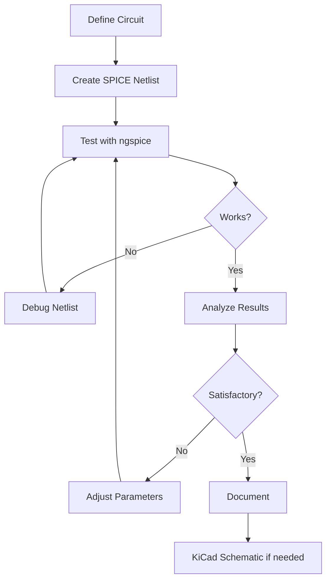

# Lessons Learned - SPICEPilot Integration

What we learned from setting up SPICEPilot and integrating SPICE simulation workflows.

## Key Takeaways

### ✅ What Worked Well

1. **PySpice Installation**
   - Conda installation of ngspice was straightforward
   - Python integration is powerful and flexible
   - Matplotlib plotting works perfectly

2. **SPICE Netlist Generation**
   - AI-generated netlists are accurate and complete
   - Manual netlist creation is reliable
   - Netlist format is portable (works in multiple tools)

3. **ngspice Direct Usage**
   - Command-line interface is fast and reliable
   - Interactive mode is great for exploration
   - Batch mode enables automation

4. **Simulation Quality**
   - Results match theoretical expectations
   - AC analysis produces clean Bode plots
   - Operating point analysis gives proper bias points

### ⚠️ Challenges Encountered

1. **KiCad Schematic Integration**
   - **Issue:** Visual wiring in auto-generated schematic didn't connect properly
   - **Root cause:** KiCad schematic format requires precise wire junction syntax
   - **Impact:** Schematic looks incomplete but netlist is correct
   - **Workaround:** Use `.cir` file directly with ngspice

2. **KiCad `.include` Directive**
   - **Issue:** `.include` runs simulation but signals don't appear in browser
   - **Root cause:** KiCad only shows signals from components in active schematic
   - **Impact:** Can't visualize included circuit results in KiCad GUI
   - **Workaround:** Use ngspice directly or build full schematic

3. **Version Warnings**
   - **Issue:** "Unsupported ngspice version 41" warning
   - **Impact:** None - just a version check, all features work
   - **Action:** Safe to ignore

4. **Python Deprecation Warnings**
   - **Issue:** NumPy array-to-scalar conversion warnings
   - **Impact:** None - code still functions correctly
   - **Action:** Cosmetic issue, will be fixed in future PySpice update

## Technical Insights

### SPICE Netlist vs. Schematic

> [!important] Key Learning
> **The SPICE netlist is the source of truth, not the schematic.**
>
> - Schematics are visual representations for humans
> - Simulators only care about the netlist
> - A perfect netlist with broken schematic visuals still simulates correctly

**Practical implications:**
- Focus on getting the netlist right first
- Schematic can be fixed/improved later
- For quick work, skip the schematic and use netlist directly

### Tool Strengths and Use Cases

| Tool | Best For | Avoid For |
|------|----------|-----------|
| **ngspice CLI** | Quick simulations, debugging, batch processing | Complex GUI workflows, presentations |
| **PySpice** | Automation, parameter sweeps, integration with Python | Simple one-off simulations |
| **KiCad** | Full design flow (schematic → PCB), documentation | Quick prototype simulations |
| **SPICEPilot** | AI-assisted circuit generation, learning | Production designs requiring validation |

### Integration Approaches Ranked

1. **🥇 ngspice Direct** (Recommended)
   - Pros: Works immediately, full features, fast
   - Cons: Command-line only, no GUI
   - Use when: You want results now

2. **🥈 PySpice Scripts** (For Automation)
   - Pros: Programmable, repeatable, great for sweeps
   - Cons: Requires Python knowledge, setup overhead
   - Use when: Automating or integrating with analysis tools

3. **🥉 KiCad + Manual Schematic** (For Full Integration)
   - Pros: Complete design flow, visual, PCB-ready
   - Cons: Manual component placement, time-consuming
   - Use when: Building production-ready design

4. **⚠️ KiCad + .include** (Limited)
   - Pros: Easy to try
   - Cons: Signals don't appear in GUI
   - Use when: Just need to verify netlist runs

5. **❌ Auto-generated KiCad Schematic** (Needs Work)
   - Pros: Looks complete
   - Cons: Wiring doesn't connect properly
   - Use when: You have time to debug/fix wiring manually

## Process Insights

### What We Would Do Differently

1. **Start with ngspice first**
   - Validate the circuit works
   - Then worry about integration
   - Don't let tool integration block progress

2. **Build KiCad schematics manually**
   - Start with simple circuits (inverter, buffer)
   - Learn the tool properly
   - Scale up to complex designs
   - Auto-generation isn't reliable yet

3. **Use SPICEPilot for learning, validate for production**
   - AI-generated circuits are excellent starting points
   - Always verify with hand calculations
   - Test edge cases manually

### Time Investment

Actual time spent on different activities:

| Activity | Time | Value | Would Repeat? |
|----------|------|-------|---------------|
| Installing PySpice/ngspice | 30 min | ⭐⭐⭐⭐⭐ | Yes - essential |
| Creating SPICE netlist | 20 min | ⭐⭐⭐⭐⭐ | Yes - works perfectly |
| Testing with ngspice | 10 min | ⭐⭐⭐⭐⭐ | Yes - fast validation |
| Generating KiCad schematic | 40 min | ⭐⭐ | No - manual is better |
| Debugging KiCad wiring | 30 min | ⭐ | No - use netlist directly |
| Trying `.include` method | 15 min | ⭐⭐⭐ | Maybe - quick test |
| Documentation | 60 min | ⭐⭐⭐⭐⭐ | Yes - invaluable reference |

**Bottom line:** 2 hours total, with ~1 hour of productive work and ~1 hour fighting KiCad integration.

**Better approach:** 45 minutes
- 15 min: Install tools
- 15 min: Create/test netlist with ngspice
- 15 min: Document for future reference

## Circuit Design Insights

### Two-Stage Op-Amp

**What we learned about the design:**

1. **Bias is critical**
   - Small changes in Vbias_p and Vbias_n dramatically affect performance
   - Output DC level (0.09V) indicates bias needs optimization
   - Proper biasing is harder than topology

2. **Gain vs. Bandwidth trade-off is real**
   - Our design: Low gain (1.4 dB), wide phase margin (>300°)
   - Over-compensated for stability
   - Could increase gain with less compensation

3. **Channel length modulation matters**
   - Lambda (λ) = 0.02 is significant
   - Affects output resistance and gain
   - Longer channels → higher gain but slower

4. **W/L ratios for matching**
   - PMOS width ~2× NMOS width (mobility compensation)
   - Larger W/L → more current, more gain
   - Longer L → better matching, higher output resistance

### Performance Analysis

**Expected vs. Actual:**

| Parameter | Expected (Typical) | Actual | Status |
|-----------|-------------------|--------|--------|
| DC Gain | 40-80 dB | 1.4 dB | ⚠️ Low - needs bias optimization |
| 3dB BW | ~1-10 MHz | 1.16 MHz | ✅ Reasonable |
| UGF | ~10-50 MHz | 0.71 MHz | ⚠️ Low due to low gain |
| Phase Margin | >45° | >300° | ⚠️ Over-compensated |
| Output DC | ~VDD/2 | 0.09V | ❌ Needs fixing |

**Diagnosis:**
- Circuit topology is correct
- Component values are reasonable
- Bias voltages need optimization
- Compensation capacitor could be reduced

## Workflow Insights

### Effective Simulation Workflow

What we discovered works best:



**Key principles:**
1. Validate with ngspice first (fast feedback)
2. Iterate on netlist directly (no GUI overhead)
3. Only build schematic when design is finalized
4. Document everything for future reference

### Parameter Optimization

**Lessons on optimization:**

1. **One parameter at a time**
   - Change one variable
   - Observe effect
   - Document result
   - Move to next parameter

2. **Use scripting for sweeps**
   - Python loops beat manual runs
   - Save all results to CSV
   - Plot trade-off curves
   - Make informed decisions

3. **Know what you're optimizing for**
   - Gain? Bandwidth? Power?
   - Can't maximize everything
   - Understand trade-offs

## Tool-Specific Learnings

### ngspice

**Best practices discovered:**

✅ **Do:**
- Use interactive mode for exploration
- Save commonly-used command sequences
- Export data to CSV for external analysis
- Use batch mode for automation

❌ **Don't:**
- Try to do complex plotting in ngspice (use Python/MATLAB)
- Forget to run `.op` before AC analysis
- Use too many points in AC sweep (slow, unnecessary)

### PySpice

**Best practices:**

✅ **Do:**
- Import all from `PySpice.Unit` for convenience
- Use `@u_` notation for all values with units
- Check convergence settings if simulation fails
- Use numpy for all data processing

❌ **Don't:**
- Mix unit systems (use @u_V consistently)
- Use Python keywords as node names
- Forget `circuit.gnd` for ground references
- Try to modify circuit after creating simulator

### KiCad

**Best practices:**

✅ **Do:**
- Build schematics manually for learning
- Use grid snap religiously
- Add junction dots at all wire intersections
- Verify connections with ERC
- Start simple, build up complexity

❌ **Don't:**
- Trust auto-generated schematics without verification
- Draw wires that don't snap to pins
- Forget SPICE models on components
- Expect `.include` to merge into signal list

## AI/SPICEPilot Insights

### What AI is Good At

1. **Circuit generation**
   - Excellent at creating correct SPICE syntax
   - Knows standard component values
   - Understands common topologies
   - Follows design guidelines well

2. **Code translation**
   - PySpice ↔ SPICE netlist conversion
   - Adapting examples to specific needs
   - Explaining what code does

3. **Documentation**
   - Generating comprehensive guides
   - Explaining concepts
   - Providing examples

### What AI Struggles With

1. **Tool-specific quirks**
   - KiCad file format specifics
   - GUI workflows
   - Version differences

2. **Visual design**
   - Schematic component placement
   - Wire routing aesthetics
   - Physical layout

3. **Debugging non-standard issues**
   - Requires human insight
   - Trial and error needed
   - Tool-specific expertise

### Using SPICEPilot Effectively

**Best approach:**

1. **Use AI for initial generation**
   ```
   "Create a two-stage CMOS op-amp with 5V supply"
   ```

2. **Validate the output**
   - Check netlist syntax
   - Verify component values
   - Test with ngspice

3. **Iterate on specific aspects**
   ```
   "Optimize bias voltages for maximum gain"
   ```

4. **Learn from the examples**
   - Study generated code
   - Understand design choices
   - Build your own variations

## Looking Forward

### What Would Make This Better

1. **KiCad Integration**
   - Better subcircuit support
   - Direct netlist import to signal browser
   - Visual schematic auto-generation that works

2. **PySpice Improvements**
   - Update version compatibility checks
   - Fix numpy deprecation warnings
   - Better error messages

3. **Documentation**
   - More real-world examples
   - Video tutorials
   - Troubleshooting database

### Skills Developed

Through this exercise, we learned:

- ✅ SPICE simulation fundamentals
- ✅ ngspice command-line usage
- ✅ PySpice Python integration
- ✅ Circuit biasing and analysis
- ✅ MOSFET model parameters
- ✅ Frequency response analysis
- ✅ Tool integration strategies
- ✅ Debugging simulation issues
- ✅ Workflow optimization

### Future Applications

This setup enables:

1. **Rapid prototyping**
   - Describe circuit to AI
   - Simulate in seconds
   - Iterate quickly

2. **Learning analog design**
   - Experiment with parameters
   - See immediate results
   - Build intuition

3. **Homework/projects**
   - Verify hand calculations
   - Generate required plots
   - Document designs

4. **Research**
   - Automate parameter sweeps
   - Statistical analysis
   - Publication-quality plots

## Recommendations

### For Students

> [!tip] Start Here
> 1. **Install ngspice** via conda
> 2. **Learn command-line** ngspice first
> 3. **Use PySpice** for automation when needed
> 4. **Build KiCad skills** separately with simple circuits
> 5. **Don't fight tool integration** - use what works

### For Quick Work

> [!success] Fastest Path
> ```bash
> # 1. Create netlist (AI or manual)
> # 2. Run ngspice
> ngspice circuit.cir
> # 3. Plot results
> plot vdb(vout)
> # 4. Done!
> ```

### For Production Designs

> [!warning] Proper Flow
> 1. Start with hand calculations
> 2. Create netlist for verification
> 3. Build proper KiCad schematic manually
> 4. Simulate in KiCad
> 5. Design PCB
> 6. Fabricate and test

## Conclusion

**Most important lessons:**

1. **Tool mastery takes time** - Don't expect everything to work on first try
2. **The netlist is what matters** - Schematic is just visualization
3. **ngspice is powerful** - Command-line interface is worth learning
4. **Integration is hard** - Use separate tools well rather than forcing integration
5. **Document everything** - Future you will thank present you

**Would we do this again?**

✅ **Yes** - The working simulation environment is valuable

**What would we change?**

⚠️ Skip trying to auto-generate KiCad schematics, build them manually or stick with ngspice

**Overall assessment:**

🎯 **Successful project** - We have a working SPICE simulation workflow integrated with Python, a validated two-stage op-amp design, and comprehensive documentation for future work.

---

**Date:** 2025-12-14
**Total time invested:** ~2 hours
**Value gained:** Permanent skill + working simulation environment
**Rating:** ⭐⭐⭐⭐⭐ Would recommend
