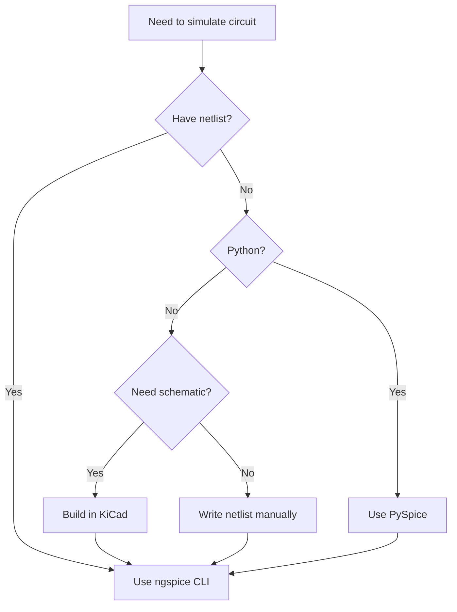

# Tool Comparison Guide

Comprehensive comparison of SPICE simulation tools and workflows to help you choose the right approach.

## Quick Decision Tree



## Tool-by-Tool Comparison

### 1. ngspice Command-Line

**Best for:** Quick simulations, testing, batch processing

| Aspect | Rating | Notes |
|--------|--------|-------|
| **Ease of setup** | ⭐⭐⭐⭐⭐ | Installed via conda |
| **Ease of use** | ⭐⭐⭐⭐ | Command-line, but straightforward |
| **Speed** | ⭐⭐⭐⭐⭐ | Fastest option |
| **Features** | ⭐⭐⭐⭐⭐ | Full SPICE capabilities |
| **Integration** | ⭐⭐⭐ | Text-based, requires external plotting |
| **Automation** | ⭐⭐⭐⭐ | Good with shell scripts |
| **Learning curve** | ⭐⭐⭐ | Medium - need to learn commands |

**Pros:**
- ✅ Immediate results
- ✅ No GUI overhead
- ✅ Works with any SPICE netlist
- ✅ Powerful interactive mode
- ✅ Excellent for debugging

**Cons:**
- ❌ Command-line only
- ❌ Basic plotting capabilities
- ❌ No schematic view
- ❌ Harder to share results (need screenshots)

**When to use:**
```bash
# Validating a design
ngspice my_circuit.cir

# Quick parameter check
ngspice -b circuit.cir -o results.txt

# Interactive exploration
ngspice circuit.cir
ngspice> run
ngspice> plot vdb(vout)
```

---

### 2. PySpice (Python Integration)

**Best for:** Automation, parameter sweeps, analysis

| Aspect | Rating | Notes |
|--------|--------|-------|
| **Ease of setup** | ⭐⭐⭐⭐ | pip install + DLL copy |
| **Ease of use** | ⭐⭐⭐ | Requires Python knowledge |
| **Speed** | ⭐⭐⭐⭐ | Fast once set up |
| **Features** | ⭐⭐⭐⭐⭐ | Full ngspice + Python power |
| **Integration** | ⭐⭐⭐⭐⭐ | Excellent with Python ecosystem |
| **Automation** | ⭐⭐⭐⭐⭐ | Best option for automation |
| **Learning curve** | ⭐⭐⭐ | Need Python + SPICE knowledge |

**Pros:**
- ✅ Programmatic circuit creation
- ✅ Easy parameter sweeps
- ✅ matplotlib integration for plots
- ✅ numpy/pandas for analysis
- ✅ Reproducible workflows
- ✅ Great for batch processing

**Cons:**
- ❌ Requires Python proficiency
- ❌ More code to write
- ❌ Setup overhead for simple tasks
- ❌ Deprecation warnings (cosmetic)

**When to use:**
```python
# Parameter optimization
for r in range(1000, 10000, 1000):
    circuit.R('load', 'out', circuit.gnd, r@u_Ohm)
    analysis = simulator.operating_point()
    # analyze results...

# Automated testing
circuits = ['inv', 'amp', 'buffer']
for c in circuits:
    # simulate and save results

# Complex analysis
# Statistical analysis, monte carlo, etc.
```

---

### 3. KiCad 9.0 Simulator

**Best for:** Full design flow (schematic → simulation → PCB)

| Aspect | Rating | Notes |
|--------|--------|-------|
| **Ease of setup** | ⭐⭐⭐⭐⭐ | Built-in to KiCad |
| **Ease of use** | ⭐⭐⭐⭐ | GUI is intuitive |
| **Speed** | ⭐⭐⭐ | Slower than CLI |
| **Features** | ⭐⭐⭐⭐ | Good SPICE integration |
| **Integration** | ⭐⭐⭐⭐⭐ | Schematic + PCB + simulation |
| **Automation** | ⭐⭐ | Limited scripting |
| **Learning curve** | ⭐⭐⭐⭐ | Easier for GUI users |

**Pros:**
- ✅ Visual schematic editor
- ✅ Integrated simulation
- ✅ Direct PCB export path
- ✅ Good for documentation
- ✅ Component libraries
- ✅ Professional workflow

**Cons:**
- ❌ Manual component placement takes time
- ❌ Auto-generated schematics don't wire correctly
- ❌ `.include` signals don't show in browser
- ❌ Slower iteration cycle

**When to use:**
```
Creating production design:
1. Draw schematic in KiCad
2. Assign footprints
3. Simulate
4. Layout PCB
5. Fabricate
```

---

### 4. SPICEPilot + AI

**Best for:** Learning, quick prototyping, initial design

| Aspect | Rating | Notes |
|--------|--------|-------|
| **Ease of setup** | ⭐⭐⭐ | Need SPICEPilot + LLM access |
| **Ease of use** | ⭐⭐⭐⭐⭐ | Natural language input |
| **Speed** | ⭐⭐⭐⭐ | Fast initial generation |
| **Features** | ⭐⭐⭐⭐ | Depends on AI capability |
| **Integration** | ⭐⭐⭐ | Outputs to various formats |
| **Automation** | ⭐⭐⭐⭐ | Can generate scripts |
| **Learning curve** | ⭐⭐⭐⭐⭐ | Just describe what you want |

**Pros:**
- ✅ Natural language circuit description
- ✅ Fast prototyping
- ✅ Good for learning
- ✅ Generates documented code
- ✅ Explains design choices
- ✅ Multiple output formats

**Cons:**
- ❌ Need to validate AI output
- ❌ May make suboptimal choices
- ❌ Requires iteration
- ❌ Not for critical designs without verification

**When to use:**
```
"Create a CMOS inverter with VDD=3.3V, analyze rise/fall time"
"Design a two-stage amplifier with 40dB gain"
"Generate a current mirror with 1:4 ratio"
```

---

### 5. LTspice (Alternative)

**Best for:** Industry-standard simulation, detailed models

| Aspect | Rating | Notes |
|--------|--------|-------|
| **Ease of setup** | ⭐⭐⭐⭐⭐ | Free download from Analog Devices |
| **Ease of use** | ⭐⭐⭐⭐ | Polished GUI |
| **Speed** | ⭐⭐⭐⭐⭐ | Highly optimized |
| **Features** | ⭐⭐⭐⭐⭐ | Extensive component libraries |
| **Integration** | ⭐⭐⭐ | Windows-focused |
| **Automation** | ⭐⭐ | Limited scripting |
| **Learning curve** | ⭐⭐⭐ | Industry standard |

**Note:** Not covered in our setup, but worth mentioning as an alternative.

**Pros:**
- ✅ Industry standard
- ✅ Excellent performance
- ✅ Huge component library
- ✅ Great GUI
- ✅ Widely used (lots of resources)

**Cons:**
- ❌ Windows-centric (Linux/Mac support limited)
- ❌ Proprietary format
- ❌ Less open than ngspice
- ❌ Limited Python integration

---

## Feature Comparison Matrix

|  Feature | ngspice CLI | PySpice | KiCad | SPICEPilot | LTspice |
|---|---|---|---|---|---|
| **Open Source** | ✅ | ✅ | ✅ | ✅ | ❌ |
| **Cross-platform** | ✅ | ✅ | ✅ | ✅ | ⚠️ |
| **GUI** | ❌ | ❌ | ✅ | ❌ | ✅ |
| **Schematic editor** | ❌ | ❌ | ✅ | ❌ | ✅ |
| **Python integration** | ⚠️ | ✅ | ❌ | ✅ | ❌ |
| **Automation** | ✅ | ✅ | ⚠️ | ✅ | ⚠️ |
| **Speed** | ✅✅ | ✅✅ | ✅ | ✅ | ✅✅ |
| **Component libraries** | ⚠️ | ⚠️ | ✅ | ⚠️ | ✅✅ |
| **Learning resources** | ✅ | ⚠️ | ✅ | ⚠️ | ✅✅ |
| **PCB integration** | ❌ | ❌ | ✅ | ❌ | ❌ |

Legend: ✅✅ Excellent, ✅ Good, ⚠️ Limited, ❌ Not available

---

## Workflow Comparison

### Simple Circuit Validation

**Task:** Verify a homework design works

| Method | Steps | Time | Best? |
|--------|-------|------|-------|
| **ngspice** | 1. Write netlist<br>2. `ngspice circuit.cir`<br>3. `run`<br>4. `plot` | 5 min | ✅ Yes - fastest |
| **PySpice** | 1. Write Python<br>2. `python sim.py`<br>3. View plot | 10 min | ⚠️ Overkill |
| **KiCad** | 1. Draw schematic<br>2. Open simulator<br>3. Configure<br>4. Run | 20 min | ❌ Too slow |

**Winner:** ngspice CLI

---

### Parameter Optimization

**Task:** Find optimal bias voltage for maximum gain

| Method | Steps | Time | Best? |
|--------|-------|------|-------|
| **ngspice** | Manual iteration:<br>1. Edit file<br>2. Rerun<br>3. Compare | 30 min | ❌ Tedious |
| **PySpice** | Write loop:<br>```for v in values:```<br>Auto-compare | 15 min | ✅ Yes - automated |
| **KiCad** | Manual iteration in GUI | 45 min | ❌ Slowest |

**Winner:** PySpice

---

### Production Design

**Task:** Complete design from concept to PCB

| Method | Steps | Time | Best? |
|--------|-------|------|-------|
| **ngspice** | 1. Netlist<br>2. Simulate<br>3. Manually create schematic<br>4. PCB tool | 4 hrs | ⚠️ Disconnected |
| **PySpice** | Similar to ngspice | 4 hrs | ⚠️ No schematic |
| **KiCad** | 1. Schematic<br>2. Simulate<br>3. PCB layout<br>4. Export | 3 hrs | ✅ Yes - integrated |
| **LTspice + KiCad** | 1. Simulate in LTspice<br>2. Recreate in KiCad<br>3. PCB | 4 hrs | ⚠️ Duplicate work |

**Winner:** KiCad end-to-end

---

### Learning/Experimentation

**Task:** Understand how circuit behaves with different parameters

| Method | Steps | Time | Best? |
|--------|-------|------|-------|
| **ngspice** | Fast iteration, immediate feedback | ✅ Good |
| **PySpice** | Plot multiple parameters together | ✅✅ Best |
| **SPICEPilot + AI** | Ask questions, get explanations | ✅ Good |
| **KiCad** | Slower iteration | ⚠️ OK |

**Winner:** PySpice (with AI assistance for understanding)

---

## Use Case Recommendations

### Homework Assignment

```
Circuit: Given topology, need to verify operation
Deadline: Tonight
Skills: Basic SPICE
```

**Recommendation:** ngspice CLI
- Fastest to results
- No GUI learning curve
- Just plot what's needed

**Commands:**
```bash
ngspice homework.cir
run
plot v(required_output)
# Screenshot for report
```

---

### Research Project

```
Circuit: Novel topology
Requirements: Parameter sweeps, statistical analysis
Timeline: Several weeks
Skills: Python proficient
```

**Recommendation:** PySpice
- Automated sweeps
- Save all data
- Reproducible analysis
- Publication-quality plots

**Approach:**
```python
# Sweep parameters
# Save results to CSV
# Statistical analysis with pandas
# Plots with matplotlib
```

---

### Class Project

```
Circuit: Amplifier design
Requirements: Schematic, simulation, report
Timeline: 2 weeks
Skills: Moderate
```

**Recommendation:** KiCad + ngspice
- Draw schematic in KiCad (for report)
- Export netlist
- Simulate with ngspice (faster iteration)
- Import plots to report

**Why hybrid:**
- KiCad schematic for documentation
- ngspice for fast simulation cycles
- Best of both worlds

---

### Industry Design

```
Circuit: Commercial product
Requirements: Full design flow, verification, PCB
Timeline: Months
Skills: Professional
```

**Recommendation:** KiCad or LTspice (full flow)
- Complete documentation
- Version control
- DRC/ERC checks
- Professional output

**Alternative:** Professional tools (Cadence, Mentor)

---

## Integration Strategies

### Strategy 1: Pure ngspice

**When:** Quick work, prototypes, learning

```
Create netlist → ngspice → Results → Done
```

**Pros:** Fast, simple
**Cons:** No schematic documentation

---

### Strategy 2: PySpice Automation

**When:** Research, optimization, batch processing

```
Python script → PySpice → Analysis → Plots/Data
```

**Pros:** Powerful, reproducible
**Cons:** Requires programming

---

### Strategy 3: KiCad + ngspice Hybrid

**When:** Projects needing documentation

```
KiCad schematic → Export netlist → ngspice → Results
                                      ↓
                Import plots ← Documentation
```

**Pros:** Best of both
**Cons:** Extra steps

---

### Strategy 4: AI-Assisted

**When:** Learning, exploration, initial design

```
Describe circuit → AI generates → Validate with ngspice
                                       ↓
                     Iterate based on results
```

**Pros:** Low barrier to entry
**Cons:** Must verify output

---

## Migration Paths

### From LTspice

**Goal:** Move existing LTspice designs to open-source tools

**Path:**
1. Export LTspice netlist (`.net` file)
2. Convert to ngspice format (minor syntax changes)
3. Test with ngspice
4. Optionally: Recreate schematic in KiCad

**Conversion notes:**
- Most SPICE syntax compatible
- May need to adjust model parameters
- Some LTspice-specific features unsupported

---

### From Manual Netlist to KiCad

**Goal:** Add schematic documentation to working design

**Path:**
1. Have working `.cir` netlist
2. Create KiCad project
3. Draw schematic matching netlist
4. Add SPICE models to components
5. Verify KiCad-generated netlist matches

**Time:** 2-4 hours for moderate circuit

---

### From KiCad to Production

**Goal:** Manufacturable PCB

**Path:**
1. Verified simulation in KiCad
2. Assign footprints
3. PCB layout
4. DRC checks
5. Generate Gerbers
6. Send to fab house

**Time:** Days to weeks depending on complexity

---

## Cost Comparison

| Tool | License Cost | Hidden Costs | Total |
|------|--------------|--------------|-------|
| **ngspice** | Free (GPL) | Learning time | $0 + time |
| **PySpice** | Free (GPL) | Python setup, learning | $0 + time |
| **KiCad** | Free (GPL) | Learning curve | $0 + time |
| **SPICEPilot** | Free (MIT) | LLM API costs (if using paid) | $0-$20/mo |
| **LTspice** | Free (Proprietary) | Windows VM if on Mac/Linux | $0 |
| **Cadence** | $$$$ | Training, maintenance | $10k-100k+ |

**Winner:** All open-source options are free! Pick based on features, not cost.

---

## Final Recommendations

### For This Project (Two-Stage Op-Amp)

**Use:** ngspice CLI
- Netlist is correct and works
- Fastest path to results
- No tool integration issues

**Optional:** PySpice for parameter optimization later

---

### For Future Work

**Quick validation:** → ngspice
**Automated analysis:** → PySpice
**Full projects:** → KiCad (manual schematic)
**Learning:** → SPICEPilot + ngspice
**Production:** → KiCad end-to-end or professional tools

---

### General Philosophy

> [!tip] Use the Right Tool for the Job
> - **Don't force integration** if it slows you down
> - **Use what works** even if it's "less elegant"
> - **Iterate quickly** is better than perfect setup
> - **Document your workflow** so you can repeat it

> [!success] Pragmatic Approach
> "The best tool is the one that gets the job done fastest with acceptable quality."
>
> - For simulation: ngspice wins on speed
> - For automation: PySpice wins on power
> - For documentation: KiCad wins on integration
> - For learning: AI assistance + any of the above

---

## Summary Table

| Tool | Best For | Avoid For | Verdict |
|------|----------|-----------|---------|
| **ngspice** | Quick sims, validation, debugging | Automation, schematic docs | ⭐⭐⭐⭐⭐ Essential |
| **PySpice** | Automation, sweeps, analysis | Simple one-off tasks | ⭐⭐⭐⭐ Very useful |
| **KiCad** | Full design flow, PCB | Quick prototypes | ⭐⭐⭐⭐ When you need it |
| **SPICEPilot** | Learning, initial designs | Production without verification | ⭐⭐⭐⭐ Great assistant |
| **LTspice** | Industry standard, performance | Open-source requirements | ⭐⭐⭐⭐ Good alternative |

---

**Last Updated:** 2025-12-14
**Based on:** Practical experience with real circuit design
