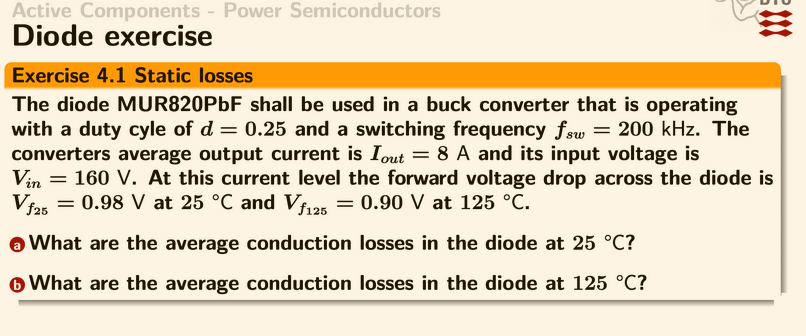
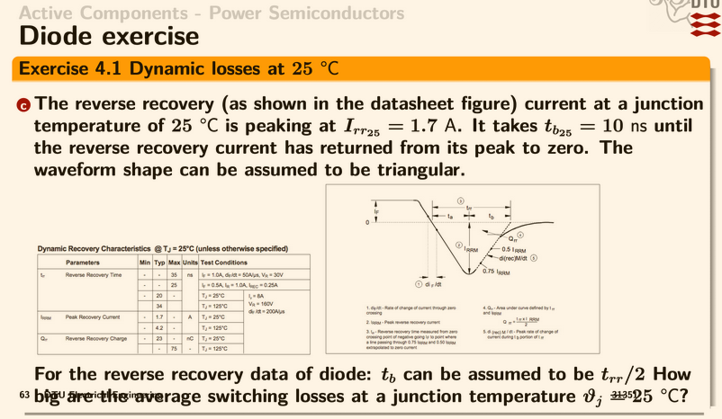
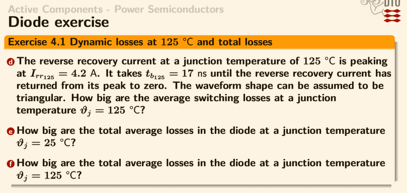
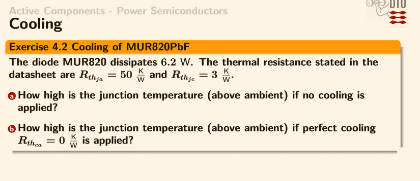
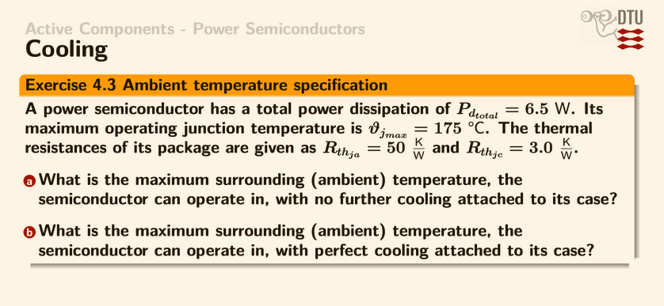
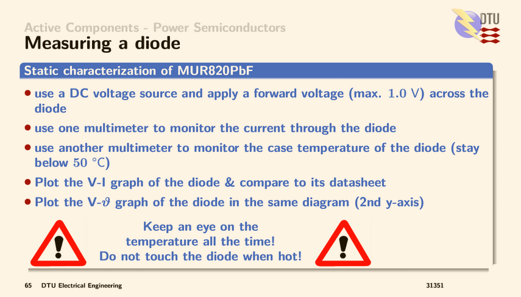

# 34620 Power Electronics - Exercises Week 4: Power Semiconductors

---

## Exercise 4.1: Diode Static & Dynamic Losses

### Part 1 — Static Losses (Conduction)

**Given (MUR820PbF in a buck converter):**
- Duty cycle: $d = 0.25$
- Switching frequency: $f_{sw} = 200$ kHz
- Output current: $I_{out} = 8$ A
- Input voltage: $V_{in} = 160$ V
- Forward voltage: $V_{F_{25}} = 0.98$ V at 25 °C, $V_{F_{125}} = 0.90$ V at 125 °C

> [!info] Background — Diode conduction in a buck converter
> In a buck converter, the MOSFET switch is ON for a fraction $d$ of the switching period and OFF for $(1-d)$. When the MOSFET is OFF, the inductor current must continue flowing — it freewheels through the diode. Therefore, the diode conducts for a fraction $(1-d)$ of each period.
>
> The conduction loss is simply the forward voltage drop across the diode multiplied by the current through it, averaged over the full period:
> $$P_{cond} = V_F \cdot I_{out} \cdot (1-d)$$

---

#### a) Average conduction losses at 25 °C

$$P_{cond,25} = V_{F_{25}} \cdot I_{out} \cdot (1 - d) = 0.98 \cdot 8 \cdot (1 - 0.25)$$

$$P_{cond,25} = 0.98 \cdot 8 \cdot 0.75 = \boxed{5.88 \text{ W}}$$

---

#### b) Average conduction losses at 125 °C

$$P_{cond,125} = V_{F_{125}} \cdot I_{out} \cdot (1 - d) = 0.90 \cdot 8 \cdot 0.75$$

$$P_{cond,125} = \boxed{5.40 \text{ W}}$$

> [!note] Temperature effect on conduction losses
> Silicon diodes have a **negative temperature coefficient** for forward voltage at high currents — $V_F$ decreases as temperature rises. This means conduction losses actually *decrease* slightly at higher temperatures (5.88 W → 5.40 W, a drop of 8%).

---

### Part 2 — Dynamic Losses at 25 °C

> [!info] Background — Reverse recovery
> When a diode turns off (transitions from forward to reverse bias), it cannot block immediately. Stored charge in the junction must be swept out first, causing a brief **reverse current** to flow. This is called *reverse recovery*.
>
> The reverse recovery waveform is approximated as **triangular**:
> - The current ramps from 0 to $-I_{rr}$ during the *storage time* $t_s$ (charge is being extracted)
> - The current returns from $-I_{rr}$ back to 0 during the *fall time* $t_b$
> - Total recovery time: $t_{rr} = t_s + t_b$
>
> During this entire time, the full reverse voltage ($V_{in}$ in a buck converter) appears across the diode, so both high voltage and high current exist simultaneously — causing significant power loss.

**Given at 25 °C:**
- $I_{rr,25} = 1.7$ A (peak reverse recovery current)
- $t_{b,25} = 10$ ns (time from peak back to zero)
- Triangular waveform, $t_s = t_{rr}/2$

**Step 1 — Find the total reverse recovery time:**

Since $t_s = t_{rr}/2$ and $t_{rr} = t_s + t_b$, substituting gives $t_b = t_{rr}/2$:

$$t_{rr,25} = 2 \cdot t_{b,25} = 2 \cdot 10 \text{ ns} = 20 \text{ ns}$$

**Step 2 — Calculate the reverse recovery charge:**

The charge is the area of the triangular current waveform:

$$Q_{rr,25} = \frac{1}{2} \cdot I_{rr} \cdot t_{rr} = \frac{1}{2} \cdot 1.7 \cdot 20 \times 10^{-9} = 17 \text{ nC}$$

**Step 3 — Calculate average switching losses:**

Each switching event dissipates energy $E_{rr} = Q_{rr} \cdot V_{in}$ (charge swept under full reverse voltage). At $f_{sw}$ events per second:

$$P_{sw,25} = Q_{rr} \cdot V_{in} \cdot f_{sw} = 17 \times 10^{-9} \cdot 160 \cdot 200 \times 10^{3}$$

#### c) Average switching losses at 25 °C

$$P_{sw,25} = \boxed{0.544 \text{ W}}$$

---

### Part 3 — Dynamic Losses at 125 °C and Total Losses

**Given at 125 °C:**
- $I_{rr,125} = 4.2$ A (significantly larger than 1.7 A at 25 °C)
- $t_{b,125} = 17$ ns (longer than 10 ns at 25 °C)

**Step 1:**
$$t_{rr,125} = 2 \cdot 17 = 34 \text{ ns}$$

**Step 2:**
$$Q_{rr,125} = \frac{1}{2} \cdot 4.2 \cdot 34 \times 10^{-9} = 71.4 \text{ nC}$$

**Step 3:**
$$P_{sw,125} = 71.4 \times 10^{-9} \cdot 160 \cdot 200 \times 10^{3}$$

#### d) Average switching losses at 125 °C

$$P_{sw,125} = \boxed{2.285 \text{ W}}$$

---

#### e) Total average losses at 25 °C

$$P_{total,25} = P_{cond,25} + P_{sw,25} = 5.88 + 0.544 = \boxed{6.42 \text{ W}}$$

#### f) Total average losses at 125 °C

$$P_{total,125} = P_{cond,125} + P_{sw,125} = 5.40 + 2.285 = \boxed{7.69 \text{ W}}$$

> [!summary] Loss breakdown comparison
>
> | | 25 °C | 125 °C | Change |
> |---|---|---|---|
> | **Conduction** | 5.88 W (91.5%) | 5.40 W (70.2%) | -8% |
> | **Switching** | 0.54 W (8.5%) | 2.29 W (29.8%) | +321% |
> | **Total** | **6.42 W** | **7.69 W** | +20% |
>
> **Key takeaway:** Conduction and switching losses have *opposite* temperature dependencies. As the device heats up, conduction losses decrease slightly but switching losses explode (~4x). This can lead to **thermal runaway** if the cooling is marginal — higher temperature → more switching losses → even higher temperature → etc.

---

## Exercise 4.2: Cooling of MUR820PbF

**Given:**
- $P_{diss} = 6.2$ W
- $R_{th,ja} = 50$ K/W (junction to ambient — thermal resistance of the package through still air)
- $R_{th,jc} = 3$ K/W (junction to case — thermal resistance through the package material)

> [!info] Background — Thermal resistance model
> Heat flow is analogous to electrical current flow:
> - **Temperature difference** $\Delta T$ ↔ Voltage
> - **Power dissipation** $P$ ↔ Current
> - **Thermal resistance** $R_{th}$ ↔ Resistance
>
> The thermal "circuit" from junction to ambient has two parallel paths:
> 1. **Direct to air:** $R_{th,ja}$ (no heatsink, heat radiates/convects from package)
> 2. **Through case + heatsink:** $R_{th,jc} + R_{th,ca}$ (heat flows through case to heatsink to air)
>
> Without a heatsink, only path 1 exists. With a perfect heatsink ($R_{th,ca} = 0$), the case is at ambient temperature.
>
> $$\Delta T = P \cdot R_{th}$$

---

#### a) Junction temperature rise — no cooling

Without a heatsink, all heat must flow through the junction-to-ambient resistance:

$$\Delta T_{ja} = P_{diss} \cdot R_{th,ja} = 6.2 \cdot 50$$

$$\Delta T_{ja} = \boxed{310 \text{ K above ambient}}$$

At a typical 25 °C ambient: $T_j = 25 + 310 = 335$ °C.

> [!warning]
> This far exceeds any silicon junction rating (typically 150--175 °C max). The diode would be destroyed without a heatsink. This result demonstrates why **thermal management is critical** in power electronics.

---

#### b) Junction temperature rise — perfect cooling ($R_{th,ca} = 0$)

With a perfect heatsink, the case sits at ambient temperature. Heat only needs to cross the junction-to-case resistance:

$$\Delta T_{jc} = P_{diss} \cdot R_{th,jc} = 6.2 \cdot 3$$

$$\Delta T_{jc} = \boxed{18.6 \text{ K above ambient}}$$

At 25 °C ambient: $T_j = 25 + 18.6 = 43.6$ °C — perfectly safe.

> [!note] Practical takeaway
> The ratio $R_{th,ja} / R_{th,jc} = 50/3 \approx 17$. A heatsink reduces the temperature rise by a factor of ~17 in this case. Even an imperfect heatsink (say $R_{th,ca} = 10$ K/W) would give $\Delta T = 6.2 \times (3 + 10) = 80.6$ K — still manageable at $T_j = 105.6$ °C.

---

## Exercise 4.3: Ambient Temperature Specification

**Given:**
- $P_{d,total} = 6.5$ W
- $\vartheta_{j,max} = 175$ °C (maximum allowed junction temperature)
- $R_{th,ja} = 50$ K/W (junction to ambient)
- $R_{th,jc} = 3.0$ K/W (junction to case)

> [!info] Background — Design question (reversed)
> This is the inverse of Exercise 4.2. Instead of calculating how hot the junction gets, we ask: **given a maximum junction temperature, what is the highest ambient temperature the device can tolerate?**
>
> $$\vartheta_{j,max} = \vartheta_{a,max} + P_d \cdot R_{th} \quad \Longrightarrow \quad \vartheta_{a,max} = \vartheta_{j,max} - P_d \cdot R_{th}$$

---

#### a) Maximum ambient temperature — no cooling

$$\vartheta_{a,max} = \vartheta_{j,max} - P_d \cdot R_{th,ja} = 175 - 6.5 \cdot 50$$

$$\vartheta_{a,max} = 175 - 325 = \boxed{-150 \text{ °C}}$$

> [!warning]
> A result of $-150$ °C means the device **cannot operate at any realistic ambient temperature** without a heatsink. The power dissipation alone causes a 325 K temperature rise, which exceeds the 175 °C junction limit even starting from absolute-zero-like temperatures. A heatsink is mandatory.

---

#### b) Maximum ambient temperature — perfect cooling ($R_{th,ca} = 0$)

$$\vartheta_{a,max} = \vartheta_{j,max} - P_d \cdot R_{th,jc} = 175 - 6.5 \cdot 3.0$$

$$\vartheta_{a,max} = 175 - 19.5 = \boxed{155.5 \text{ °C}}$$

> [!note]
> With perfect cooling the device can handle ambient temperatures up to 155.5 °C. Since typical operating environments are 25--85 °C, there is a large safety margin ($\geq 70$ K), which could be "spent" on a cheaper, less ideal heatsink.

---

## Lab: Measuring a Diode (Static Characterization)

> [!abstract] Lab procedure
> - Apply a DC forward voltage (max 1.0 V) across the MUR820PbF
> - Monitor current through the diode with a multimeter
> - Monitor case temperature with a second multimeter (stay below 50 °C)
> - Plot the **V-I curve** and compare to the datasheet
> - Plot the **V-$\vartheta$** curve on a second y-axis (to see how $V_F$ changes with temperature)
>
> **Purpose:** Verify the datasheet values ($V_{F_{25}}$, $V_{F_{125}}$) used in Exercise 4.1 and observe the negative temperature coefficient of $V_F$ firsthand.

---

## Lab: Modelling MOSFETs (Static Characterization of IRF540)

> [!abstract] Lab procedure
> - Apply gate-source voltage $V_{gs}$ within datasheet limits (steps of 0.2 V)
> - Measure the drain-source on-resistance $R_{ds,on}$ with a multimeter
> - Plot $R_{ds,on}$ as a function of $V_{gs}$ and compare to datasheet
> - Determine the **threshold voltage** $V_{th}$ (the $V_{gs}$ where the device starts conducting)
> - Compare measurements across groups
>
> **Purpose:** Understand how a MOSFET behaves as a voltage-controlled resistor. At low $V_{gs}$ (near $V_{th}$), $R_{ds,on}$ is very high. As $V_{gs}$ increases, $R_{ds,on}$ drops — this is why gate drivers aim for high $V_{gs}$ to minimize conduction losses in power MOSFETs.

---

> [!nav]
> &nbsp;
>
> [[34620 Basic Power Electronics|34620 Home]]
>
> &nbsp;
