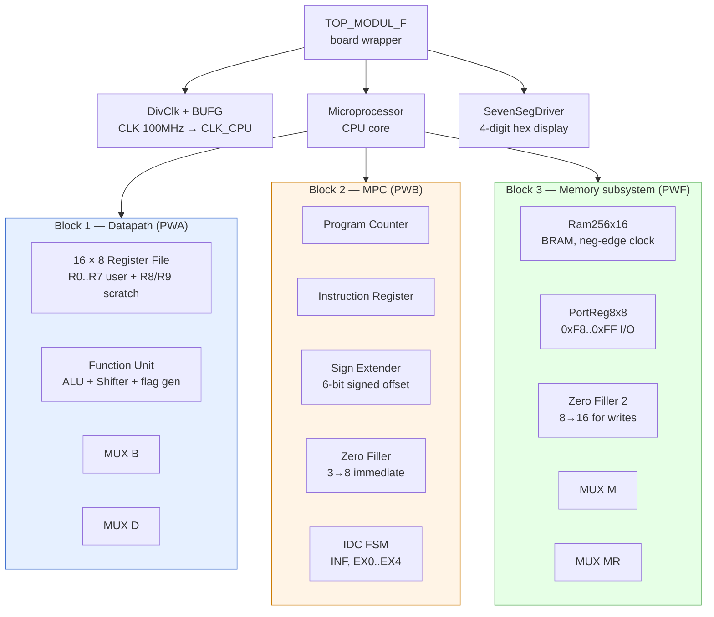
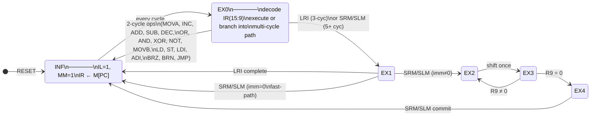
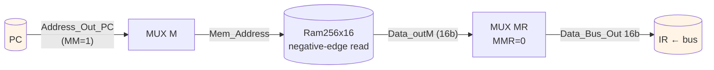
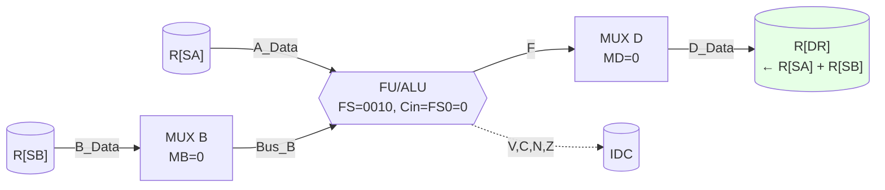
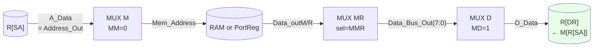
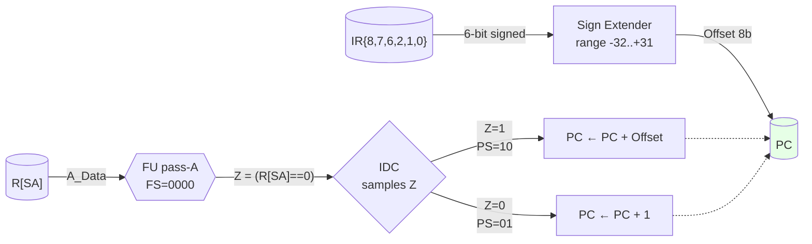
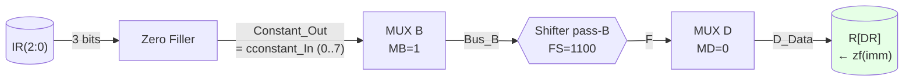

# 00 PWF System — Exam Hub

> [!success] This is the master document
> Every other exam-prep note links back here. Open this when you want one cohesive view of how the **integrated PWA + PWB + PWF microprocessor** works, what each block on `architecture.pdf` does, and what happens cycle-by-cycle when the machine executes a typical instruction. Built in four phases ([[EXAM_PREP_INVENTORY|Phase 0]] → Extractions ([[EX — Microprocessor (top)]] and instruction notes) → [[FACT_CHECK_REPORT|Phase 2]] → this hub).

**Exam reminders:** oral exam **Thu 28-May / Fri 29-May 2026**. Bring the report, the spec, this hub, and the diagram printed out.

---

## 1. System overview — what the PWF microprocessor is, in five sentences

The PWF system is a **complete 8-bit soft microprocessor** implemented in structural VHDL on a Digilent Nexys 4 DDR FPGA (Xilinx Artix-7). It glues together the **PWA Datapath** (16×8-bit register file + ALU + Shifter + flag generation) and the **PWB Microprogram Controller** (Program Counter + Instruction Register + Sign Extender + Zero Filler + Instruction Decoder/Controller FSM), and adds **256×16-bit Block RAM**, an **8×8-bit memory-mapped Port Register** (switches, buttons, LEDs, 7-seg), and the three multiplexers (`MUX M`, `MUX MR`, `Zero Filler2`) that route addresses and data between them. Instructions are **16-bit words** stored in RAM; the 7-bit opcode field in `IR(15:9)` selects one of 20 instructions in an ISA covering arithmetic, logic, shift, memory access, immediate-load, and conditional branching. Execution is **microcoded**: a small FSM (states INF → EX0, optionally → EX1 → EX2 ⇄ EX3 → EX4) emits a 28-bit control word each cycle that orchestrates the datapath; simple instructions complete in 2 cycles, the multi-cycle shift instructions in 3 + 2·imm cycles. The system runs the CPU at a divided clock (~50 MHz nominal, ~100 Hz for board demos) while the BRAM stays on the full 100 MHz clock — exploiting a negative-edge BRAM read so synchronous fetches settle in time for the next positive CPU edge.

---

## 2. The diagram, narrated

The single reference visual is [`architecture.pdf`](../architecture.pdf) (also embedded as the lecture-10 slide-11 block diagram). It has **three red-numbered super-blocks** plus the memory subsystem on the right:


### 2.1 Block hierarchy at a glance



### 2.2 Region-to-VHDL key

| Region on the diagram | What lives there | Deep-dive |
|---|---|---|
| **Block 1** (right-centre, biggest) | Datapath: the `16 × 8 REGISTER FILE`, `FUNCTION UNIT` (ALU + Shifter), `MUX B`, `MUX D`. Reads `A_Data` and `B_Data` from the register file; produces `Address_Out` (= A_Data, drives memory) and `Data_Out` (= B_Data, drives memory writes). | [[PWA Project]] · [[EX — Microprocessor (top)#5.3]] |
| **Block 2** (left-centre) | Microprogram Controller: `PROGRAM COUNTER`, `INSTRUCTION REGISTER`, `Sign Extender`, `Zero Filler`, and the `INSTRUCTION DECODER/CONTROLLER` state machine. Outputs the 28-bit control word (PS, IL, DX, AX, BX, MB, FS, MD, RW, MM, MW). | [[PWB Project]] · [[InstructionDecoderController]] · [[EX — Microprocessor (top)#5.4]] |
| **Block 3** (right edge) | Memory subsystem: `RAM Module/Controller — 256x16 bits (248 addressable)`, `Port Register Module / Controller - 8 x 8 bits`, `7seg driver`, and the buses connecting them to the board pins `BTN1-5`, `SW0-7`, `LED0-7`, `A1-8`, `CA-F`. | [[EX — Microprocessor (top)#5.5]] (RAM) · [[EX — Microprocessor (top)#5.6]] (PortReg) |
| **Top middle** | `MUX M` — picks address source: `(0)`=Datapath, `(1)`=PC, selector `MM`. Drives the shared `Mem_Address` line. | [[EX — Microprocessor (top)#5.1]] |
| **Right-centre, between Datapath and Block 3** | `Zero Filler2` — pads the 8-bit Datapath `Data_Out` to a 16-bit `Data_In` for RAM/PortReg. | [[EX — Microprocessor (top)#5.2]] |
| **Bottom of Block 3** | `MUX MR` — picks read-data source: `(0)`=RAM `Data_outM`, `(1)`=PortReg `Data_outR`, selector `MMR`. Produces the shared `Data_Bus_Out` (16 bit). | [[EX — Microprocessor (top)#5.7]] |

> [!note] Signal-name aliases — diagram vs VHDL
> The diagram and the VHDL aren't 100% identical on label names; pin both to the same wire when reading:
>
> | On `architecture.pdf` | In the VHDL | Carrier |
> |---|---|---|
> | `cconstant_In` | `Constant_Out` (from MPC) → `ConstantIn` (into Datapath) | 8-bit immediate from ZeroFiller |
> | `Data_Bus_Out` | same | 16-bit shared read bus |
> | `Address_Out` (Block 1's pin) | `Address_Out_DP` | 8-bit address from Datapath = A_Data |
> | `Address_Out` (PC's pin) | `Address_Out_PC` | 8-bit PC value |
> | `Mem_Address` (inferred wire) | `Mem_Address` (signal in Microprocessor.vhd) | MUX M output |
> | `Data_Out` (Block 1's pin) | `Data_Out_DP` | 8-bit data from Datapath = B_Data |
> | `Data_In` (RAM + PortReg pins) | `Data_In_RAM` (after Zero Filler 2) | 16-bit zero-padded |
> | `[LED0-8]` label | `LED(7:0)` | 8 LEDs (diagram typo — see [[FACT_CHECK_REPORT|fact-check]] §2.4 region) |

> [!important] Dual clock domain
> Two clocks enter the CPU: `CLK` (100 MHz, drives **only** the BRAM and the 7-seg driver) and `CLK_CPU` (50 MHz or ~100 Hz, drives everything else). `CLK_CPU` is divided from `CLK` by `DivClk` and BUFG-buffered in `TOP_MODUL_F` so the two domains are phase-synchronous. The BRAM is clocked on the **negative** edge of `CLK` so its synchronous read settles in time for IR to load on the next positive `CLK_CPU` edge. See [[EX — Microprocessor (top)#2]].

---

## 3. Block-by-block walkthrough

Every block, one paragraph each, with a link to its deep dive.

### 3.1 Program Counter (PC) — block "2", top-left

8-bit register holding the next instruction address. Inputs: `Address_In` (the absolute-jump target from the Datapath, used when `PS=11`), `Offset` (the sign-extended branch displacement, used when `PS=10`), and `PS` (the 2-bit Program-Source selector). Behaves like four primitives stitched together: `PS=00` holds, `PS=01` increments (`PC←PC+1`), `PS=10` adds the offset (`PC←PC+Offset`, signed), `PS=11` loads absolutely (`PC←Address_In`). Drives the wire labelled `Address_Out` going into MUX M's `(1)` input. Async reset to `0x00`. See [[ProgramCounter]] and [`ProgramCounter.vhd`](../../../../../4.%20Semester/Digital%20Systems%20Design/team/PWB/sources/hdl/ProgramCounter.vhd).

### 3.2 Instruction Register (IR) — block "2", just below the PC

16-bit register holding the current instruction. Loads `Instruction_In` from the data bus on the rising `CLK_CPU` edge whenever `IL=1` (which is asserted only in state INF). `IR(15:9)` is the opcode that the IDC decodes; `IR(8:6)` is DR; `IR(5:3)` is SA; `IR(2:0)` is SB or immediate. See [[InstructionRegister]].

### 3.3 Sign Extender — block "2", small box right of IR

Combinational: extracts a 6-bit signed branch offset from non-contiguous IR bits `{IR(8), IR(7), IR(6), IR(2), IR(1), IR(0)}` and sign-extends to 8 bits. Range **-32..+31**. Feeds the PC's `Offset` input. Only meaningful for BRZ/BRN; otherwise the value floats around unused. See [[SignExtender]] and the bit-by-bit table in [[EX — Instruction BRZ#2]].

### 3.4 Zero Filler — block "2", small box just below the Sign Extender

Combinational: takes `IR(2:0)` (the 3-bit immediate field) and zero-extends to 8 bits. Range **0..7**. Output `Constant_Out` (also labelled `cconstant_In` on the diagram) feeds MUX B's `(1)` input and ultimately the ALU when `MB=1`. Used by LDI, ADI, and SRM/SLM's EX1 counter-load. See [[ZeroFiller]] and [[EX — Instruction LDI#3]].

### 3.5 Instruction Decoder/Controller (IDC) — block "2", bottom-left

The brain. A two-process Mealy FSM with states INF, EX0, EX1, EX2, EX3, EX4. Looks at `current_state`, `IR(15:9)` (opcode), and the flag inputs `V, C, N, Z` (note: V and C are unused — see [[FACT_CHECK_REPORT|fact-check]] §6) and emits the full 28-bit control word. Default values (all "no-op") are asserted at the top of the combinational process to prevent latches. Per-opcode behavior is documented exhaustively in [[InstructionDecoderController]] §"Komplet Transition Table".

### 3.6 Register File — block "1", left side

16 × 8-bit dual-read single-write file. Selectors `DA` (write port, gated by `RW`), `AA` (read port A, output `A_Data`), `BA` (read port B, output `B_Data`). Each register is built from 8 `Register8bit` cells (a `MUX2x1` selecting between old value and new D_Data, feeding a `flip_flop` with async reset). The first 8 registers (R0..R7) are user-visible; R8 and R9 are hidden scratch used only by LRI/SRM/SLM via the extended DX/AX selectors. See [[RegisterFile]] and the FS-encoding table in [[PWA Project]].

### 3.7 Function Unit (FU) — block "1", right side

The ALU + Shifter + flag generator. Inputs: A (8 bits, from register file's A_Data), B (8 bits, from MUX B's output), `FS3..FS0` (4-bit function code), `Cin` (tied to FS0 at the top level — clever trick, see [[EX — Microprocessor (top)#5.3]]). The ALU and Shifter run in parallel; `MUX F` picks one based on `MF = FS3 AND FS2`. Output `F` (8 bits) goes to MUX D's `(0)` input. Flags `V, C, N, Z` are combinational outputs of `NegZero` and the ripple-carry adder. See [[FunctionUnit]], [[ALU]], [[Shifter]], [[NegZero]].

### 3.8 MUX B — block "1", between register file and FU

2:1 mux selecting the FU's B input: `(0)`=B_Data (= R[SB]), `(1)`=ConstantIn (= ZeroFiller output). Selector `MB`. Asserted high by LDI, ADI, and SRM/SLM EX1 to inject an immediate. See [[EX — Instruction LDI#3]] and [[EX — Instruction ADD#7]] (the ADI variant).

### 3.9 MUX D — block "1", bottom

2:1 mux selecting the register file's write-back source: `(0)`=F (= FU output), `(1)`=DataIn (= Data_Bus_Out's low byte, from memory). Selector `MD`. Asserted high by LD (and LRI EX0/EX1). For every other instruction MD=0 and the FU's result is what gets written. See [[EX — Instruction LD#3]].

### 3.10 MUX M — top-centre, just outside the Datapath

2:1 mux selecting the address-bus source: `(0)`=Datapath (= A_Data), `(1)`=PC. Selector `MM`. **MM=1 only in state INF** (fetch); everything else uses MM=0 so the Datapath drives memory operands. See [[EX — Microprocessor (top)#5.1]].

### 3.11 Zero Filler 2 — small box between Datapath and RAM

Combinational 8→16 zero-pad. The Datapath outputs only an 8-bit `Data_Out`, but RAM and the PortReg expect 16-bit `Data_In`. ZF2 pads the high byte to zero. See [[EX — Microprocessor (top)#5.2]].

### 3.12 RAM 256×16 — block "3", lower-right

256-entry, 16-bit-word single-port Block RAM. Implemented with the Xilinx Artix-7 `BRAM_SINGLE_MACRO` primitive in 18Kb mode. Address `Address_in` (8 bits, padded with 2 leading zeros to fit the macro's 10-bit pin). Synchronous read and write on the negative edge of `CLK`. The lowest 248 addresses (`0x00..0xF7`) hold the program and data; the top 8 (`0xF8..0xFF`) are decoded as Port Register accesses. `INIT_00`..`INIT_0F` generics carry the program — patched by [[dsdasm]] via the `--vhdl` flag. See [[EX — Microprocessor (top)#5.5]] for the negative-edge trick.

### 3.13 Port Register 8×8 — block "3", upper-right

Eight 8-bit registers memory-mapped at `0xF8..0xFF`. MR0..MR2 are read/write (drive D_Word low/high byte and the LEDs respectively). MR3..MR7 are read-only from the CPU; they each latch the current SW pattern when their corresponding board button is pressed (BTNR→MR3, BTNL→MR4, BTND→MR5, BTNU→MR6, BTNC→MR7). The combinational output `MMR` goes high when `Address(7:3) = "11111"`, telling MUX MR to route this block's output instead of RAM's. See [[EX — Microprocessor (top)#5.6]] and the memory map in §4.2 of [[PWF Project]].

### 3.14 MUX MR — block "3", bottom

2:1 mux selecting the read-data source: `(0)`=RAM `Data_outM`, `(1)`=PortReg `Data_outR`. Selector `MMR`. Drives the 16-bit `Data_Bus_Out` that simultaneously feeds the IR (via `Instruction_In`) and the Datapath (via `DataIn`, low byte only). The "one bus, two consumers" arrangement is central — see [[EX — Microprocessor (top)#4]].

### 3.15 SevenSegDriver — separate from block "3", in TOP_MODUL_F

Time-multiplexed driver for the 4-digit hex display. Takes the 16-bit `D_Word` from PortReg (which is `MR1` concatenated with `MR0`) and refreshes the four anodes at ~380 Hz per digit. Lives in [`TOP_MODUL_F.vhd`](../../../../../4.%20Semester/Digital%20Systems%20Design/team/PWF/sources/hdl/TOP_MODUL_F.vhd), clocked on the full `CLK`. Not on `architecture.pdf` directly — the diagram shows just the `7seg driver` box on the right edge feeding `[A1-8, CA-F]`. See [`SevenSegDriver.vhd`](../../../../../4.%20Semester/Digital%20Systems%20Design/team/PWF/sources/hdl/SevenSegDriver.vhd).

### 3.16 DivClk + BUFG — in TOP_MODUL_F

The clock divider that turns the board's 100 MHz `CLK` into the CPU's `CLK_CPU`. `TimeP=1_000_000` gives ~100 Hz for board demos (so each instruction takes ~10 ms and you can see it on the LEDs); set to `1` for simulation/full-speed (CLK/2 = 50 MHz). The divided clock passes through a `BUFG` to land on the global clock network. See [[EX — Microprocessor (top)#9]].

---

### 3.17 Universal fetch-execute pattern (every instruction)

Every instruction, regardless of opcode, follows this 2-state minimum:



The IDC FSM lives entirely inside Block 2. Per-instruction control words (28 bits each, comprising PS, IL, DX, AX, BX, MB, FS, MD, RW, MM, MW + internal NS) are emitted combinationally — see [[InstructionDecoderController]] §"Komplet Transition Table" for all 20 opcodes.

---

## 4. Instruction set

The complete 20-instruction ISA. Every row links to the cycle-by-cycle walkthrough in §5 or to a dedicated extraction note.

| Opcode `IR(15:9)` | Mnemonic | Effect | Cycles | Walkthrough |
|---|---|---|---|---|
| `0000000` | MOVA | `R[DR] ← R[SA]` | 2 | (variant of [[EX — Instruction ADD]]) |
| `0000001` | INC | `R[DR] ← R[SA] + 1` | 2 | (variant of [[EX — Instruction ADD]]) |
| `0000010` | **ADD** | `R[DR] ← R[SA] + R[SB]` | 2 | **[[EX — Instruction ADD]]** |
| `0000101` | SUB | `R[DR] ← R[SA] - R[SB]` | 2 | (variant of ADD) |
| `0000110` | DEC | `R[DR] ← R[SA] - 1` | 2 | (variant of ADD) |
| `0001000` | **OR** | `R[DR] ← R[SA] ∨ R[SB]` | 2 | (variant of ADD; see §6 for the AND/OR gotcha) |
| `0001001` | **AND** | `R[DR] ← R[SA] ∧ R[SB]` | 2 | (variant of ADD; see §6) |
| `0001010` | XOR | `R[DR] ← R[SA] ⊕ R[SB]` | 2 | (variant of ADD) |
| `0001011` | NOT | `R[DR] ← ¬R[SA]` | 2 | (variant of ADD) |
| `0001100` | MOVB | `R[DR] ← R[SB]` | 2 | (variant of ADD; FS=1100 routes through Shifter pass-through) |
| `0001101` | **SRM** | `R[DR] ← R[SA] >> imm` | 3+2·imm | **[[EX — Instruction SRM]]** |
| `0001110` | SLM | `R[DR] ← R[SA] << imm` | 3+2·imm | mirror of SRM in [[EX — Instruction SRM]] |
| `0010000` | **LD** | `R[DR] ← M[R[SA]]` | 2 | **[[EX — Instruction LD]]** |
| `0010001` | LRI | `R[DR] ← M[M[R[SA]]]` (via R8) | 3 | [[InstructionDecoderController#Kategori 2: 3-cyklus — LRI]] |
| `0100000` | ST | `M[R[SA]] ← R[SB]` | 2 | (mirror of LD with MW=1) |
| `1000010` | ADI | `R[DR] ← R[SA] + zf(imm)` | 2 | (variant of ADD with MB=1) |
| `1001100` | **LDI** | `R[DR] ← zf(imm)` (imm 0..7) | 2 | **[[EX — Instruction LDI]]** |
| `1100000` | **BRZ** | if `Z` then `PC ← PC + se(off)` else `PC ← PC+1` | 2 | **[[EX — Instruction BRZ]]** |
| `1100001` | BRN | if `N` then `PC ← PC + se(off)` else `PC ← PC+1` | 2 | (mirror of BRZ, sampling N instead of Z) |
| `1110000` | **JMP** | `PC ← R[SA]` | 2 | **[[EX — Instruction JMP]]** |

**Instruction word layout:**

```
 15        9 | 8 6 | 5 3 | 2 0
┌───────────┬─────┬─────┬─────┐
│  opcode   │ DR  │ SA  │ SB/ │
│  7 bits   │ 3 b │ 3 b │ imm │
└───────────┴─────┴─────┴─────┘
```

---

## 5. Worked microcode examples — the heart of the hub

> [!info] How to read this section
> Every instruction shares the same **cycle 0 (INF fetch)** — drawn once below. What differs is **cycle 1 (EX0)**: which blocks of `architecture.pdf` light up, which muxes select which input, where the result lands. Each subsection below shows that EX0 data flow as a single diagram. For numeric examples and the full per-cycle prose, follow the `[[EX — …]]` links.

### 5.0 The shared fetch cycle — cycle 0 (INF) for every instruction



IDC asserts `IL=1, MM=1`. On the next rising `CLK_CPU` edge: **IR ← Data_Bus_Out**, FSM advances **state ← EX0**. PC is held (`PS=00`).

---

### 5.1 ADD — `R[DR] ← R[SA] + R[SB]`



**Same diagram for MOVA, INC, SUB, DEC, OR, AND, XOR, NOT, MOVB** — only `FS = IR(12..9)` differs (single 10-pattern `when`-clause in the IDC). Cycles: **2**. Full trace: [[EX — Instruction ADD]].

---

### 5.2 LD — `R[DR] ← M[R[SA]]`



`Address_Out` is the register file's read-port A output — **not** the ALU output (PWA quirk: `Address_Out <= A_Data`). If R[SA] ∈ `0xF8..0xFF`, MMR=1 and the read targets a port register instead of RAM. Cycles: **2**. Full trace: [[EX — Instruction LD]].

---

### 5.3 JMP — `PC ← R[SA]`

```mermaid
flowchart LR
    SA[("R[SA]")] -->|"A_Data<br/>= Address_Out"| MPC[MPC.Address_In]
    MPC -->|"PS=11, Load=1"| PC[(PC ← R[SA])]
    style PC fill:#e6ffe6
```

No register file write, no memory access — only the PC is updated. `PS=11` in the PC's internal decoder selects `Address_In` over the offset adder. Cycles: **2**. Full trace: [[EX — Instruction JMP]].

---

### 5.4 BRZ — `if Z then PC ← PC + se(off) else PC ← PC + 1`



> [!warning] Z is from THIS cycle, not the previous instruction
> The ALU runs pass-A on R[SA] during BRZ's EX0; its combinational Z is what the IDC samples. So `BRZ A1, off` means *"if R1 == 0, branch"* — not *"if the previous result was 0"*. To branch on an earlier op's result, put the destination into BRZ's SA slot:
> ```asm
> add  D2 A1 B3      ; R2 = R1 + R3
> brz  A2, target    ; tests R2 (R2's value flows through pass-A → Z)
> ```

Cycles: **2** (whether taken or not). Full trace: [[EX — Instruction BRZ]].

---

### 5.5 LDI — `R[DR] ← zf(IR(2:0))`, imm 0..7



FS=1100 routes through the Shifter's pass-through (defensive — independent of the ALU's A input). **Range is 0..7 only**; for `0xF8..0xFF` use `NOT R2 R4 ; LDI R4 n ; SUB R3 R2 R4` to build `0xFF − n`. Cycles: **2**. Full trace: [[EX — Instruction LDI]].

---

### 5.6 SRM — `R[DR] ← R[SA] >> imm`, 3 + 2·imm cycles

```mermaid
flowchart TD
    INF((INF<br/>fetch))
    EX0[EX0: R8 ← R[SA]<br/>DX=1000, RW=1]
    EX1[EX1: R9 ← zf(imm)<br/>DX=1001, FS=1100, MB=1, RW=1]
    EX2[EX2: R8 ← shift_right(R8)<br/>DX=1000, BX=1000, FS=IR(12..9)=1101, RW=1]
    EX3[EX3: R9 ← R9 − 1<br/>DX=1001, AX=1001, FS=0110, RW=1]
    EX4[EX4: R[DR] ← R8<br/>AX=1000, RW=1, PS=01]

    INF --> EX0
    EX0 -- "R[SA] = 0 (Z=1)<br/>fast-path, R[DR] NOT updated" --> INF
    EX0 -- "R[SA] ≠ 0 (Z=0)" --> EX1
    EX1 -- "imm = 0 (Z=1)<br/>fast-path, R[DR] NOT updated" --> INF
    EX1 -- "imm ≠ 0 (Z=0)" --> EX2
    EX2 -->|unconditional| EX3
    EX3 -- "R9 ≠ 0 (Z=0)<br/>loop" --> EX2
    EX3 -- "R9 = 0 (Z=1)<br/>done" --> EX4
    EX4 --> INF

    style INF fill:#fff4e6
    style EX4 fill:#e6ffe6
```

Cycles: **3 + 2·imm** total — `imm=3` gives 9 cycles. EX2↔EX3 ping-pongs `imm` times. R8/R9 are hidden scratch (user code can't address them). **Critical fix `b899da1`:** `BX <= "1000"` in EX2 is what makes the Shifter actually read R8 — without that line SRM is broken (see [[EX — Instruction SRM#9|EX — Instruction SRM §9]] for the full story). Full numeric trace: [[EX — Instruction SRM]].

---

## 6. Discrepancies & gotchas — what could trip you at the oral exam

Cross-referenced from [[FACT_CHECK_REPORT]] §5. Ranked by exam-relevance.

### 6.1 ⚠️ AND/OR opcode mapping — the team's hardware vs the textbook + lecture-10 slide

**The hardware (and the PWF spec page 1, and `dsdasm`, and every team Obsidian note) uses:**
- `0001000` → **OR**
- `0001001` → **AND**

The PWA FS-encoding table maps FS=1000→OR and FS=1001→AND, and the IDC's smart trick `FS = IR(12..9)` propagates the opcode bits straight into FS, so the hardware just works out this way.

**The Mano/Kime textbook (pp.490, 493), the Java assembler (Assembler_v3.jar), and Lecture-10 slide 9 use the opposite:**
- `0001000` → **AND**
- `0001001` → **OR**

The PWF spec's own footnote on page 1 acknowledges this: *"Page 490, 493 i bogen er opcoderne for AND og OR byttet i forhold til tabel s. 1 og figuren passer til tabel s 1."* — i.e., the book has them swapped vs. the spec table.

**Practical consequence:** if you assemble `and R0 R1 R2` with the Java tool and load that hex into the team's BRAM, the hardware will execute OR instead. Use [[dsdasm]] instead — its self-test (`python dsdasm.py test` → PASS 20/20) verifies against the hardware-correct encoding.

> **At the oral exam**, if the lecturer points at slide 9 and asks "what's the opcode for AND?", the safe answer is: *"In the spec and the team's implementation, AND is `0001001`. The lecture slide and textbook use `0001000` instead — this is the well-known AND/OR swap that the PWF spec footnote flags. The team's `dsdasm` assembler matches the hardware; the Java assembler matches the slide. We use dsdasm."*

### 6.2 ⚠️ 3-bit LDI immediate limit — and how to fake higher values

`LDI` (and `ADI`) take a 3-bit immediate from `IR(2:0)`, zero-extended to 8 bits → **range 0..7**. To put any value above 7 in a register, you need a multi-instruction trick.

**The team's standard idiom** (used in [[microcode-program]] addsub_calc and in §10.2 of [[Opg 10]]): manufacture `0xFF` via `NOT R0` (since R0 is zero-initialized after reset), then subtract a small constant:

```asm
not  D2 A4         ; R4 = 0 (post-reset) → R2 = NOT 0 = 0xFF
ldi  D4 B7         ; R4 = 7
sub  D3 A2 B4      ; R3 = 0xFF - 7 = 0xF8 → addresses MR0 (D_Word low byte)
```

For MR-region addresses `0xF8..0xFF`, subtract `0..7` from `R2 (=0xFF)`.

**Alternative for arbitrary constants:** use `dsdasm`'s `.word 0xFA` directive — store the value as a data word in low memory, then `ldi` a small index to that word and `ld` through it.

> **At the oral exam**, if asked "how do you address the LEDs at 0xFA?", explain the NOT+LDI+SUB sequence on the spot.

### 6.3 ⚠️ BRZ/BRN test R[SA], not the previous instruction's flag

`BRZ A1, +3` does **not** mean "if the previous arithmetic op produced 0, branch by 3". It means **"if R1 is zero right now, branch by 3"**. The Z flag the IDC samples in EX0 is the combinational output of the FU's pass-A on `R[SA]` — produced *during* BRZ's EX0, not registered from the previous instruction.

To branch on the result of an earlier ADD, put the destination into BRZ's SA slot:

```asm
add  D2 A1 B3      ; R2 = R1 + R3
brz  A2, target    ; tests R2 (R2's value flows through ALU pass-A → Z = R2==0)
```

This is consistent with the [[microcode-program]] addsub_calc usage (`LD R4 R3 ; BRZ D0 A4 B2` — tests R4, which holds the LD'd "operation selector" value).

> **At the oral exam**, this gotcha is the most subtle conceptual thing in the project. The lecturer might phrase it differently — "what register field does BRZ read?" — and the correct answer is "the SA field, which selects R[SA] for the ALU's pass-A in EX0; the resulting Z flag drives the branch decision."

### 6.4 ⚠️ Branch offset range — actually -32..+31, not 3-bit

`SignExtender.vhd` produces a 6-bit signed offset from non-contiguous IR bits `{IR(8), IR(7), IR(6), IR(2), IR(1), IR(0)}`. Range: **-32..+31**.

[[dsdasm]]'s wording suggests "-4..+3" — that's a quirk of the `B<n>` shorthand syntax (which only fills the B-slot, leaving the high 3 offset bits zero). Decimal/label syntax can encode the full range. The hardware does not constrain to -4..+3.

### 6.5 ⚠️ Dual-clock domain + BRAM negative-edge clocking

Two clocks: `CLK` (100 MHz, RAM + 7-seg only), `CLK_CPU` (50 MHz or ~100 Hz, everything else). `CLK_CPU` is divided from `CLK` by `DivClk`, BUFG-buffered, and phase-synchronous to `CLK`. The RAM is clocked on the **negative** edge of `CLK` ([`Ram256x16.vhd:51`](../../../../../4.%20Semester/Digital%20Systems%20Design/team/PWF/sources/hdl/Ram256x16.vhd)) so the synchronous read settles by the next positive `CLK_CPU` edge — that's how the team avoids a one-cycle read latency that would force a "fetch+wait+execute" 3-state INF.

### 6.6 ⚠️ `Cin = FS0` clever tie

At the top level ([`Microprocessor.vhd:102`](../../../../../4.%20Semester/Digital%20Systems%20Design/team/PWF/sources/hdl/Microprocessor.vhd)), `Cin` is wired to `FS_sig(0)`. The FS encoding was designed so FS0 is the right carry-in for every arithmetic op: ADD (FS=0010, Cin=0), SUB (FS=0101, Cin=1), INC (FS=0001, Cin=1), DEC (FS=0110, Cin=0). For logic/shift ops FS0 is don't-care because MUX F doesn't pick the ALU output. No separate Cin control signal in the 28-bit control word — it's baked into FS.

### 6.7 ⚠️ Lecture 10 says BRZ uses `zf(offset)` — hardware uses `se(offset)`

`Lecture 10 - Floating Point & Assembly Language.md` line 251 documents the addressing-mode table with `BRZ R1, offset` meaning `if Z then PC ← PC + zf(offset)` — zero-extended. **Hardware uses sign-extended** via SignExtender. Backward branches are possible (and used by `dsdasm`'s `jmp loop` label resolution).

### 6.8 ⚠️ Opg 10 hex error — `add D2 A0 B1` is `0x0481`, not `0x040A`

[[Opg 10]] §10.2 mistakenly claims `add D2 A0 B1 = 0x040A`. The correct encoding is `0x0481`. If you load `0x040A` into RAM thinking it's the operation, you actually load `add D0 A1 B2` and the program writes to the wrong register. The other four hex values in the same table are correct.

### 6.9 (Trivia) BTNS typo in Lecture 10's I/O table, `-- 5 nuller` VHDL comment mismatches

Minor — see [[FACT_CHECK_REPORT]] §2.4 and §1.5.

### 6.10 (Trivia) The IDC's combinational process sensitivity list omits V and C

Fine for the current ISA (no BRV/BRC). Worth knowing if someone asks "why isn't V in the sensitivity list?". Note this isn't an oversight — it was an explicit cleanup as part of the `b899da1` fix (see §6.11 below).

### 6.11 ⚠️ The b899da1 IDC fix — explicit per-state behavior + two real bug fixes

A late-stage commit (`fix(IDC): SRM/SLM Z-check i EX1 og BX=R8 i EX2`, Jonas, 13-May-2026) made the SRM/SLM flow actually work and introduced a "be explicit about every signal in every state" design discipline. The fix is on the team's current `main`. Three things you should be ready to explain:

**1. The EX2 BX=R8 fix (the critical bug):** Before the fix, EX2 left `BX` defaulted to `'0' & IR(2..0)` (the imm field). The Shifter takes its input from port B (B_Data after MUX B), so the Shifter was shifting whatever register the imm-field indexed — *not R8*. SRM was completely broken; R[DR] received garbage unrelated to R[SA]. The fix adds the single line `BX <= "1000"` to EX2 — the most important line in the whole IDC. Detail and exam rehearsal in [EX — Instruction SRM.md §9.1](Exercises/Work/Project/Exam%20Prep/EX%20%E2%80%94%20Instruction%20SRM.md).

**2. The EX1 Z-check fix (the 256-cycle bug):** Before the fix, EX1 unconditionally went to EX2 — so `srm Rd Rs B0` (shift by 0) would load R9=0, then DEC in EX3 would wrap R9 to 0xFF, and the EX2/EX3 loop would run **256 extra times** before R9 cycled back to zero. The fix adds a Z-check in EX1: if imm=0, jump straight to INF. Caveat: R[DR] is *not* updated in the imm=0 fast-path (R8 stays loaded with R[SA] from EX0 but EX4 is skipped). See [EX — Instruction SRM.md §9.2](Exercises/Work/Project/Exam%20Prep/EX%20%E2%80%94%20Instruction%20SRM.md).

**3. The "default holds, not falls" policy:** The fix changed the top-of-process default from `next_state <= INF` to `next_state <= current_state`. Consequence: every state must now restate every signal explicitly — the INF state grew from 3 to 11 assignments to make this work. Forgotten transitions now stick (visibly buggy) instead of silently jumping to INF (invisibly buggy). This is the design lesson that justifies the FACT_CHECK_REPORT §6 observations about "redundant explicit defaults" — they're not redundant, they're load-bearing under the new policy. See [EX — Instruction SRM.md §9.3](Exercises/Work/Project/Exam%20Prep/EX%20%E2%80%94%20Instruction%20SRM.md).

Plus minor cleanup: V and C dropped from the sensitivity list (§6.10), and `else` replaced with `elsif Z='0'` / `elsif N='0'` on BRZ/BRN/SRM-EX0 for defensiveness against undefined Z/N.

---

## 7. Navigation index

### Phase-by-phase artifacts
- [[EXAM_PREP_INVENTORY|Phase 0 — Inventory]] (this is the audit trail of what existed before I started, with file-by-file trust assessments)
- [[FACT_CHECK_REPORT|Phase 2 — Fact-check report]] (the 5 errors + 5 ambiguities cross-checked against VHDL)
- **Phase 3 — This hub** (you are here)

### Extraction notes (deep dives written during Phase 1)
- [[EX — Microprocessor (top)]] — top-level wiring; the doc every walkthrough leans on
- [[EX — Instruction LD]] — 2-cycle memory read
- [[EX — Instruction ADD]] — unified ALU template + flag generation
- [[EX — Instruction JMP]] — PS=11 absolute jump
- [[EX — Instruction BRZ]] — conditional branch + Z-semantics gotcha
- [[EX — Instruction LDI]] — immediate load + workarounds for high values
- [[EX — Instruction SRM]] — 5+ cycle multi-state FSM with concrete shift trace

### Existing team study notes (referenced, not edited)
- [[62711 Digital Systems Design|Course home]]
- [[PWA Project]] · [[PWB Project]] · [[PWF Project]]
- [[Datapath]] · [[RegisterFile]] · [[FunctionUnit]] · [[ALU]] · [[Shifter]] · [[NegZero]] · [[FunctionSelect]] · [[MUXF]] · [[MUX16x1x8]] · [[DestinationDecoder]] · [[RegisterR16]] · [[Register8bit]] · [[MUX2x1]] · [[flip_flop]]
- [[MicroprogramController]] · [[ProgramCounter]] · [[InstructionRegister]] · [[SignExtender]] · [[ZeroFiller]] · [[InstructionDecoderController]]
- [[dsdasm]] (the team's Python assembler)
- [[Opg 5 - Datapath & MPC Control|Opg 5]] · [[Opg 10 - PWF Memory Access & Calculator Program|Opg 10]]
- [[Lecture 10 - Floating Point & Assembly Language|Lecture 10]]

### Authoritative sources (off-vault)
- Spec: [`62711_ProjectWork_F_F2026.pdf`](../62711_ProjectWork_F_F2026.pdf) (PWF), `62711_ProjectWork_A_F2026.pdf` (PWA), `62711_ProjectWork_B_F2026.pdf` (PWB), `opg5.pdf`
- Diagram: [`architecture.pdf`](../architecture.pdf)
- VHDL truth source: `team/PWF/sources/hdl/`, `team/PWB/sources/hdl/`, `team/PWA/PWA.srcs/sources_1/new/`
- Final submitted report: `team/Report-PWF/main.pdf` (Overleaf submodule)
- NotebookLM: 62711 notebook `eb1f49b9-61a5-4494-8a3e-9821f8514324`

---

## 8. Exam-readiness checklist

| Topic | Documented? | Where |
|---|---|---|
| **System overview** (what PWF does in plain Danish/English) | ✅ | §1 above |
| **Architecture walkthrough** — every block + its diagram label | ✅ | §3 above, [[EX — Microprocessor (top)]] |
| **Dual-clock CLK/CLK_CPU explanation** | ✅ | §6.5, [[EX — Microprocessor (top)#2]] |
| **BRAM negative-edge trick** | ✅ | §6.5, [[EX — Microprocessor (top)#5.5]] |
| **Memory map** (RAM vs port-register region, MMR decode) | ✅ | §3.13, [[PWF Project]] table, [[Opg 10]] |
| **Instruction set** — all 20 opcodes | ✅ | §4 table |
| **Worked example: arithmetic** | ✅ | §5.1 (ADD), [[EX — Instruction ADD]] |
| **Worked example: memory** | ✅ | §5.2 (LD), [[EX — Instruction LD]] |
| **Worked example: jump** | ✅ | §5.3 (JMP), [[EX — Instruction JMP]] |
| **Worked example: branch** | ✅ | §5.4 (BRZ), [[EX — Instruction BRZ]] |
| **Worked example: immediate load** | ✅ | §5.5 (LDI), [[EX — Instruction LDI]] |
| **Worked example: multi-cycle shift** | ✅ | §5.6 (SRM, 9 cycles narrated), [[EX — Instruction SRM]] |
| **AND/OR conflict explanation** | ✅ | §6.1 |
| **3-bit LDI workarounds** (NOT+SUB, `.word`) | ✅ | §6.2 |
| **BRZ Z-semantics gotcha** | ✅ | §6.3, [[EX — Instruction BRZ#5]] |
| **Branch offset range -32..+31** | ✅ | §6.4 |
| **Microcode program walkthrough** (test_program + addsub_calc) | ⚠️ Partially | [[microcode-program]] in `Report-PWF/sections/`; not in a dedicated Obsidian note. **Phase-3 extension candidate** if you want one. |
| **A/B/C/D system-timing diagram** (PWF spec instruction 4) | ⚠️ Partially | [[Opg 10]] §10.1 has wavedrom diagrams for all four sequences; the team's `Memory_abcd_tb.vhd` is the simulation source. **Phase-3 extension candidate.** |
| **PortReg8x8 MR3..MR7 reset behavior** | ❌ Unverified | claim in [[EX — Microprocessor (top)#7]] needs cross-check vs `PortReg8x8.vhd` |
| **Lecture-1 to lecture-9 pensum** (digital arithmetic, ALU, adders, datapath, ASM) | ✅ for lectures 1-3 + 6-10 | [[Lecture 01 - Digital Arithmetic]], [[Lecture 02 - Arithmetic Circuits & ALU]], [[Lecture 03 - Adders]], [[Lecture 10 - Floating Point & Assembly Language]] |
| **Lecture 11/12/13** | ❌ No notes | Not in vault — the user's `62711 Digital Systems Design.md` shows lecture-11 (`I/O & Memory Systems`), 12 (`CPU Models`), 13 (`PWF Completion`) as `[[wikilinks]]` to nonexistent notes. Phase-3 candidate if needed for the exam. |
| **Quiz answers** (Quiz 1, 2, 3, 4, 10, before-9, before-11) | partial | `Exercises/Work/Quiz/` |
| **Floating-point (lecture 10 part 1)** | ✅ | [[Lecture 10 - Floating Point & Assembly Language]] §"Part 1 — Floating Point Numbers" — IEEE 754 mechanics |

> [!success] At this point you should be able to
> - Walk into the oral and trace any of the 6 instruction walkthroughs on a printed `architecture.pdf` without notes.
> - Explain the AND/OR conflict, the 3-bit LDI workaround, and the BRZ-tests-R[SA] gotcha in 30 seconds each.
> - Answer "why two clocks?" and "why does the BRAM clock on the negative edge?"
> - Cite the VHDL line numbers for any nontrivial claim if pressed.

---

> [!nav]
> &nbsp;
>
> **Backlinks:** every EX note's "Backlinks" entry points here.
>
> **First-time reading order:** §1 → §2 → §5 (pick one walkthrough) → §6 → §3 → §4 → §7 → §8. Then dive into the EX notes via §7 links.
>
> &nbsp;
