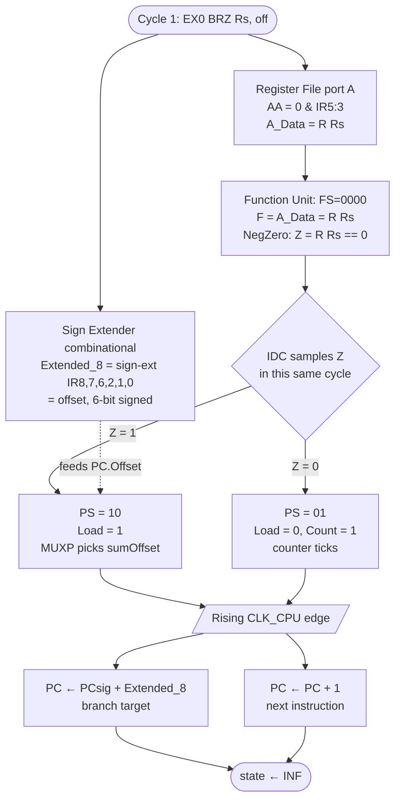

# EX — BRZ (Branch on Zero)

> [!info] What this note is
> The **conditional control-flow walkthrough**. BRZ exercises (a) the SignExtender's quirky non-contiguous offset encoding, (b) the PC's PS=10 branch-add path, and (c) **a subtle Z-flag semantics gotcha**: BRZ does NOT test the previous instruction's Z — it tests the Z produced by the current cycle's ALU pass of R[SA].

**Backlinks:** [[EX — Microprocessor (top)]] · [[EX — Instruction ADD]] · [[EX — Instruction JMP]] · [[ProgramCounter]] · [[SignExtender]]

---

## 1. Spec & semantics

> If Z=1: `PC ← PC + se(ΔD)`
> If Z=0: `PC ← PC + 1` (normal increment, branch not taken)
>
> Where `se(ΔD)` is the sign-extended offset embedded in IR's non-opcode fields. ΔD is a 6-bit signed value; range `-32..+31`.

| Property | Value |
|---|---|
| Opcode (`IR(15:9)`) | `1100000` |
| Cycles | **2** (INF → EX0 → INF) — same cost whether taken or not |
| Affected flags | none directly, but EX0's combinational ALU pass updates V/C/N/Z based on R[SA] |
| Affected registers | none (PC only) |
| Memory access | none |

**Source citations:**
- 62711 PWF spec PDF page 1: two BRZ rows in the FSM table — one for Z=1 (PS=10), one for Z=0 (PS=01).
- Team VHDL: [`InstructionDecoderController.vhd:156-163`](../../../../../../../4.%20Semester/Digital%20Systems%20Design/team/PWB/sources/hdl/InstructionDecoderController.vhd):
  ```vhdl
  when "1100000" =>
      next_state <= INF;
      if Z = '1' then
          PS <= "10";
      elsif z = '0' then
          PS <= "01";
      end if;
  ```
- [`team/PWB/sources/hdl/SignExtender.vhd:15-17`](../../../../../../../4.%20Semester/Digital%20Systems%20Design/team/PWB/sources/hdl/SignExtender.vhd):
  ```vhdl
  Extended_8 <= (7 downto 5 => IR(8)) &  -- IR(8) extended (3 sign bits)
                IR(7 downto 6) &          -- 2 middle bits
                IR(2 downto 0);           -- 3 low bits
  ```

---

## 2. Encoding — the weird offset layout

```
 15        9 | 8 6 | 5 3 | 2 0
┌───────────┬─────┬─────┬─────┐
│  1100000  │ Δhi │ SA  │ Δlo │
│  opcode   │ 3 b │ 3 b │ 3 b │
└───────────┴─────┴─────┴─────┘
```

The 6-bit signed offset ΔD is **split** across the DR slot (high 3 bits) and the B-slot (low 3 bits). The middle slot (5..3) holds SA — the register whose value is passed through the ALU to generate Z for *this* cycle (see §5 gotcha).

The bit-by-bit layout the SignExtender produces in `Extended_8(7..0)`:

| `Extended_8` bit | Source IR bit | Role |
|---|---|---|
| 7, 6, 5 | IR(8), IR(8), IR(8) | sign-extension (3 copies of IR(8)) |
| 4 | IR(7) | offset bit 4 |
| 3 | IR(6) | offset bit 3 |
| 2 | IR(2) | offset bit 2 |
| 1 | IR(1) | offset bit 1 |
| 0 | IR(0) | offset bit 0 |

So the offset is a 6-bit signed value `{IR(8), IR(7), IR(6), IR(2), IR(1), IR(0)}` with IR(8) as the sign bit. Range: **-32..+31**.

> [!warning] [[dsdasm]]'s `-4..+3` claim is wrong about the hardware
> [[dsdasm]]'s syntax reference says branch offsets are "3-bit signed (-4..+3)" — that's only true if you use the `B<n>` shorthand (which only fills IR(2:0) and zero-fills IR(8:6)). When you write a decimal offset like `brz A0, -10`, the assembler must put the offset across both fields. **The hardware can encode -32..+31. The [[dsdasm]] note is a Phase-2 fact-check item.**

**Example word:** `BRZ A1, +3` (if Z then jump 3 ahead)
- Opcode `1100000`, ΔD = +3 = `000011`
- IR(8..6) = top 3 bits of `000011` = `000`. IR(5..3) = SA = `001`. IR(2..0) = bottom 3 bits = `011`.
- Binary: `1100000 000 001 011` = `1100 0000 0000 1011` = `0xC00B`

**Example word:** `BRZ A1, -2` (if Z then jump back 2)
- Opcode `1100000`, ΔD = -2 = `111110` (two's-complement 6-bit)
- IR(8..6) = `111`, IR(5..3) = `001`, IR(2..0) = `110`.
- Binary: `1100000 111 001 110` = `1100 0001 1100 1110` = `0xC1CE`

---

## 3. Cycle-by-cycle walkthrough — Z=1 (branch taken)

Setup:
- R1 = `0x00` (so that the EX0 ALU pass produces Z=1).
- IDC.current_state = INF, PC = `0x05` (the BRZ instruction's address).
- BRZ instruction at `0x05`: `BRZ A1, +3` (= `0xC00B`). Target = PC + 3 = 0x08.

### Cycle 0 — INF (fetch)

Same as every fetch. RAM returns `0xC00B` on `Data_Bus_Out`. IR loads on the rising edge. Next state → EX0.

### The EX0 decision in one picture



> **The non-obvious thing this diagram makes explicit:** the FU is running on `R[SA]` *during* BRZ's EX0, and the Z it produces drives the branch decision. So `BRZ A1, off` literally tests `R1 == 0`, not "did the previous instruction produce zero?". Section §5 below has the full prose explanation.

### Cycle 1 — EX0 (test Z, branch if set)

```
IR(15:9) = 1100000 → BRZ branch

Asserted by IDC (combinational, sees Z=1):
   PS = 10                          ← branch path: PC ← PC + Offset
   IL = 0
   DX = 0 & IR(8..6) = "0000"       ← driven (top 3 offset bits), ignored
   AX = 0 & IR(5..3) = "0001"       ← R[SA] = R1 → A_Data = 0 (this is what feeds the ALU)
   BX = 0 & IR(2..0) = "0011"       ← driven, ignored
   FS = 0000                        ← ALU passes A through (= 0)
   MB = 0, MD = 0
   RW = 0                           ← NO register write
   MM = 0, MW = 0
```

**Diagram trace:**
1. Register file: AA=`0001` → A_Data = R1 = 0.
2. SignExtender (combinational, always running on IR): IR=`0xC00B` → `Extended_8 = 000_000_011 = 0x03`.
3. PC: with `PS=10`, MUXP selects `sumOffset = PCsig + Extended_8 = 0x05 + 0x03 = 0x08`. Load=1.
4. Function Unit: A=0, B=garbage, FS=0000 → F = 0. NegZero: Z=1, N=0. **This Z is what the IDC sampled when deciding PS=10.**
5. Output mux flags V/C/N/Z combinational → IDC's input.

**Critical timing point:** The Z flag is *combinational*. The IDC's combinational process sees:
- `current_state = EX0`, IR matches BRZ pattern.
- Z is fed live from the FU, which is running on `R1 = 0` with FS=0000 → Z=1.
- So the IDC's `if Z = '1'` branch fires → asserts `PS = 10`.

This means **BRZ's branch decision is based on whether R[SA] = 0 at this exact moment, not on whatever Z was after the previous instruction.** Go read §5 before this confuses you.

**Rising edge ends cycle 1:**
- PC ← `0x08` (PC + offset = PC + 3).
- State ← INF.

---

## 4. Cycle-by-cycle walkthrough — Z=0 (branch NOT taken)

Setup change: R1 = `0x42` (nonzero).

Cycle 0 same. Cycle 1 with the same IR:
- A_Data = R1 = 0x42. FU pass-A → F = 0x42. Z = 0.
- IDC's `if Z = '1'` is false; `elsif Z = '0'` fires → `PS = 01`.
- PC: PS=01 → `Load=0, Count=1` → counter ticks: PC ← 0x05 + 1 = `0x06`.

**Rising edge:** PC ← 0x06 (just the next instruction). State ← INF.

So whether or not the branch is taken, **BRZ always takes 2 cycles**.

---

## 5. The Z-semantics gotcha — read this twice

The intuitive reading of `BRZ A1, +3` is **"if the result of the *previous* arithmetic op was zero, branch."** This is how branches work in most ISAs (e.g. AVR, ARM A32, x86).

**But this hardware doesn't work that way.** The flags V/C/N/Z are *combinational outputs of the FU*, recomputed every cycle from whatever the ALU is currently doing. In BRZ's EX0:
- The IDC drives FS=0000 (default) → ALU does "pass A".
- A = `A_Data` = R[SA].
- So Z = `(R[SA] == 0)`.

The Z that BRZ samples is **the Z produced by this cycle's ALU running on R[SA]** — NOT the Z left over from the previous instruction. The previous instruction's flag has already been overwritten in this very cycle.

So `BRZ A1, +3` actually means **"if R1 = 0, branch by +3"**, not "if the previous result was 0, branch."

This is consistent with the spec mnemonic-explained table which writes `BRZ` as `PC ← PC + se ΔD` (with no explicit reference to a "result" flag) — it just leaves the Z-source unspecified.

> [!warning] How to *actually* test "is the result of the previous op zero?"
> You can't, directly. You have to *re-run* the test in the same instruction's EX0. The standard idiom:
> ```asm
>     add  D2 A1 B3       ; R2 = R1 + R3, sets flags but flags are about to be lost
>     mova D2 A2          ; explicitly move R2 to itself via the ALU — flags now reflect R2
>     ; ... no wait, MOVA still discards flags at the end of the cycle.
> ```
>
> Actually the trick is: BRZ's *implicit* Z test on R[SA] works perfectly if you put the result you want to test into R[SA]:
> ```asm
>     add  D2 A1 B3       ; R2 = R1 + R3
>     brz  A2, target     ; tests R2 == 0; works because EX0's pass-A puts R2 through the ALU
> ```
>
> So the spec's notation `BRZ Rs, off` IS meaningful — `Rs` is the register being tested. The mnemonic just doesn't say it explicitly.

Confirmed in the [[microcode-program]] addsub_calc example: `LD R4 R3 ; BRZ D0 A4 B2` — the `LD` loads R4, then `BRZ A4` tests R4's value, not the LD's effect on Z.

---

## 6. Path on `architecture.pdf`

For Z=1 (branch taken):

```
R1 ─→ A_Data ─→ FU.A ─→ ALU pass-A ─→ F ─→ NegZero ─→ Z ─┐
                                                          │
IR(8,7,6,2,1,0) ─→ Sign Extender ─→ Extended_8 = Offset   │
                                       │                  │
                                       ▼                  │
                                       PC.Offset          │
                                                          ▼
                                                       IDC sees Z=1 → PS=10
                                                                       │
                                                                       ▼
                                                       PC: MUXP picks sumOffset (= PCsig + Offset)
                                                                       │
                                                                       ▼ (next CLK_CPU edge)
                                                       PC ← PCsig + Offset
```

The Z signal from the Function Unit travels **leftward** across the diagram into the IDC's `V,C,N,Z` input pin. The Offset travels **upward** from the SignExtender (just below the IR block) into the PC's `Offset` input pin.

---

## 7. BRN vs BRZ

`BRN` (Branch on Negative, opcode `1100001`) is structurally identical, only swapping which flag the IDC samples:

```vhdl
when "1100001" =>
    next_state <= INF;
    if N = '1' then PS <= "10";
    elsif N = '0' then PS <= "01";
    end if;
```

Same encoding layout, same SignExtender path, same gotcha — `BRN A1, +3` tests "is R1 negative (bit 7 set)?", not "was the previous result negative?".

---

## 8. Gotchas

| Gotcha | Why it matters |
|---|---|
| **Z is determined by R[SA] = 0, not by the previous instruction.** | The exam-trivia eye-opener. See §5. |
| **Offset is 6-bit signed (-32..+31), encoded non-contiguously across IR(8,7,6) ∥ IR(2,1,0).** | [[dsdasm]]'s claim of "3-bit signed" is wrong about the hardware. Phase-2 fact-check item. |
| **PS=10 does not include a +1.** | The PC adder computes `PCsig + Offset` with Cin=0 ([`ProgramCounter.vhd:24-30`](../../../../../../../4.%20Semester/Digital%20Systems%20Design/team/PWB/sources/hdl/ProgramCounter.vhd)). So the assembler computes Offset = `target_address - branch_instruction_address`, no -1 needed. |
| **BRZ always takes 2 cycles, taken or not.** | Saves you from "is my BRZ-not-taken faster" timing reasoning. It isn't. |
| **The "Rs" syntactic field is semantically the *test* register, not a "source" register in the normal sense.** | Easy to confuse with LD's Rs (which is the address). For BRZ/BRN, Rs is the value being tested for zero/negative. |

---

## 9. Source list

- [`team/PWB/sources/hdl/InstructionDecoderController.vhd:156-163`](../../../../../../../4.%20Semester/Digital%20Systems%20Design/team/PWB/sources/hdl/InstructionDecoderController.vhd) — BRZ FSM case.
- [`team/PWB/sources/hdl/SignExtender.vhd:15-17`](../../../../../../../4.%20Semester/Digital%20Systems%20Design/team/PWB/sources/hdl/SignExtender.vhd) — non-contiguous offset assembly.
- [`team/PWB/sources/hdl/ProgramCounter.vhd:137-146`](../../../../../../../4.%20Semester/Digital%20Systems%20Design/team/PWB/sources/hdl/ProgramCounter.vhd) — PS decoding.
- 62711 PWF spec PDF page 1.
- [[SignExtender]] · [[ProgramCounter]] · [[NegZero]].
- [[microcode-program]] addsub_calc example — real-world BRZ usage.

---

> [!nav]
> &nbsp;
>
> ← [[EX — Instruction JMP]] · → [[EX — Instruction LDI]] *(next)*
>
> Related: [[ProgramCounter]] · [[SignExtender]] · [[InstructionDecoderController]]
