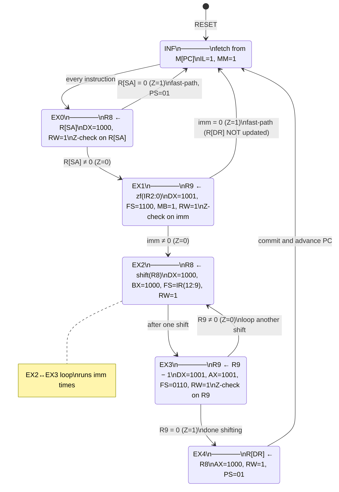

# EX — SRM (Shift Right Multiple)

> [!info] What this note is
> Phase-1 extraction for the **headliner multi-cycle instruction** — explicitly named in the exam-prep prompt. SRM is the 5+ cycle one that loops EX2↔EX3 until the shift counter hits zero. The walkthrough below traces the full FSM with concrete register values and shows exactly which wires move on `architecture.pdf` in each state.

**Backlinks:** [[EX — Microprocessor (top)]] · [[EX — Instruction LD]] · [[InstructionDecoderController]] · [[PWF Project]]

---

## 1. Spec & semantics

> `R[DR] ← R[SA] >> imm`
> *"Right-shift the value in R[SA] by `imm` positions and store the result in R[DR]. The shift count `imm` is the 3-bit unsigned value in the B-slot."*

| Property | Value |
|---|---|
| Opcode (`IR(15:9)`) | `0001101` |
| Shift count | `imm = IR(2:0)`, range 0..7 |
| Cycles | **3 + 2·imm** (INF → EX0 → [EX1 → EX2 → EX3]·imm → EX4 → INF), unless `imm=0` which short-circuits to 2 cycles (INF → EX0 → INF) |
| Affected flags | V/C/N/Z each cycle from the active ALU op — final flag state reflects the EX3 decrement |
| Scratch registers used | **R8** (holds the value being shifted), **R9** (the down-counter). These are reserved; user code must not assume them. |
| Memory access | none |

> [!warning] SLM is the mirror image
> `SLM` (opcode `0001110`, "Shift Left Multiple") is structurally identical — same 5-state flow, only FS changes (`1101=sr` vs `1110=sl` in EX2). Everything in this note applies to SLM with `sr→sl`. **There is one known VHDL difference**: the SRM EX1 transition has the `Z=0 → EX2, Z=1 → INF` early-exit; SLM's EX1 case in the VHDL also writes the same logic but with a redundant prior `next_state <= EX2` (overwritten by the if-elsif) — net behavior is identical, just stylistically different. ([`InstructionDecoderController.vhd:213-225`](../../../../../../../4.%20Semester/Digital%20Systems%20Design/team/PWB/sources/hdl/InstructionDecoderController.vhd))

**Source citations:**
- 62711 PWF spec PDF page 1 — SRM rows (`EX0 0001101 XX0 EX1` etc.) show the full 5-cycle FSM with imm-skip on Z=1.
- Team VHDL: [`InstructionDecoderController.vhd:97-105`](../../../../../../../4.%20Semester/Digital%20Systems%20Design/team/PWB/sources/hdl/InstructionDecoderController.vhd) (EX0), `:199-211` (EX1), `:236-242` (EX2), `:246-257` (EX3), `:262-267` (EX4).
- [[InstructionDecoderController]] §"Kategori 3: 5+ cyklus" — the existing Obsidian note's FSM diagram matches the VHDL exactly. Trust verified.
- [[dsdasm]] — note that the assembler takes 3 operands (`srm D0 A0 B2`), with B as a zero-filled immediate. (The lecture-9 short form `srm R0` is rejected.)

---

## 2. Encoding

```
 15        9 | 8 6 | 5 3 | 2 0
┌───────────┬─────┬─────┬─────┐
│  0001101  │ DR  │ SA  │ imm │
│  opcode   │ 3 b │ 3 b │ 3 b │
└───────────┴─────┴─────┴─────┘
```

**Example:** `SRM D2 A1 B3` (R2 ← R1 >> 3)
- Opcode `0001101`, DR=`010`, SA=`001`, imm=`011`
- Binary: `0001101 010 001 011` = `0001 1010 1000 1011` = `0x1A8B`

---

## 3. The FSM in one picture



Cycle count: `3 + 2·imm` total CLK_CPU cycles (1 INF + 1 EX0 + 1 EX1 + imm·(EX2+EX3) + 1 EX4). The two fast-paths (R[SA]=0 in EX0, imm=0 in EX1) short-circuit to INF in 2 cycles total — but with the caveat that R[DR] is **not** updated in either fast-path (EX4 is skipped).

---

## 4. State-by-state control word

Reading the VHDL ([`InstructionDecoderController.vhd`](../../../../../../../4.%20Semester/Digital%20Systems%20Design/team/PWB/sources/hdl/InstructionDecoderController.vhd)) line by line — every signal not listed defaults from the top-of-process defaults (`PS=00, IL=0, FS=0000, MB=0, MD=0, RW=0, MM=0, MW=0, DX/AX/BX = '0' & IR-fields`).

| State | Next State | Asserted control bits | What's actually happening |
|---|---|---|---|
| **INF** | EX0 | `IL=1, MM=1` | Fetch the SRM word into IR. |
| **EX0** | EX1 if Z=0, else INF | `DX="1000", RW=1` (FS default `0000` = transfer A; AX = `'0'&IR(5..3)` = SA-register) | R8 ← R[SA]. Flag Z is sampled from this transfer — Z=1 means R[SA] was zero, so shift result would also be zero, no need to loop. Z=0 means we have shifting work to do; first set up the counter in EX1. PS stays `00` (PC holds) for the multi-cycle path. **(SRM imm=0 case: when `Z=1` the IDC overrides next_state to INF with `PS=01`, advancing PC.)** |
| **EX1** | EX2 if Z=0, INF if Z=1 | `DX="1001", FS="1100" (MOVB / pass-B), MB=1, RW=1` | R9 ← zf(IR(2:0)) — the shift count, taken via the ZeroFiller through MUX B (MB=1), pass-B in the ALU (FS=1100), written to R9 (DX=1001). The post-write Z flag reflects the loaded count: Z=1 only if imm=0 (already handled in EX0). |
| **EX2** | EX3 (unconditional) | `DX="1000", AX='0'&IR(5..3) (= SA-register, defensive but unused), BX="1000" (= R8 on port B), FS=IR(12..9) (= 1101 for SRM, 1110 for SLM), RW=1` | R8 ← shift-right(R8) by *one* position. The Shifter inside the Function Unit takes its input from port B (`B_Data` after MUX B with MB=0); `BX="1000"` routes R8 there. FS=1101 selects "shift right" in the FS encoding (see [[PWA Project]] §"Shift operations"). AX is the user's SA register — driven defensively but irrelevant this cycle because MUX F picks Shifter output, not ALU output. **See §10 below for why this `BX="1000"` line is the most important line in the whole IDC.** |
| **EX3** | EX2 if Z=0, EX4 if Z=1 | `DX="1001", AX="1001", BX='0'&IR(2..0), FS="0110" (DEC), RW=1` | R9 ← R9 − 1. The ALU's DEC operation sets Z when the result hits zero. If R9 is still nonzero, loop back to EX2 for another shift. If R9 just hit zero, advance to EX4. |
| **EX4** | INF | `PS=01, AX="1000", RW=1` (FS default `0000`, AA selects R8, MUX D picks ALU pass-A output) | R[DR] ← R8 (the accumulated shift result). PS=01 advances PC for the *next* instruction. `DX` defaults to `'0'&IR(8..6)` (= the user's destination register), which is what we want. |

> [!important] How EX2 and EX3 cooperate — single shift, single decrement, ping-pong
> Each loop iteration costs **two** CLK_CPU cycles: one for the shift (EX2) and one for the decrement+test (EX3). So shifting by 3 positions takes 6 cycles in the loop alone, plus 1 (INF) + 1 (EX0) + 1 (EX1) + 1 (EX4) = **10 cycles total** for `imm=3`.

---

## 5. Concrete walkthrough — `SRM D2 A1 B3` with R1 = 0xC0 (= 0b1100_0000)

Expected result: R2 = 0xC0 >> 3 = 0b0001_1000 = 0x18, in 9 cycles total.

Setup (preconditions):
- R1 = `0xC0`, R2 = `0x00`, R8 = `0x00`, R9 = `0x00`.
- IDC.current_state = INF, PC = address of the SRM instruction (say `0x10`).

### Cycle 0 — INF (fetch)

```
state=INF  →  IL=1, MM=1
PC = 0x10 → MUX M (1) → RAM reads 0x10 → 0x1A8B → MUX MR → Data_Bus_Out
Next edge: IR ← 0x1A8B, state ← EX0.
```

(Identical mechanics to [[EX — Instruction LD]] cycle 0 — see there for the diagram trace.)

### Cycle 1 — EX0 (R8 ← R1, check Z)

```
IR(15:9) = 0001101 → SRM branch
IR(8:6) = 010 (DR=R2), IR(5:3) = 001 (SA=R1), IR(2:0) = 011 (imm=3)

Asserted:
   DX = "1000"           ← R8 is the destination
   AX = '0' & IR(5..3) = "0001"  ← read port A = R1 → A_Data = 0xC0
   BX = '0' & IR(2..0) = "0011"  ← driven, ignored (MB=0 means MUX B picks B_Data = R3)
   FS = "0000"           ← pass-A
   MB = 0, MD = 0
   RW = 1                ← R8 will be written next edge
   MM = 0, MW = 0, IL = 0
   PS = 00               ← PC holds (multi-cycle path)
```

**Diagram trace:**
- Register file: read port A selects `AA=0001` → `A_Data = R1 = 0xC0`. Read port B selects `BA=0011` → `B_Data = R3 = 0x00` (irrelevant).
- Function Unit: A=0xC0, B=0 (via MUX B with MB=0), FS=0000 → F = A = 0xC0.
- Flags: N = bit-7 of F = 1 (the 1 in 0xC0's MSB), Z = 0 (0xC0 ≠ 0), V = 0, C = 0.
- MUX D: MD=0 → picks F = 0xC0.
- Register file: DA=1000 selects R8 (the high MSB on DX puts us in the extended-register region). RW=1 → next edge writes 0xC0 to R8.

**Z is sampled by the IDC's combinational logic in this same cycle.** Because Z=0, `next_state = EX1`.

**Rising edge of CLK_CPU:** R8 ← 0xC0, IDC.state ← EX1.

### Cycle 2 — EX1 (R9 ← imm = 3)

```
state=EX1, IR still 0x1A8B → SRM branch
Asserted:
   DX = "1001"            ← R9
   AX, BX default
   FS = "1100"            ← MOVB / pass-B  (so the ALU just hands through its B input)
   MB = 1                 ← MUX B picks ConstantIn (= ZeroFiller output)
   RW = 1
   PS = 00
```

**Diagram trace:**
- ZeroFiller: input IR(2..0) = 011, output = `0000 0011` = 0x03 → `Constant_Out`.
- MUX B: MB=1 → picks `ConstantIn = 0x03` (ignores B_Data).
- ALU: A=A_Data (irrelevant), B=0x03, FS=1100 → F = B = 0x03 (the Shifter in the FU's pass-through mode actually; FS=1100 is in the shift region per [[PWA Project]] §"Shift operations" — `F = B` pass-through).
- Flags: N=0, Z=0 (0x03 ≠ 0), V=0, C=0.
- MUX D: MD=0 → picks F = 0x03.
- Register file: DA=1001 selects R9. RW=1.

**Z=0**, so `next_state = EX2`.

**Rising edge:** R9 ← 3, state ← EX2.

### Cycle 3 — EX2 (R8 ← R8 >> 1)

```
state=EX2
Asserted:
   DX = "1000", AX = '0' & IR(5..3) = "0001", BX = "1000"
   FS = IR(12..9) = "1101" (shift right)
   RW = 1
   PS = 00
```

Wait — let me re-read the VHDL on AX:

```vhdl
when EX2 =>
    next_state <= EX3;
    DX <= "1000";
    AX <= '0' & IR(5 downto 3);   -- ⚠ note: this is SA, not R8
    BX <= "1000";                  -- ← R8 selected on port B
    FS <= IR(12 downto 9);
    RW <= '1';
```

So `AX = '0' & IR(5..3) = 0001` (= R1) on port A, and `BX = 1000` (= R8) on port B. The Shifter inside the FU shifts its **B input** (which is R8), not the ALU's A input. The FS=1101 selects "shift right" in the Shifter (see [[Shifter]]). The A input is fed but ignored — the FU's output mux picks Shifter when MF=1 (which happens when FS3=1 AND FS2=1, true for 1101).

**Diagram trace** (cycle 3, iteration 1):
- Register file read port B: BA=1000 → R8 = 0xC0 → `B_Data = 0xC0`.
- MUX B: MB=0 → picks B_Data = 0xC0 → Function Unit's B input.
- Function Unit Shifter: shifts B (= 0xC0 = 0b1100_0000) right by 1 → 0x60 = 0b0110_0000.
- FU output (MUX F selects Shifter because FS3∧FS2 = 1): F = 0x60.
- MUX D: MD=0 → picks F = 0x60.
- Register file: DA=1000 = R8. RW=1.

**Rising edge:** R8 ← 0x60, state ← EX3.

### Cycle 4 — EX3 (R9 ← R9 − 1 = 2, test Z)

```
state=EX3
Asserted:
   DX = "1001", AX = "1001", BX = '0' & IR(2..0) = "0011"
   FS = "0110" (DEC: F = A − 1)
   RW = 1
```

- A_Data = R9 = 3, B_Data ignored.
- ALU: A=3, FS=0110 → F = A − 1 = 2.
- Flags: Z = (F == 0) = 0, N = 0.
- Register file: DA=1001 = R9, write 2.

**Z=0** → `next_state = EX2`.

**Rising edge:** R9 ← 2, state ← EX2.

### Cycle 5 — EX2 (R8 ← R8 >> 1 again)

R8 = 0x60 → shifted right → R8 ← 0x30. `next_state = EX3`.

### Cycle 6 — EX3 (R9 ← 2 − 1 = 1, Z=0)

R9 ← 1. **Z=0** → `next_state = EX2`.

### Cycle 7 — EX2 (R8 ← R8 >> 1 again)

R8 = 0x30 → 0x18. `next_state = EX3`.

### Cycle 8 — EX3 (R9 ← 1 − 1 = 0, Z=1)

R9 ← 0. **Z=1** → `next_state = EX4`.

### Cycle 9 — EX4 (commit R8 → R[DR])

```
state=EX4
Asserted:
   PS = 01                  ← PC will increment next edge (instruction done)
   AX = "1000"              ← read port A = R8 → A_Data = 0x18
   DX = '0' & IR(8..6) = "0010"  ← R[DR] = R2 (default DX from top-of-process)
   FS = "0000"              ← pass-A
   MB = 0, MD = 0, RW = 1
```

- A_Data = R8 = 0x18.
- ALU: F = A = 0x18.
- MUX D: MD=0 → picks F = 0x18.
- Register file: DA = 0010 = R2, RW=1.

**Rising edge:** **R2 ← 0x18**, PC ← PC+1, state ← INF. Instruction complete.

Total cycles consumed: **9** (1 INF + 1 EX0 + 1 EX1 + 3×(EX2+EX3) + 1 EX4) = matches the `3 + 2·imm = 3 + 6 = 9` formula. ✓

---

## 6. Path on `architecture.pdf`

The key paths SRM exercises across its lifetime:

| Cycle | Wires lit on the diagram |
|---|---|
| INF | PC → MUX M(1) → RAM → MUX MR → Data_Bus_Out → IR |
| EX0 | Register file read A → ALU pass-A → MUX D(0) → D_Data → R8 (via DX=1000 to the extended-reg region of the register file). Z flag travels from NegZero → IDC. |
| EX1 | ZeroFiller (from IR) → cconstant_In → MUX B(1) → Shifter pass-B → MUX F → MUX D(0) → R9. |
| EX2 | Register file read B (R8) → MUX B(0) → Shifter sr → MUX F → MUX D(0) → R8. |
| EX3 | Register file read A (R9) → ALU DEC → MUX F → MUX D(0) → R9. Z flag → IDC. |
| EX4 | Register file read A (R8) → ALU pass-A → MUX F → MUX D(0) → R[DR]. |

> [!tip] The reason EX2 takes only one cycle, not "one shift per bit of R8"
> The Shifter is a **single-position barrel shifter** in this design (see [[Shifter]]). One position per EX2 visit. To shift by 3, the FSM loops through EX2/EX3 three times. The alternative — a multi-position shifter — would shift "all at once" in one cycle but burn more LUTs; the team picked the loop.

---

## 7. The R8/R9 hazard — why user code mustn't touch them

R8 and R9 are not in the user's normal `R0..R7` set. They're addressable via the extended `DX`/`AX` = `1000` and `1001` MSB-prefix that the IDC uses internally.

- If your microcode happens to write to "R8" or "R9" via `LDI` or any other instruction, **you can't** — the encoding only has 3 bits for register selectors (`IR(8:6)` etc.), so the high bit `DX(3)` is always 0 for user-visible instructions.
- BUT if you `LRI` or `SRM` and your *immediately preceding* code assumed R8/R9 held something, those assumptions are broken. R8 is also used by `LRI` (see [[InstructionDecoderController]] §"Kategori 2"), so back-to-back `LRI; SRM` will work fine but `SRM; ...; LRI; SRM` will get fresh R8 each time.

(The [[dsdasm]] doc has a "Don't use R8" warning that reflects this — it's about the assembler accepting `R8` syntactically but the encoding not supporting it.)

---

## 8. Gotchas

| Gotcha | Why it matters |
|---|---|
| **`imm=0` short-circuits to 2 cycles in EX0, with PS=01.** | If you write `srm D2 A1 B0` expecting nothing to happen, it really *does* nothing — and only costs 2 cycles. R8 is still written to R[SA] in EX0 though, so don't rely on R8's contents surviving. |
| **The Z flag in EX0 reflects R[SA], not the shift result.** | Useful for the imm=0 fast-path (when R[SA] = 0, both routes give 0 so the fast-path is correct). |
| **In EX2, AX is set to SA, not R8 — but A_Data is unused** because Shifter takes B_Data. | Looks like a bug, isn't one. It's just defensive driving of AX (which is unused this cycle). The actual shift input is `BX = "1000"` (= R8). |
| **`PS=00` during the entire multi-cycle path, *except* EX0's fast-path and EX4.** | The PC must hold through the loop; only the cycle that *exits* the instruction asserts PS=01 to advance. |
| **No memory access at all.** | Despite SRM being a "5+ cycle" instruction it never reads or writes memory. The cycle cost comes from the register-file ping-pong, not from RAM latency. |

---

## 9. The b899da1 fix — what would have happened without it (exam-gold)

The current IDC reflects fix commit `b899da1` (`fix(IDC): SRM/SLM Z-check i EX1 og BX=R8 i EX2`, 13-May-2026, by Jonas) which made the SRM/SLM flow actually work. The same commit also enforced a design discipline: **be explicit about every signal in every state.** If the lecturer asks "what does this fix do?", here is the precise story.

### 9.1 The critical bug in EX2 — wrong register on the Shifter

**Pre-fix EX2:**
```vhdl
when EX2 =>
    next_state <= EX3;
    DX  <= "1000";
    AX  <= "1000";                     -- R8 on port A (defensive)
    -- BX falls through to default: '0' & IR(2..0) = the imm field interpreted as a register index
    FS  <= IR(12 downto 9);
    RW  <= '1';
```

The Shifter's B input comes from `B_Data` (= the register file's read port B). With the default `BX = '0' & IR(2..0)`, port B reads **the register whose index equals the shift count** — for `srm Rd Rs B3` that's R3, for `srm Rd Rs B0` that's R0, for `srm Rd Rs B7` that's R7. **Not R8.** The accumulator R8 sat there shifted by nothing; the Shifter shifted some arbitrary user register's contents instead, wrote them back to R8, and propagated to R[DR] in EX4. SRM was completely broken — its output had no relationship to R[SA] or to the shift count.

**Post-fix EX2** (current):
```vhdl
when EX2 =>
    next_state <= EX3;
    DX  <= "1000";
    AX  <= '0' & IR(5 downto 3);       -- SA (defensive, unused since Shifter takes port B)
    BX  <= "1000";                     -- ★ R8 on port B → Shifter input
    FS  <= IR(12 downto 9);
    RW  <= '1';
```

Now port B reads R8, MUX B with MB=0 routes it to the Shifter's input, the Shifter shifts R8 by one, the result is written back to R8. **This single line `BX <= "1000"` is what makes SRM work.**

### 9.2 The other bug — 256-cycle infinite-loop when imm=0

**Pre-fix EX1:**
```vhdl
when "0001101" | "0001110" =>
    next_state <= EX2;                 -- always go to EX2, no Z-check
    DX  <= "1001";
    FS  <= "1100";
    MB  <= '1';
    RW  <= '1';
```

If you issue `srm Rd Rs B0` (shift by 0), EX1 loads R9 = 0 and unconditionally proceeds to EX2. In EX3, R9 is decremented: 0 - 1 = `0xFF` (255 in unsigned), and Z is now 0 (since 0xFF ≠ 0). The FSM loops back to EX2 and shifts R8 again. R9 decrements through 0xFE, 0xFD, …, all the way to 0 — **256 extra cycles** of shifting before the loop finally terminates. R8 ends up shifted 257 times (1 from the inadvertent first EX2 + 256 from the loop), which on an 8-bit value means R[DR] = 0 always.

**Post-fix EX1:**
```vhdl
when "0001101" =>                      -- SRM (separate when, with Z-check)
    DX  <= "1001";
    FS  <= "1100";
    MB  <= '1';
    RW  <= '1';
    if z = '0' then
        next_state <= EX2;
    elsif z = '1' then                 -- ★ imm=0 → exit immediately
        next_state <= INF;
    end if;
```

Now the Z output of the FU's pass-B (with B = imm) directly tells EX1 whether to enter the loop. If imm=0, Z=1 and the FSM jumps straight to INF. (SLM gets an identical `when` clause — see [`InstructionDecoderController.vhd:213-225`](../../../../../../../4.%20Semester/Digital%20Systems%20Design/team/PWB/sources/hdl/InstructionDecoderController.vhd), with one stylistic remnant: a redundant `next_state <= EX2` line before the if-elsif that gets overwritten.)

> [!warning] What about R[DR]? — the imm=0 caveat
> The imm=0 fast-path exits at EX1 **before** EX4 commits R8 → R[DR]. So `srm Rd Rs B0` leaves R[DR] *unchanged*, not assigned to R[SA]. A pure shift-by-zero is therefore *not* equivalent to `mova Rd Rs`. The same caveat applies to the EX0 fast-path (when R[SA] = 0): R[DR] never gets the "0" written to it explicitly — EX4 is skipped.

### 9.3 The "be explicit per state" discipline

The same commit changed the default at the top of the combinational process:

```vhdl
-- Pre-fix:
next_state <= INF;                     -- any state that forgot to set next_state would silently jump to INF
-- Post-fix:
next_state <= current_state;           -- any state that forgot now holds — visible misbehavior, easier to debug
```

The consequence: every state must restate every signal it wants set. So the **INF state grew from 3 lines to 11 lines** — re-asserting `PS=00, IL=1, MM=1` and all the default-zero outputs for `DX, AX, BX, MB, FS, MD, RW, MW`. The diff shows this verbatim.

This is the design lesson behind the commit title's "didn't tell exactly what happens in each state" framing: with the old defaults, INF only *had* to assert `IL=1, MM=1` and the rest came "for free" from process defaults. With the new policy, the defaults are unreachable from inside any `when` branch, so each branch self-documents — and a forgotten signal becomes visible as "held from previous state" rather than "silently fell back to no-op-INF".

Same commit also added defensive `elsif Z='0'` (instead of `else`) in BRZ, BRN, and SRM EX0 — so a metastable/X Z value doesn't accidentally drive PS.

### 9.4 Exam-question rehearsals

- **"What would happen if line `BX <= "1000";` in EX2 were deleted?"** → The Shifter would read R[IR(2:0)] (= the imm-field interpreted as a register index) instead of R8. SRM would shift the wrong register; R[DR] would receive shifted garbage unrelated to R[SA].
- **"What does the Z-check in EX1 protect against?"** → A 256-cycle infinite loop. Without it, `srm Rd Rs 0` (shift by zero) decrements R9 from 0 to 0xFF and loops through 256 spurious shifts.
- **"Why is the default `next_state <= current_state` and not `next_state <= INF`?"** → To enforce explicit per-state transitions. With the old default, any forgotten next_state assignment would silently fall through to INF (= "fetch next instruction"), which masks bugs. The new default holds — a forgotten transition is now a stuck FSM, which is visible immediately.

---

## 10. Source list

- [`team/PWB/sources/hdl/InstructionDecoderController.vhd`](../../../../../../../4.%20Semester/Digital%20Systems%20Design/team/PWB/sources/hdl/InstructionDecoderController.vhd) — the FSM (lines 97-105, 199-211, 236-242, 246-257, 262-267).
- 62711 PWF spec PDF, page 1, SRM rows of the FSM table.
- [[InstructionDecoderController]] §"Kategori 3" — the existing Obsidian note; trust verified by direct VHDL read.
- [[PWA Project]] §"Shift operations" — FS encoding for shifter (`1101=sr`, `1110=sl`).
- [[Shifter]] — single-position barrel shifter design.
- [[dsdasm]] §"SRM/SLM operand count" — 3-operand syntax, no R9 (shift count comes from B-slot, not from R9 the way an older lecture-9 form suggested).

---

> [!nav]
> &nbsp;
>
> ← [[EX — Instruction LD]] · ← [[EX — Microprocessor (top)]] · → [[EX — Instruction ADD]] *(next)*
>
> Related: [[InstructionDecoderController]] · [[Shifter]]
