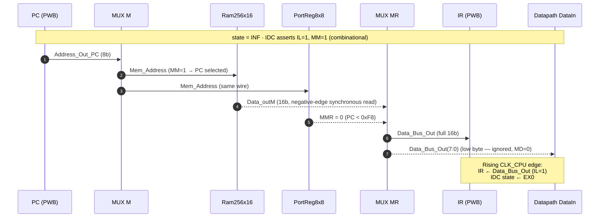

# EX — Microprocessor (top)

> [!info] What this note is
> A Phase-1 extraction — the **authoritative description of how the PWF microprocessor is wired together**. Sourced from the actual VHDL in [`team/PWF/sources/hdl/Microprocessor.vhd`](../../../../../../../4.%20Semester/Digital%20Systems%20Design/team/PWF/sources/hdl/Microprocessor.vhd) (truth source), with every block keyed to a label on [`architecture.pdf`](../architecture.pdf). Every later worked-example walkthrough leans on this doc.

**Backlinks:** [[EXAM_PREP_INVENTORY|Phase-0 Inventory]] · [[PWF Project]] · [[PWA Project]] · [[PWB Project]]

---

## 1. One-sentence purpose

`Microprocessor.vhd` is the **structural top of the CPU core** (everything inside the dotted-rectangle marked "1+2+3" on `architecture.pdf` *except* the seven-segment driver) — it instantiates the PWA Datapath, the PWB Microprogram Controller, the RAM, the Port Register, and the three multiplexers (MUX M, MUX MR, Zero Filler 2) that glue them together. The board wrapper [[#9 board-level wrapper TOP_MODUL_F|TOP_MODUL_F]] adds the clock divider + 7-seg driver and routes everything to the Nexys 4 DDR pins.

---

## 2. Entity ports

```vhdl
entity Microprocessor is
    port (
        CLK      : in  STD_LOGIC;                          -- 100 MHz board clock (drives BRAM only)
        CLK_CPU  : in  STD_LOGIC;                          -- divided clock (~50 MHz) -- drives CPU logic
        RESET    : in  STD_LOGIC;                          -- active-high (TOP inverts board's active-low pin)
        SW       : in  STD_LOGIC_VECTOR(7 downto 0);
        BTNC     : in  STD_LOGIC;
        BTNU     : in  STD_LOGIC;
        BTNL     : in  STD_LOGIC;
        BTNR     : in  STD_LOGIC;
        BTND     : in  STD_LOGIC;
        LED      : out STD_LOGIC_VECTOR(7 downto 0);
        D_Word   : out STD_LOGIC_VECTOR(15 downto 0)       -- 7-seg display word (driven by SevenSegDriver in TOP)
    );
end Microprocessor;
```

**Source:** [`Microprocessor.vhd:16-31`](../../../../../../../4.%20Semester/Digital%20Systems%20Design/team/PWF/sources/hdl/Microprocessor.vhd).

> [!warning] Dual clock domain — exam-relevant
> Two synchronous clocks enter the entity:
> - `CLK` (100 MHz) drives **only the RAM** (`Ram256x16`) and (in `TOP_MODUL_F`) the `SevenSegDriver`. It's the raw Nexys-4-DDR board clock.
> - `CLK_CPU` (50 MHz when `CPU_DIV=1`, ~100 Hz when `CPU_DIV=1_000_000`) drives **all the CPU logic** — Datapath, Microprogram Controller, PortReg8x8.
>
> `CLK_CPU` is **synchronously derived** from `CLK` via a toggle-based divider ([`DivClk.vhd`](../../../../../../../4.%20Semester/Digital%20Systems%20Design/team/PWF/sources/hdl/DivClk.vhd)) and then routed through a `BUFG` global-clock buffer in `TOP_MODUL_F.vhd:83-87`. Because the relationship is fixed-phase, no CDC synchronizers are needed across the boundary. (Doc-note at the top of [`Microprocessor.vhd:6-15`](../../../../../../../4.%20Semester/Digital%20Systems%20Design/team/PWF/sources/hdl/Microprocessor.vhd).)
>
> **Why two domains?** Two reasons. (a) The BRAM macro wants its full 100 MHz clock; throttling the CPU doesn't gain anything on the RAM side. (b) For board demos a slow CPU clock (~100 Hz) lets you eyeball single-cycle behavior on the LEDs.

---

## 3. The five internal blocks at a glance

| Diagram label (architecture.pdf) | VHDL entity | Clock | Role |
|---|---|---|---|
| **Block 1** — 16×8 Register File + Function Unit + MUX B + MUX D | `Datapath` (PWA) | `CLK_CPU` | Holds registers; performs ALU/Shifter ops |
| **Block 2** — PC + IR + SE + ZF + IDC | `MicroprogramController` (PWB) | `CLK_CPU` | Fetches & decodes instructions; emits control word |
| **Block 3 left** — `RAM 256x16` | `Ram256x16` | `CLK` (negative edge!) | Holds the microcode program + data |
| **Block 3 right** — `Port Register 8 x 8` | `PortReg8x8` | `CLK_CPU` | Memory-mapped I/O at `0xF8..0xFF` |
| **MUX M** | inline VHDL in `Microprocessor.vhd:70` | combinational | Picks address source (PC vs Datapath) |
| **MUX MR** | `MUX_MR` | combinational | Picks read-data source (RAM vs PortReg) |
| **Zero Filler2** | `Zero_Filler_2` | combinational | Pads 8-bit Datapath output to 16-bit for memory write |

---

## 4. Signal-flow paths — the two journeys

Every cycle, exactly **one of these two paths** is exercised, selected by `MM`:

### 4.1 Instruction-fetch path (MM=1, state = INF)



For instruction fetch, `MMR` is always 0 (PC values live below `0xF8`), so MUX MR passes RAM output. The same `Mem_Address` reaches the PortReg, but with MMR=0 its output is ignored.

### 4.2 Operand path (MM=0, state = EX0/EX1/…)

```mermaid
sequenceDiagram
    autonumber
    participant RF as Register File
    participant DP as Datapath
    participant ZF2 as Zero Filler 2
    participant MM as MUX M
    participant RAM as Ram256x16
    participant PR as PortReg8x8
    participant MR as MUX MR
    participant MUXD as MUX D
    participant IDC as IDC

    Note over RF,IDC: state ≠ INF · IDC asserts MM=0 (default in EX0+)
    RF->>DP: A_Data = R[SA] (drives Address_Out)
    DP->>MM: Address_Out_DP (= A_Data, 8b)
    MM->>RAM: Mem_Address (MM=0 → Datapath selected)
    MM->>PR: Mem_Address (same wire)

    alt MW = 1 (memory write — ST)
        RF->>DP: B_Data = R[SB] (drives Data_Out)
        DP->>ZF2: Data_Out (8b)
        ZF2->>RAM: Data_in_RAM (16b, top byte = 0)
        ZF2->>PR: Data_In (same wire)
        Note over RAM,PR: Address(7:3)="11111" picks PortReg;<br/>else picks RAM. Only the matching<br/>region actually commits the write.
    end

    PR-->>MR: MMR (combinational from Address(7:3))
    RAM-->>MR: Data_outM (16b)
    PR-->>MR: Data_outR (16b)
    MR->>MUXD: Data_Bus_Out(7:0) (low byte)

    alt MD = 1 AND RW = 1 (memory read — LD, LRI EX0/1)
        MUXD->>RF: D_Data = memory low byte
        Note over RF: Rising edge: R[DR] ← memory byte
    end
```

The Address(7:3)="11111" decode lives inside PortReg8x8 and drives `MMR` combinationally — so whether the address selects RAM or PortReg switches mid-cycle when the address bus changes between INF (PC) and EX0 (Datapath).

> [!important] One bus, two consumers
> `Data_Bus_Out` (16 bits) goes **simultaneously** to two places:
> - To the IR's `Instruction_In` port (used when `IL=1`)
> - To the Datapath's `DataIn` port — but the Datapath only reads its **low 8 bits** (`Data_Bus_Out(7 downto 0)`); the high byte is discarded.
>
> Which consumer "wins" is decided by the control word, not by the bus: `IL=1, MD=0` → IR loads; `IL=0, MD=1, RW=1` → register file loads from low byte. Both signals never assert in the same cycle on a valid instruction.

---

## 5. The structural body — every line annotated

This is the entire `architecture MP_Structural` of `Microprocessor.vhd`. Annotations point each instantiation to its diagram block and explain the non-obvious choices.

### 5.1 MUX M (inline)

```vhdl
Mem_Address <= Address_Out_PC when MM_sig = '1' else Address_Out_DP;
```
- Diagram: the small box near the top-right labelled "MUX M" with inputs `(0)=Address_Out` (from Datapath, the long horizontal wire labelled `Address_Out`) and `(1)=Address_Out` (from PC) and selector `MM`.
- Selector is `MM_sig` from the IDC. **MM=1 only in the INF state** — all other states use MM=0.
- 8-bit address bus, fed identically to RAM and PortReg.

### 5.2 Zero Filler 2 (8→16 zero pad for memory writes)

```vhdl
ZF_inst : entity work.Zero_Filler_2
    port map (Data_Out => Data_Out_DP, Data_ZF => Data_In_RAM);
```
- Diagram: small `Zero Filler2` box sitting between Datapath's `Data_Out` and the RAM/PortReg `Data_In` ports.
- VHDL ([`Zero_Filler_2.vhd:42`](../../../../../../../4.%20Semester/Digital%20Systems%20Design/team/PWF/sources/hdl/Zero_Filler_2.vhd)): `Data_ZF <= (15 downto 8 => '0') & Data_Out(7 downto 0);` — top 8 bits forced to zero.

> [!note] Doc bug (cosmetic, exam-trivia worth flagging)
> The inline comment on `Zero_Filler_2.vhd:42` reads `-- 5 nuller` but the slice `(15 downto 8 => '0')` is actually **8 zeros**, not 5. Same copy-paste bug also appears in [`ZeroFiller.vhd:14`](../../../../../../../4.%20Semester/Digital%20Systems%20Design/team/PWB/sources/hdl/ZeroFiller.vhd) where it reads `-- 5 nuller` and actually puts 5 zeros (3-bit imm → 8-bit). Goes in `FACT_CHECK_REPORT.md`.

### 5.3 Datapath (PWA)

```vhdl
DP_inst : entity work.Datapath
    port map (
        RESET => RESET, CLK => CLK_CPU,
        RW => RW_sig,
        DA => DX_sig, AA => AX_sig, BA => BX_sig,    -- 4-bit register selectors (3 normal bits + MSB for R8/R9)
        ConstantIn => Constant_Out,                   -- from PWB ZeroFiller, 8 bits
        MB => MB_sig,
        FS3 => FS_sig(3), FS2 => FS_sig(2),
        FS1 => FS_sig(1), FS0 => FS_sig(0),
        Cin => FS_sig(0),                             -- ⚠ Cin tied to FS0 — see clever-trick note below
        DataIn => Data_Bus_Out(7 downto 0),           -- only low byte of the 16-bit bus
        MD => MD_sig,
        Address_Out => Address_Out_DP,                -- = A_Data (the read port A value)
        Data_Out => Data_Out_DP,                      -- = B_Data (the read port B value)
        V => V_sig, C => C_sig, N => N_sig, Z => Z_sig
    );
```

- Diagram: super-block "1" — `16 x 8 REGISTER FILE` + `FUNCTION UNIT` + `MUX B` + `MUX D`.
- **Address_Out = A_Data**: the datapath puts the **value read from R[SA]** out on the address bus. This is *not* the ALU result — it's the raw register read. ([`Datapath.vhd:115`](../../../../../../../4.%20Semester/Digital%20Systems%20Design/team/PWA/PWA.srcs/sources_1/new/Datapath.vhd))
- **Data_Out = B_Data**: similarly, the Datapath sends **R[SB]'s raw value** to memory (used by `ST`). ([`Datapath.vhd:116`](../../../../../../../4.%20Semester/Digital%20Systems%20Design/team/PWA/PWA.srcs/sources_1/new/Datapath.vhd))

> [!tip] Clever trick — `Cin <= FS0`
> Adders need a carry-in (1 for SUB/DEC, 0 for ADD/INC), and the FS encoding was designed so that `FS0` *is* the right carry-in for arithmetic ops. So instead of routing a separate `Cin` from the IDC, the top-level just ties `Cin` to `FS0`. For logic/shift ops the FS0 value is don't-care because the ALU's output mux picks Shifter/logic-result not adder-result.
> Source: top-of-file comment in [`Microprocessor.vhd:84-87`](../../../../../../../4.%20Semester/Digital%20Systems%20Design/team/PWF/sources/hdl/Microprocessor.vhd).

### 5.4 Microprogram Controller (PWB)

```vhdl
MPC_inst : entity work.MicroprogramController
    port map (
        RESET => RESET, CLK => CLK_CPU,
        Address_In => Address_Out_DP,                 -- used by JMP (PC <- R[SA])
        Address_Out => Address_Out_PC,                -- PC value
        Instruction_In => Data_Bus_Out,               -- full 16 bits → IR
        Constant_Out => Constant_Out,                 -- ZeroFiller imm → Datapath ConstantIn
        V => V_sig, C => C_sig, N => N_sig, Z => Z_sig,
        DX => DX_sig, AX => AX_sig, BX => BX_sig, FS => FS_sig,
        MB => MB_sig, MD => MD_sig, RW => RW_sig, MM => MM_sig, MW => MW_sig
    );
```

- Diagram: super-block "2" — `PROGRAM COUNTER`, `INSTRUCTION REGISTER`, `Sign Extender`, `Zero Filler`, `INSTRUCTION DECODER/CONTROLLER`.
- Drives the 28-bit control word (PS internally; `DX,AX,BX,FS,MB,MD,RW,MM,MW` externally — PS stays inside the MPC because only the PC consumes it).
- See [[InstructionDecoderController]] for the FSM; see [[ProgramCounter]] for PS decoding.

> [!warning] IDC sensitivity list — V and C are inputs but **not** in the sensitivity list
> [`InstructionDecoderController.vhd:37`](../../../../../../../4.%20Semester/Digital%20Systems%20Design/team/PWB/sources/hdl/InstructionDecoderController.vhd): the combinational process is sensitive to `(current_state, IR, N, Z)` — not V, not C. This is fine because no instruction's branch decision uses V or C. If a future BRV/BRC were added, the sensitivity list would need updating.

### 5.5 Ram256x16 (BRAM_SINGLE_MACRO)

```vhdl
RAM_inst : entity work.Ram256x16
    port map (
        clk        => CLK,           -- ⚠ NOT CLK_CPU — see negative-edge note
        Reset      => '0',           -- ⚠ tied low; INIT data IS the program
        Data_in    => Data_In_RAM,   -- 16 bits, top byte zero-padded
        Address_in => Mem_Address,
        MW         => MW_sig,
        Data_out   => Data_outM
    );
```

- Diagram: bottom-right of block "3", labelled `RAM Module/Controller — 256x16 bits (248x addressable)`.
- 256 16-bit words; the lowest 248 (`0x00..0xF7`) are RAM-resident; the top 8 (`0xF8..0xFF`) are aliased to PortReg.
- Uses Xilinx Artix-7 `BRAM_SINGLE_MACRO` primitive in 18Kb / 16-bit-width mode. Address is padded with two leading zeros to fill the macro's 10-bit address.

> [!important] BRAM is clocked on the **negative edge** — the trick
> [`Ram256x16.vhd:18-23`](../../../../../../../4.%20Semester/Digital%20Systems%20Design/team/PWF/sources/hdl/Ram256x16.vhd) inverts `CLK` and feeds the inverted version to the BRAM primitive. **Why:** the BRAM is *synchronous-read*, but the IR needs to load on the next positive `CLK_CPU` edge. By reading on the negative edge of the (much faster) `CLK`, the data is stable on the bus by the time `CLK_CPU` rises and `IR` latches `Instruction_In` (because `IL=1`).
>
> **Why `Reset => '0'`?** Because the BRAM's INIT generic *is* the program. Resetting it would (per Xilinx semantics) only clear the output latch, not the contents — but the team didn't want even that, so they tied it low. The program is loaded by re-synthesis (via [[dsdasm]]'s `--vhdl` injection), not at runtime.

### 5.6 Port Register (memory-mapped I/O)

```vhdl
PR_inst : entity work.PortReg8x8
    port map (
        clk => CLK_CPU, MW => MW_sig, RESET => RESET,
        Data_In => Data_In_RAM,        -- ⚠ same 16-bit zero-padded data as RAM
        Address_in => Mem_Address,
        SW => SW, BTNC => BTNC, BTNU => BTNU, BTNL => BTNL, BTNR => BTNR, BTND => BTND,
        MMR => MMR_sig,                -- combinational output: high when Address(7:3)="11111"
        D_word => D_Word,              -- (MR1, MR0) → 7-seg
        Data_outR => Data_outR,        -- read port (16b, top byte 0)
        LED => LED                     -- MR2 → LED(7:0)
    );
```

- Diagram: top-right of block "3", labelled `Port Register Module / Controller - 8 x 8 bits`, with side-pins `BTN1-5`, `[SW0-7]`, `[LED0-8]`.
- 8 registers; only MR0, MR1, MR2 are writable (D_Word low byte, D_Word high byte, LED pattern). MR3..MR7 are **read-only**, loaded from the SW pattern when the corresponding button is pressed.
- `MMR` is **combinational** in PortReg8x8 — it goes high when the address is in `0xF8..0xFF`, independent of MW. That's why MUX MR can switch sources mid-cycle on the address change between INF and EX0.

> [!note] The "[LED0-8]" label on the diagram is a typo
> The diagram shows 9 LED lines (`LED0-8`); the actual implementation is 8 LEDs (`LED(7:0)`). The constraints file `Nexys_4_DDR_Master.xdc` confirms 8 user LEDs on the board.

### 5.7 MUX MR

```vhdl
MUXMR_inst : entity work.MUX_MR
    port map (
        Data_outM    => Data_outM,
        Data_outR    => Data_outR,
        MMR          => MMR_sig,
        Data_Bus_Out => Data_Bus_Out
    );
```

- Diagram: bottom of block "3", labelled `MUX MR`, inputs `(0)=Data_outM`, `(1)=Data_outR`, selector `MMR`, output `Data_Bus_Out`.
- Implementation ([`MUX_MR.vhd:20-21`](../../../../../../../4.%20Semester/Digital%20Systems%20Design/team/PWF/sources/hdl/MUX_MR.vhd)) is a bitmask-style mux (`(Data_OutR AND (15..0 => MMR)) OR (Data_OutM AND NOT (15..0 => MMR))`), not the more usual `when` form. Logically identical.

---

## 6. Memory map (the consequence of MMR's combinational decode)

| Address range | MMR | Target | Notes |
|---|---|---|---|
| `0x00..0xF7` (binary `000…000..1111_0111`) | 0 | RAM | 248 words; program lives in `0x00..0x1F` typically (the team's `addsub_calc` uses 0x00..0x14 = 21 instructions). |
| `0xF8` | 1 | MR0 (R/W) | `D_Word(7:0)` — 7-seg low byte |
| `0xF9` | 1 | MR1 (R/W) | `D_Word(15:8)` — 7-seg high byte |
| `0xFA` | 1 | MR2 (R/W) | `LED(7:0)` |
| `0xFB` | 1 | MR3 (R-only) | loaded from SW on `BTNR` press |
| `0xFC` | 1 | MR4 (R-only) | loaded from SW on `BTNL` press |
| `0xFD` | 1 | MR5 (R-only) | loaded from SW on `BTND` press |
| `0xFE` | 1 | MR6 (R-only) | loaded from SW on `BTNU` press |
| `0xFF` | 1 | MR7 (R-only) | loaded from SW on `BTNC` press |

Source: [`PortReg8x8.vhd:4-13`](../../../../../../../4.%20Semester/Digital%20Systems%20Design/team/PWF/sources/hdl/PortReg8x8.vhd) and lecture-10 slide 12 ("Register8x8 IO module") — **the two sources agree**.

> [!tip] LDI workaround for high addresses
> `LDI` can only put 0..7 into a register (3-bit immediate). To address MR-region (0xF8..0xFF) you can't `ldi R0, 0xFA`. The team's idiom (see [[microcode-program]]) is:
> ```asm
>     not R2 R4         ; R4=0 after reset → R2 = 0xFF
>     ldi R4 5          ; R4 = 5
>     sub R3 R2 R4      ; R3 = 0xFF - 5 = 0xFA → R3 now addresses MR2 (LED)
> ```
> The constant `0xFF` is conjured by NOT'ing the zero-initialized R4. Subsequent subtractions produce 0xF8..0xFF. (See the worked microcode program for the full pattern.)

---

## 7. Reset behavior

- `RESET` enters as the **TOP-level inverted board reset** — `RESET=1` while the user holds `CPU_RESETN` (the board's active-low reset button, pin C12).
- Asynchronous, active-high inside the CPU:
  - PC → 0 ([`ProgramCounter`](../../../../../../../4.%20Semester/Digital%20Systems%20Design/team/PWB/sources/hdl/ProgramCounter.vhd) via `CounterLogic` reset).
  - IR → `0x0000` ([`InstructionRegister.vhd`](../../../../../../../4.%20Semester/Digital%20Systems%20Design/team/PWB/sources/hdl/InstructionRegister.vhd)).
  - IDC current_state → INF ([`InstructionDecoderController.vhd:27-34`](../../../../../../../4.%20Semester/Digital%20Systems%20Design/team/PWB/sources/hdl/InstructionDecoderController.vhd)).
  - All Datapath registers R0..R15 → 0 ([`Register8bit.vhd`](../../../../../../../4.%20Semester/Digital%20Systems%20Design/team/PWA/PWA.srcs/sources_1/new/8bit_Register.vhd) — async clear of each flip-flop).
  - PortReg MR0..MR2 → 0; MR3..MR7 keep their pre-reset SW latch (technically — verify in Phase 2 against `PortReg8x8.vhd`).
- RAM contents → **unchanged** (Reset tied to '0' inside `Ram256x16`).

---

## 8. Power-on walkthrough — cycle 0 sketch

The simplest possible trace, to anchor every later worked example:

| Edge | What happens |
|---|---|
| `RESET` deasserts (rising edge of TOP's `not RESET`) | All Datapath regs = 0, R8 = 0, R9 = 0; PC = 0; IR = 0x0000; IDC current_state = INF. |
| **Combinationally** (no clock needed) | IDC sees `current_state = INF` → asserts `IL=1, MM=1`, defaults everywhere else. MUX M picks PC = 0 → Mem_Address = 0. RAM macro starts reading word 0 (its INIT_00 generic, high nibble). MUX MR sees MMR=0 (address 0 isn't in port range) → routes RAM output to Data_Bus_Out. |
| Falling edge of `CLK` (the BRAM clock) | RAM commits its synchronous read; `Data_outM` becomes the first instruction word. |
| Rising edge of `CLK_CPU` (≥ half a `CLK` period later, so `Data_Bus_Out` is stable) | `IL=1` → IR loads `Data_Bus_Out`. Same edge, IDC's state register loads `next_state=EX0`. PS=00 in INF → PC holds 0. |
| Next combinational pass | IDC sees `current_state=EX0`, looks at `IR(15:9)` to pick a `when` branch. From here on it's the per-instruction story — pick it up in [[EX — Instruction LD]], [[EX — Instruction SRM]], [[EX — Instruction ADD]], etc. |

---

## 9. Board-level wrapper TOP_MODUL_F

Not technically inside `Microprocessor`, but exam-relevant for the *full* signal chain:

```vhdl
RESET_int <= not RESET;                          -- board pin is active-low; CPU expects active-high
DivClk_inst : entity work.DivClk port map ( ... TimeP => 1_000_000, Clk1 => CPU_CLK_pre );
BUFG_CPU    : BUFG          port map ( I => CPU_CLK_pre, O => CPU_CLK );
CPU_inst    : entity work.Microprocessor  port map ( CLK=>CLK, CLK_CPU=>CPU_CLK, ... );
SSD_inst    : entity work.SevenSegDriver  port map ( clk=>CLK, D_Word=>D_Word_sig, ... );
```

Key: `CPU_DIV` constant gates the demo speed. For simulation set it to `1` (50 MHz); for board demos `1_000_000` (~100 Hz, so each instruction takes ~10 ms and you can see it on the LEDs).

**Source:** [`TOP_MODUL_F.vhd`](../../../../../../../4.%20Semester/Digital%20Systems%20Design/team/PWF/sources/hdl/TOP_MODUL_F.vhd).

---

## 10. Open items for Phase 2 fact-check

- [ ] Verify `PortReg8x8` MR3..MR7 reset behavior (notes above say "keep" — confirm against VHDL).
- [ ] Verify `SignExtender` actually produces 6-bit signed offset (-32..+31), contradicting [[dsdasm]]'s claim of -4..+3. ([`SignExtender.vhd:15-17`](../../../../../../../4.%20Semester/Digital%20Systems%20Design/team/PWB/sources/hdl/SignExtender.vhd): bits routed as `IR(8) IR(8) IR(8) IR(7) IR(6) IR(2) IR(1) IR(0)`.)
- [ ] Confirm RAM contents survive reset on real hardware (theoretical from `Reset => '0'` but worth confirming in waveform).

---

> [!nav]
> &nbsp;
>
> ← [[EXAM_PREP_INVENTORY|Phase-0 Inventory]] · → [[EX — Instruction LD]] · → [[EX — Instruction SRM]]
>
> Related deep dives (existing notes): [[Datapath]] · [[MicroprogramController]] · [[InstructionDecoderController]] · [[PWF Project]]
