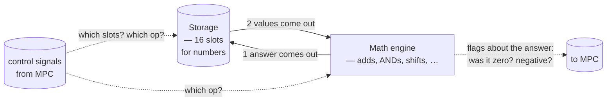
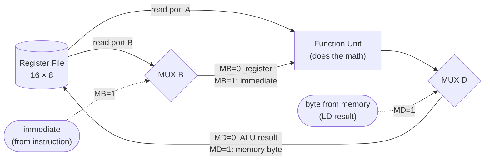
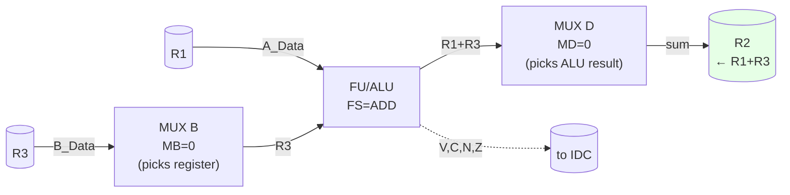
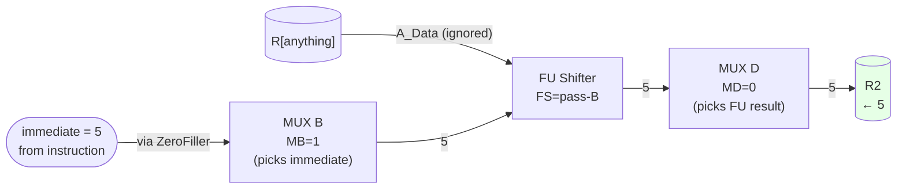
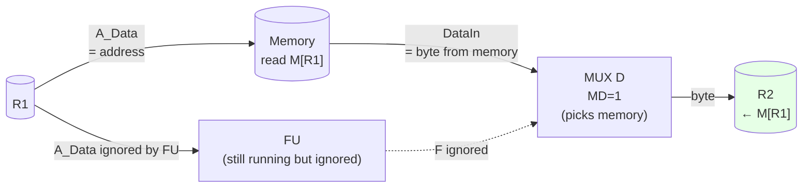
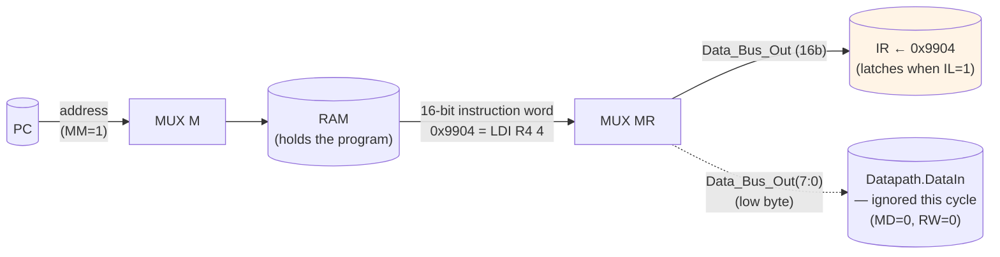
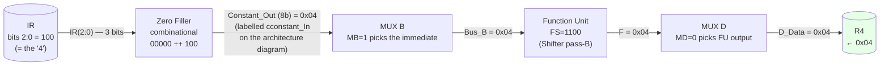
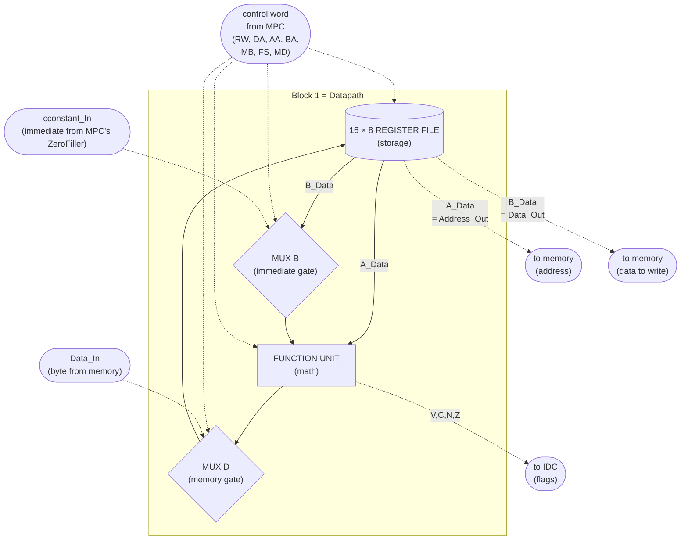

# STUDY — 01 · PWA Datapath (the simple version)

> [!info] What this note is
> The "explain it like I'm new to this" version of the Datapath. No port tables, no VHDL line numbers — just the conceptual story so you can hold the whole thing in your head before drilling into the details.
>
> When you want the deep version: [[EX — Microprocessor (top)]] for the wiring, [[PWA Project]] for the per-module index, [[00 PWF System — Exam Hub]] §3 for the per-block summary.

---

## The big idea (one sentence)

A CPU needs to **store numbers, do math on them, and put the answer back**. The Datapath is exactly those three things, wired in a loop.

## The three things, in a loop

That's it. **Read two values → do math → write one value back.** One trip around the loop = one arithmetic instruction.

The MPC (= the brain in Block 2 of the diagram) is what decides *which* registers to read, *which* operation to do, and *whether* to write the answer back. The Datapath just executes whatever the MPC tells it each cycle.

## In our PWA's vocabulary

The three things have specific names in the project:

| Conceptually | What we call it in PWA | What's inside |
|---|---|---|
| Storage | **Register File** | 16 cells, each holds 8 bits (one byte) |
| Math engine | **Function Unit (FU)** | ALU + Shifter + flag generator |
| The wiring loop | **MUX B + MUX D** | tiny switches that let us inject "extras" |

The two muxes are little detours in the loop — they let us inject things that don't come from the register file:

- **MUX B** sits in front of the math engine. It can swap one of the math inputs for an **immediate value** (a number baked into the instruction itself, like the "5" in `LDI R2, 5`).
- **MUX D** sits after the math engine. It can swap the math result for a **byte read from memory** (used by `LD`).

**That's the entire Datapath.** Every instruction is some variation of this loop with different settings for the two muxes and different op selected on the math engine. Once you have this picture in your head, everything else is detail.

---

## Walking three instructions through the loop, slowly

The whole Datapath shines when you trace different instructions through it. Same loop, different mux settings.

### Example 1: `ADD D2 A1 B3` → `R2 ← R1 + R3`

What happened:
1. MPC sends: *"read R1 onto port A, R3 onto port B, do ADD, write into R2."*
2. Register File sends R1 out its A-port and R3 out its B-port.
3. **MUX B is set to 0** → R3 passes straight through.
4. Function Unit does R1 + R3.
5. **MUX D is set to 0** → the sum passes straight through.
6. On the next clock tick, R2 holds the sum.

Vanilla case — both muxes set to 0, both go register-style.

### Example 2: `LDI D2 B5` → `R2 ← 5`

What changed: **MUX B flipped to 1.** Now the math engine's B input is the immediate "5" from the instruction itself, not R[SB] from the register file. The math engine just hands it straight through (special pass-through mode), and it lands in R2.

### Example 3: `LD D2 A1` → `R2 ← M[R1]`

What changed: **MUX D flipped to 1.** R[SA] (= R1) does double duty — it's read out as A_Data (which the Datapath sends out as the **address** to memory), and memory returns a byte that comes back in on the `DataIn` pin. MUX D picks that byte over the FU's result, and it lands in R2.

> **The pattern:**
>
> | Instruction style | MUX B | MUX D |
> |---|---|---|
> | Register-register math (`ADD`, `SUB`, `AND`, …) | 0 (use register) | 0 (use FU result) |
> | Immediate math (`LDI`, `ADI`) | **1 (use immediate)** | 0 (use FU result) |
> | Memory load (`LD`) | 0 (don't care) | **1 (use memory)** |
> | Memory store (`ST`) | 0 (don't care) | 0 (don't care — nothing's written to a register) |
>
> So **MUX B is the "immediate gate"** and **MUX D is the "memory gate"**. That's all those two muxes do, ever.

---

## Where does the immediate actually come from? — the two-cycle journey

In Example 2 above I waved hands and said *"the immediate `5` goes into the math engine via MUX B"*. That's true, but it skips the most interesting part: **the `5` isn't sitting in some register waiting to be used. It's encoded inside the instruction word itself**, in bits 2..0 of the 16-bit `LDI` opcode. So before it can flow into the FU, it has to travel out of memory, into the IR, get zero-extended from 3 bits to 8 bits, and arrive at MUX B's "(1)" input.

That journey takes **two cycles** — because every instruction first has to be fetched (cycle 0), and only then executed (cycle 1).

### Cycle 0 — INF: the whole 16-bit instruction is fetched from RAM

The whole instruction word lands in the IR. The `4` is now sitting at bits 2..0 of the IR, but nothing in the Datapath uses it yet. The Datapath sees the low byte on `DataIn` too, but with MD=0 and RW=0 nothing happens there. **All the work in cycle 0 is just "go get the next instruction and park it in IR".**

### Cycle 1 — EX0: the immediate is extracted from IR and routed into the Datapath

Now the IDC sees opcode `1001100` (LDI) and emits the control word for it: `MB=1, FS=1100, MD=0, RW=1`. *Now* the `4` finally moves:

The constant rides on **four** different blocks: IR → Zero Filler → MUX B → FU → (MUX D, just passing through) → register file. None of that touches MUX D's *memory* input — that path is reserved for `LD`.

### The crucial answer

> **The immediate goes: `RAM → MUX MR → IR` (cycle 0), then `IR(2:0) → Zero Filler → MUX B → FU → MUX D → R[DR]` (cycle 1).**
>
> It does **not** go through MUX D from RAM directly. MUX D is the memory-read gate (LD only). For immediates the route is MUX B + Zero Filler — never the memory-byte side of MUX D.

This is why MUX B and MUX D never interfere with each other: they're the entry points for two completely different kinds of data. MUX B feeds the FU; MUX D writes the register file. An instruction can use either, both, or neither, and the IDC just picks whichever is right for that opcode.

### Why two boxes (Zero Filler *and* MUX B) instead of one?

You could fold them together in principle, but the team kept them separate because each has a single, simple job:

- **Zero Filler** is a tiny combinational gadget — it pads `IR(2..0)` from 3 bits to 8 bits, always. Its output sits there ready to use even when no immediate instruction is active. If MB=0, the output just floats unused.
- **MUX B** is the actual selector that decides whether the FU's B input comes from the register file (MB=0) or from the Zero Filler (MB=1). MB is part of the control word the IDC emits each cycle.

Separating *"format the data"* from *"decide where it goes"* keeps each piece a single line of VHDL. Same way the **Sign Extender** + the PC's PS=10 path stay separate for branches (we'll see that when we get to the MPC).

---

## The diagram, decoded

When you look at Block 1 on `architecture.pdf`, here's what each box is:

The two extra wires on the right (`Address_Out` and `Data_Out`) are how the Datapath talks to memory:
- **`Address_Out`** is literally the register file's port-A output. So when you do `LD R2, R1`, R1's *value* (not its name) becomes the address sent to memory. Same wire used by ST for the address.
- **`Data_Out`** is literally the register file's port-B output. Used by ST: `ST A1 B3` sends R3's value out to memory at the address R1.

The four flag wires (V, C, N, Z) feed back into the IDC's control logic — that's how BRZ and BRN can later make decisions based on what the FU just computed.

---

## The one-line summary

> The Datapath is a **read–compute–write loop** around 16 registers. Two tiny muxes let us substitute *"an immediate"* for the second operand (MUX B) or *"a byte from memory"* for the math result (MUX D). The MPC tells it which registers, which math op, and which way to flip the two muxes — every cycle.

---

## What's next

You can drill into any of these whenever you're ready:

1. **[STUDY — 01 PWA.md §Register File](#)** *(this file, when we extend it)* — how do the 16 storage cells physically work? How does it read two cells *at the same time*?
2. **[STUDY — 01 PWA.md §Function Unit](#)** *(this file, when we extend it)* — how does the math engine actually add two 8-bit numbers? What's a "ripple-carry adder"? Where do the flags come from?
3. **[STUDY — 01 PWA.md §MUX B and MUX D](#)** *(this file, when we extend it)* — the two muxes in more detail.

(We'll fill those in as we go. Just say which one you want to do next.)

---

> [!nav]
> &nbsp;
>
> **Deep version of the same material:** [[EX — Microprocessor (top)]] · [[PWA Project]]
>
> **The hub:** [[00 PWF System — Exam Hub]]
>
> &nbsp;
