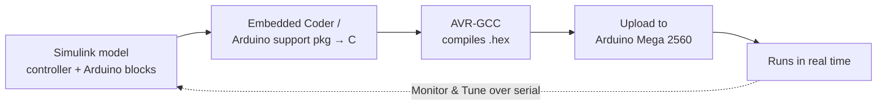
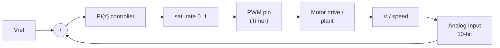

# Code Generation — ATmega2560 (Arduino Mega) Workflow

> Sister note to [[Code Generation — C2000 Workflow]]. The lecture slides target the TI
> **C2000 F28027**, but our project uses an **Arduino Mega 2560 (ATmega2560)**. The
> *model-based code-generation idea is identical* — only the support package and the
> peripheral details change. This note ports the workflow to the ATmega2560 and is honest
> about what's different (and where the AVR is weaker).

---

## 1. Same idea, different target

You still **draw the controller in Simulink and press one button** — MATLAB generates the
C, compiles it with **AVR-GCC**, and flashes it onto the Arduino over USB. No hand-written
`.ino` sketch, no manual register poking.

The big practical win vs C2000: **the toolchain is tiny.** No Code Composer Studio, no
C2000Ware, no version-matching headache — the Arduino support package bundles its own
compiler.

---

## 2. Toolchain & install

You need **two MathWorks add-ons** (and nothing from TI):

| Piece | Role |
|---|---|
| **MATLAB Support Package for Arduino Hardware** | talk to the board from MATLAB (test pins interactively) |
| **Simulink Support Package for Arduino Hardware** | the Arduino blocks (Digital I/O, PWM, Analog Input, Serial…) + AVR-GCC + deploy |

**Steps:**
1. MATLAB → **Add-Ons** → Get Hardware Support Packages → search **`Arduino`** → install both
   packages above. (Bundles the compiler — no separate IDE.)
2. Plug in the Mega over USB; the support package installs the driver and finds the COM port.
3. New Simulink model → **Ctrl + E** → **Hardware Implementation** →
   **Hardware board = `Arduino Mega 2560`**. Set the COM port under the board options.
4. Smoke test: a **Pulse Generator → Digital Output (pin 13)** block, **Build, Deploy &
   Start** → the on-board LED blinks. Proves the whole chain works.

---

## 3. The control loop (unchanged in shape)

**The PI(z) controller block is 100 % portable** — the same discrete PID block you use in
simulation and in the C2000 note works here unchanged. Only the *actuator* (PWM) and
*sensor* (ADC) blocks swap to Arduino versions, and their numbers change.

---

## 4. ⚠️ Know the hardware — ATmega2560 vs C2000

This is where the AVR is meaningfully weaker. Read this before designing the loop.

| Aspect | C2000 F28027 | **ATmega2560 (Mega)** |
|---|---|---|
| Core | 32-bit, **60 MHz** | **8-bit AVR, 16 MHz** |
| FPU | none (fixed-point) | **none** — `float` is software-emulated (slow) |
| ADC | 12-bit, 0–4095, 3.3 V, ePWM-synced | **10-bit, 0–1023, 5 V (AVCC) default**, free-running |
| PWM | ePWM: exact freq (`TBPRD`), %-duty, ADC sync | **Timer PWM**: default ~490 Hz, 8-bit duty; custom freq needs timer setup |
| PWM↔ADC sync | yes (sample at carrier peak) | **no** tight sync |
| Realistic loop rate | tens–hundreds of kHz | **~1–10 kHz** for light maths |

**Implication:** the ATmega2560 is great for **slow outer loops**, marginal for fast
switching control. That's *fine for our project* (see §8) — but don't try to close a
20 kHz converter loop on it.

---

## 5. PWM — the actuator on the ATmega

The Arduino **PWM block** writes a duty (0–255, 8-bit) to a PWM-capable pin.

**The catch — frequency.** By default Arduino PWM runs at **~490 Hz** (or ~980 Hz on a few
pins). For motor speed control you usually want a few **kHz** and finer resolution. Options,
from easiest to most work:
- **Accept the default** ~490 Hz if the load (motor + inductance) filters it enough — often
  OK for a DC-motor speed loop.
- **Raise the timer frequency:** the Mega's **16-bit timers (Timer1, 3, 4, 5)** can do
  high-frequency Fast-PWM. Some support-package versions expose a PWM-frequency option;
  otherwise set the timer prescaler/mode (TCCRnB) — either via a one-off **Arduino C
  function-call block** at init, or a small custom block.
- Pick PWM pins driven by the 16-bit timers (e.g. **pins 11/12 = Timer1, 2/3/5 = Timer3,
  6/7/8 = Timer4, 44/45/46 = Timer5** on the Mega) when you need the headroom.

For our **Exp 3A motor drive** (opto → IR2110 → MOSFET), feed this PWM pin into the opto;
the duty from the PI loop sets motor speed.

---

## 6. ADC — the sensor on the ATmega

The **Analog Input** block reads a pin and returns **0–1023 (10-bit)**.

**Reference voltage:** default is **AVCC ≈ 5 V** (so a count of 1023 ≈ 5 V). You can switch
to the internal 1.1 V / 2.56 V or an external **AREF** (e.g. tie AREF to 3.3 V) — set this
to match your divider.

### Sensing chain (same idea, new numbers)
A pin only tolerates 0–`Vref`, so you put a **voltage divider** in front of a higher rail
and undo it in software. The count → volts gain:

$$ g_{v,adc}=\frac{V_{ref}}{1023}\cdot\frac{R_{low}}{R_{high}+R_{low}}
   \qquad(1023 = 2^{10}-1,\; V_{ref}\approx 5\,\text{V default}) $$

Simulink chain: **Analog Input → cast to `single` → subtract offset → gain `g_{v,adc}` →
`[v_sensed]`**. (Compare the C2000 note's `3.3/4095` — here it's `5/1023`.)

> ⚠️ A 5 V-referenced 10-bit ADC has ~**4.9 mV** per count vs the C2000's ~**0.8 mV**. For
> the project's slow voltage/current loops this resolution is plenty; just size the divider
> so the sensed range uses most of the 0–5 V span.

---

## 7. Assembling the loop & deploying

- **Controller:** drop the same **discrete PID** block, type **PI (Parallel)**, sample time
  `Ts`, set `P`/`Ki`. **Saturate output to [0, 1]** with **back-calculation anti-windup**
  (identical to the C2000 note).
- **Keep the maths light:** no FPU → avoid heavy `float`/`double` and trig in the loop. A
  simple PI is fine; if it's too slow, let Embedded Coder generate **fixed-point**.
- **Sample time `Ts`:** start conservative (e.g. 1 ms = 1 kHz loop) — the AVR can't do the
  µs-scale ticks the C2000 can.
- **Deploy:** HARDWARE tab → **Build, Deploy & Start** (uploads over USB, runs standalone).
- **Tune live:** **Monitor & Tune (External Mode)** over the **serial/USB** link — watch
  signals and change `Vref`/gains without re-flashing. (Slower than the C2000's link, but
  works.)
- **Monitoring:** use **Serial Transmit** blocks to stream V1/V2/V3/currents to the PC at the
  1 s update the spec asks for.

### Bench-test plant — RC filter (verify the loop without a converter)

To test the whole deploy + PI loop with no power stage, use an RC low-pass as a fake plant:
the PWM average becomes a DC voltage the loop can regulate. τ = RC = 10 ms smooths the
~490 Hz PWM nicely, and the loop self-starts once wired.

![[RC plant filter — Mega pin11 to A0.png]]

- **Pin 11 → 10 kΩ → node X**, **X → 1 µF → GND**, **X → A0** (+ scope probe on X).
- Open-loop sanity check *first*: deploy `Constant 128 → PWM pin 11` and confirm
  X ≈ 2.5 V before closing the loop — proves resistor, cap, ground and pin in one number.
- Steady state: $V_X = 5\,\mathrm{V}\cdot d$. PID saturation limits must match the
  actuator scaling ([0, 1] before the ×255 → `uint8` → PWM), with anti-windup enabled —
  mismatched limits let the integrator wind up to values the actuator can't represent
  (learned the hard way on the C2000, see the team repo's `C2000_HW_TEST_RESULTS.md`).

---

## 8. How this fits the 62768 project ✅

This actually **resolves the "which MCU?" question** nicely:

- The **converters are discrete/analog** (Krav: discrete components, no converter ICs) — so
  the MCU does **not** need fast switching PWM for them. The fast control lives in hardware.
- The **ATmega2560's job is the slow outer control + monitoring**, which it handles
  comfortably at 16 MHz:
  - **Motor PID** — regulate **V1** by varying the motor-drive PWM duty (a slow
    mechanical/generator loop). See [[Lec 1b — Modelling, PID and MPPT]].
  - **MPPT (Perturb & Observe)** — a slow tracking loop into the PV/store.
  - **PC monitoring** — stream measurements at the 1 s spec rate.

So: **fast loops = analog hardware; slow loops + supervision = ATmega2560 via this codegen
flow.** The 8-bit/16 MHz limits that hurt for converter switching simply don't bite here.

---

## Quick reference (ATmega2560)

| Thing | Value / formula |
|---|---|
| Board | **Arduino Mega 2560**, set COM port in board options |
| Toolchain | MATLAB + Simulink **Support Package for Arduino Hardware** (bundles AVR-GCC; no CCS) |
| Core | 8-bit AVR @ **16 MHz**, **no FPU** |
| PWM | PWM block, 8-bit duty, ~490 Hz default; kHz needs 16-bit Timer1/3/4/5 config |
| ADC | **10-bit → 0–1023**, ref = AVCC **5 V** (or AREF) |
| Sense gain | `g_{v,adc} = (V_ref/1023)·R_low/(R_high+R_low)` |
| Controller | PI(z) Parallel, `Ts` (~1 ms), saturate [0,1] + anti-windup, keep maths light |
| Deploy | **Build, Deploy & Start** · **Monitor & Tune** (serial) |
| Project role | motor PID + MPPT + monitoring (slow loops); converters stay analog |

**See also:** [[Code Generation — C2000 Workflow]] (the lecture's original target) ·
[[Lec 1b — Modelling, PID and MPPT]] (the PID/MPPT theory this deploys).
