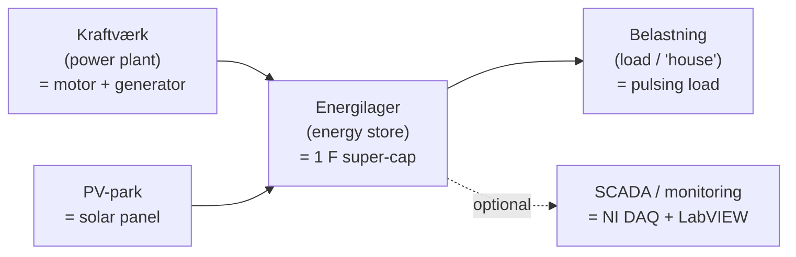
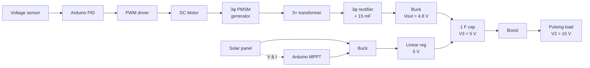
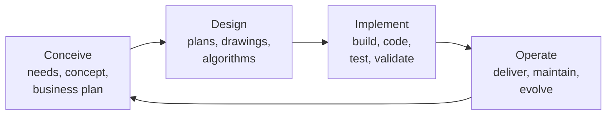

# Lec 1 — Project Description & Plan

Part of [[62768 Electrical Energy Systems]]. Lecturer: Ashraf Khalil. Source deck:
`Slides/Lecture 1.pdf` (2025). This is the **kick-off** lecture — what we're building and
how the report/plan is structured. No deep theory here; it sets the scope.

> [!tip] Companion deck
> `Lecture 1 Modeling.pdf` (Per Lynggaard) is a separate, more technical companion to
> this one — motor/generator modelling, PID, MPPT. See [[Lec 1b — Modelling, PID and MPPT]].

---

## The analogy: a miniature power grid

The project mirrors a real electrical energy system at bench scale:

Two sources (a rotating generator and a PV panel) feed a shared store, which serves a
load — plus optional PC monitoring.

---

## The project diagram (slide 4) — the spec in one picture

**Voltage targets read off the diagram:**
- **V1 = 15 V** — rectifier bus (generator branch).
- **Buck output ≈ 4.8 V** feeding the store.
- **V3 = 5 V** — the 1 F energy store.
- **V2 = 15 V** — boost output to the pulsing load.

> [!warning] Nominal-value ambiguity
> The Kravspecifikation table and this diagram don't fully agree on V2 (one shows ~10 V,
> here it's 15 V). **Confirm V2 with the supervisor** before sizing the boost.

---

## CDIO — the process we're graded on

This is the DTU project model — the report should show we went through all four phases,
not just built something.

---

## The Project Plan — 9 sections (use this as the report skeleton)

The lecture gives the exact structure the project plan / report should follow:

1. **Identification** — course no., title, project-ID, group no., members, date.
2. **Introduction to the problem** — background + concepts/technologies needed.
3. **Problem formulation** — the questions, and how we plan to solve them.
4. **Tasks** — define tasks + **who does each** (→ our GitHub board + Gantt).
5. **Outcomes** — expected results + benefit (theoretical + technical).
6. **Methodology** — how the group will solve the problem.
7. **Resources** — component list + **budget** + other resources.
8. **Activities Plan** — activities + **schedule as a Gantt chart**.
9. **Reference list** — books, lectures, **datasheets** of all components.
10. **Green Challenge** — state if we want to present the idea there.

> This is exactly the structure mirrored in the team repo's `docs/project-plan.md`.

---

## What to take away
- We're building a **complete two-source energy system**, end to end.
- The **project diagram is the contract** — every block is a deliverable.
- The report follows the **9-section plan**; tasks → board, schedule → Gantt, parts → BOM.
