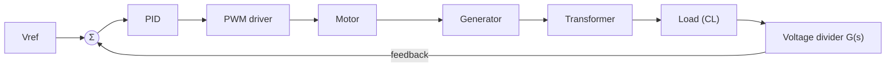
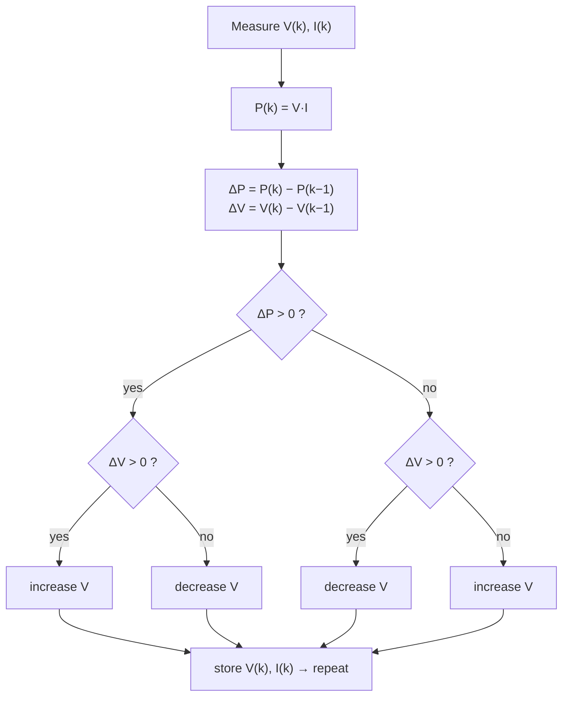

# Lec 1b — Modelling, PID & MPPT (companion deck)

Part of [[62768 Electrical Energy Systems]]. Source deck: `Slides/Lecture 1 Modeling.pdf`
(Per Lynggaard — an older 62407 deck reused as the technical companion to [[Lec 1 — Project Description and Plan]]).

> [!important] This is the most important deck for the control/firmware work
> Everything about **how the Arduino actually regulates the system** lives here: the
> motor+generator transfer function, why proportional-only control fails, the **digital
> PID written in C**, Ziegler-Nichols tuning, the **MPPT P&O algorithm**, and a buck/boost
> simulation. If you're doing the PID or the UI, start here.

---

## The control problem

The Arduino **regulates V1 by driving the motor's PWM** — a closed loop on the generator
output. (The buck/boost converters are discrete/analog; the Arduino does *not* control
them.)



---

## Plant model: DC-motor + 3-phase generator (slides 4–6)

The motor+generator is modelled as two cascaded transfer functions $H_1(s)\,H_2(s)$.
Using the parameters from a previously-used motor
($K_m, R_m, L_m, J_m, B_m, \dots$), the combined plant comes out as:

$$H(s) = \frac{22.83}{(s + 7.40)(s + 37.17)}$$

- **Two poles**, with the pole at **37 r/s dominant** → the system behaves roughly like a
  **1st-order** system.
- Driving it with a 12·u(t) step, the output settles to **≈ 9.6 V** — the expected value
  across the filter cap $C_L$.

> Takeaway: the plant is slow and roughly first-order, which is why a simple PID can
> stabilise it.

---

## Why proportional-only isn't enough (slides 7–9)

Closed-loop transfer function:

$$Y(s) = \frac{H(s)}{1 + G(s)\,H(s)}$$

- With **P-only**, tuned so overshoot stays within 0.5 V, the **steady-state error is
  ≈ 3 V** — too much for the Kravspecifikation.
- Push the gain to kill the error → the closed-loop poles go complex and move toward the
  jω-axis → **ringing/oscillation**.
- **Conclusion: you need full PID** (the integrator removes steady-state error).

---

## Digital PID in C (slide 10) — the deployable controller

Each term is discretised with the z-transform and turned into a one-line C update:

**Integral** — $H_i(z) = \dfrac{z}{z-1} = \dfrac{1}{1 - z^{-1}}$ →

```c
y  = y + x;          // running sum
yi = y * Ki / fs;    // integral term
```

**Derivative** — $H_d(z) = \dfrac{z-1}{z} = 1 - z^{-1}$ →

```c
y    = x - xold;     // difference
xold = x;
yd   = Kd * y * fs;  // derivative term
```

Output $u = K_p e + y_i + y_d$. (`fs` = sample rate; `x` = error this sample.)

> This is the hand-written PID route — simple, transparent, easy to defend in the report.
> It's also why the MATLAB-Coder code-gen experiment in the repo is optional, not needed.

---

## Tuning: Ziegler-Nichols (slide 11)

The slide gives the Z-N table (P, PI, PD, classic PID, "some overshoot", "no overshoot"
variants) plus the standard intuition table:

| Increase | Rise time | Overshoot | Settling | Steady-state error | Stability |
|---|---|---|---|---|---|
| $K_p$ | ↓ | ↑ | small ↑ | ↓ | degrade |
| $K_i$ | small ↓ | ↑ | ↑ | large ↓ | degrade |
| $K_d$ | small ↓ | ↓ | ↓ | minor | improve |

Practical recipe: find the ultimate gain $K_u$ and period $T_u$, then read $K_p,T_i,T_d$
off the Z-N table.

---

## MPPT — Perturb & Observe (slides 12–13)

The PV branch uses a **P&O** maximum-power-point tracker:



Idea: nudge the operating voltage, see if power went up or down, keep moving the way that
increases power. PV-system block diagram: panel → current sense + voltage divider → buck
(MPPT-controlled) → linear regulator (5 V).

---

## Buck/boost simulation (slide 14)

A LTspice/QSPICE model of both converters with parameterised `{vin}`, `{fsw}`, `{duty}`,
a `MYSW` switch and `MyDiode`, driven by a `PULSE` source. This is the seed for the
`simulation/qspice/` model in the team repo.

---

## What to take away
- Plant ≈ 1st-order, settles ~9.6 V; **P-only leaves ~3 V error → use full PID**.
- The **digital PID is ~6 lines of C** (integral = running sum, derivative = difference).
- Tune with **Ziegler-Nichols**.
- **MPPT = Perturb & Observe**: nudge voltage, follow the power uphill.
