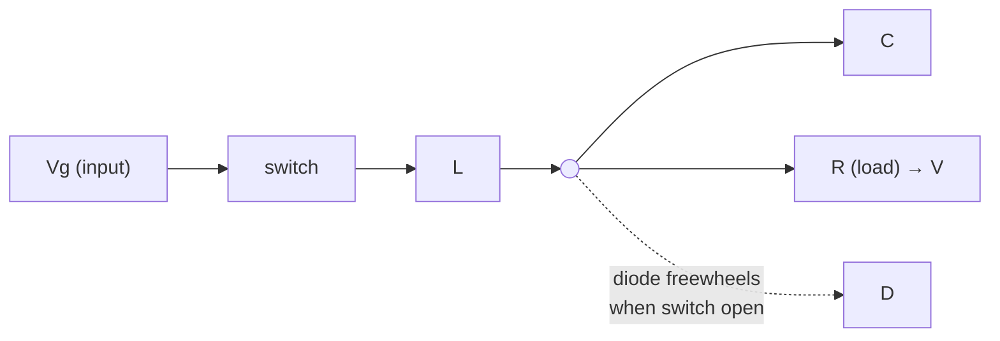
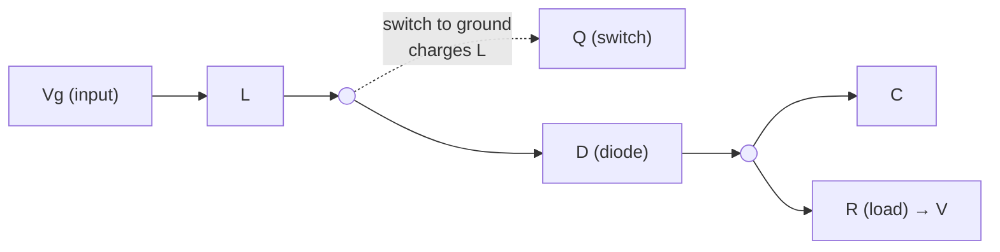
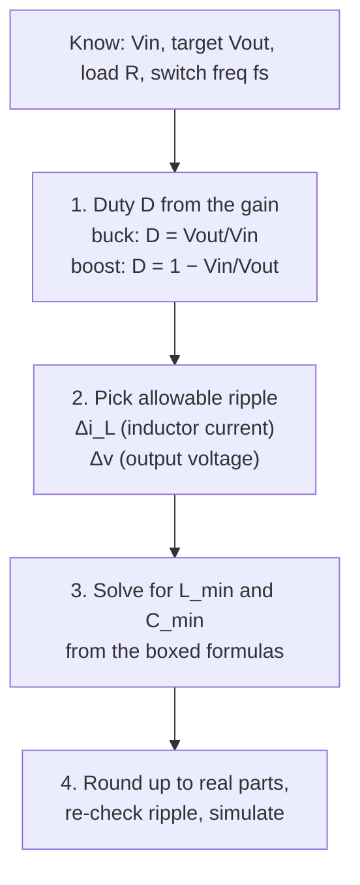

# Lec 2 — Design and Analysis of Buck & Boost Converters

Part of [[62768 Electrical Energy Systems]]. Lecturers: Ashraf & Sam. Source deck:
`Slides/Lec 2_PowerElectronics.pdf`. Textbook: **Erickson & Maksimović, *Fundamentals
of Power Electronics* (2nd ed.)**.

> [!note] This is the "how do I size L and C?" lecture
> No code generation, no motor modelling here — that's a different deck. Lecture 2 is
> pure converter theory: the two switching states, volt-second balance, and the **ripple
> formulas** you use to pick the inductor and capacitor for a target ripple. This is the
> design step that comes *before* you build the discrete buck/boost on the PCB.
>
> (Careful: there are two "Lec 2" files. The 2024 `Lec 2.pdf` is an old *DC Motor* deck —
> **ignore it**. The real Lecture 2 is `Lec 2_PowerElectronics.pdf`.)

---

## The three topologies (slide 3)

Every DC-DC converter here is "switch + inductor + capacitor + diode", just wired
differently. The duty cycle $D$ (fraction of the period the switch is ON) sets the
output:

| Converter | DC gain $V_o/V_{in}$ | What it does |
|---|---|---|
| **Buck** | $D$ | steps **down** ($0 \le V_o \le V_{in}$) |
| **Boost** | $\dfrac{1}{1-D}$ | steps **up** ($V_o \ge V_{in}$) |
| **Buck-boost** | $-\dfrac{D}{1-D}$ | up *or* down, **inverted** polarity |

For our project: the **buck** feeds the V2 load, the **boost** pushes the super-cap store
up to the pulsing load.

---

## Buck converter (slides 4–5)

Two states per switching period $T_s = 1/f_s$:

- **Switch closed** ($D\,T_s$): inductor sees $V_g - V$, current ramps **up**.
- **Switch open** ($D'T_s$): diode conducts, inductor sees $-V$, current ramps **down**.

Steady state (volt-second balance — the inductor voltage must average to zero):

$$V = D\,V_g \qquad I_L = I_o = \frac{V}{R}$$

**Design formulas (slide 5):**

$$\boxed{\;\Delta i_L = \frac{V(1-D)}{2 L f_s}\;}\qquad
  \boxed{\;\Delta v = \frac{(1-D)\,V}{16\,L C f_s^{2}}\;}$$

Read these *backwards* to design: you know $V$, $D$, $f_s$ and your **target ripple**, so
solve for the **minimum $L$** (from $\Delta i_L$) and **minimum $C$** (from $\Delta v$).

---

## Boost converter (slides 6–8)

- **Switch closed** ($D\,T_s$): inductor connects across $V_g$, current ramps up, load is
  held up by $C$ alone.
- **Switch open** ($D'T_s$): inductor dumps into the output through the diode.

Steady state:

$$V = \frac{V_g}{1-D}\qquad
  I_{in} = I_{L,\text{avg}} = \frac{V_{in}}{R(1-D)^2}$$

Note the input current equals the (larger) inductor current — the boost draws **more**
current at the input than it delivers at the output, which matters for wire/switch rating.

**Design formulas (slide 8):**

$$\boxed{\;\Delta i_L = \frac{V_{in}}{2 L}\,D\,T_s\;}\qquad
  \boxed{\;\Delta v = \frac{V}{2 R C}\,D\,T_s\;}$$

(Equivalently $\Delta i_L = \dfrac{V_{in}D}{2 L f_s}$ and
$\Delta v = \dfrac{V D}{2 R C f_s}$.)

---

## The design workflow

In the repo, [`simulation/DC-DC Converters/load_parameters.m`](.) does exactly step 4: you
set `Vin, R, L, C, f, d` and it prints back `Vout, Iout, dIL, dVc` so you can sanity-check
the ripple against the parts you chose.

---

## ⚠️ The factor-of-2 convention (important for our scripts)

Erickson (and these slides) define $\Delta i_L$ and $\Delta v$ as the **amplitude** — the
ripple measured *about the average*, i.e. **half** the peak-to-peak swing. That's where the
`2L` and the `16` come from.

This matters because the **Kravspecifikation tolerances are amplitudes** too: "V2 within
±1.0 V" means the amplitude ripple must be ≤ 1.0 V. So design with the slide formulas
directly and compare $\Delta v \le 1.0\text{ V}$.

> `load_parameters.m` originally computed the **full peak-to-peak** swing (it was missing
> the factor of 2 — `f*L` instead of `2*f*L`, `8` instead of `16`). It's now aligned to
> these slides so the printed `dVc`/`dIL` are amplitudes and compare straight against the
> ± spec.

---

## Reference
- Erickson, R. W., & Maksimović, D. (2001). *Fundamentals of Power Electronics* (2nd ed.). Springer.
- Slides: `Lec 2_PowerElectronics.pdf`.
