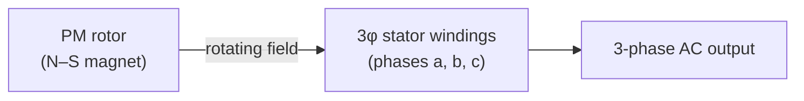
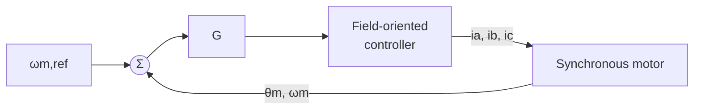

# Lec 3 — Permanent-Magnet AC Machines (PMSM)

Part of [[62768 Electrical Energy Systems]]. Lecturer: Ashraf Khalil. Source deck:
`Slides/Lec 3.pdf`. This is the theory behind our **3-phase generator** (the Hacker
A20-L22 PMSM in the kit).

> [!note] Why this matters for us
> Our "AC generator" is a permanent-magnet synchronous machine driven by the DC motor.
> When spun, it produces 3-phase AC that feeds the transformers and rectifier. This
> lecture explains how that machine behaves.

---

## The core idea

A **permanent-magnet AC machine** replaces the rotor's field winding with **permanent
magnets** as the source of rotor excitation.

- You can analyse it with the **same techniques as a normal synchronous machine** — just
  treat it as if excited by a **constant field current**.
- Growing use: hybrid-electric vehicle motors, and **large wind-turbine generators** (our
  use-case in miniature — a generator).

The rotor angle is $\theta_m = \omega_m t + \theta_0$ — the magnetic axis of the rotor
sweeps past the stator phases, inducing 3-phase EMF.

---

## Key practical properties (slides 4–5)

- **Temperature-dependent magnets** — the residual flux density of rare-earth magnets
  (neodymium-iron-boron) **drops as temperature rises**. Hot magnets = weaker field.
- **Fixed excitation** — unlike a wound-rotor machine you can't adjust the field. This
  complicates both **control** and **protection**.
- **Base speed** — PM motors are usually designed so the generated voltage equals the
  rated terminal voltage at a "base speed" well below max speed.
- **Over-speed risk** — if the drive trips at high speed, the generated voltage can climb
  high enough to **damage insulation** (saturation only partly limits it).

> For us as a *generator*: faster spin → higher output voltage. That's exactly the knob
> the motor-PWM/PID loop uses to regulate V1.

---

## Driving & sensing (slide 6)

As a **motor**, a PMSM needs a **variable-frequency drive** plus rotor position feedback:

- **Field-oriented control (FOC)** generates the 3-phase currents from a torque reference.
- **Position/speed sensing**: Hall-effect devices, or LED + phototransistor with a pulsed
  wheel, mounted on the shaft.

(For our project we run it as a *generator*, so we mostly care about the voltage-vs-speed
behaviour, not FOC — but this is the full picture of how PMSMs are controlled as motors.)

---

## What to take away
- Our AC generator = a **PMSM** — permanent magnets instead of a field winding.
- Analyse it like a synchronous machine with **constant field**.
- **Speed sets output voltage** → that's the lever the Arduino PID pulls to hold V1.
- Watch **temperature** (weaker magnets) and **over-speed** (insulation risk).
