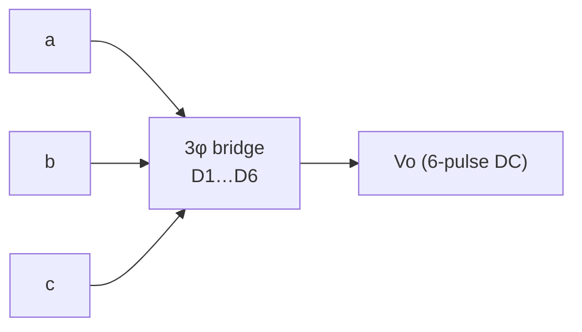
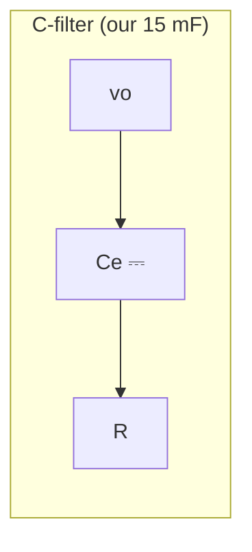

# Lec 4 — Diode Rectifiers

Part of [[62768 Electrical Energy Systems]]. Lecturer: Ashraf Khalil. Source deck:
`Slides/Lec 4.pdf`. This is the theory for our **3-phase bridge rectifier + 15 mF filter**
that turns the generator's AC into the **V1 = 15 V** DC bus.

> [!note] Where it sits in our system
> Generator (3φ AC) → 3× transformer → **6-diode bridge rectifier → 15 mF cap → V1**.
> This lecture tells us the output voltage we'll get and how to rate the diodes/filter.

---

## Performance parameters (slides 3–4)

How you grade any rectifier's output quality:

| Quantity | Formula | Meaning |
|---|---|---|
| AC power | $P_{ac} = V_{rms} I_{rms}$ | total output power |
| Efficiency | $\eta = P_{dc}/P_{ac}$ | rectification ratio |
| AC ripple (rms) | $V_{ac} = \sqrt{V_{rms}^2 - V_{dc}^2}$ | size of the ripple |
| **Form factor** | $FF = V_{rms}/V_{dc}$ | shape of output |
| **Ripple factor** | $RF = V_{ac}/V_{dc} = \sqrt{FF^2 - 1}$ | ripple content |
| Transformer util. | $TUF = P_{dc}/(V_s I_s)$ | how well the transformer is used |
| Power factor | $PF = P_{ac}/(V_s I_s)$ | |
| Crest factor | $CF = I_{s(peak)}/I_s$ | peakiness of input current |

Lower $RF$ = smoother DC. A 3-phase bridge is already very smooth (see below).

---

## Three-phase bridge rectifier (slides 5–7)

Six diodes, each conducting **120°**, in the sequence
D1-D2, D3-D2, D3-D4, D5-D4, D5-D6, D1-D6. The pair across the **highest instantaneous
line-to-line voltage** conducts. Line-to-line voltage is $\sqrt{3}$× the phase voltage
(Y-connected).

**The key result — average output voltage:**

$$V_{dc} = \frac{3\sqrt{3}}{\pi}\,V_m = 1.654\,V_m
\qquad V_{rms} = 1.6554\,V_m$$

(where $V_m$ is the peak **phase** voltage). Because $V_{rms}$ and $V_{dc}$ are almost
equal, the **ripple factor is tiny** — a 6-pulse bridge gives very clean DC even before
filtering. The ripple is at **6× the line frequency**:

$$v_0(t) = 0.9549\,V_m\left(1 + \tfrac{2}{35}\cos 6\omega t - \tfrac{2}{143}\cos 12\omega t + \cdots\right)$$

Diode currents: $I_{D(rms)} = 0.5518\,I_m$, source current $I_s = 0.7804\,I_m$.

---

## Rectifier circuit design (slide 8)

- **Diode ratings** are specified by average current, rms current, peak current, and
  **peak inverse voltage (PIV)** — size your diodes above all four.
- **DC filters** are **L, C, or LC** type:

- Filter design = figure out the **harmonic magnitudes/frequencies** (here, multiples of
  6ω) and size L/C to attenuate them.

> For us: the 6-pulse bridge already gives clean DC; the **15 mF cap** mops up the
> remaining 6ω ripple to hold a steady **V1 = 15 V**. Size diodes for the generator's
> peak voltage (PIV) and the ~300 mA bus current.

---

## What to take away
- 3-phase bridge: **6 diodes, 120° each**, conducts on the highest line-to-line voltage.
- **$V_{dc} = 1.654\,V_m$** — that's the DC bus you get from the peak phase voltage.
- Ripple is small and at **6× line frequency**; the **15 mF** cap smooths it to V1 = 15 V.
- Rate diodes by average/rms/peak current **and PIV**.
