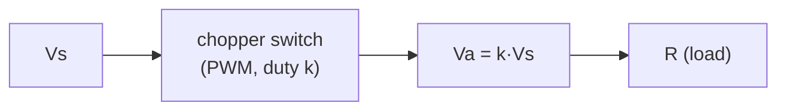

# Lec 5 — DC/DC Converters (Chopper treatment)

Part of [[62768 Electrical Energy Systems]]. Lecturer: Ashraf Khalil. Source deck:
`Slides/Lecture 5.pdf`. This is a **second, deeper pass** at buck/boost converters,
using the **Rashid "chopper"** formulation.

> [!note] How this relates to Lec 2
> [[Lec 2 — Buck and Boost Converters]] does buck/boost the **Erickson** way (volt-second
> balance, ripple = amplitude about the mean, $D$ for duty). **Lec 5 does the same
> converters the Rashid way** — duty cycle called $k$, full RL-load transient analysis,
> and the worst-case ripple. Same physics, different notation and extra depth. Read both;
> use whichever formula set your teammate's report leans on.

---

## DC/DC converter basics (slide 3)

Quality metrics, mirroring the rectifier ones:
- Output DC power $P_{dc} = I_a V_a$; AC output $P_{ac} = I_o V_o$; efficiency
  $\eta_c = P_{dc}/P_{ac}$.
- Output ripple $V_r = \sqrt{V_o^2 - V_a^2}$, input-current ripple $I_r = \sqrt{I_i^2 - I_s^2}$.
- Ripple factors $RF_o = V_r/V_a$, $RF_s = I_r/I_s$.

---

## Step-down (buck) chopper (slides 4–8)

A switch chops $V_s$ on for $t_1$ out of period $T$. Duty cycle $k = t_1/T$.

$$\boxed{V_a = k\,V_s}\qquad I_a = \frac{V_a}{R} = \frac{k V_s}{R}
\qquad V_{o,rms} = \sqrt{k}\,V_s \qquad R_i = \frac{R}{k}$$

So the chopper looks like a **variable resistance** $R/k$ to the source, and can produce
**any output from 0 to $V_s$**.

- **Switch options:** BJT, MOSFET, GTO, or IGBT.
- **Control modes:**
  - **PWM (constant frequency, vary $t_1$)** — fixed $f$, vary pulse width. *This is what
    we use.* Harmonics land at predictable frequencies → easy filter design.
  - **Frequency modulation** — vary $f$. Harmonics at unpredictable frequencies → hard to
    filter. Avoid.
- **Duty-cycle generation:** compare a ramp reference $v_r = (V_r/T)t$ against a carrier
  $V_{cr}$; the cross-over sets the pulse. This gives $k = V_{cr}/V_r = M$, the
  **modulation index**.

---

## Buck with RL load — the ripple result (slides 9–11)

With a real **R-L(-E)** load the current ramps up in mode 1 (switch on) and decays in mode
2 (switch off, freewheeling through $D_m$):

$$i_1(t) = I_1 e^{-tR/L} + \frac{V_s - E}{R}\left(1 - e^{-tR/L}\right)$$

Solving for steady state ($I_1 = I_3$) gives the **peak-to-peak ripple** $\Delta I = I_2 - I_1$.
Maximising over $k$ gives:

$$\frac{d(\Delta I)}{dk} = 0 \;\Rightarrow\; k = 0.5
\qquad \Delta I_{max} = \frac{V_s}{R}\tanh\frac{R}{4fL}$$

and for $4fL \gg R$ (the usual case, $\tanh\theta \approx \theta$):

$$\boxed{\Delta I_{max} \approx \frac{V_s}{4 f L}}$$

> **Worst-case ripple is at duty = 0.5**, and scales as $V_s/(4fL)$ — raise $f$ or $L$ to
> shrink it. Handy rule of thumb for picking the inductor.

**Continuous vs discontinuous current:** the load current stays continuous if
$L/R \gg T$ (i.e. $Lf \gg R$); otherwise $I_1 = 0$ and conduction is discontinuous.

---

## Step-up (boost) chopper (slides 13–15)

Switch closed for $t_1$: inductor charges ($v_L = L\,di/dt$, current rises by
$\Delta I = \frac{V_s}{L}t_1$). Switch open: inductor dumps into the load through $D_1$,
adding to $V_s$:

$$\boxed{v_o = V_s\left(1 + \frac{t_1}{t_2}\right) = \frac{V_s}{1 - k}}$$

Stability note: for the boost-with-EMF case, mode-2 needs $V_s < E$; if not, inductor
current runs away (unstable).

---

## Lec 2 ↔ Lec 5 cheat-sheet

| | Lec 2 (Erickson) | Lec 5 (Rashid) |
|---|---|---|
| Duty symbol | $D$ | $k$ |
| Buck gain | $V = D V_g$ | $V_a = k V_s$ |
| Boost gain | $V = \frac{V_g}{1-D}$ | $v_o = \frac{V_s}{1-k}$ |
| Ripple style | amplitude (½ p-p), $\Delta i_L = \frac{V(1-D)}{2Lf}$ | peak-to-peak, $\Delta I_{max} = \frac{V_s}{4fL}$ |
| Extra depth | C sizing, $\Delta v$ | RL-load transient, worst-case ripple, modulation index |

(They're consistent — Lec 2's amplitude × 2 = Lec 5's peak-to-peak, evaluated at the same
operating point.)

---

## What to take away
- Buck: **$V_a = k V_s$**, looks like resistance $R/k$ to the source.
- Use **PWM (fixed $f$, vary duty)**, not frequency modulation.
- **Worst-case inductor ripple at $k = 0.5$**, $\approx V_s/(4fL)$ → pick $L$/$f$ from this.
- Boost: **$v_o = V_s/(1-k)$**.
- Same converters as [[Lec 2 — Buck and Boost Converters]], just $k$-notation + RL depth.
