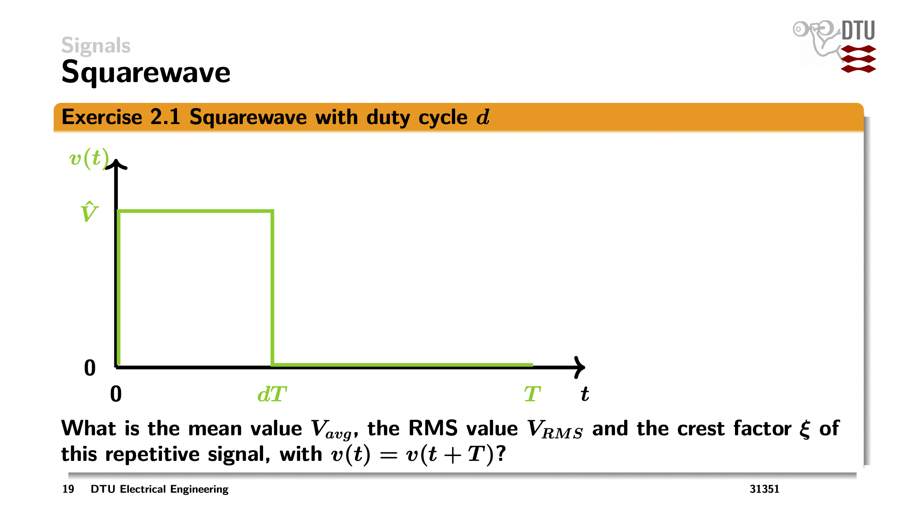
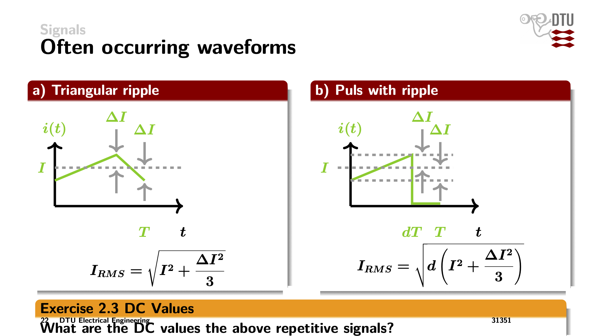
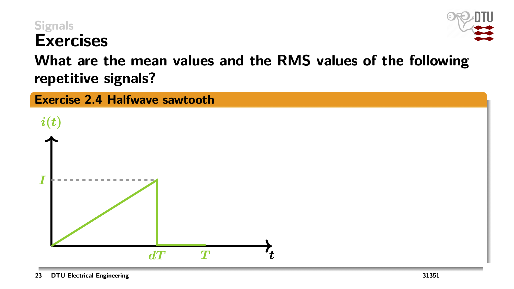
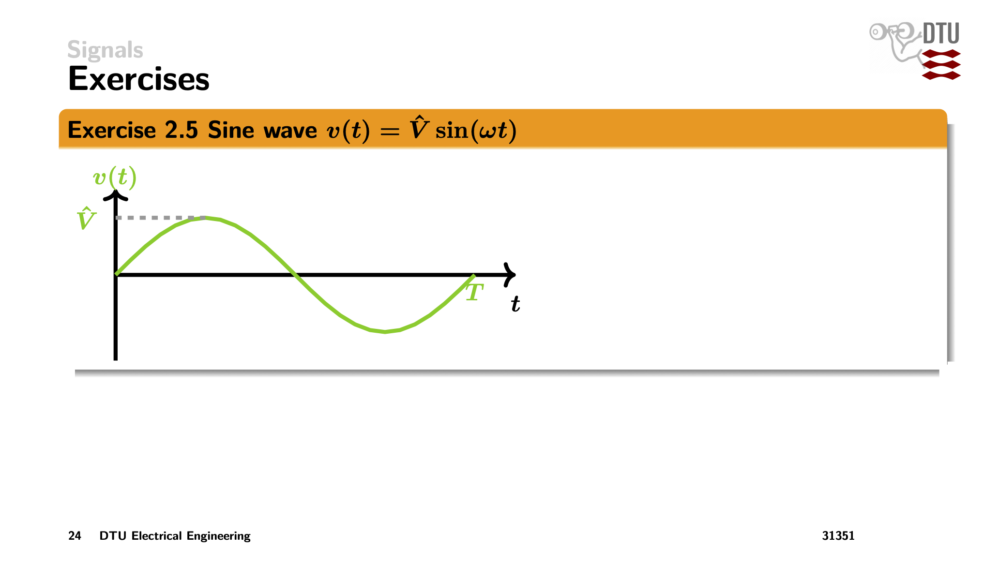
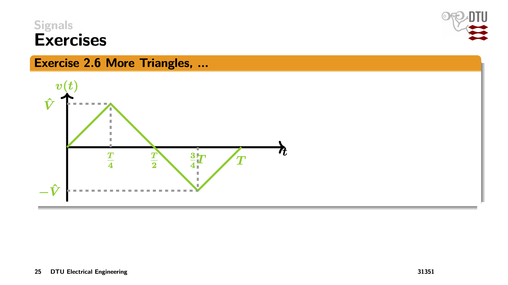
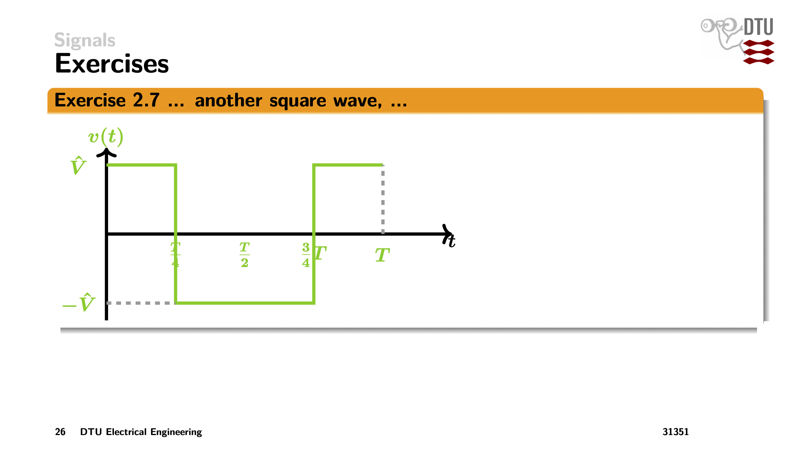
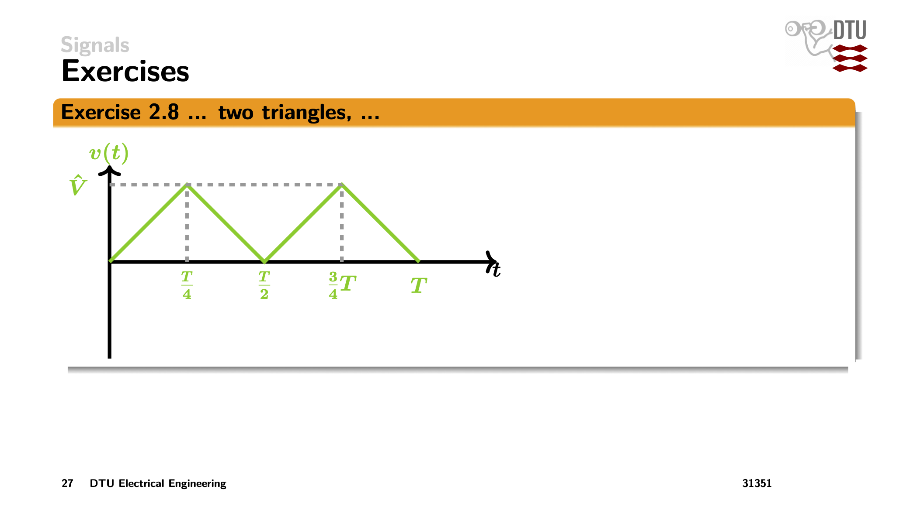
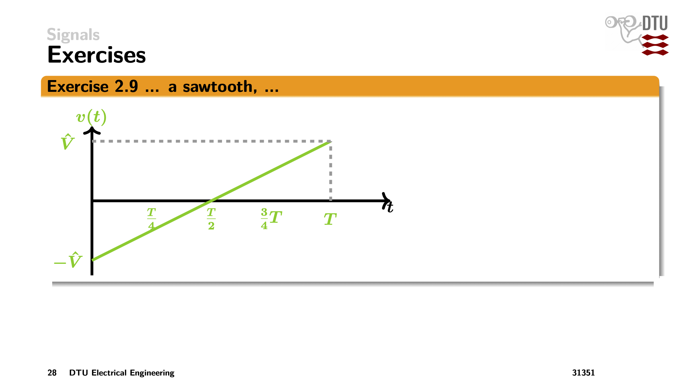
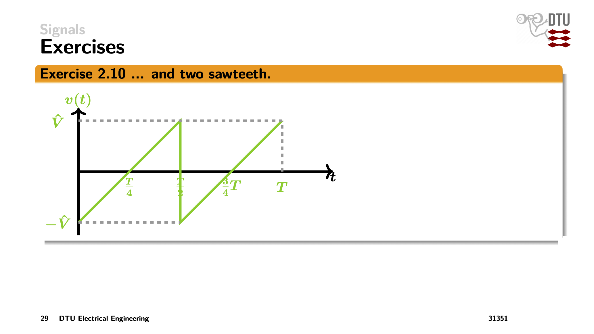

# 34620 Power Electronics - Exercises Week 2

## Exercise 1.2: Low Voltage Microcontroller Supply

**Given:**
- $V_{in} = 5$ V
- $V_{out} = 1.5$ V
- $I_{out} = 15$ A
- $R_{load} = 0.1\ \Omega$

**Question:** What is the maximum achievable efficiency of the linear regulator?

### Solution:

For a linear regulator, the input current equals the output current (plus small bias current, which we ignore):

$$P_{in} = V_{in} \cdot I_{out}$$
$$P_{out} = V_{out} \cdot I_{out}$$

The efficiency is:
$$\eta = \frac{P_{out}}{P_{in}} = \frac{V_{out} \cdot I_{out}}{V_{in} \cdot I_{out}} = \frac{V_{out}}{V_{in}} = \frac{1.5}{5} = 0.30 = \boxed{30\%}$$

Power dissipated in the regulator:
$$P_{loss} = (V_{in} - V_{out}) \cdot I_{out} = (5 - 1.5) \cdot 15 = 52.5 \text{ W}$$

---

## Exercise 2.1: Squarewave with Duty Cycle d

**Question:** What is the mean value $V_{avg}$, the RMS value $V_{RMS}$ and the crest factor $\xi$ of this repetitive signal, with $v(t) = v(t+T)$?

### Solution:

The signal is $\hat{V}$ for time $dT$ and $0$ for time $(1-d)T$.

**Mean value:**
$$V_{avg} = \frac{1}{T} \int_0^T v(t)\,dt = \frac{1}{T}\left[\hat{V} \cdot dT + 0 \cdot (1-d)T\right] = \boxed{d \cdot \hat{V}}$$

**RMS value:**
$$V_{RMS} = \sqrt{\frac{1}{T} \int_0^T v^2(t)\,dt} = \sqrt{\frac{1}{T} \cdot \hat{V}^2 \cdot dT} = \boxed{\sqrt{d} \cdot \hat{V}}$$

**Crest factor:**
$$\xi = \frac{\hat{V}}{V_{RMS}} = \frac{\hat{V}}{\sqrt{d} \cdot \hat{V}} = \boxed{\frac{1}{\sqrt{d}}}$$

---

## Exercise 2.3: DC Values

**Question:** What are the DC values of the above repetitive signals?

### Solution:

**a) Triangular ripple:**
The signal oscillates symmetrically around the DC value $I$ with peak-to-peak ripple $2\Delta I$.

$$I_{DC} = \boxed{I}$$

**b) Pulse with ripple:**
The signal has value $I$ (with ripple) for time $dT$ and $0$ for time $(1-d)T$.

$$I_{DC} = \frac{1}{T}\left[I \cdot dT + 0 \cdot (1-d)T\right] = \boxed{d \cdot I}$$

---

## Exercise 2.4: Halfwave Sawtooth

**Question:** What are the mean values and the RMS values of the following repetitive signals?

### Solution:

The signal rises linearly from $0$ to $I$ over time $dT$, then is $0$ for $(1-d)T$.

For $0 \leq t \leq dT$: $i(t) = \frac{I}{dT} \cdot t$

**Mean value:**
$$I_{avg} = \frac{1}{T} \cdot \frac{1}{2} \cdot dT \cdot I = \boxed{\frac{dI}{2}}$$

**RMS value:**
$$I_{RMS}^2 = \frac{1}{T} \int_0^{dT} \left(\frac{I}{dT} \cdot t\right)^2 dt = \frac{1}{T} \cdot \frac{I^2}{d^2T^2} \cdot \frac{(dT)^3}{3} = \frac{dI^2}{3}$$

$$I_{RMS} = \boxed{I\sqrt{\frac{d}{3}}}$$

---

## Exercise 2.5: Sine Wave

**Given:** $v(t) = \hat{V} \sin(\omega t)$

**Question:** Find mean and RMS values.

### Solution:

**Mean value:**
$$V_{avg} = \frac{1}{T} \int_0^T \hat{V} \sin(\omega t)\,dt = \boxed{0}$$

(The positive and negative half-cycles cancel out)

**RMS value:**
Using $\sin^2(x) = \frac{1 - \cos(2x)}{2}$:

$$V_{RMS}^2 = \frac{1}{T} \int_0^T \hat{V}^2 \sin^2(\omega t)\,dt = \frac{\hat{V}^2}{T} \cdot \frac{T}{2} = \frac{\hat{V}^2}{2}$$

$$V_{RMS} = \boxed{\frac{\hat{V}}{\sqrt{2}}}$$

**Crest factor:** $\xi = \sqrt{2} \approx 1.414$

---

## Exercise 2.6: More Triangles

**Question:** Find mean and RMS values.

### Solution:

Symmetric triangle wave: rises from $0$ to $\hat{V}$ at $T/4$, falls to $-\hat{V}$ at $3T/4$, returns to $0$ at $T$.

**Mean value:**
$$V_{avg} = \boxed{0}$$

(Symmetric about zero)

**RMS value:**
For a symmetric triangle wave with peak $\hat{V}$:

$$V_{RMS} = \boxed{\frac{\hat{V}}{\sqrt{3}}}$$

---

## Exercise 2.7: Another Square Wave

**Question:** Find mean and RMS values.

### Solution:

From the figure: $+\hat{V}$ for $0 < t < T/4$, $-\hat{V}$ for $T/4 < t < T/2$, $+\hat{V}$ for $T/2 < t < 3T/4$, $0$ for $3T/4 < t < T$.

**Mean value:**
$$V_{avg} = \frac{1}{T}\left[\hat{V} \cdot \frac{T}{4} + (-\hat{V}) \cdot \frac{T}{4} + \hat{V} \cdot \frac{T}{4} + 0\right] = \boxed{\frac{\hat{V}}{4}}$$

**RMS value:**
$$V_{RMS}^2 = \frac{1}{T}\left[\hat{V}^2 \cdot \frac{T}{4} + \hat{V}^2 \cdot \frac{T}{4} + \hat{V}^2 \cdot \frac{T}{4} + 0\right] = \frac{3\hat{V}^2}{4}$$

$$V_{RMS} = \boxed{\frac{\hat{V}\sqrt{3}}{2}}$$

---

## Exercise 2.8: Two Triangles

**Question:** Find mean and RMS values.

### Solution:

Two identical triangular pulses per period: rises from $0$ to $\hat{V}$ at $T/4$, falls to $0$ at $T/2$, rises to $\hat{V}$ at $3T/4$, falls to $0$ at $T$.

**Mean value:**
$$V_{avg} = \frac{2 \cdot \frac{1}{2} \cdot \frac{T}{2} \cdot \hat{V}}{T} = \boxed{\frac{\hat{V}}{2}}$$

**RMS value:**
For each triangle (isoceles with base $T/2$ and height $\hat{V}$):
$$\int v^2 dt = \frac{\hat{V}^2 \cdot T/2}{3} = \frac{\hat{V}^2 T}{6}$$

For two triangles:
$$V_{RMS}^2 = \frac{1}{T} \cdot 2 \cdot \frac{\hat{V}^2 T}{6} = \frac{\hat{V}^2}{3}$$

$$V_{RMS} = \boxed{\frac{\hat{V}}{\sqrt{3}}}$$

---

## Exercise 2.9: A Sawtooth

**Question:** Find mean and RMS values.

### Solution:

Sawtooth from $-\hat{V}$ to $+\hat{V}$ over one period: $v(t) = \hat{V}\left(\frac{2t}{T} - 1\right)$

**Mean value:**
$$V_{avg} = \boxed{0}$$

(Symmetric about zero)

**RMS value:**
$$V_{RMS}^2 = \frac{1}{T} \int_0^T \hat{V}^2\left(\frac{2t}{T} - 1\right)^2 dt = \frac{\hat{V}^2}{3}$$

$$V_{RMS} = \boxed{\frac{\hat{V}}{\sqrt{3}}}$$

---

## Exercise 2.10: Two Sawteeth

**Question:** Find mean and RMS values.

### Solution:

Two sawtooth cycles per period: from $-\hat{V}$ to $+\hat{V}$ over $T/2$, repeated.

**Mean value:**
$$V_{avg} = \boxed{0}$$

(Symmetric about zero)

**RMS value:**
The RMS is independent of frequency for the same waveform shape:

$$V_{RMS} = \boxed{\frac{\hat{V}}{\sqrt{3}}}$$
