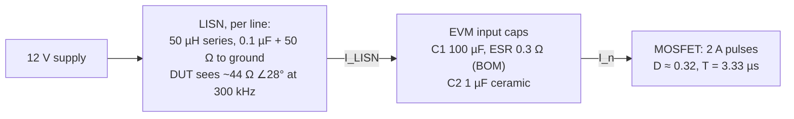
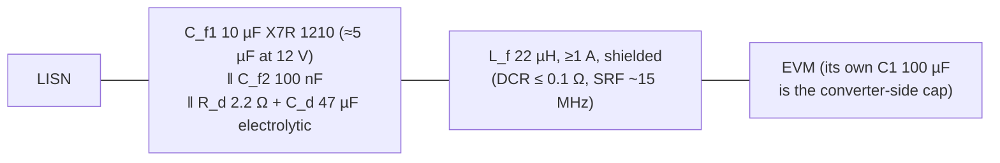

# Assignment 3 — EMC: input filter for a buck converter

> [!info] Practical
> **Brief:** [[Assignment 3 - EMC.pdf]] (Arnold Knott). **Hardware:** TI TPS40200EVM-001 ([[TPS40200EVM-001 - TI buck EVM user guide.pdf]]), 12 V in, 3.3 V / 2 A out (1.65 Ω), 300 kHz. **Limit:** EN 55022 class B, conducted, mains port, 150 kHz – 30 MHz.
> **Rooms:** EMC chamber + LISN + EMI receiver **b.325 r.261** (24/7 access, Arnold's mail of 21-Sep) · network analyser **329A-020**. Intro video: <https://youtu.be/fiSCyV1R1Fw>
> **Files:** `5. Semester/Circuit Technology and EMC/Assignment 3 - EMC/` — `calc/lisn_estimate.py` (pen & paper), `ltspice/gen_emc_ltspice.py` (three `.asc`, batch run + plots), `measurements/` (CSV templates, lab-day checklist), `results/`.
> **Deliverable:** one presentation per group, **max 11 slides** (title + 2 per bullet), pitched to a customer. Timeline: Arnold plans ~4 weeks from 15-Sep.

## The one idea

A buck converter draws its input current in **pulses**: 2 A while the P-MOSFET is on (about a third of every 3.33 µs period), nothing while it is off. The board's input capacitor supplies most of that pulse, but not all of it — the leftover ripple current flows out of the input terminals, through the LISN, and the receiver reads the voltage it makes across the LISN's 50 Ω. The job is to make the leftover small enough: **put an inductor in the way and a capacitor behind it**, so the ripple has a low-impedance loop on the converter side and a high-impedance path towards the LISN.

Arnold's hint (21-Sep): *don't overcomplicate the modelling, simplify and move to the hands-on part.* The model below is three lines of physics.

## The limit

Table 2 of EN 55022 (class B, mains port), quasi-peak / average in dBµV:

| f | QP | AV |
|---|---|---|
| 0.15 – 0.5 MHz | 66 → 56 (linear in log f) | 56 → 46 |
| 0.5 – 5 MHz | 56 | 46 |
| 5 – 30 MHz | 60 | 50 |

At 300 kHz the QP limit is **60.2 dBµV**, at 600 kHz 56.0. Harmonics of a fixed-frequency converter are pure tones inside the 9 kHz receiver bandwidth, so **QP = AV = the RMS value of the tone** — both limits bite, the average one is 10 dB tighter. Design against the **average** line. 0 dBµV = 1 µV, so 60 dBµV is 1 mV RMS across 50 Ω.

## Step 1 — calculate the disturbance voltage

### The model (pen & paper, `calc/lisn_estimate.py`)

1. **Duty cycle.** $D = \dfrac{V_{out} + V_F + I R_L}{V_{in} - I (R_{DS} + R_{sense})} = \dfrac{3.3 + 0.4 + 0.08}{12 - 0.19} \approx 0.32$. The diode drop matters: with an ideal D = 3.3/12 = 0.275 the 3rd harmonic would be 2 dB different.
2. **Harmonic currents** of a rectangular pulse train of height $I_{out}$ = 2 A and width $DT$: $\hat I_n = \dfrac{2 I_{out}}{n\pi}\,|\sin(n\pi D)|$, times $\mathrm{sinc}(n\pi t_r/T)$ for the 30 ns edges. $\hat I_1$ = 1.07 A, $\hat I_2$ = 0.58 A, $\hat I_3$ = 0.05 A (D ≈ 1/3 kills the 3rd), $\hat I_4$ = 0.24 A …
3. **Current divider.** $I_{LISN} = \hat I_n \dfrac{Z_{cap}}{Z_{cap} + Z_{LISN,DM}}$ with $Z_{cap} = Z_{C1}\,\|\,Z_{C2}$ and $Z_{LISN,DM} = 2 \times [\,j\omega 50\,µH \,\|\,(50\,Ω + 1/j\omega 0.1\,µF)\,]$ (out on one line, back on the other). At 300 kHz: $|Z_{cap}|$ = 0.28 Ω, $|Z_{LISN,DM}|$ = 93 Ω.
4. **Receiver** reads $V = I_{LISN} \cdot 50\,Ω$ on one line, as RMS: $V_{dBµV} = 20\log_{10}(\hat V/\sqrt2 / 1\,µV)$.

At the fundamental: 1.07 A × 0.28/93 = 3.2 mA peak → 0.16 V peak across 50 Ω → 0.11 V RMS → **101 dBµV**, 40 dB over the limit.

### The numbers

`ltspice/Buck_LISN_noFilter.asc` is the same thing with real waveforms: switch model (75 mΩ, 30 ns edges, fixed D), MBRS330 Schottky, 33 µH, output caps, and parasitic ESL on the input caps (5 nH on C1) plus a guessed **10 pF from the switch node to the ground plane** (the common-mode path). Open loop — the control loop is far below 300 kHz and does not change the spectrum. 40 periods after 2 ms of settling, FFT with a Hann window.

![[Buck_LISN_withFilter.png]]
*(the with-filter variant; the no-filter schematic is the same without the four parts between the LISN and `dut_p`)*

| n | f / MHz | hand, ESR 0.3 Ω | LTspice, ESR 0.3 Ω | hand, ESR 0.03 Ω | LTspice, ESR 0.03 Ω | QP limit | AV limit |
|---|---|---|---|---|---|---|---|
| 1 | 0.30 | 100.6 | 100.3 | 81.2 | 80.4 | 60.2 | 50.2 |
| 2 | 0.60 | 94.2 | 93.8 | 77.1 | 77.6 | 56 | 46 |
| 3 | 0.90 | 72.2 | 73.5 | 58.3 | 60.7 | 56 | 46 |
| 4 | 1.20 | 84.0 | 82.8 | 73.6 | 75.3 | 56 | 46 |
| 5 | 1.50 | 82.5 | 80.9 | 75.7 | 77.7 | 56 | 46 |
| 6 | 1.80 | 68.0 | 66.6 | 65.0 | 67.7 | 56 | 46 |
| 7 | 2.10 | 74.1 | 70.8 | 74.9 | 75.8 | 56 | 46 |
| 8 | 2.40 | 74.9 | 70.4 | 79.4 | 80.0 | 56 | 46 |
| 95–99 | 28.5–29.7 | 15–36 | 53–69 | 15–36 | 53–69 | 60 | 50 |

![[spectrum_nofilter.png]]

What to take from it:

- **Hand and LTspice agree within ~3 dB up to 2.4 MHz.** The model is the current divider; nothing more is needed for the low harmonics.
- **The unknown is C1's ESR.** The EVM BOM prints *0.3 Ω* for the Sanyo 20SVP100M, the OS-CON datasheet says ~0.03 Ω. That is **20 dB** on every low harmonic (100 vs 80 dBµV at 300 kHz). Either way the fundamental is 20–40 dB over the QP limit and 30–50 dB over the average limit. The measurement settles it: read the fundamental, back out the ESR.
- **Above ~3 MHz the hand model is useless** (it predicts 15–36 dBµV; the simulation says 55–70). Up there it is not the pulse shape but the *parasitics*: the 5 nH of C1 turning the 2 A / 30 ns edges into 0.3 V spikes, and the common-mode current through the switch node's capacitance to the plane. Both are guesses (5 nH, 10 pF). Expect the measured top-of-band to be **whatever the layout and the lead dressing make it**; do not promise a number there.
- Even harmonics are as strong as odd ones because D ≈ 0.32, not 0.5.

![[waveforms_nofilter.png]]

## Step 2 — measure the bare EVM (to do, b.325 r.261)

The lab-day checklist is `measurements/README.md`; the table template `measurements/emi_nofilter.csv` has the limits pre-filled. In short: RBW 9 kHz, **QP and AV**, 150 kHz – 30 MHz, ambient sweep with the EVM off, **read the real switching frequency off the fundamental** (the RC oscillator is not exactly 300 kHz, and "the last 5 harmonics below 30 MHz" depend on it: n_max = ⌊30 MHz / f_s⌋), save the trace to USB, photograph the setup. Short, bundled leads between LISN and EVM — a 20 cm loop is an antenna at 30 MHz.

## Step 3 — the filter

### What is needed

| harmonic | over the AV limit (ESR 0.3 / 0.03 Ω) |
|---|---|
| 300 kHz | 50 / 30 dB |
| 600 kHz | 48 / 32 dB |
| 1.2–1.5 MHz | 37 / 30 dB |
| 2.4 MHz | 24 / 34 dB |

So ≥ **50 dB at 300 kHz** with some margin, falling to ~35 dB at 2 MHz. A second-order LC gives 40 dB/decade: a corner at 30 kHz gives exactly 40 dB at 300 kHz (not enough if the BOM's ESR is right), a corner at **15 kHz** gives 52 dB.

The attenuation of an L–C section between the converter's ripple voltage and the LISN port is simply the divider $\left|\dfrac{Z_{Cf}}{Z_{Cf} + j\omega L_f}\right| \approx \dfrac{1}{\omega^2 L_f C_f}$ well above the corner. The LISN's 100 Ω in parallel with $C_f$ changes nothing (a 5 µF ceramic is 0.1 Ω at 300 kHz). **The inductor is the part that works**; a capacitor across the LISN port alone only buys the ratio of the capacitor impedances (~10 dB).

### Proposed (smallest/cheapest that has margin)

- **L_f = 22 µH, C_f1 = 10 µF nominal** → corner 15 kHz with the 5 µF that is left at 12 V bias (a 1210 X7R loses half its capacitance at 12 V; do not use an 0805). Attenuation 1/(ω²LC) at 300 kHz: **52 dB**, at 600 kHz 64 dB. 22 µH rather than 10 µH because 10 µH with the derated 5 µF gives only 45 dB — no margin against the BOM ESR.
- **C_f2 = 100 nF** ceramic: the 10 µF's ESL (~1 nH) makes it inductive above ~2 MHz; the small one takes over up to ~30 MHz.
- **R_d + C_d**: the L_f–C_f corner at 15 kHz sees a nearly lossless source (the LISN's 50 µH) on one side and C1 with its ESR on the other. A cheap 47 µF electrolytic (its own ESR ~0.5 Ω plus 2.2 Ω) in parallel with C_f1 damps it so the converter's input does not ring or, worse, interact with the TPS40200's negative input resistance (−V²/P ≈ −20 Ω). Costs nothing; leave it in.
- The inductor's **self-resonance** (5 pF across 22 µH ≈ 15 MHz) is where the filter stops working; above it the 100 nF has to carry the day. A ferrite bead in series would extend it, but measure first.
- DC: 0.65 A through 0.1 Ω → 65 mV, 42 mW. Fine.
- **Common mode is the open question.** The DM filter above kills the DM leftover completely in the simulation; what remains on the LISN is the common-mode current from the switch node through its capacitance to the plane, returning through the LISN's 25 Ω. With 10 pF that alone is ~66 dBµV at 300 kHz (fail); with 1 pF, 46 dBµV (pass). A bare 3.5 × 5.4 cm board 40 cm from the plane is probably ≪ 1 pF, but the load leads and the electronic load add to it. **If the measurement with the DM filter shows a residual that does not depend on the filter values, that is CM** — then add a small common-mode choke (or, simpler in this DC setup, two 4.7–100 nF Y-caps from + and return to the LISN ground plane right at the filter).

### Simulated with the filter (`ltspice/Buck_LISN_withFilter.asc`)

| n | f / MHz | no filter | with filter, Cpar = 10 pF | with filter, Cpar = 1 pF | QP limit | AV limit |
|---|---|---|---|---|---|---|
| 1 | 0.30 | 100.3 | 66.5 | 52.2 | 60.2 | 50.2 |
| 2 | 0.60 | 93.8 | 67.1 | 47.9 | 56 | 46 |
| 3 | 0.90 | 73.5 | 51.2 | 31.9 | 56 | 46 |
| 4 | 1.20 | 82.8 | 65.5 | 45.7 | 56 | 46 |
| 5 | 1.50 | 80.9 | 67.7 | 47.9 | 56 | 46 |
| 6 | 1.80 | 66.6 | 57.6 | 37.9 | 56 | 46 |
| 7 | 2.10 | 70.8 | 64.1 | 44.3 | 56 | 46 |
| 8 | 2.40 | 70.4 | 68.0 | 48.2 | 56 | 46 |
| 95–99 | 28.5–29.7 | 53–69 | 48–68 | 27–48 | 60 | 50 |

![[spectrum_withfilter.png]]

Read it like this: the two "with filter" columns differ by **exactly 20 dB at every harmonic** — the ratio of the two Cpar guesses. So with the filter in place *nothing differential-mode is left*; every µV on the LISN is common-mode current through the switch node's capacitance to the plane. The DM design has ~50 dB of margin over what is needed and does not need to grow; whether the board passes is decided by the CM path, which only the measurement can size. With ≲ 2 pF (the likely case for a bare EVM) it passes both QP and AV with ≥ 6 dB of margin; with 10 pF it needs the CM fix.

### Filter alone in 50 Ω — what the network analyser will show

![[filter_s21.png]]

`ltspice/Filter_S21.asc`: port 1 (50 Ω source) on the line side, port 2 (50 Ω load) on the converter side. Note that **S21 in 50 Ω is not the in-situ attenuation** — the real source is the converter's 0.3 Ω capacitor and the real load is the LISN's 100 Ω, both far from 50 Ω. Expect the measured S21 to be within a few dB of the simulated curve; the useful check is the shape (40 dB/decade above 15 kHz, floor set by the inductor's self-resonance).

## Step 4 — measure S21 (329A-020)

Template `measurements/filter_s21.csv`. Measure the *through* first (that is the 0 dB and the floor of the setup), sweep 10 kHz – 100 MHz, and try the reverse direction too (this filter is not symmetric). If the floor sits at −70 dB, that is the setup's crosstalk, not the filter.

## Step 5 — measure the EVM with the filter (b.325 r.261)

Same setup, same settings, `measurements/emi_withfilter.csv`. Put the filter **right at the EVM's input terminals**, on a scrap of copper-clad with a solid return, filter caps across + and return with the shortest possible loop. If it still fails at 300 kHz: check the derated capacitance (measure the 10 µF at 12 V bias on the Bode 100 if it is around — that is also assignment-4 material) and the CM story above.

## Step 6 — the presentation (max 11 slides)

| # | Slide | Content |
|---|---|---|
| 1 | Title | group, EVM, the customer's requirement (EN 55022 B) |
| 2–3 | Calculate | the current-divider model + the table above; LTspice schematic; "40 dB to go" |
| 4–5 | Measure 1 | photo of the setup, the receiver trace with the limit line, the 8 + 5 harmonic table, the measured f_s and back-calculated ESR |
| 6–7 | Design | the two-line design equation, the part list with prices, the photo of the built filter |
| 8–9 | Filter S21 | measured vs simulated, the inductor's self-resonance |
| 10–11 | Measure 2 | before/after spectrum on one plot, margins to QP and AV, "compliant" (or what is left and why) |

Arnold's rules: KISS, no novels, big quantified graphs, share the work.

## Open questions

- [ ] Which LISN and receiver exactly (model numbers for the block diagram) — the video shows it, note it on the day.
- [ ] Is the receiver's LISN transducer factor already applied? Check the reading of a known CW signal or ask.
- [ ] C1's real ESR (0.3 vs 0.03 Ω) — the first measurement tells.
- [ ] Is CM present at all — the second measurement tells.
- [ ] The EVM's actual switching frequency.
- [ ] Parts: order the 22 µH inductor and the 10 µF/25 V 1210 X7R now (the rest is drawer stock).
