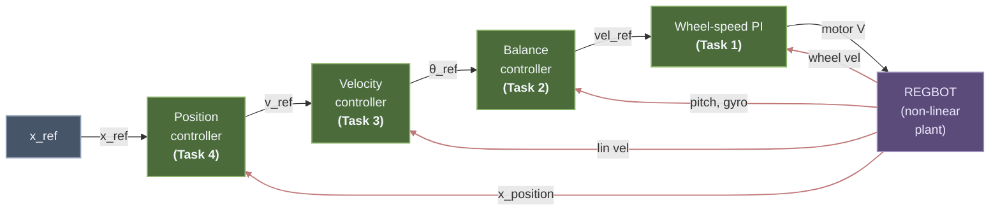
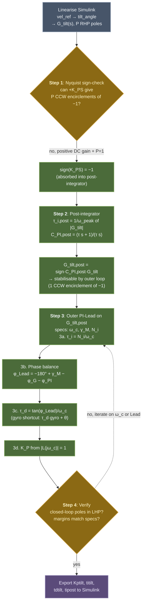
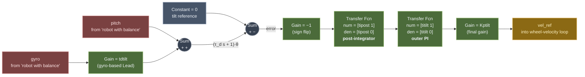

# REGBOT Balance Assignment

> [!abstract] Goal
> Design, implement and test a control strategy for the REGBOT such that we achieve motion while keeping balance.

> [!example] Related Materials
> - [[Lesson 10 - Unstable Systems and REGBOT Balance]] — unstable-system theory and Nyquist primer (§2)
> - [[Lecture_10_Unstable_systems.pdf|Lecture 10 Slides]]
> - [[Fundamentals - Intuitive Control Theory|Fundamentals Guide]]
> - [[Diagnostic Guide - What Went Wrong|Diagnostic Guide]]
> - [[Worked Example - REGBOT Position Controller|Worked Example]]
> - [[Day 5 - Black Box Modeling]] — voltage-to-velocity transfer function
> - [[Day 8 & 9 - Position Controller Design]] — prior PILead design

---

## Preparation

Before you start designing:

- [x] Watch `REGBOT balance introduction.mp4` (Resources/Videos and Tutorials)
- [x] Review the **REGBOT control architecture** slides (included in Lecture 10 slides)
- [x] Download starter files from Resources/REGBOT balance resources:
    - `regbot_1mg` — REGBOT system with wheel velocity control loop
    - `regbot_mg` — associated model file
- [ ] Calibrate the **gyro** and **tilt-offset** before testing on the robot
- [x] Install MATLAB packages (from **Add-Ons** in the Home tab):
    - **Simscape Multibody** (required to simulate the model)
    - **Simulink Control Design**

> [!warning] Before Testing on REGBOT
> Implement all controllers (designed in MATLAB) in the **Simulink model** first. Only test on the physical REGBOT after simulation confirms the design works.

---

## Control Architecture Overview

The REGBOT balance problem requires a **cascaded control** structure with four nested loops. Each task in this assignment builds the next loop in the cascade, from the innermost (Task 1) outward (Task 4).



*Cascaded structure: the position loop (outermost) drives a velocity reference, which drives a tilt reference, which drives a velocity-reference for the inner wheel-speed PI, which drives the motor voltage. Red arrows show measurement feedback paths.*

---

## Tasks

### Task 1 — Wheel Speed Controller (PI)

**Design a PI-controller** for the wheel velocity loop.

- **Transfer function to control:** voltage-to-velocity $G_{vel}(s)$ identified on [[Day 5 - Black Box Modeling|Day 5]]
- **Controller type:** PI
- **Source:** your own design from previous exercises

---

### Task 2 — Balance Controller (PI + Post-Integrator)

**Design a balance controller** so the REGBOT can balance itself and maintain balance during a mission.

> [!important] Post-Integrator
> Include a **"post-integrator"** — a second PI block in the open loop.
> - Treat it as an **additional design element** when computing controller phase and $K_P$
> - Its phase contribution must be added when calculating the total open-loop phase
> - Its gain must be accounted for when solving $|L(j\omega_c)| = 1$
>
> See Lecture 10 slides for details on the post-integrator design.

**Design checklist:**
- [ ] Identify the balance transfer function (angle-to-tilt or similar unstable plant)
- [ ] Include post-integrator in the open loop
- [ ] Compute phase contribution from all elements
- [ ] Calculate $K_P$ such that $|L(j\omega_c)| = 1$
- [ ] Verify stability via Nyquist (REGBOT balance is open-loop unstable!)

---

### Task 3 — Velocity Controller (in Balance State)

**Design a velocity controller** so the REGBOT can move at a given speed forwards/backwards while balancing.

#### Test 3a — Zero velocity (stationary balance)

**Expected:** REGBOT balances in place. Some small movement is acceptable, e.g. drift within approximately **0.5 m** from the starting point.

#### Test 3b — Square run at 0.8 m/s

**Expected:** REGBOT makes a **square run** while staying in balance:
- Side length: **1 m**
- Turning radius: **0.2 m**

---

### Task 4 — Position Controller (in Balance State)

**Design a position controller** for moving the REGBOT to a given position while balancing.

#### Test sequence

The REGBOT must execute:

| Step | State |
|------|-------|
| (a) | Robot stands still |
| (b) | Robot finds the balance |
| (c) | Robot moves a distance of **2 m** with max speed exceeding **0.7 m/s** |
| (d) | Robot stops |

#### Example mission script

```
vel=0, bal=1, log=15 : time=2
topos=2, vel=1.2 : time=10
```

Where:
- `topos=2` → target distance in meters
- `vel=1.2` → maximum speed during movement (m/s)
- `bal=1` → balance mode enabled
- `log=15` → logging level

---

## Mandatory Report — Hand-in Instructions

> [!tip] Submission Details
> - **Max length:** 5 pages
> - **Submit on:** Learn under *Course Content* → *Assignments* → *REGBOT balance*
> - **One submission per group** (only the most recent is kept)
> - **Filename format:** `Group_XX.pdf`
> - **Front page:** full names and student numbers

### Required Content

#### Front Matter
- [ ] Full names and student numbers

#### General Architecture
- [ ] A few lines on the overall control architecture used

#### For Each Design Step, Document:
- [ ] Which transfer function is being controlled
- [ ] Which controllers are in the open loop, and **why**
- [ ] Design parameters and how they were found:
    - $N_i$
    - $\alpha$
    - $\tau_d$
    - $\tau_i$
    - $K_P$
    - $\gamma_M$
    - $\omega_c$
- [ ] **Bode plot** of the open-loop transfer function (showing phase margin)
- [ ] **Step response** of the closed-loop system from Simulink
- [ ] **Step response** from the REGBOT (include the mission script used)
- [ ] **Comments** comparing simulation vs. experiment

#### Extras
- [ ] General comments on findings and methods
- [ ] A cool **XY-plane plot** showing REGBOT motion during Task 4
- [ ] (Optional) Video link to controller tests

> [!important] Style
> Be **precise, accurate, and short**.

---

## Design Workflow Checklist

Follow this order to systematically work through the assignment:

1. **Preparation** — watch intro video, calibrate REGBOT, install MATLAB packages
2. **Task 1** — PI velocity controller (reuse from earlier)
3. **Simulink model** — verify velocity controller works in sim
4. **Task 2** — Balance controller with post-integrator
5. **Simulink** — confirm balance loop closes (REGBOT stays upright in sim)
6. **Physical test** — balance at zero velocity (Test 3a)
7. **Task 3** — Outer velocity controller
8. **Physical test** — square run (Test 3b)
9. **Task 4** — Position controller
10. **Physical test** — 2 m position move (Test 4)
11. **Report** — compile Bode plots, step responses, XY-plot, mission scripts

---

## Key Design Principles (from Course)

> [!tip] Reminders from Fundamentals
> - The balance plant is **open-loop unstable** → Nyquist stability criterion requires **CCW encirclement** of $-1$ per RHP pole (see [[Fundamentals - Intuitive Control Theory#9. The Nyquist Plot Another Stability View|Fundamentals, Section 9]])
> - For zero steady-state error to a **step** reference, you need **at least one integrator** in the loop (see [[Fundamentals - Intuitive Control Theory#11. Type-n Systems and Steady-State Error|Type-n systems]])
> - The post-integrator makes the loop Type-2 → zero error for both step and ramp references
> - Phase margin target: typically $\gamma_M = 50°$–$65°$ for balance between speed and overshoot

---

## Progress Log

> [!abstract] Purpose
> This section tracks what we have actually done so far. Add to it as we progress.

### 2026-04-15 — Session 1: Plant Identification & Task 1 Design

#### Preparation completed
- [x] Watched `REGBOT balance introduction.mp4`
- [x] Downloaded starter files `regbot_1mg.slx` and `regbot_mg.m` from Learn
- [x] Files committed to repo: [`4. Semester/Linear Control Design/REGBOT-Balance-Assignment/simulink/`](../../../../../../4.%20Semester/Linear%20Control%20Design/REGBOT-Balance-Assignment/simulink/)

#### Plant identification via LINEARIZE

Used MATLAB's `linearize()` on the Simulink model at two sets of I/O points:

**1. Voltage → wheel velocity ($G_{wv}$)** — I/O points: `/Limit9v → /wheel_vel_filter`

$$G_{wv}(s) = \frac{7.023\times10^5 s^3 + 7.023\times10^8 s^2 - 5.083\times10^7 s - 5.083\times10^{10}}{s^6 + 2418 s^5 + 1.317\times10^6 s^4 + 1.872\times10^8 s^3 + 2.371\times10^9 s^2 - 3.032\times10^{10} s - 1.881\times10^{11}}$$

**Poles:** $-1713, -490, -200, -21.1, \boxed{+10.6}, -5.0$ rad/s
**DC gain:** 0.270 (m/s)/V
**RHP poles: 1** → physically consistent with the inverted pendulum mode

**2. Velocity reference → tilt angle ($G_{tilt}$)** — I/O points: `/vel_ref → /robot with balance (port 1)`

**Poles:** $-1715, -515.8, -83.7 \pm 63.7j, \boxed{+8.7}, -19.3, -9.2$ rad/s
**DC gain:** $5.04 \times 10^{-4}$ rad/(m/s)
**RHP poles: 1** → the same falling pendulum mode, seen through the closed velocity loop

> [!important] Key finding
> **Both plants have exactly 1 RHP pole** (around $+8$–$+11$ rad/s). This corresponds to the inverted-pendulum falling dynamics — the robot is open-loop unstable, as expected.
>
> **Nyquist implication:** The balance controller must produce **1 CCW encirclement** of $-1$ for the closed-loop system to be stable ($Z = N + P \Rightarrow 0 = N + 1 \Rightarrow N = -1$).

#### Plots generated

**Bode plots:**

![[regbot_Gwv_bode.png]]
*$G_{wv}$: Motor voltage → wheel velocity. Low-frequency DC gain matches physical expectation.*

![[regbot_Gtilt_bode.png]]
*$G_{tilt}$: Velocity reference → tilt angle. This is the plant the balance controller will see.*

**Pole–zero maps (shaded stability regions):**

![[regbot_Gwv_pzmap.png]]
*$G_{wv}$ in the s-plane. The RHP pole (highlighted) is the unstable pendulum mode.*

![[regbot_Gtilt_pzmap.png]]
*$G_{tilt}$ in the s-plane. One RHP pole — the same physical falling mode.*

**Zoomed pole–zero maps (focus on the slow dynamics around origin):**

![[regbot_Gwv_pzmap_zoom.png]]
*$G_{wv}$ zoomed to ±50 rad/s. The RHP pole at $\approx +10.6$ rad/s is clearly visible with its orange ring.*

![[regbot_Gtilt_pzmap_zoom.png]]
*$G_{tilt}$ zoomed to ±50 rad/s. RHP pole at $\approx +8.7$ rad/s is the pendulum falling mode the balance controller must stabilise. Nearby LHP poles and zeros show the slow dynamics.*

**Nyquist plot of $G_{tilt}$:**

![[regbot_Gtilt_nyquist.png]]
*$G_{tilt}$ Nyquist plot. Solid blue = $\omega > 0$, dashed = mirror for $\omega < 0$. The red "+" marks the critical point $(-1, 0)$ that governs closed-loop stability. Title shows the open-loop RHP-pole count $P$.*

> [!important] Reading the Nyquist Plot for Task 2
> $G_{tilt}$ has **$P = 1$** RHP pole (the falling-pendulum mode). The Nyquist criterion says $Z = N + P$, so for a stable closed loop we need $Z = 0$, i.e. $N = -1$ — exactly **one counter-clockwise encirclement** of $(-1, 0)$.
>
> Key implications for the balance controller:
> 1. **Sign check first.** Look at which side of the complex plane the curve lives on. If the real-axis crossing is positive, no proportional gain alone can shift the curve past $(-1, 0)$ in the correct direction — we'll need to absorb a minus sign (which is exactly what the "$-C_{PI,\text{post}}$" structure from Lecture 10 does).
> 2. **Post-integrator choice.** After inserting $-C_{PI,\text{post}}(s)$, redraw the Nyquist plot. With $\tau_{i,\text{post}} = 1/\omega_{i,\text{post}}$ (peak of $|G_{tilt}|$), the curve should now make one clean CCW loop around $(-1, 0)$ — visually confirming that Task 2 is on the right track before any PI-Lead design.
> 3. **Distance to $(-1,0)$ = robustness.** A curve that skims past $(-1, 0)$ has low margins. We want the corrected curve to give a comfortable clearance so the real REGBOT (with model mismatch and sensor noise) still works.

In practice this means the Task 2 workflow is: (i) plot $G_{tilt}$ on Nyquist, (ii) insert the sign-absorbing post-integrator, (iii) **replot** and verify the CCW encirclement visually, (iv) only then start the phase-balance calculation for the outer PI-Lead.

#### Task 1 — Wheel Speed PI Controller ✅

**Plant used:** Day 5 black-box identification $G_{vel}(s) = \dfrac{13.34}{s + 35.71}$
(Chosen over the linearized $G_{wv}$ because the assignment specifies the Day 5 TF, and because the inner velocity loop should be designed in isolation from the unstable tilt mode.)

**Design choices:**

| Parameter | Value | Reason |
|---|---|---|
| $\omega_c$ | 30 rad/s | Fast inner loop, still below $\omega$ of plant pole (35.71) |
| $\gamma_M$ (target) | $\geq 60°$ | Spec |
| $N_i$ | 3 | PI zero placed 3× below crossover |

**Computed values:**

| Parameter                      | Value                                |
| ------------------------------ | ------------------------------------ |
| $\tau_i = N_i/\omega_c$        | **0.10 s**                           |
| $K_p$ (from $L(j\omega_c)= 1$) | **3.31**                             |
| Achieved $\omega_c$            | ~30 rad/s                            |
| Achieved $\gamma_M$            | ~121° (well above 60° spec — robust) |

**Controller:**
$$C_{wv}(s) = 3.31 \cdot \frac{0.1s + 1}{0.1s}$$

**Simulink:** The starter model variables `Kpwv` and `tiwv` have been updated to these design values.

![[regbot_task1_bode.png]]
*Task 1 open-loop Bode with phase and gain margins marked.*

![[regbot_task1_step.png]]
*Task 1 closed-loop step response — confirms $e_{ss} = 0$ and low overshoot.*

---

### Task 2 — Balance Controller (Lecture 10, Method 2) ✅ (MATLAB)

> [!info] Workflow followed
> [[Lecture_10_Unstable_systems.pdf|Lecture 10 slides]] describe two methods for stabilising an open-loop unstable plant. We follow **Method 2** (slide 13) specialised to the tilt loop (slides 21–24).



*Lecture 10 Method 2 applied to the REGBOT balance loop. Each green box is a design step, each orange diamond a go/no-go gate, and the purple box is the handoff to Simulink.*

#### Step 1 — Nyquist sign-check

From the linearisation in Plant Identification above:

| Property | Value |
|---|---|
| DC gain of $G_{tilt}$ | $+5.04 \times 10^{-4}$ rad/(m/s) |
| RHP poles ($P$) | $1$  (pole at $+8.7$ rad/s) |

The Nyquist criterion requires $Z = N + P = 0 \Rightarrow N = -1$ (one CCW encirclement of $(-1,0)$).

A positive DC gain plus $P = 1$ means **no positive $K_{PS}$ can produce the required CCW encirclement** — the Nyquist curve cannot be scaled into encircling $-1$ in the correct direction. We therefore need
$$\boxed{\text{sign}(K_{PS}) = -1}$$
This minus sign is absorbed into the post-integrator (Lecture 10 slide 21, $G_{tv,\text{post}}(s) = -C_{PI,\text{post}}(s)\,G_{tv}(s)$).

#### Step 2 — Post-integrator design

Find the peak of $|G_{tilt}|$ on the Bode magnitude curve:

| Quantity | Value |
|---|---|
| Peak magnitude $\lvert G_{tilt}\rvert_{\max}$ | $0.588$ |
| Peak frequency $\omega_{\text{peak}}$ | $5.95$ rad/s |

Place the post-integrator zero at the peak so the combined magnitude curve rolls off monotonically:
$$\tau_{i,\text{post}} = \frac{1}{\omega_{\text{peak}}} = \frac{1}{5.95} = 0.1682\ \text{s}$$
$$C_{PI,\text{post}}(s) = \frac{\tau_{i,\text{post}} s + 1}{\tau_{i,\text{post}} s} = \frac{0.1682\, s + 1}{0.1682\, s}$$
$$G_{tilt,\text{post}}(s) = -\,C_{PI,\text{post}}(s)\cdot G_{tilt}(s)$$

![[regbot_task2_bode_post.png]]
*Bode plots of $G_{tilt}$ (blue) and $G_{tilt,\text{post}}$ (orange). After the post-integrator the magnitude curve is monotonically decreasing beyond $\omega_{\text{peak}}$ — the condition Method 2 requires before designing the outer loop.*

![[regbot_task2_nyquist_post.png]]
*Nyquist of $G_{tilt,\text{post}}$. One clean CCW encirclement of $(-1, 0)$ — matches $P = 1$, so the plant is now stabilisable by a standard outer controller.*

#### Step 3 — Outer PI-Lead on $G_{tilt,\text{post}}$

**Design specifications:**

| Spec | Value |
|---|---|
| Crossover $\omega_c$ | $15$ rad/s |
| Phase margin $\gamma_M$ | $60°$ |
| PI zero placement $N_i$ | $3$ |

**3a. I-part (outer PI).** Place the PI zero at $\omega_c/N_i$:
$$\tau_i = \frac{N_i}{\omega_c} = \frac{3}{15} = 0.200\ \text{s}, \qquad C_{PI}(s) = \frac{0.200\, s + 1}{0.200\, s}$$

**3b. Phase balance at $\omega_c$.** We need $\angle L(j\omega_c) = -180° + \gamma_M$. Breaking the loop phase into contributions:

| Contribution | Value at $\omega_c = 15$ rad/s |
|---|---|
| $\angle G_{tilt,\text{post}}(j\omega_c)$ (from Bode) | $-165.4°$ |
| $\angle C_{PI}(j\omega_c) = -\arctan(1/N_i)$ | $-18.43°$ |
| $\phi_\text{Lead}$ required $= -180° + \gamma_M - \phi_G - \phi_{PI}$ | $+63.8°$ |

**3c. Lead from gyro.** The REGBOT gyro directly measures $\dot\theta$, so
$$\tau_d\, \dot\theta + \theta = (\tau_d s + 1)\,\theta$$
is a proper, noise-free realisation of the ideal Lead — no filter pole needed (Lecture 10 slide 24). Solve for $\tau_d$:
$$\tau_d = \frac{\tan(\phi_\text{Lead})}{\omega_c} = \frac{\tan(63.8°)}{15} = 0.1355\ \text{s}$$

**3d. Loop gain.** Choose $K_P$ so $|L(j\omega_c)| = 1$:
$$|C_{PI}(j\omega_c)\cdot C_{\text{Lead}}(j\omega_c)\cdot G_{tilt,\text{post}}(j\omega_c)| = 0.879$$
$$K_P = \frac{1}{0.879} = 1.137$$

**Full controller** (as viewed from pitch measurement to `vel_ref`):
$$C_\text{total}(s) = K_P \cdot \underbrace{\frac{-(\tau_{i,\text{post}}s + 1)}{\tau_{i,\text{post}}s}}_{\text{sign + post-integrator}} \cdot \underbrace{\frac{\tau_i s + 1}{\tau_i s}}_{\text{outer PI}} \cdot \underbrace{(\tau_d s + 1)}_{\text{Lead (gyro)}}$$

#### Step 4 — Closed-loop verification

**Margins and crossover** (from `margin(L_tilt)`):

| Metric | Value | Note |
|---|---|---|
| Achieved $\omega_c$ | $15.0$ rad/s | matches spec ✓ |
| Phase margin $\gamma_M$ | $60.0°$ | matches spec ✓ |
| Gain margin | $-4.6$ dB | see note below |
| Closed-loop RHP poles | $0$ | stable ✓ |

![[regbot_task2_loop_bode.png]]
*Open-loop Bode of $L = K_P\, C_{PI}\, C_{\text{Lead}}\, G_{tilt,\text{post}}$. Crossover at $15$ rad/s with $60°$ phase margin.*

> [!note] Why negative gain margin is OK here
> For a plant with $P = 1$ RHP pole, the gain margin reported by `margin` is a **lower bound** — we need $|K|$ above a minimum, not below a maximum. A negative $GM$ in dB means "do not reduce gain below $10^{GM/20}\approx 0.59$× of designed value". This is the standard signature of an unstable-plant design (see Lecture 10 slides 5–7).

![[regbot_task2_ic_response.png]]
*Linear-model regulation: response to a $10°$ output-disturbance step on pitch. Settling time $\approx 1.5$ s, small undershoot. This is a linear-model proxy — the authoritative IC test is the Simulink simulation shown below.*

#### Design summary

| Parameter           | Symbol                 | Value      | Source                                              |
| ------------------- | ---------------------- | ---------- | --------------------------------------------------- |
| Target crossover    | $\omega_c$             | $15$ rad/s | spec                                                |
| Target phase margin | $\gamma_M$             | $60°$      | spec                                                |
| PI zero ratio       | $N_i$                  | $3$        | standard placement                                  |
| Post-integrator     | $\tau_{i,\text{post}}$ | $0.1682$ s | $1/\omega_{\text{peak}}$ of $\lvert G_{tilt}\rvert$ |
| Outer PI            | $\tau_i$               | $0.200$ s  | $N_i/\omega_c$                                      |
| Lead (gyro)         | $\tau_d$               | $0.1355$ s | $\tan(\phi_\text{Lead})/\omega_c$                   |
| Loop gain           | $K_P$                  | $1.137$    | $L(j\omega_c)= 1$                                   |

These four values (`Kptilt`, `titilt`, `tdtilt`, `tipost`) are written to the MATLAB base workspace by `regbot_mg.m` and read automatically by the Simulink blocks when the model loads.

---

### Simulink implementation — balance controller

The balance controller wraps around the existing Simulink model. Pitch and gyro outputs from the `robot with balance` subsystem feed into the controller, which outputs a velocity reference to the inner wheel-velocity loop.



#### Block-by-block

| #   | Block type     | Parameter                          | Why                                                                                        |
| --- | -------------- | ---------------------------------- | ------------------------------------------------------------------------------------------ |
| 1   | `Gain`         | `tdtilt`                           | Multiplies the gyro signal — this is the ideal Lead $\tau_d s$ part                        |
| 2   | `Sum`          | signs `+ +`                        | Combines $\theta$ (pitch) with $\tau_d \dot\theta$ (gyro) → feedback signal $(\tau_d s + 1)\theta$ |
| 3   | `Constant`     | `0`                                | Tilt reference — we want the robot upright                                                 |
| 4   | `Sum`          | signs `+ -`                        | Error = reference − Lead-filtered pitch                                                    |
| 5   | `Gain`         | `-1`                               | Sign flip absorbed into the post-integrator (Lecture 10 trick)                             |
| 6   | `Transfer Fcn` | num `[tipost 1]`, den `[tipost 0]` | Post-integrator stabilises the RHP pole                                                    |
| 7   | `Transfer Fcn` | num `[titilt 1]`, den `[titilt 0]` | Outer PI for zero steady-state tilt error                                                  |
| 8   | `Gain`         | `Kptilt`                           | Overall loop gain to hit $\omega_c = 15$ rad/s                                             |

> [!important] Placement of the Lead matters
> The gyro-based Lead must be combined with pitch **on the feedback path (before the error sum)**, not added in parallel after the PI blocks. Putting the Lead in parallel implements $C_{PI,post}\cdot C_{PI} + \tau_d s$ (additive, no high-frequency phase boost) instead of the intended $C_{PI,post}\cdot C_{PI}\cdot(\tau_d s + 1)$ (multiplicative Lead in series). The parallel version has too little phase margin at $\omega_c$ and saturates the motor on any disturbance.

All four parameters (`tipost`, `titilt`, `tdtilt`, `Kptilt`) are written to the base workspace by `regbot_mg.m`, so the Simulink blocks read them automatically after the script runs.

> [!tip] Why the gyro shortcut?
> An ideal Lead $\tau_d s + 1$ is improper and cannot be implemented as a Transfer Fcn block. The trick is that the REGBOT gyro *already measures* $\dot\theta$ directly, so we don't need to differentiate $\theta$ numerically — we just multiply the gyro signal by $\tau_d$ and add it to $\theta$. Mathematically: $\tau_d\dot\theta + \theta = (\tau_d s + 1)\theta$. No filter pole needed.

#### Simulink verification — authoritative IC test ✅

With `startAngle = 10°` and no push disturbance, the full Simulink model (non-linear plant + ±9 V limiter + corrected controller topology) recovers cleanly:

![[regbot_task2_sim_recovery_10deg.png]]
*Recovery from $\theta_0 = 10°$ initial tilt in Simulink. Yellow = pitch in radians (starts at $\approx 0.175$ rad $= 10°$, settles to $0$). Blue = motor voltage in volts (peak $\approx 1.3$ V, steady $\approx 0.5$ V). No saturation — well below the $\pm 9$ V limit. Settling time $\approx 1$ s, matching the linear-model prediction.*

The small non-zero steady-state voltage ($\approx 0.5$ V) is expected with no velocity outer loop closed: the inner wheel-speed loop just needs a small bias to hold the wheels against residual position offset. It vanishes once Task 3 (velocity outer loop) wraps around this.

---

### Next Session — Planned Work

- [x] Build the balance controller in Simulink following the corrected diagram
- [x] First simulation test: $\theta_0 = 10°$ recovery in Simulink ✓
- [ ] Physical REGBOT test at zero velocity (Test 3a: `vel=0, bal=1, log=15 : time=10`)
- [ ] Move on to **Task 3** (velocity outer loop — linearise `theta_ref → wheel_vel_filter` output)

---

*Last updated: 2026-04-15*
