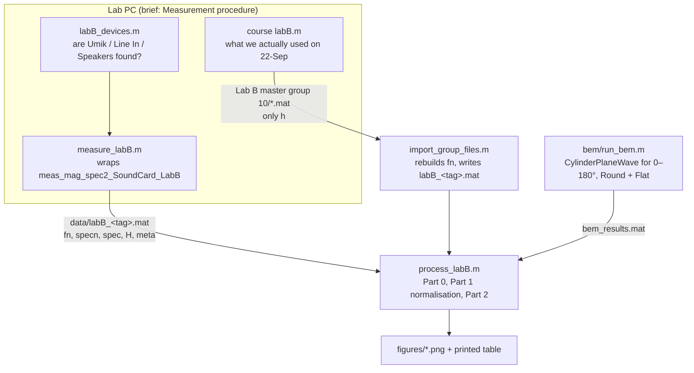

# Lab B — MATLAB guide

> [!info] What this note is
> How to run the Lab B MATLAB files, in the order of the brief [[34870_Lab_B_CylinderScattering_E2026.pdf]]. Each section below says what the brief asks, which script does it, and which lines to look at.
> **Results and interpretation:** [[Lab B - Runthrough]] · **Before the lab:** [[Lab B - Preparation]]
> **Files:** labs repo `~/DTU/5. Semester/Electroacoustics/Labs/Lab B/` (its own git repo, not the umbrella)

## The short version

At home, everything is already measured and imported. To regenerate every figure and number:

1. Start MATLAB (`matlab`) and set the current folder to `Lab B/matlab/`.
2. Open `process_labB.m` and press **Run** (F5), or type `process_labB`.
3. Figures appear and are saved to `Lab B/figures/`, and the table of numbers is printed in the Command Window.

> [!warning] Always run whole files
> Every script finds its folders with `mfilename('fullpath')`. If you copy lines into the Command Window, that is empty and the paths break. Run the file (F5 or its name), or run a `%%` section from the editor.

## How the files fit together



| File | Where it runs | Brief section |
|---|---|---|
| `matlab/course/meas_mag_spec2_SoundCard_LabB.m` + `createMultitone_w.m` + UMIK correction files | lab PC | Measurement procedure and routines |
| `matlab/labB_devices.m` | lab PC, first | (setup: "connect the UMIK before opening MATLAB") |
| `matlab/measure_labB.m` | lab PC | Part 0 + Part 1 measurements |
| `matlab/import_group_files.m` | home, once (already done) | converts what the course `labB.m` saved |
| `bem/run_bem.m` | home, once (already done) | Part 2, Simulations |
| `matlab/process_labB.m` | home, any time | Part 0 check, Part 1 normalisation, Part 2 comparison + scaling |
| `bem/explore_gap.m` | home, any time | Part 2: "use the field point to explain deviations", sweeping the mic-to-face distance |

---

## Brief: "Measurement procedure and routines"

The brief gives one command:

```matlab
[fn,specn,f,spec,ch] = meas_mag_spec2_SoundCard_LabB(f1,f2,n_oct,fres,Nav,UmikSN,IncAngle)
```

with `f1 = 50`, `f2 = 10000`, `n_oct = 24`, `fres = 1`, `Nav = 32`, `UmikSN = '708-0332'` (our UMIK) and `IncAngle = 90`. `IncAngle` is the angle of the sound on the **UMIK** (it points upwards, so the sound arrives at 90°), not the mock-up angle. It only selects which UMIK correction curve gets applied.

What comes out:

| Output | Size | Meaning |
|---|---|---|
| `fn` | 184 × 1 | the multitone frequencies, 24 per octave from 50 Hz to 10 kHz |
| `specn` | 184 × 2 | complex spectrum at those tones: column 1 = line-in (loudspeaker signal), column 2 = UMIK (corrected) |
| `f`, `spec` | full resolution, 1 Hz | the whole spectrum, including the bins *between* the tones, so noise and distortion |
| `ch` | time signals | averaged recordings |

**Our wrapper, `measure_labB(tag, UmikSN, note)`**, calls exactly that with the brief's numbers typed in (line 15), computes $H = $ `specn(:,2)./specn(:,1)`, and saves **everything** to `data/labB_<tag>.mat` immediately. It never overwrites a file: a repeat becomes `_2`, `_3`. It also plots the signal against the noise floor from `spec` and warns if the clearance is under 30 dB. That is the brief's "adjust the amplifier until the response is well over noise" as a number.

On the lab PC, in this order:

```matlab
labB_devices                              % all three devices found? none may be NaN
measure_labB('nomockup', '708-0332')      % reference, no mock-up
measure_labB('ang000',   '708-0332')      % mock-up at 0°
measure_labB('ang045',   '708-0332')      % ... and so on, 'ang015', 'ang090'
measure_labB('nomockup_end', '708-0332')  % reference again: proves nothing moved
```

> [!note] What we actually did on 22-Sep
> The group ran the course script `labB.m` (it is in `data/Lab B master group 10/`). It saves only `h = specn(:,2)./specn(:,1)`: no `fn`, no `spec`, no metadata. `import_group_files.m` fixes that: `fn` is deterministic (only the phases of the multitone are random), so it regenerates `fn` with `createMultitone_w` and the same parameters, checks that the lengths match (184 points), and writes `labB_ang000.mat` … `labB_nomockup.mat` next to the untouched originals. **It has already been run.** Run it again only if the file-to-tag mapping (the `map` table, line 20) is wrong.
> **For Labs C/D/E:** use the `measure_labX` wrappers so the raw spectra are saved.

---

## Brief Part 0: free-field check (1/r)

The brief asks for one or two extra measurements without the mock-up at different distances. The level should fall as $1/r$, i.e. $20\log_{10}(r_1/r_2)$ dB.

- **Measuring:** `measure_labB('dist140cm', …)`, `measure_labB('dist93cm', …)`. The number in the tag *is* the distance in cm; `process_labB` reads it from the file name.
- **Our files:** `labB_dist280cm.mat` (the reference, same file as `nomockup`), `labB_dist140cm.mat`, `labB_dist93cm.mat`.
- **Processing:** section 4 of `process_labB` (search for `Part 0`). It sorts by distance, divides each $H$ by the one at the largest distance, and draws the 1/r prediction as a dashed line. Output: `figures/labB_free_field_check.png`.
- **What to read off:** measured −3.66 / −9.61 dB against 1/r −3.55 / −9.57 dB above the chamber's 125 Hz cut-off.

---

## Brief Part 1: $H_{ang}$ and the normalisation

The brief's two bullets are two lines of code:

| Brief | Code |
|---|---|
| $H_{ang} = specn(:,2)\;./\;specn(:,1)$ | `H = specn(:,2)./specn(:,1)` in `measure_labB` (line 16), or `m.h` in the imported files |
| $H_{ang,norm} = H_{ang}\;./\;H_{no\_mockup}$ | `Hn(:,k) = m.H ./ ref.H;` in `process_labB`, section 1 |

`process_labB` loads the reference (`ref`, newest `labB_nomockup*`), finds every `labB_ang*.mat` (newest repeat of each), divides, and plots all angles with the BEM on top → `figures/labB_measured_vs_bem.png`. The printed table gives, per angle, the 125–200 Hz mean (should be ≈ 0 dB), the peak below 2 kHz, and the level at 1345 Hz (the BEM peak).

If `labB_nomockup_end.mat` exists, section 3b plots end-vs-start reference drift. We did not take one on 22-Sep, so that figure is skipped.

---

## Brief Part 2: Simulations (BEM)

The brief's call:

```matlab
[fr,p_centre,p_FP,p_avg] = CylinderPlaneWave(AngleS, CylEnd, see, [r_FP z_FP]);
```

- `AngleS` in **radians** (`deg*pi/180`)
- `CylEnd` = `'Round'` or `'Flat'` back end
- `see` = `'yes'` draws the mesh plots
- `[r_FP z_FP]` is optional; the default field point is 3 cm in front of the face centre
- `fr` is fixed at 50–5382 Hz in 1/12 octaves

**`bem/run_bem.m`** runs that for 0, 15, 30, 45, 60, 75, 90, 120, 150, 180° and both ends (about 13 s per call) and stores it all in `bem_results.mat` (plus a dB table in `bem_results.csv`). **Already done.** The package from `BEM_FreeField.zip` is unpacked in `bem/package/`; the function must be called from inside that folder, which `run_bem` does with `cd`.

In `process_labB`, the BEM is a struct:

```matlab
bem.fr                       % frequencies
bem.angles                   % [0 15 30 ... 180]
bem.Round.p_centre(ia, :)    % row ia = angle bem.angles(ia); also .p_FP, .p_avg
bem.Flat.p_centre(ia, :)     % the flat back end
```

The brief's "use the field point and pressure average to explain deviations" is sections 2 and 2b:
- `labB_bem_positions.png`: at 0°, centre vs 3 cm field point vs face average vs flat end
- `labB_tip_position.png`: the measured 0° curve against those. The −18 dB notch at 3.9 kHz matches the 3 cm field point, so the UMIK tip was about 2–3 cm in front of the face. The script prints the notch frequency and the quarter-wave gap $c/4f$.

**Trying another field point yourself** (e.g. 2 cm in front, for the quiz):

```matlab
cd('~/DTU/5. Semester/Electroacoustics/Labs/Lab B/bem/package')
% [r_FP z_FP]: r_FP = off-axis distance, z_FP = height above the face, both in m
% (the help text says the default is 0.015; the code actually uses [0 0.03])
[fr, pc, pfp] = CylinderPlaneWave(0, 'Round', 'no', [0 0.02]);
semilogx(fr, 20*log10(abs(pfp))); grid on
```

### Playing with the mic-to-mock-up distance: `bem/explore_gap.m`

We only measured at one gap (the UMIK tip sat about 2–3 cm in front of the face), so varying the distance happens in the BEM. The field point `[r_FP z_FP]` is in the cylinder's own coordinates: the face is at z = 0, so `z_FP` **is** the gap, at any incidence angle, and `r_FP` moves the mic off the axis.

Open `Lab B/bem/explore_gap.m`, edit the settings section and press F5:

```matlab
gaps    = [0 0.01 0.02 0.03 0.05];   % [m] mic distance from the face centre
angle   = 0;                         % [deg] mock-up angle; the measured curve at this angle is drawn on top
offaxis = 0;                         % [m] r_FP
CylEnd  = 'Round';                   % or 'Flat'
```

Each gap is one full BEM solve (~15 s). The script prints the peak below 2 kHz and the deepest dip above it for every gap. At gap 0 it uses `p_centre`, because a field point exactly on the surface is singular in the BEM and gives nonsense.

At 0° (24-Sep run):

| Gap | Peak below 2 kHz | Deepest dip above 2 kHz |
|---|---|---|
| 0 cm (face centre) | +9.9 dB at 1345 Hz | −1.0 dB |
| 1 cm | +9.7 dB at 1199 Hz | −11.8 dB at 5382 Hz |
| 2 cm | +9.3 dB at 1199 Hz | −25.0 dB at 2691 Hz |
| **3 cm** | **+8.7 dB at 1068 Hz** | **−20.8 dB at 4032 Hz** |
| 5 cm | +7.3 dB at 898 Hz | −2.7 dB at 3805 Hz |
| *measured* | *+8.6 dB at 1155 Hz* | *−17.9 dB at 3868 Hz* |

![[labB_gap_sweep.png]]

The 3 cm curve lies on top of the measurement all the way to 5 kHz. The further the mic is from the face, the lower and earlier the peak. The dips are interference between the incident wave and the wave reflected off the face, and they do not follow a simple $c/4z$ rule: the reflected wave comes from a finite disc, not an infinite wall.

---

## Brief Part 2: Scaling

The brief: scale factor = mock-up diameter / microphone diameter, and the mock-up frequency axis shifts **down** by that factor: $f_{mic} = f_{mockup} \cdot D_{mockup}/D_{mic}$.

Section 3 of `process_labB`:

```matlab
D_mockup = 0.250;                               % line 7: the nominal diameter (not taped on the day)
mics = struct('name', {'1"','1/2"','1/4"','1/8"'}, 'D', {23.77e-3, 12.7e-3, 6.35e-3, 3.175e-3});
s = D_mockup / mics(q).D;                       % scale factor
semilogx(fn * s / 1e3, ...)                     % frequency axis in kHz for the real microphone
```

This gives scale factors of about 10.5, 19.7, 39.4 and 78.7, in `figures/labB_scaled_to_microphones.png`. Change `D_mockup` if you get the real diameter; only this figure changes.

## Brief Part 2: Datasheets

No script does this, because the B&K curves exist only as pictures in the brief (pp. 6–9). Compare by eye: put `labB_scaled_to_microphones.png` next to the handbook page for the same microphone size and read the 0° and 90° curves at a few frequencies. The runthrough's quiz checklist lists what to compare.

---

## Poking at the results after a run

`process_labB` is a script, so its variables stay in the workspace:

| Variable | Contents |
|---|---|
| `fn` | 184 frequencies, Hz |
| `ang` | `[0 15 30 45 60 75 90]` |
| `Hn(:,k)` | normalised response at `ang(k)` (complex) |
| `ref` | the no-mock-up file: `ref.H`, `ref.meta` |
| `bem` | the BEM struct above |

```matlab
k = find(ang == 45);
semilogx(fn, 20*log10(abs(Hn(:,k)))); grid on       % one angle in dB
[pk, i] = max(20*log10(abs(Hn(:,k)))); fn(i)         % where it peaks
m = load('../data/labB_ang030.mat'); m.meta          % source file, time, parameters
```

## When to re-run what

| You changed … | Re-run |
|---|---|
| nothing, just want the figures | `process_labB` |
| `D_mockup` or a plot | `process_labB` |
| the mapping of raw files to tags | `import_group_files`, then `process_labB` |
| BEM angles or field point | `bem/run_bem` (~5 min for all 20 runs), then `process_labB` |
| new measurements | `measure_labB` on the lab PC, copy `data/` home, then `process_labB` |

Headless alternative from a terminal: `cd "Lab B/matlab" && matlab -batch process_labB < /dev/null`. It takes about 8 minutes on the laptop, mostly for the figure export.
