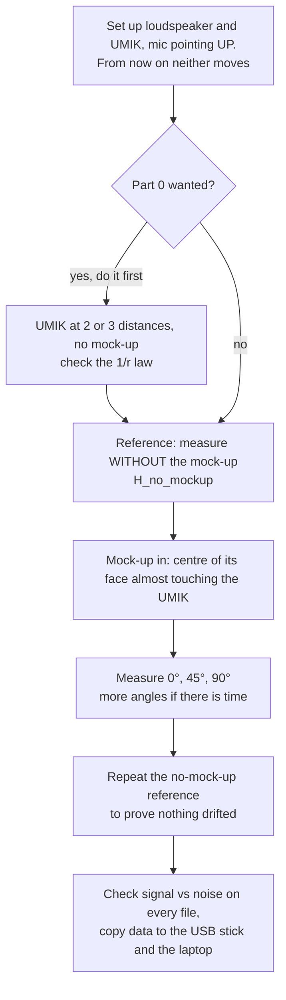

# Lab B — Microphone scattering: preparation

> [!todo] Lab day — **Tue 22 Sep 2026, 10:00–12:00** (Group 10 slot, 2 h)
> **Rooms:** building 354, small anechoic chamber **028**, control room **025**. Card access: ask Henrik Hvidberg, or take the tunnel from the 352 cellar. Arrive on time, all three group members.
> **Bring:** laptop, the folder `Lab B/matlab/` on a USB stick (the lab stick cannot leave the room, so the data comes home via the laptop), tape measure, phone for photos.
> **On the lab PC, in this order:** plug in the UMIK → start MATLAB → `cd` into the copied `matlab/` → `labB_devices` (must print three device IDs, none NaN) → `measure_labB('nomockup', '708-03xx')` with the amplifier very low → turn up until the check plot shows > 30 dB clearance → the series below → delete your data from the lab PC when done.
> **Heads-up:** the staff re-uploaded the measurement files on 21-Sep 18:12 (`34870 - Lab B (2).zip`): the only change is how the sound card is found, now an input called `Line In` and an output called `Speakers` (the internal card), instead of the USB "7.1 Surround" card. The repo copy is the new one. If `labB_devices` still cannot find a device, the names are printed and the three `contains(...)` tests are on lines 88–98 of `course/meas_mag_spec2_SoundCard_LabB.m`.
> **Later slots:** Lab C Tue 29 Sep 10:30 (room 026) · Lab D Tue 6 Oct 08:00 (026) · Lab E Tue 20 Oct 10:00 (028/025). Loudspeaker **System D**, shared with Group 4 (never book the same slot as them for D/E). All four collide with the 34840 Tuesday-morning lecture.

> [!info] Practical
> **Where:** small anechoic room, building 354 (card access may need updating with Henrik Hvidberg; or take the tunnel between the cellars of 352 and 354). **Group 10:** Louis Andrianne, Sophie Kimura, Mads. **Quiz:** Lab B + C together, individual, deadline **Mon 5 Oct 2026**.
> **Brief:** [[34870_Lab_B_CylinderScattering_E2026.pdf]] · **Theory:** [[Lecture 6 - Microphone Scattering, Metrology & Calibration]] §2–3 and §9 · **Files:** `5. Semester/Electroacoustics/Labs/Lab B/` (labs repo) · interactive version: [The Analogy Bench, Lab B](https://study.madsrudolph.dev/34870/#labB)

## The one idea

A microphone is an obstacle. When its size gets comparable to the wavelength, the sound reflects off it and the pressure on its own diaphragm is **higher than the pressure that would be there without the microphone**. That increase, as a function of frequency and angle, is the **free-field correction**. We measure it on a wooden mock-up that is a microphone scaled up about 20 times, so an ordinary small microphone can play the role of "a point on the diaphragm" and everything happens 20 times lower in frequency.

Everything depends on one number, $ka = 2\pi f a / c$ (body radius over wavelength):

| $ka$ | What the body does | Pressure at the face, 0° |
|---|---|---|
| $\ll 1$ | invisible, the wave flows around it | 0 dB at every angle |
| $\approx 1$ | starts to reflect | +3 to +5 dB |
| $\approx 3$ | first maximum | about **+10 dB** |
| $> 3$ | ripples (interference between the direct wave and the waves diffracted at the edge) | between −1 and +10 dB |

A rigid infinite wall would give exactly +6 dB (pressure doubling). The mock-up gets to +10 dB because the waves diffracted at the rim of the face arrive at the centre **in phase** with each other: the centre is the worst place. For the mock-up ($a = 125$ mm) $ka = 1$ is at **437 Hz**, for a ½″ microphone at 8.6 kHz.

## What we do in the chamber



- The result is a **ratio**: $H_{ang,norm} = H_{ang} / H_{no\,mockup}$. The loudspeaker response, the amplifier, the UMIK response and the distance all cancel, **but only if the loudspeaker and the UMIK do not move**. The mock-up is what gets rotated around the fixed microphone.
- `IncAngle = 90` in the measurement function is the incidence on the **UMIK** (it points up, sound comes from the side), it picks the UMIK's own correction file. It is not the mock-up angle and it never changes.
- The chamber is anechoic only above its cut-off, **125 Hz**. Below that, reflections come back and the ratio gets ripples. Not a mistake, a limit of the room.
- We assume a plane wave. With the loudspeaker at distance $r$ the wave is spherical; the further away, the better the assumption (and the lower the signal-to-noise ratio).

### Commands (lab PC, no internet; bring `Lab B/matlab/` on a stick)

Connect the UMIK **before** starting MATLAB. Start with the amplifier volume very low.

```matlab
labB_devices                              % first: are Umik, Line In and Speakers all found?
measure_labB('nomockup', '708-03xx')     % serial number is printed on the UMIK (0329, 0332 or 0335)
measure_labB('ang000',   '708-03xx')
measure_labB('ang045',   '708-03xx')
measure_labB('ang090',   '708-03xx')     % ang030, ang060, ang135, ang180 if there is time
measure_labB('nomockup_end', '708-03xx')
```

Each call takes about 35 s (32 periods of 1 s plus one for the transient). A bad run is simply measured again with the same tag: the wrapper never overwrites, the repeat becomes `_2`, and `process_labB` uses the **newest** repeat of every tag. The end reference is compared with the first one by `process_labB` (drift plot, should be 0 dB).

`measure_labB` calls the course routine with the parameters from the brief (`50, 10000, 24, 1, 32, SN, 90`), saves `data/labB_<tag>.mat` immediately (it never overwrites, a repeat becomes `_2`), and shows the signal against the noise floor between the tones. Want more than 30 dB of clearance; if not, turn the amplifier up a little. The raw call, if the wrapper is not available:

```matlab
[fn,specn,f,spec,ch] = meas_mag_spec2_SoundCard_LabB(50,10000,24,1,32,'708-03xx',90);
H = specn(:,2)./specn(:,1);
```

### Write down in the lab

- [ ] Mock-up **diameter** and **length** (tape). The BEM model assumes 250 mm and 855 mm with a rounded back.
- [ ] Loudspeaker to UMIK distance, height, which driver points at the mic.
- [ ] Gap between the UMIK tip and the mock-up face (the BEM can evaluate a field point in front of the face, default 3 cm).
- [ ] UMIK serial number, amplifier setting, anything that was touched between measurements.
- [ ] A photo of the setup with the protractor visible.

## What to expect (BEM, run before the lab)

![[labB_bem_prediction.png]]

The course BEM model (`CylinderPlaneWave`, plane wave, rigid cylinder with a round back) for the mock-up, from `Lab B/bem/run_bem.m`:

| Incidence | Low f (100 Hz) | 500 Hz | 1 kHz | Maximum | Note |
|---|---|---|---|---|---|
| 0° | +0.3 dB | +4.7 | +9.4 | **+9.9 dB at 1345 Hz** ($ka = 3.1$) | dip to −1.0 dB at 2.7 kHz, back to +9.9 at 4 kHz |
| 45° | +0.1 | +3.3 | +6.7 | +7.9 dB at 2.5 kHz | smoother, no deep dip |
| 90° | −0.1 | +0.7 | +1.6 | about +2 dB | grazing incidence: almost no build-up |
| 180° | 0 | +1.2 | +2.0 | +2.1 dB at 850 Hz | from behind: the "bright spot", the diffracted waves meet in phase on the axis |

> [!warning] Reading the BEM
> The model uses only 8 circumferential terms, so the last few points above about 4 kHz at oblique angles (90°, 120°) are not reliable (the 90° curve jumps to +12 dB at the very last frequency). Trust the 0° and 180° curves (axisymmetric) over the whole range and the oblique ones up to about 4 kHz.

**Where on the face you measure matters** (this is what the `p_FP` and `p_avg` outputs are for):

![[labB_bem_positions.png]]

At 0° and 4 kHz the BEM gives +9.9 dB at the exact centre, **+6.2 dB averaged over the face** (parabolic weight, like a real diaphragm) and **−21 dB at a point 3 cm in front of the face**: a standing wave forms in front of the rigid face and at 4 kHz that point is near a pressure node ($\lambda/4 = 2.1$ cm). So:

- if the UMIK tip sits a few cm in front of the face instead of flush, expect a deep notch at a few kHz that is not in the centre curve;
- a real microphone averages over its diaphragm, so its free-field correction is a little lower than our centre-point curve at high $ka$;
- flat or round back end makes no difference at 0° (less than 0.25 dB): the front decides.

## After the lab

`matlab/process_labB.m` does all of Part 2: normalise, overlay the BEM, rescale to real microphones, optional 1/r plot.

**Scaling.** Same shape, smaller size, so the same curve at a frequency higher by the ratio of diameters: $f_{mic} = f_{mockup} \cdot D_{mockup}/D_{mic}$.

| Microphone | Diameter | Scale factor (250 mm mock-up) | 0° maximum moves from 1345 Hz to |
|---|---|---|---|
| 1″ (B&K 4144/4145) | 23.77 mm | 10.5 | 14 kHz |
| ½″ | 12.7 mm | 19.7 | 26 kHz |
| ¼″ | 6.35 mm | 39.4 | 53 kHz |
| ⅛″ | 3.175 mm | 78.7 | 106 kHz |

The B&K free-field correction of the 1″ type 4145 in the brief peaks at about +10 dB around 12–15 kHz at 0°: exactly the scaled BEM curve. Use the diameter **measured with the tape**, not 250 mm, in `process_labB.m`.

> [!question] Things the quiz is likely to ask (prepare while it is fresh)
> - Why must the loudspeaker and the measurement microphone stay fixed? (Ratio, everything common cancels.)
> - Why does the ratio go to 0 dB at low frequency and what sets where it starts to rise? ($ka$.)
> - Why more than +6 dB? (Edge diffraction adding in phase at the centre.)
> - Why does the 90° curve stay near 0 dB? (Grazing incidence, the face does not block the wave.)
> - Differences between measurement and BEM: spherical instead of plane wave, the UMIK is not a point and is not exactly at the centre or flush, the stand and the UMIK body scatter too, room below 125 Hz, angle read off a paper protractor, wood is not perfectly rigid, temperature (c) shifts the frequency axis.
> - Differences to the datasheet curves: protection grid, the real diaphragm averages the pressure, the real microphone body is not a plain cylinder.
