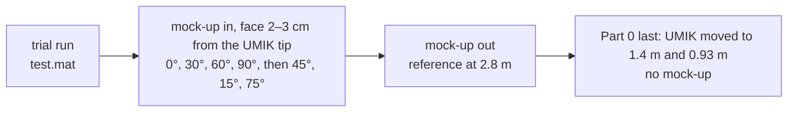

# Lab B — Microphone scattering: full runthrough

> [!info] Lab Info
> **Measured:** Tue 22 Sep 2026, Group 10 (Louis Andrianne, Sophie Kimura, Mads), building 354, small anechoic room 028 + control room 025 · **Brief:** [[34870_Lab_B_CylinderScattering_E2026.pdf]] · **Preparation note:** [[Lab B - Preparation]] (BEM prediction, procedure, checklist)
> **Quiz:** Lab B + C together, individual, in DTU Learn, ⏰ **deadline Mon 5 Oct 2026**
> **Theory:** [[Lecture 6 - Microphone Scattering, Metrology & Calibration]] §2–3 and §9 (free-field correction, $ka$, diffraction at the rim)
> **Files:** labs repo `5. Semester/Electroacoustics/Labs/Lab B/` — raw data `data/Lab B master group 10/`, pipeline files `data/labB_*.mat`, log `data/labB_log.md`, `matlab/import_group_files.m` → `matlab/process_labB.m`, BEM `bem/`, figures `figures/`, report `report/LabB_report.tex`
> **Interactive version:** [The Analogy Bench, Lab B](https://study.madsrudolph.dev/34870/#labB) — the bench now overlays the measured curves on the BEM

> [!abstract] The one idea, and what the day showed
> A microphone is an obstacle. Once its size is comparable to the wavelength the sound reflects off it and the pressure on its own face is **higher** than the pressure that would be there without it; the ratio is the **free-field correction**. We measured it on a 250 mm wooden cylinder, a microphone scaled up about 20 times, by dividing the transfer function with the mock-up in front of a small UMIK microphone by the transfer function without it. **Result:** below 200 Hz nothing (0 dB at every angle), head-on the pressure climbs to **+8.6 dB at 1.16 kHz** and grazing incidence stays within +2 dB, exactly the ordering and, up to 2 kHz, within about 1 dB of the level the course BEM predicts. The one systematic deviation is a **−18 dB notch at 3.9 kHz at 0°**, which is the fingerprint of the UMIK tip sitting 2–3 cm in front of the face instead of flush: the BEM's own "3 cm in front" curve reproduces the whole measured 0° curve, notch included, within 1.5 dB up to 3.5 kHz.

---

## What happened in the chamber

| Setting | Value | Comment |
|---|---|---|
| UMIK | 708-0332, incidence correction 90° | it points up, sound comes from the side; this is the UMIK's own correction, never the mock-up angle |
| Loudspeaker front → UMIK | **2.8 m** | the reference file on the lab PC is called `no_mockup_1.8m`: a typo, the 1/r check settles it (below) |
| Mock-up | Ø 250 mm, L 855 mm nominal, round back | **not measured with the tape** — the low-frequency rise matches the BEM for 250 mm within 1 dB, so the nominal value is used throughout |
| UMIK tip → face | **2–3 cm**, not flush | this is what the 3.9 kHz notch says too |
| Multitone | 50 Hz – 10 kHz, 24 tones/octave, 1 Hz resolution, 32 averages | 184 tones; ≈ 35 s per run |
| Amplifier | not changed during the session | reference, angle series and Part 0 at the same level |
| Temperature | not taken | $c = 344$ m/s assumed; 1 % in $c$ is 1 % on the frequency axis |
| Lab-PC clock | ahead of real time | file stamps 12:31–13:11 for a slot that ended at 12:00 |

Two things went differently from the plan, both worth remembering for Lab D/E:

- **The course script `labB.m` was used instead of `measure_labB`.** Each saved file holds only `h = specn(:,2)./specn(:,1)` — no frequency vector, no raw spectra (so no signal-to-noise plot afterwards), no metadata. `import_group_files.m` rebuilds the 184-point frequency axis from `createMultitone_w` (deterministic: only the phases are random) and writes `labB_<tag>.mat` with `fn`, `H` and a `meta` struct; the originals are never touched.
- **No reference was taken *before* the series**, only after, so there is no start/end drift plot. `test.mat` (before the series) matches no reference and is not used.

---

## Part 0 — Is it a free field? (1/r check)

![[labB_free_field_check.png]]

> [!success] Answer, Part 0
> | UMIK distance | 1/r predicts | measured, mean 125–200 Hz |
> |---|---|---|
> | 1.4 m vs 0.93 m | −3.55 dB | **−3.66 dB** |
> | 2.8 m vs 0.93 m | −9.57 dB | **−9.61 dB** |
>
> Between the chamber cut-off and about 400 Hz the level follows $1/r$ to 0.1 dB: the room is anechoic and the loudspeaker radiates like a point source there. Above 400 Hz the 1.4 m curve ripples by ±3–4 dB (interference between the direct sound and something near the microphone: the stand, the floor net, the loudspeaker cabinet) and above 4 kHz both curves wander by several dB (the loudspeaker is directional and a 1 cm placement error is already 0.1 λ). Below 100 Hz the 2.8 m curve drops to −16 dB: below its cut-off the room is a room.
>
> This is also how the **2.8 m** got settled: with 1.8 m the second row would have to read −5.7 dB, and it reads −9.6.

> [!tip] Why Part 0 last was the right order
> The brief suggests doing the distance check first. Doing it last meant the microphone never moved between the reference and the seven angles, which is the one thing the normalisation cannot survive. The price: no drift check, because the reference was measured only once.

---

## Part 1 — The measurement: seven angles against the BEM

$$H_{norm}(\theta) = \frac{H_\theta}{H_{no\ mock\text{-}up}}, \qquad \Delta L_\theta = 20\log_{10}|H_{norm}(\theta)|$$

![[labB_measured_vs_bem.png]]

> [!success] Answer, Part 1
> | Angle | 125–200 Hz | Peak below 2 kHz | At 1345 Hz (BEM peak) | BEM centre-of-face |
> |---|---|---|---|---|
> | 0° | +0.8 dB | **+8.6 dB at 1155 Hz** | +8.1 | +9.9 dB at 1345 Hz |
> | 15° | +0.8 | +8.4 at 972 | +7.7 | +9.4 |
> | 30° | +0.7 | +7.2 at 917 | +5.8 | +8.3 |
> | 45° | +0.6 | +6.5 at 891 | +5.0 | +6.7 dB at 1068 Hz |
> | 60° | +0.4 | +5.4 at 917 | +3.8 | +5.0 |
> | 75° | +0.2 | +3.6 at 1995 | +1.6 | +3.0 |
> | 90° | 0.0 | +2.1 at 891 | +0.3 | +1.7 dB at 673 Hz |
>
> **What is right.** Every curve is 0 dB below 200 Hz ($ka < 0.5$): the body is invisible. The rise starts around $ka \approx 0.5$ (200 Hz), and from there to 2 kHz the measured curves sit on top of the BEM curves for the same angles within about 1 dB, in the right order, 0° highest and 90° lowest. Head-on the face is a partial wall: more than the +6 dB of pressure doubling because the wave diffracted at the rim of the face reaches the centre from all around the edge with the same delay. At 90° the face does not block the wave and the build-up is 2 dB at most.
>
> **What is not.** The 0° maximum comes out 1.3 dB lower and 15 % earlier than the BEM's face-centre value, all the oblique curves fall away above 2 kHz, and there are deep notches: −18 dB at 3.9 kHz (0°), −10 dB at 2.5 kHz (15°), −10 dB at 3.4 kHz (30°), −16 dB at 3.9 kHz (45°), −19 dB at 6 kHz (60°). None of that is in the centre-of-face BEM. All of it is in the next figure.

### Where the UMIK tip really was

![[labB_tip_position.png]]

> [!success] The notch is the tip gap
> The BEM can also evaluate the pressure at a **field point 3 cm in front of the face** (`p_FP`). At 0° that curve is the measured curve: same peak (+8.7 dB at 1.1–1.2 kHz, not +9.9 at 1.35 kHz), same dip to −1.5 dB at 2.5 kHz, same **notch at 4.0 kHz (−21 dB) against our −18 dB at 3.9 kHz**, same return to +9 dB at 5 kHz. Maximum difference 200 Hz – 3.5 kHz: **1.5 dB**.
>
> The physics: a rigid face reflects the wave back on itself, so a standing wave forms in front of it. A quarter wavelength in front the incident and reflected waves cancel. $\lambda/4 = 2.2$ cm at 3.9 kHz, and Mads' recollection of the gap is 2–3 cm — the diffraction at the rim shifts the exact node a little, which is why the BEM puts it at 4.0 kHz for 3 cm. For the oblique angles the path difference shrinks with $\cos\theta$, so the notch should move up in frequency as the angle grows, and the field-point BEM does put the 15° notch at 2.7 kHz, the 30° one at 3.4 kHz and the 45° one at 4.3 kHz (measured 2.5, 3.35 and 3.9 kHz). Their depths do not agree, but the BEM uses only 8 circumferential terms and its oblique curves are not trustworthy above about 4 kHz.
>
> **So the measurement is a good free-field correction up to about 2 kHz ($ka \approx 4.6$) at every angle, and a good measurement of "2–3 cm in front of a scattering body" above that.** Next time: tip flush with the face, and a start *and* end reference.

> [!question] Hints if you want to derive the notch yourself
> Write the pressure a distance $d$ in front of a rigid wall at normal incidence as the sum of the incident wave and its reflection. What is the total pressure at $d = 0$? Where is the first zero? Now tilt the incidence by $\theta$: which component of the wavenumber sees the wall?

---

## Part 2 — What the BEM says about *where* on the face you measure

![[labB_bem_positions.png]]

Three ways to read "the pressure at the face" of the same body at 0°, all from `CylinderPlaneWave`:

| Curve | Peak | At 4 kHz | Represents |
|---|---|---|---|
| face centre (`p_centre`) | +9.9 dB at 1345 Hz | +9.9 dB | a point microphone flush with the face — what the lab *intends* |
| parabolic average over the face (`p_avg`) | +7.8 dB | +6.2 dB | what a real diaphragm of that diameter feels |
| 3 cm in front (`p_FP`) | +8.7 dB at ~1.15 kHz | −21 dB | what we *actually* measured |
| face centre, flat back end | +9.9 dB | +9.9 dB | the back does not matter head-on (< 0.25 dB) |

The diaphragm-averaged curve is why a datasheet free-field correction (B&K 4145 in the brief, about +10 dB at 12–15 kHz) sits a little below a centre-point calculation at high $ka$, and why it is smoother: the ripples above the first maximum average out across the face.

---

## Part 2 (continued) — Scaling to real microphones

Same shape, smaller body, same $ka$: the whole curve moves up in frequency by $s = D_{mockup}/D_{mic}$ and the dB values stay put.

![[labB_scaled_to_microphones.png]]

> [!success] Answer, scaling (nominal $D_{mockup}$ = 250 mm)
> | Microphone | Diameter | $s$ | Measured 0° maximum (+8.6 dB at 1155 Hz) lands at | The notch (3.9 kHz) lands at |
> |---|---|---|---|---|
> | 1″ (B&K 4144/4145) | 23.77 mm | 10.5 | **12.1 kHz** | 41 kHz |
> | ½″ | 12.7 mm | 19.7 | 22.7 kHz | 76 kHz |
> | ¼″ | 6.35 mm | 39.4 | 45 kHz | 152 kHz |
> | ⅛″ | 3.175 mm | 78.7 | 91 kHz | 305 kHz |
>
> The 1″ row is the one to check against the brief: the B&K 4145 free-field correction peaks at about +10 dB between 12 and 15 kHz at 0° and drops towards 0 dB at 90°. Our scaled measurement puts +8.6 dB at 12 kHz — right place, slightly low, and the reason is the tip gap again (the BEM centre value would be +9.9 dB at 14 kHz). The scale factor carries the diameter uncertainty one to one: not having measured the mock-up with the tape is a few per cent on every frequency in this table.

---

## Differences: measurement vs BEM vs datasheet (for the quiz)

| Effect | Size here | Direction |
|---|---|---|
| UMIK tip 2–3 cm in front of the face | dominant above 2 kHz; −1.3 dB and −15 % on the 0° maximum | the field-point BEM reproduces it |
| Spherical wave from 2.8 m instead of a plane wave | small: the 1/r check is clean and the low-frequency rise matches the BEM | the 855 mm body spans 2.8–3.7 m from the source, so the incident phase is not exactly planar along it |
| Angle read from a paper protractor | ±2–3°; the curves are 0.5–1 dB apart per 15° near the peak | random |
| Mock-up diameter not measured | few % on the frequency axis, nothing on the dB axis | systematic |
| UMIK body and stand scatter too | ripples of ±3 dB above 400 Hz already in the no-mock-up 1/r curves | partly cancels in the ratio, since both runs contain it |
| Room below 125 Hz | −16 dB at 60 Hz in the 2.8 m curve; ripples below 100 Hz in every ratio | ignore below 125 Hz |
| Temperature (c) | 1 % per 3 °C on the frequency axis | not measured |
| Real microphone vs mock-up | protection grid, diaphragm averaging (+7.8 instead of +9.9 dB), body not a plain cylinder | datasheet sits below and smoother than a centre-point curve |

---

## Quiz checklist (due Mon 5 Oct, with Lab C)

- [ ] Part 0: the 1/r figure with the two dashed predictions; say −3.66 vs −3.55 dB and −9.61 vs −9.57 dB between 125 and 400 Hz; name the ripples above 400 Hz and the room below 100 Hz.
- [ ] Part 1: the measured-vs-BEM figure, 50 Hz – 10 kHz, −15 … +15 dB, angles distinguishable; the table of low-frequency level / peak / value at 1345 Hz per angle.
- [ ] Explain 0 dB below $ka \approx 0.5$, +8.6 dB at 0° from in-phase rim diffraction, 2 dB at 90° from grazing incidence.
- [ ] The tip-position figure and one paragraph: notch at 3.9 kHz = λ/4 in front of a rigid face = 2.2 cm, BEM field point at 3 cm reproduces the curve to 1.5 dB.
- [ ] Part 2: centre vs average vs field point vs flat back, with the +9.9 / +6.2 / −21 dB numbers at 4 kHz.
- [ ] Scaling table with the diameter used (250 mm nominal, state that it was not measured) and the 1″ comparison with the B&K 4145 curve in the brief.
- [ ] Limitations, ranked: tip gap, no start reference, diameter not taped, spherical wave, protractor, temperature.
