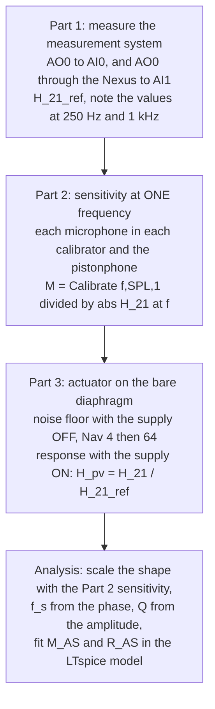

# Lab C — Microphone calibration: preparation

> [!info] Practical
> **Where:** room 026, building 354. **Group 10:** Louis Andrianne, Sophie Kimura, Mads. **Quiz:** Lab B + C together, individual, deadline **Mon 5 Oct 2026**.
> **Brief:** [[34870_Lab_C_ActuatorCalibration_E2026.pdf]] · **Theory:** [[Lecture 5 - Microphone Directionality & Condenser Microphones]] §4 (the condenser model), [[Lecture 6 - Microphone Scattering, Metrology & Calibration]] §4–8 (metrology, GUM, calibrators, $f_s$ and $Q$) · **Files:** `5. Semester/Electroacoustics/Labs/Lab C/` (labs repo) · interactive: [The Analogy Bench, Lab C](https://study.madsrudolph.dev/34870/#labC)
> **Microphones:** B&K 4133 (S/N 591628) and B&K 4134 (S/N 1534527), both ½″, nominal 12.5 mV/Pa, 19 pF.

## The one idea

A calibration has two halves. A **calibrator or pistonphone** gives one trustworthy number: the sensitivity in mV/Pa at a single frequency (a known pressure in a closed cavity). An **electrostatic actuator** gives the *shape* of the response over the whole band (an electric field pulls on the diaphragm, no sound, so no scattering and no room), but its absolute level means nothing. Glue them together: shape from the actuator, level from the calibrator. Then read the diaphragm resonance $f_s$ and its $Q$ off the curve and you know what is behind the diaphragm.

## The four parts



### Things that destroy equipment (read twice)

- **Never touch a diaphragm.** Unscrew the protection grid carefully; lower the actuator onto the rim one leg first, then level. The red wire can pull it off when you let go.
- **GRAS 14AA actuator supply ON only while measuring** (800 V DC on the actuator). OFF for every manipulation.
- **The Nexus must already be ON before the microphone cable goes in**, and the cable comes **out of the Nexus every time you change capsule**. If the Nexus powers up with a preamplifier attached it reads the preamp's data and changes its own settings.
- LEMO plugs: pull the sleeve back, they fit one way only.

### Nexus settings (channel 1)

Output 10 mV/Pa, input sensitivity 10 mV/Pa (so the gain $G_{Nex} = 1$), high-pass 0.1 Hz, low-pass 100 kHz, **polarization 200 V**. Check them again before Part 2.

### Commands

```matlab
measure_labC('ref', 'system')                                % Part 1 (fb = 1); prints H_21_250 and H_21_1000
calibrate_labC('4133', '42AG #1', 1000, 94.0, H_21_1000)     % Part 2; f and SPL from THAT device's sticker
calibrate_labC('4133', 'pistonphone', 250, 124.0, H_21_250)
measure_labC('noise_4133', 'mic')                            % Part 3b, supply OFF (fb = 200)
measure_labC('noise_4133_N64', 'mic', 64)
measure_labC('resp_4133', 'mic')                             % Part 3c, supply ON, door closed, everybody quiet
measure_labC('resp_4134', 'mic')
```

The wrappers call the course functions with the brief's parameters (`f1=20, f2=60000, Amax=1, n_oct=6, Nav=4, fres=1`, `fb=1` for the system, `fb=200` with a microphone), save `data/labC_<tag>.mat` immediately and log every calibration to `data/labC_calibration_log.csv`. Raw calls if needed: `[fn,specn,f,spec]=meas_mag_spec2(20,60000,1,6,4,1,1); H_21_ref=specn(:,2)./specn(:,1);` and `M=Calibrate(1000,94,1)/abs(H_21_1000)`.

> [!question] Ask the TA
> The NI card runs at 96 kHz in `meas_mag_spec2`, so the Nyquist frequency is 48 kHz, but the brief says `f2 = 60000`. Tones above 48 kHz cannot be measured; check what the routine does with them and ignore points above about 40 kHz (`process_labC` fits up to 40 kHz).

### Write down in the lab

- [ ] For every calibrator and the pistonphone: **serial number, frequency and SPL from its sticker/certificate** (they differ from unit to unit: 94.0x dB, 1000 Hz; the pistonphone is about 124 dB at 250 Hz and needs a barometric pressure correction, ask).
- [ ] `H_21_250`, `H_21_1000`.
- [ ] Each sensitivity result, and do each microphone–device pair **2–3 times, taking the microphone out in between**: that is the only way to say anything about repeatability.
- [ ] Temperature and static pressure in the room if there is a barometer.
- [ ] Which capsule was on the preamplifier for which file.

## Part 2: what the numbers mean (metrology vocabulary from lecture 6)

| Word | In this lab |
|---|---|
| **True value** | the sensitivity the microphone really has; never known, only estimated |
| **Repeatability** | same microphone, same calibrator, same people, a few minutes apart: the spread of those results (expect about 0.1–0.3 %, a few hundredths of a dB) |
| **Reproducibility** | conditions changed: another calibrator, the pistonphone, another group, another day. Spread is larger (each device has its own calibration error) |
| **Uncertainty** | what you state with the result: combine the calibrator's certificate uncertainty (typically ±0.2 dB for a class 1 calibrator, smaller for a pistonphone), the repeatability, the H_21 correction, the Nexus gain. 0.1 dB is 1.2 % |
| **Traceability** | the calibrator was itself calibrated against a laboratory standard microphone, which was calibrated by reciprocity: an unbroken chain to the SI |

Nominal sensitivity of both types is **12.5 mV/Pa = −38.1 dB re 1 V/Pa**; an individual capsule is typically within ±1.5 dB of that. $p_{rms}$ at 94 dB is 1.002 Pa, at 114 dB 10.02 Pa, at 124 dB 31.7 Pa.

## Part 3: what to expect

**Noise floor.** The averaging is synchronous with the multitone signal: the signal stays, uncorrelated noise drops by $\sqrt{N}$ in amplitude. Going from Nav = 4 to 64 should lower the floor by $10\log(64/4) = 12$ dB. With the supply on, the response should sit far above it except at the lowest frequencies (that is why `fb = 200` boosts the tones below 200 Hz) and mains hum at 50 Hz and its harmonics.

**Which microphone is which.** The actuator gives the **pressure response** (no sound field, no scattering):

- a **pressure-field** microphone (for couplers and cavities) is built to be flat in exactly this measurement: resonance damped to $Q \approx 0.7$–$1$, flat up to about 20 kHz;
- a **free-field** microphone is built so that its *free-field* response at 0° is flat. In a free field the body adds up to about +10 dB near 20–25 kHz for a ½″ capsule (that is Lab B), so its pressure response must **droop by the same amount**: heavily damped, $Q \approx 0.3$–$0.5$, already −3 dB around 8–10 kHz.

So the curve that falls early belongs to the free-field type (**4133**) and the flat one to the pressure type (**4134**). The difference between the two curves is roughly the free-field correction of Lab B.

**Which sensitivity value to scale with?** The one measured at a frequency where the response is still flat and the device is most accurate: the 250 Hz pistonphone value (or 1 kHz for the pressure type, where it is still flat; the free-field type has already lost a few tenths of a dB at 1 kHz). Scale the actuator curve so that its value *at the calibration frequency* equals that sensitivity.

### $f_s$ and $Q$ (lecture 6B, slide 20)

1. $f_s$ is where the **phase has dropped 90°** from its low/mid-frequency value.
2. $Q = |H(f_s)| / |H(f \ll f_s)|$ as a **linear** ratio; a response that is down at resonance has $Q < 1$ and a negative $20\log Q$.

> [!warning] A trap in the slide procedure
> For a heavily damped capsule the phase has already fallen several degrees at 1 kHz. If "mid-band" is taken around 1 kHz, the −90° point lands about 2 % too high in frequency. Reference the phase to 60–300 Hz instead. `process_labC.m` does that **and** fits $G/(1-x^2+jx/Q)$ to the complex data, which needs no phase reference at all; it prints both. Tested on synthetic data: the fit returns the true $f_s$ and $Q$ exactly.

### The LTspice model (`Lab C/ltspice/LabC_CondenserMics.asc`)

Same three-domain circuit as Problem 5.2, without the scattering block (no sound field with an actuator):

- **acoustic** (impedance analogy): the diaphragm's volume velocity $S_D u_D$ is injected into the series branch $M_{A1}$ – $R_{AS}$ – $M_{AS}$ – $C_{AB}$ – 1 Pa source (the actuator);
- **mechanical** (mobility analogy): node $u_D$ with $M_{MD}$ as a capacitor and $C_{MD}$ as an inductor to ground ($R_{MD} = 0$), a G source draws the force $S_D p$;
- **electrical**: Norton source $(E\,C_{E0}/x_0)\,u_D$ into $C_{E0} \parallel R_L$; `V(out)` is the output per pascal.

Given data: $x_0 = 20.77$ µm, $E = 200$ V, effective diameter 8.95 mm, $M_{MD} = 1.5$ mg, $C_{MD} = 0.02$ mm/N, $R_{MD} = 0$, back volume 126.4 mm³. From those: $S_D = 62.9$ mm², $C_{AB} = 9.05\cdot10^{-13}$ m⁵/N, $C_{MT} = 18.4$ µm/N (the back cavity stiffens the diaphragm by 9 %), $C_{E0} = 26.8$ pF, low-frequency sensitivity $E S_D C_{MT}/x_0 = $ **11.1 mV/Pa** (below the nominal 12.5, as the brief's appendix warns; accept it). With no backplate mass at all the resonance would be at 28.4 kHz, so a measured $f_s$ near 20 kHz means the air in the backplate holes roughly doubles the moving mass.

The backplate follows from the two measured numbers:

$$M_{MT} = \frac{1}{(2\pi f_s)^2 C_{MT}}, \qquad M_{AS} = \frac{M_{MT}-M_{MD}}{S_D^2} - M_{A1}, \qquad R_{AS} = \frac{1}{S_D^2}\,\frac{1}{Q}\sqrt{\frac{M_{MT}}{C_{MT}}}$$

On the sheet you only edit `.param fs33=… Q33=…` and `.param fs34=… Q34=…`; LTspice evaluates the three formulas itself. Example: $f_s = 20$ kHz, $Q = 0.45$ gives $M_{AS} = 440$ kg/m⁴ and $R_{AS} = 2.4\cdot10^{8}$ Pa·s/m³; $Q = 0.95$ gives $1.15\cdot10^{8}$. `gen_labC_ltspice.py --verify` runs LTspice headless and confirms the circuit reproduces $M/(1-x^2+jx/Q)$ to 7 digits, phase −90° at $f_s$, $|H(f_s)|/|H(\text{low})| = Q$. A 180° offset against the measurement is only the ground convention.

> [!question] Things the quiz is likely to ask
> - Why measure H_21_ref first, and why divide by it? (DAQ + Nexus are not flat in magnitude or phase, especially toward 50 kHz; the ratio removes them.)
> - Why can the actuator not give the absolute sensitivity? (The force depends on the actuator–diaphragm distance and the voltages, which are not known accurately; it is only proportional to pressure.)
> - Which microphone is the free-field type and how do you know?
> - Which single-frequency value do you use to scale, and why?
> - Spread between calibrators vs spread between repeats: repeatability or reproducibility? Which is the "true value"? (None; state a mean with an uncertainty.)
> - Where does the damping physically sit? (Lecture 5 slide 24: mostly squeeze-film damping in the thin gap, although the textbook model puts $R_{AS}$ in the backplate holes.)
> - Why does the model give 11.1 and not 12.5 mV/Pa? (Effective capacitor area is smaller than the diaphragm area; the brief's values are approximations.)
