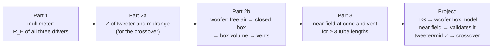
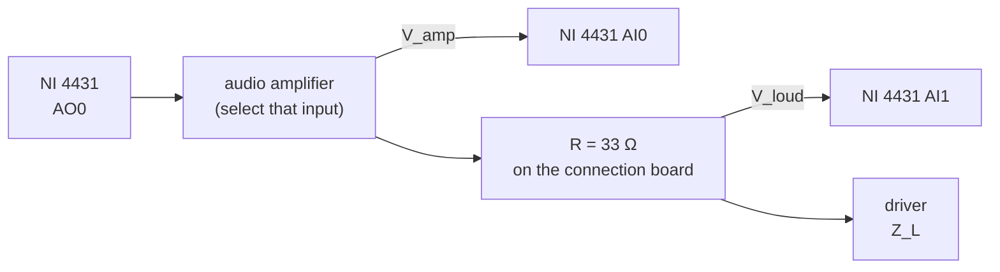

# Lab D: loudspeaker impedance and near field (preparation)

> [!info] Practical
> **When:** **Tue 6 Oct 2026, 08:00–10:00** (2 h, Group 10). **Where:** room 026, building 354. **Group 10:** Louis Andrianne, Sophie Kimura, Mads.
> **Loudspeaker:** **System D**, shared with Group 4. Use the same system for Lab E and the project.
> **Quiz:** Lab D and Lab E together, individual, deadline **Mon 26 Oct 2026**.
> **Brief:** [[34870_Lab_D_Loudspeakers1_E2026.pdf]]
> **Theory:** [[Lecture 7 - Moving Coil Loudspeakers]] §8 (T-S from the impedance curve) and §12–13 (near field); [[Lecture 8 - Loudspeaker Enclosures]] §6 ($V_{AS}$ from a closed box), §8–9 (vented box) and §12 (vent tube).
> **Files:** `5. Semester/Electroacoustics/Labs/Lab D/` in the labs repo.
> **Interactive:** [The Analogy Bench, Lab D](https://study.madsrudolph.dev/34870/#labD)
> It clashes with the 34840 Tuesday lecture (8–12).

## The one idea

The loudspeaker is measured **through its own electrical impedance**. The cone's mechanical resonance shows up as a peak in $|Z_E|$, because near $f_S$ the cone moves the most and the back-EMF $Bl\,u$ fights the current the hardest. From that one curve you read $f_S$, $Q_{MS}$, $Q_{ES}$ and $Q_{TS}$.

Change the air behind the cone and the peak moves. You get the remaining numbers from how it moves:

| Behind the cone | What the impedance shows | What you get from it |
|---|---|---|
| **Free air** (back cover off) | one peak at $f_S$ | $f_S$, $Q_{MS}$, $Q_{ES}$, $Q_{TS}$ |
| **Closed box** (cover on, vents plugged) | one peak, higher: $f_C = f_S\sqrt{1+\alpha}$ | $\alpha$, then $V_{AS} = V_B\,[(f_C/f_S)^2-1]$ |
| **Vented box** (vent open) | **two** peaks, with a dip between them at $f_B$ | the vent tuning $f_B$, against the Helmholtz formula |

Part 3 swaps the impedance for a **microphone right at the cone and at the vent** (the near field). That gives the acoustic version of the same story: at $f_B$ the cone stands almost still (notch) and the vent does the radiating (peak).



---

## Tonight (10 minutes)

- [ ] **Put `Lab D/matlab/` on a USB stick**, or anywhere the lab PC can reach. It holds `measure_labD.m`, `analyse_labD.m`, `labD_dims.m`, `ts_from_Z.m`, `fb_from_Z.m` and the course routines in `course/`. `test_labD` runs the whole analysis on synthetic data, which is a quick way to check the copy works.
- [ ] Bring a **tape measure or ruler** and **calipers** if you have them. You need the box's inside dimensions, the vent radius and length, the cone diameter and the room size.
- [ ] Re-read the three formulas in "Numbers to know by heart" below.
- [ ] Agree roles with Louis and Sophie: one person on the PC, one on the speaker and microphone, one writing everything down.

> [!warning] Lessons from Labs B and C
> - **Lab B:** the course script was run instead of the wrapper, so only `h` was saved, and the mock-up size and temperature were never written down.
> - **Lab C:** two numbers were typed in dB instead of linear, which put the sensitivities out by a factor of 277.
> - So this time: **use `measure_labD` for every measurement**, since it saves everything the moment it is taken. Put the hand-measured numbers straight into `labD_dims.m` on the lab PC and run `analyse_labD` *before you leave*.

---

## The setup



The NI inputs are **grounded**, so you can't measure the voltage across R directly. You measure $V_{amp}$ and $V_{loud}$, and R and Z form a voltage divider:

$$\frac{V_{loud}}{V_{amp}} = \frac{Z_L}{R+Z_L} \;\Rightarrow\; \boxed{Z_L = R\,\frac{V_{loud}/V_{amp}}{1 - V_{loud}/V_{amp}}}$$

That is the brief's formula. At low frequency $Z_L \to R_E$, which is your check that the wiring is right.

Course routine: `[fn,specn,f,spec,ch] = meas_mag_spec2_LabD(f1,f2,n_oct,fres,Nav)`. `specn(:,1)` is AI0 and `specn(:,2)` is AI1. `measure_labD` calls it with the brief's numbers ($n_{oct}$ = 48, $f_{res}$ = 0.125 Hz, so each period is 8 s) and computes $Z$ (or $H$ for the near field). It then saves to `data/labD_<tag>.mat`, never overwriting an older file, and plots the result.

> [!tip] Signal level
> Aim for **about 0.1 V rms on the loudspeaker** (AI1). `measure_labD` prints both rms values.
> - Too low: the curve gets noisy (brief, Appendix A: 0.005 V is a mess).
> - Too high: the driver goes nonlinear (0.7 V bends the peak).
> - The sound will be quiet because of the 33 Ω resistor. That is expected.
> - If MATLAB complains about `Dev4`, run `daq.getDevices` and change the device name in the two `addAnalog…Channel` lines of `course/meas_mag_spec2_LabD.m`.

---

## The two hours

```mermaid
gantt
    dateFormat HH:mm
    axisFormat %H:%M
    section Part 1–2a
    Wiring + R_E of 3 drivers + resistor     :a1, 08:00, 12m
    Tweeter + midrange impedance           :a2, after a1, 15m
    section Part 2b
    Woofer free air (cover off)            :b1, after a2, 12m
    Closed box + measure the box           :b2, after b1, 15m
    Vents: 3 lengths                       :b3, after b2, 20m
    section Part 3
    Near field cone + vent, 3 lengths      :c1, after b3, 30m
    analyse_labD + refill box + tidy       :c2, after c1, 10m
```



That is tight. **Priority order if time runs out:** tweeter and midrange Z (the crossover needs them) → woofer free air and closed box (T-S + $V_{AS}$) → one vent length in the impedance and near field → the other lengths.

### Part 1: DC resistance (multimeter)

1. Short the probes together and note the lead resistance; subtract it from every reading.
2. Measure $R_E$ for the **woofer, midrange and tweeter**.
3. Measure **every 33 Ω resistor** you are given. They are 5 % parts (code J), so 31.4–34.7 Ω.
4. Pass the **measured** resistor value to `measure_labD(..., 'R', 33.2)`. The extra resistors are for the optional tolerance check in the brief.

> [!danger] Never touch the tweeter dome
> Even a light touch can dent it. Handle the boxes by their sides.
> Keep the **mid/tweeter box's vent closed** all the time; only the woofer box's vents are part of the lab.

### Part 2a: tweeter and midrange impedance (for the crossover)

```matlab
measure_labD('tweeter',  'tweeter',  'R', 33.2)   % 100 Hz – 24 kHz
measure_labD('midrange', 'midrange', 'R', 33.2)   %  20 Hz – 20 kHz
```

**What you should see:**
- **Low end:** $|Z|$ sits flat on $R_E$.
- **Resonance:** one peak. For the tweeter it is typically around 0.5–1.5 kHz and fairly low, if the tweeter has ferrofluid damping. For the midrange it is in the tens to low hundreds of Hz, and it is the **closed-box** resonance, because the mid sits in its own sealed box.
- **Top end:** $|Z|$ rises from the voice-coil inductance (lossy $L_E$, Lecture 7 §11), and the phase goes positive.

You need the **complex** $Z$ (magnitude *and* phase) for the passive crossover. `measure_labD` saves it.

### Part 2b: woofer T-S parameters

**2b1, free air.** Take the back cover off and **take the filling out** (keep it to put back). Hold or stand the box so the woofer faces open room, not a wall or the table.
```matlab
measure_labD('woofer_free', 'woofer', 'R', 33.2)   % 1 Hz – 10 kHz, ~16 s
```
You should see one tall peak at $f_S$. Expect tens of Hz and tens of ohms for $Z_{MAX}$.

**2b2, closed box.** Put the cover back on and plug the vents with the two vent plugs. Leave it **without filling**, so $V_{AB} = V_B$.
```matlab
measure_labD('woofer_closed', 'woofer', 'R', 33.2)
```
The peak moves **up** to $f_C$. Quick check: $f_C/f_S$ should be about equal to $Q_{TC}/Q_{TS}$, because both equal $\sqrt{1+\alpha}$. `analyse_labD` prints both.

**2b3, box volume.** Measure the **inside** width, height and depth and type them into `labD_dims.m`. The brief says to ignore the volume of the vents and the driver.

**2b4, vents.** Open the vent(s) and measure at **at least three tube lengths**. Write down each length and the vent's inner radius.
```matlab
measure_labD('vent_L1', 'woofer', 'R', 33.2, 'note', 'one vent open, L = 50 mm')
measure_labD('vent_L2', 'woofer', 'R', 33.2, 'note', '...')
measure_labD('vent_L3', 'woofer', 'R', 33.2, 'note', '...')
```
You should see **two peaks** with a dip between them. The dip is at (very nearly) $f_B$. A longer tube means more air mass, so $f_B$ drops.

**Two vents → one.** The box has two physical vents. Two equal tubes in parallel act like one tube with **twice the area** (the masses are in parallel, $M_{AP}/2$), so $f_B$ rises by $\sqrt{2}$. You may also block one. Write down which you did; the `N` column in `labD_dims.m` handles it.

Now fill in `labD_dims.m` and run:
```matlab
r = analyse_labD
```

**What it prints:**
- **Free air and closed box:** $f_S$, $Z_{MAX}$, $r_c$, $Q_{MS}$, $Q_{ES}$, $Q_{TS}$, and $f_C$, $Q_{TC}$.
- **Box:** $V_B$, $\alpha$, $V_{AS}$.
- **With the cone diameter:** $S_D$, $C_{MS}$, $M_{MS}$, $Bl$, $R_{MS}$.
- **For each vent:** both peaks, $f_B$ from the $|Z|$ minimum and from the phase zero-crossing, and $f_B$ from the formula.

> [!note] Which $f_B$ estimate to trust
> On synthetic data, the **phase zero-crossing** lands within 1 % of the formula, and the $|Z|$ minimum lands 2–3 % high. Quote both, and use the phase value as the measurement.

### Part 3: near field of the woofer and the vent

**Rewiring:**
1. Connect the microphone to the Nexus **before switching the Nexus on**, so it auto-detects the sensitivity. Set the output to **1 V/Pa**.
2. Connect the Nexus output to **AI1**.
3. **Replace the 33 Ω resistor with a short circuit**, joining the two terminals. Now AI0 = amplifier = loudspeaker voltage.

**Placing the microphone:**
- **Cone:** at the centre of the dust cap, a few mm away, never touching it. The near field only holds for $r \ll a$.
- **Vent:** at the centre of the vent mouth, in the plane of the opening.

```matlab
measure_labD('nf_cone_L1', 'nearfield', 'note', 'cone, L = 50 mm, mic 5 mm from dust cap')
measure_labD('nf_vent_L1', 'nearfield', 'note', 'vent mouth, L = 50 mm')
% ... same for L2, L3; Nav = 4 by default, try 'Nav', 8 if the low end is noisy
```

**Volume:** start with the amplifier volume very low and raise it until the time signals in figure 20 approach ±1 V, but never over. The vent output peaks hard at $f_B$, so check the vent measurement too. If it clips at 1 V/Pa, set the Nexus to 100 mV/Pa and pass `'NexusVperPa', 0.1`.

**What you should see:**
- **Cone:** a sharp **notch at $f_B$**, because the resonator's pressure holds the cone still.
- **Vent:** a **peak near $f_B$**, falling at 12 dB/oct above it. On the synthetic woofer the peak lands up to 15 % away from $f_B$ (31.1 Hz against 33.7 Hz at 100 mm), while the cone notch is within 0.5 %. So **read $f_B$ off the cone notch**.
- **Both:** below $f_B$ they are in antiphase and cancel in the far field, giving the 24 dB/oct roll-off.
- **Room modes:** wiggles at the room's mode frequencies. Measure the room (L × W × H) and `analyse_labD` lists the modes below 120 Hz.

> [!important] Cone and vent levels can't simply be compared
> $p_{near} = j\omega\,\rho\,U/(\ldots a)$ depends on each radiator's own radius ($M_{A1} = 8\rho/3\pi^2 a$). To add cone and vent into a far-field response, scale each one by its radius first (Lecture 7 §13). For the lab it is the **frequencies** that matter: $f_B$ from the notch and the peak, compared with 2b4 and the formula.

### Before you leave (5 minutes, don't skip)

- [ ] Run `analyse_labD`. Are the numbers sensible ($Q_{TS}$ about 0.2–0.6, $V_{AS}$ in litres, $f_C > f_S$)? Repeat anything that looks odd now, not next week.
- [ ] **Put the filling back** in the woofer box and screw the cover on. Leave the vents the way you found them, because Group 4 uses the same system.
- [ ] Copy the **whole lab-PC MATLAB folder** to the USB stick, including the `data/` folder. At home it goes untouched into `Lab D/raw data/`, the same as Lab C.
- [ ] Take photos: the setup, the box with dimensions, the vent tubes, the mic positions and the Nexus front panel.

---

## Write down in the lab

| What | Value |
|---|---|
| $R_E$ woofer / midrange / tweeter (minus lead resistance) | |
| Each 33 Ω resistor, and which one was used for what | |
| Room temperature | |
| Woofer cone diameter (cone + half the surround each side) | |
| Box **inside** W × H × D | |
| Vent inner radius, each tube length used, one or two vents open | |
| Microphone type and serial number, and its distance from the dust cap / vent | |
| Nexus output setting (1 V/Pa?) | |
| Room L × W × H | |
| Amplifier volume setting for each measurement | |

---

## Numbers to know by heart

$$Z_{MAX} = R_E + \frac{(Bl)^2}{R_{MS}}, \quad r_c = \frac{Z_{MAX}}{R_E}, \quad |Z(f_1)| = |Z(f_2)| = \sqrt{R_E Z_{MAX}}$$

$$Q_{MS} = \frac{f_S\sqrt{r_c}}{f_2 - f_1}, \qquad Q_{ES} = \frac{Q_{MS}}{r_c - 1}, \qquad Q_{TS} = \frac{Q_{MS}}{r_c}$$

$$V_{AS} = V_B\left[\left(\frac{f_C}{f_S}\right)^2 - 1\right], \qquad f_B = \frac{c}{2\pi}\sqrt{\frac{N\,S_P}{V_B\,(L_P + 1.46\,a_P)}}$$

- $\sqrt{R_E Z_{MAX}}$ is the **geometric mean**, not the −3 dB point.
- The Q method works for free air, a baffle or a closed box, **never for the vented box** (two peaks).
- **$V_{AS}$ assumes $M_{MC} \approx M_{MS}$:** the box's air mass behind the cone replaces the free-air one. Free air (open-backed box) and a true baffle differ slightly, so expect a few % error. That makes a good quiz sentence.
- **Vent end correction:** $1.46\,a_P = 0.85\,a_P$ (flanged end) + $0.61\,a_P$ (unflanged end inside the box).

> [!example] Synthetic check (`test_labD`)
> **Woofer used:** $f_S$ = 40 Hz, $Q_{MS}$ = 4, $Q_{ES}$ = 0.45, $V_{AS}$ = 25 L, in a 20.1 L box, with a 17.5 mm vent.
> **Free air:** $Z_{MAX}$ = 59.3 Ω, $f_1$ = 27.2 Hz, $f_2$ = 58.5 Hz, which gives $Q_{MS}$ = 4.01 and $Q_{ES}$ = 0.452.
> **Closed box:** $f_C$ = 59.9 Hz, which gives $\alpha$ = 1.24 and $V_{AS}$ = 25.0 L.
> **Vents (50/100/150 mm):** $f_B$ = 43.3/33.5/28.3 Hz (phase) against 43.5/33.7/28.5 Hz (formula).

---

## What Lab D feeds into

1. **Project, woofer box:** the woofer's T-S parameters go into the circuit analogy of the vented woofer box (Lecture 8). Lab E keeps working on the same box.
2. **Project, validation:** the near-field responses validate that circuit. Both setups stay available during the project if you need to re-measure.
3. **Project, crossover:** the **midrange and tweeter** complex impedances go into the passive crossover design. The woofer's impedance isn't needed there, because its crossover is digital.

Quiz (D + E, individual) due **26 Oct**.
