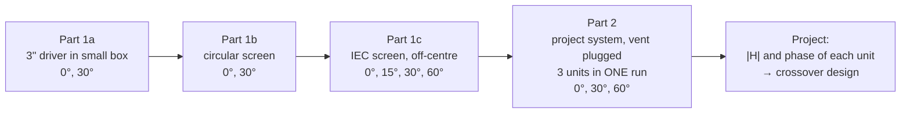

# Lab E: loudspeaker response in free field (preparation)

> [!info] Practical
> **When:** **Tue 20 Oct 2026, 08:30** (moved from 10:00), rooms 028/025, building 354 (the large anechoic chamber + control room). **Group 10:** Louis Andrianne, Sophie Kimura, Mads.
> **Loudspeaker:** **System D** (Scan-Speak woofer box + DALI mid/tweeter box), shared with Group 4. It clashes with the 34840 Tuesday lecture.
> **Quiz:** Lab D and Lab E together, individual, deadline **Mon 26 Oct 2026**. Q6–Q9 are already ticked from theory; Q10 and Q11 wait for this lab.
> **Brief:** [[34870_Lab_E_Loudspeakers2_E2026.pdf]] · **Digest:** [[34870_Lecture_10_Digest_Lab_E.pdf]]
> **Theory links:** [[Lecture 6 - Microphone Scattering, Metrology & Calibration]] (diffraction and reciprocity, the same physics from the receiving side) · [[Lab B - Runthrough]] · [[Lecture 7 - Moving Coil Loudspeakers]] §5 (on-axis pressure of a baffled piston) · [[Lecture 8 - Loudspeaker Enclosures]] §1 (mounting).
> **Files:** `5. Semester/Electroacoustics/Labs/Lab E/` in the labs repo (`matlab/labE_run.m` is the one you open).

## The one idea

A driver in an **infinite baffle** radiates into half space. On a **finite** baffle, the wave that runs along the front reaches the edge and launches a second, **inverted** wave from there. At the microphone the direct and the edge waves add, and whether they reinforce or cancel depends on the path difference in wavelengths. So the baffle's **shape and the driver's position on it** write ripples into the frequency response.

- **Circular baffle, driver in the centre:** every edge point is the same distance away, so every edge wave arrives at the same time. The ripples line up and are as large as they can be: deep, regular peaks and dips.
- **Rectangular (IEC) baffle, driver off-centre:** the edge distances are spread out, so the edge waves arrive at many different times and the ripples average out. This is why the IEC screen exists and why real speakers put the tweeter off-centre and round the edges.
- **Small box:** the box itself is the baffle. Its edges are close, so the step from 2π (half space) to 4π (full space) radiation moves up in frequency.

This is the same physics as Lab B, seen from the other side. Lab B had a **receiver** on a body; Lab E has a **source** on a body. By **reciprocity**, swapping source and receiver gives the same transfer function (Lecture 10 digest, slide 8).



---

## Before the slot (10 minutes)

- [ ] **Put `Lab E/matlab/` on a USB stick.** `labE_run.m` is the editor script with one section per measurement. `test_labE` checks the copy without hardware (it must print PASS). The course files are in `course/`.
- [ ] Bring a **tape measure** and **calipers**. You need the 3" driver diameter, the circle radius, the IEC screen size and the driver position on it, the diameter of all three project drivers, and the microphone distance and height.
- [ ] **Agree on the listening height** for part 2 before you go in (e.g. tweeter height or between mid and tweeter). It fixes the crossover phase, so it can't change afterwards.
- [ ] Agree roles: one person on the PC, one in the chamber (angle, switchboard), one writing everything into `labE_dims.m`.

> [!warning] Lessons from Labs B, C and D
> - **Lab B:** the mock-up size and temperature were never written down. **Lab D:** the typed `'R'` was the driver's R_E instead of the series resistor, tags were reused, and the cone diameter was nearly lost.
> - So this time: **one tag per measurement** (the sections build it from the angle for you), **write the dimensions into `labE_dims.m` on the lab PC**, and **look at the plot after every run** before you move anything.

---

## The setup

- **The sound card, not the NI card.** The PC's line-out goes to the amplifier *and* back into line-in, which becomes the reference ("channel 1"). The **UMIK-1** USB microphone is channel 2. `H = specn(:,2)./specn(:,1)` is therefore pressure over voltage.
- **Plug the UMIK in before you start MATLAB.** The routine looks it up by name when it starts.
- **UMIK serial number:** the routine applies that microphone's correction curve, so the serial number must match the label. The available ones are 0329, 0332 and 0335; in Lab B we had 708-0332. `IncAngle = 0` means the microphone points at the speaker.
- **Level:** start with the amplifier very low and turn it up until the UMIK curve sits well above the noise in the routine's figure 21. Time signals must stay **below 1** (digital full scale). The wrapper warns about both.
- **Random delay:** the sound card does not synchronise playback and recording, so every run gets its own unknown phase shift. Magnitudes are fine; **phases are only comparable within one run**. That's why part 2 measures all three units in a single run.

---

## The two hours

| Block | What | Runs | Time |
|---|---|---|---|
| Setup | UMIK in, MATLAB, `test_labE`, level check | — | 15 min |
| 1a | small box, 0° and 30° | 2 × ~17 s | 10 min |
| 1b | circular screen, 0° and 30° | 2 × ~17 s | 15 min (mounting) |
| 1c | IEC screen, 0°, 15°, 30°, 60° | 4 × ~17 s | 20 min (mounting) |
| 2 | project system on the platform, 0°, 30°, 60° | 3 × ~4.3 min | 40 min (incl. moving the stand out) |
| End | `labE_dims.m`, copy `data/` | — | 10 min |

### Part 1: the 3" driver on three mountings

Settings are fixed for all of part 1: **50 Hz–20 kHz, 24/oct, fres 1 Hz, Nav 16, Nmeas 1**. These are the `'baffle'` defaults in `measure_labE`.

- **1a, small box:** 0° and 30°. Turn the metal bar the box sits on to change the angle.
- **1b, circular screen:** black arrow pointing up. **Measure the radius.** Then 0° and 30°.
- **1c, IEC screen:** the driver sits in the upper part. **Measure the screen size and where the driver sits on it.** Then 0°, 15°, 30° and 60°.
- **Measure the 3" driver's effective diameter** (cone plus half the surround). The rule of thumb says the radius in cm is about the size in inches, so a ≈ 3 cm.
- **Watch the wedges and the net.** Don't drop nuts through it.

### Part 2: the project system

- Take the small box and its stand off the platform, and **screw its nuts and bolts into the spare holes** so they don't fall through the net.
- **Place the system:** mid/tweeter box on or next to the woofer box. **Try a couple of positions** and keep the one that measures best. Decide on dust cover on or off, then **keep both for the whole project** and write them in `labE_dims.m`.
- **Plug the woofer vent.** The chamber can't do low frequencies anyway.
- **Microphone at the listening height**, and **don't move it again** during part 2.
- **Measure the rough distance** from speaker to microphone. It's the first guess for the phase compensation.
- **Measure all three driver diameters.** The woofer is already known: 211 mm from the Scan-Speak data sheet.
- **One run per angle (0°, 30°, 60°)**, with `'system'` defaults: **48/oct, Nav 64, Nmeas 3**. Start on the **woofer**, switch to the **midrange** during the first ~30 s of beeps, then to the **tweeter** during the second. Each run takes about 4.3 minutes. Turn the wooden base between angles.

### Before you leave (don't skip)

- [ ] Open every saved file's plot: three units in `system_*`, and no clipping warnings.
- [ ] Fill in **every** NaN in `labE_dims.m`.
- [ ] Copy `data/` to the stick, then delete the files from the lab PC (the brief asks for this).

---

## What to expect (so you can tell a good curve from a bad one)

### Edge diffraction on the circular baffle

For a point source in the centre of a circular baffle of radius $a$, with the microphone on axis at distance $r$, the path difference between the edge wave and the direct wave is

$$\Delta = a + \sqrt{a^2 + r^2} - r \;\approx\; a \quad (r \gg a)$$

The edge wave is **inverted**, so:

| Path difference | Result | Frequency |
|---|---|---|
| $\Delta = (2n-1)\,\lambda/2$ | in phase → **peak** (up to +6 dB) | $f_{\max} = (2n-1)\,\dfrac{c}{2\Delta}$ |
| $\Delta = n\,\lambda$ | cancellation → **dip** | $f_{\min} = n\,\dfrac{c}{\Delta}$ |

As an example, $a$ = 0.25 m and $r$ = 1 m give Δ ≈ 0.28 m, so the first peak is near 610 Hz and the first dip near 1.2 kHz. Recompute this with the measured $a$ and $r$.

- **At 30°** the edge points are no longer equidistant, so the ripples **smear out**. The difference between your 0° and 30° circle curves *is* the lesson.
- **Below** the first peak, the baffle is small compared with the wavelength. The driver radiates into full space and the level drops by up to 6 dB (the **baffle step**).
- An **extended source** (radius $a_s$, not a point) has a smaller effective edge distance and weaker ripples at high frequency. That's why `diffrac.m` is run with both a tiny radius and the measured radius.

### `diffrac.m` (course file, Terai's method, thin baffle)

```matlab
N = 200; th = linspace(0, 2*pi, N+1)';
corners = [a*cos(th), a*sin(th)];          % circle: many corners, closed
[t, h, f, H] = diffrac(corners, r, [0 0; 30 0], 0.001, 48000);   % point source
[t, h, f, H] = diffrac(corners, r, [0 0; 30 0], a_s, 48000);     % extended source
```

The driver is always at (0,0), so the IEC rectangle must be described **relative to the driver**, e.g. `[x1 y1; x2 y1; x2 y2; x1 y2; x1 y1]`. That's why the driver position on the screen has to be measured.

### Directivity of a piston (for the IEC off-axis curves)

$$D(\theta) = \frac{2\,J_1(ka\sin\theta)}{ka\sin\theta}$$

Normalise each off-axis IEC curve by the 0° curve, and compare with $20\log_{10}|D|$. For the 3" driver ($a$ ≈ 3 cm, where $ka = 1$ at 1.8 kHz):

| Angle | −3 dB at | First null at |
|---|---|---|
| 15° | ~11 kHz | above 20 kHz |
| 30° | ~5.9 kHz | ~14 kHz |
| 60° | ~3.4 kHz | ~8 kHz |

For the **woofer** ($a$ = 10.5 cm, $ka = 1$ at 520 Hz), −3 dB at 30° is already at **~1.7 kHz**. That's one reason the woofer must hand over to the midrange well below that.

### Phase compensation (part 2d)

The measured phase of each unit contains (1) the unit's own phase, (2) the flight time over the distance $d$, a phase of $-2\pi f d/c$ that grows linearly with frequency, and (3) the sound card's random delay, which is the same for all three units within one run.

`phaseunwrap(phiw_deg, d, f)` adds $2\pi f d/c$ back and unwraps. **Use the same $d$ for all three units.**
- If all phases rise with frequency, $d$ is too long: decrease it (negative is allowed).
- If all fall, increase it.
- Stop when the units have mixed slopes, or one is almost flat.

Adding a multiple of 360° to a whole curve changes nothing, so use it to bring the curves together.

---

## Write down in the lab

| What | Where it goes |
|---|---|
| UMIK serial number | `labE_dims.UmikSN` + `labE_run` section 0 |
| 3" driver effective diameter | `diam_3in` |
| Microphone distance (part 1) | `r_mic_1` |
| Circular screen radius | `circle_radius` |
| IEC screen width × height, driver centre from left/bottom edge | `iec_size`, `iec_driver` |
| Midrange and tweeter effective diameters | `diam_midrange`, `diam_tweeter` |
| Microphone distance and height (part 2) | `r_mic_2`, `h_mic_2` |
| Box placement, dust cover | `layout`, `dust_cover` |
| Room temperature | `T_celsius` |

---

## What Lab E feeds into

- **Quiz Q10 (20 points):** explain the differences between the three units' transfer functions, the importance of baffle shape, and the system's magnitude and phase. You need two figures: a **baffle comparison** and the **three units of the system**.
- **Quiz Q11 (20 points):** how Lab D and Lab E fit together. Lab D gives the T-S parameters, box tuning and the impedances the crossover sees; Lab E gives the acoustic magnitude and relative phase the crossover must sum.
- **The project:** the crossover is designed on the `system_0` responses (magnitude *and* relative phase) together with the Lab D impedances.
