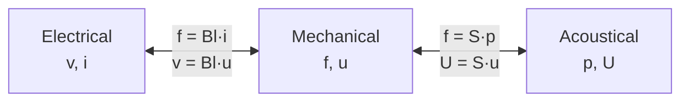

# Lecture 4 — Analogies: Transducers & Dynamic Microphones

> [!info] Lecture Info
> **Date:** Thursday 10 September 2026, 8:30–12:00 · Lyngby · **FL** (4A, transducers) then **VCH** (4B, dynamic microphones)
> **Slides:** `Slides/34870_Lecture4A_10092026.pdf` (24 pages, FL) · `Slides/34870_Lecture_4B_E26.pdf` (VCH)
> **Problems:** `Exercises/34870_Problems4_2026.pdf` (dynamic microphones, with answers in brackets)
> **Refs:** Beranek §3.5–3.7, ch. 5 · Leach §4.4–4.7, §5.1–5.4
> **Also today:** the **Lab A quiz opens** (Frieder's announcement of 9 Sep) and is previewed during the morning class — **deadline 20 Sep**, individual, mandatory for the exam, part of the 30 %. Sign up to a Lab Group in DTU Learn if not done.
> **Previous:** [[Lecture 3 - Analogies - Acoustic Systems|Lecture 3 — acoustic systems]] · **Next:** Lecture 5 — microphones: dynamic & condenser (1) *(VCH, Mo 14/9)*

> [!abstract] Where this lecture sits
> Lectures 1–3 gave us three separate toolboxes: electrical, mechanical and acoustic lumped networks, each living in its own domain. Today the domains get **wired together**. A transducer is nothing more than a pair of **controlled sources** (or a transformer/gyrator two-port) whose gain is a physical constant — $S$ for a diaphragm, $Bl$ for a voice coil, $v_0/x_0$ for a condenser. Once you can draw that pair correctly (and with the right *signs*), you can model a complete microphone or loudspeaker as one circuit and simulate it. VCH's half then does exactly that for the **dynamic microphone**, ending in the band-pass formula whose three total elements $M_{MT}, R_{MT}, C_{MT}$ are the whole design story.
>
> This is also the theory behind **Lab A parts 3 and 4** (coupled mechanical–acoustic and electrical–mechanical systems) — see [[Lab A - Runthrough]].

---

## 1. Repetition — pop quiz, answered

### The dead-simple version (read this first)

The whole point of lectures 1–3: **circuits are the one thing we can solve easily** (Kirchhoff, impedances, LTspice). Springs, masses and air cavities happen to obey *exactly the same equations* as R, L and C — so we translate them into a circuit, solve the circuit, and translate back.

**Q1a — mechanical networks.** A mechanical system only has two quantities worth tracking: **force $f$** (how hard something is pushed) and **velocity $u$** (how fast it moves). And it only has three building blocks:

- **Mass $M_M$** — hates changing speed (a loaded shopping cart). Its velocity is always measured *against the fixed world*, so in the circuit one of its terminals is **always ground**.
- **Compliance $C_M$** — a spring's *softness* ($C_M = 1/k$). Stores energy when squeezed or stretched.
- **Damper $R_M$** — friction. Eats energy, turns it into heat (dragging your hand through water).

Two translation dictionaries exist:

| | force $f$ | velocity $u$ | mass | compliance | damper |
|---|---|---|---|---|---|
| **Impedance analogy** | voltage | current | inductor | capacitor | resistor $R_M$ |
| **Mobility analogy** (course default for mechanics) | current | voltage | capacitor **to ground** | inductor | resistor $1/R_M$ |

They contain the same information — every mesh in one becomes a node in the other (duals, [[Lecture 2 - Analogies - Mechanical Systems|Lecture 2]]).

**Q1b — acoustic networks.** Same game, new pair of variables: **pressure $p$** (like voltage) and **volume velocity $U$** (m³/s of air flowing — like current). The building blocks come from simple geometries:

- **Short open tube** → the plug of air inside sloshes back and forth as one lump → an **acoustic mass** $M_A = \rho l^*/S$ → inductor.
- **Closed box of volume $V$** → the trapped air acts as a spring when compressed → **compliance** $C_A = V/\rho c^2$ → capacitor, **always to ground** (the box "pushes back" against still air, i.e. against zero pressure).
- **Narrow slits, mesh, cloth** → viscous losses → $R_A$ → resistor.

(Think of a bottle: neck = acoustic mass, body = acoustic compliance. That LC pair is why blowing over it gives one tone — a Helmholtz resonator.)

**Q2a — which variables are coupled?** A transducer sits *between* two domains and ties one variable on each side to a variable on the other side, **in both directions**:



- Voice coil (electrical ↔ mechanical): current through the coil creates force ($f = Bl\,i$), and moving the coil generates voltage ($v = Bl\,u$). Same wire, both effects, always simultaneously.
- Diaphragm of area $S$ (mechanical ↔ acoustical): pressure on the area is a force ($f = S\,p$), and moving the piston pumps air ($U = S\,u$).

**Q2b — what defines the coupling?** A **physical law**, and each law boils down to a single **constant number** — the transduction factor:

| Transducer | Law | Factor |
|---|---|---|
| diaphragm / piston | pressure on an area | $S$ |
| voice coil | Lorentz force + Faraday induction | $Bl$ |
| condenser mic | electrostatics | $v_0/x_0$ |
| piezo | piezoelectricity | $1/d$ |

Because the coupling works in both directions at once, the circuit model always needs **two** controlled sources (or one transformer/gyrator two-port) — one per direction. That is exactly what today's lecture (4A) builds.

---

> [!question]+ Pop quiz
> **Q1 — Equivalent systems: describe lumped mechanical networks/circuits.**
> Variables: velocity $u$ and force $f$. Elements: mass $M_M$ (needs a reference velocity = ground), compliance $C_M$, damper $R_M$. Equilibrium (sum of forces) and continuity (sum of velocities) written per node/mesh. Two analogies: **impedance** ($f\leftrightarrow v$, $u\leftrightarrow i$, mass = inductor) and **mobility** ($u\leftrightarrow v$, $f\leftrightarrow i$, mass = capacitor to ground) — graphically converted by turning every mesh into a node, adding one node outside (ground), and replacing each element by its dual ([[Lecture 2 - Analogies - Mechanical Systems|Lecture 2]]).
>
> **Q1 — … and lumped acoustic networks/circuits.**
> Variables: pressure $p$ and volume velocity $U$. Elements derived from the plane-wave tube: open tube → mass $M_A=\rho l^*/S$, closed volume → compliance $C_A = V/\rho c^2$ (**always to ground**), losses → $R_A$. Sources: pressure ⇔ voltage, volume velocity ⇔ current ([[Lecture 3 - Analogies - Acoustic Systems|Lecture 3]]).
>
> **Q2 — Coupled systems: which network variables are coupled to each other?**
> One variable of each domain is a function of a variable in the neighbouring domain, in *both* directions:
> - electrical $\leftrightarrow$ mechanical: $v \leftrightarrow f\ \text{or}\ u$, $i \leftrightarrow u\ \text{or}\ f$
> - mechanical $\leftrightarrow$ acoustical: $f \leftrightarrow p$, $u \leftrightarrow U$
>
> **Q2 — What defines the coupling?**
> A **physical law** of the transducer, which gives a (constant) **transduction factor**: pressure on an area ($f = Sp$, $U = Su$), Lorentz force + Faraday induction ($f = Bl\,i$, $v = Bl\,u$), electrostatics ($v_0/x_0$), piezoelectricity ($1/d$). Transduction is bidirectional (excitation *and* response), so both directions must appear in the circuit.

### The analogy table, extended with the coupling column

> [!note] Mobility (mechanical) + impedance (acoustic) form — the one the course uses
> | | Electrical | Mechanical (mobility) | Acoustical |
> |---|---|---|---|
> | Across variable | $v$ | $u$ | $p$ |
> | Through variable | $i$ | $f$ | $U$ |
> | Real element | $R$ | $1/R_M$ | $R_A$ |
> | $j\omega$ element (L) | $L$ | $C_M$ | $M_A$ |
> | $1/j\omega$ element (C) | $C$ | $M_M$ (to ground) | $C_A$ (to ground) |
> | Coupling to the right → | $f = Bl\,i$, $v = Bl\,u$ | $f = S\,p$, $U = S\,u$ | — |

---

## 2. Transducers — connecting the systems

> [!abstract] Definitions
> **Transduction** = transfer of energy between physical domains. The domains become **coupled** (dependent on each other), and the coupling is generally **bidirectional**.
> **Transducer** = the component connecting the variables. In network terms: **controlled sources** whose control variable lives in the other domain. Alternative: a **two-port** (transformer or gyrator) with the transduction factor $x$ as its parameter.

### 2a. The four controlled sources

> [!important] Pick the source from the pair of variables it connects
> | Coupling | Source type | LTspice | SPICE letter | KiCad symbol |
> |---|---|---|---|---|
> | across ⇔ across | voltage-controlled voltage source | E, E2 | `E` | `Simulation_SPICE:ESOURCE` |
> | through ⇔ through | current-controlled current source | F | `F` | *(no symbol — sense the current as a voltage across a resistor and use a G)* |
> | across ⇔ through | voltage-controlled current source | G, G2 | `G` | `Simulation_SPICE:GSOURCE` |
> | through ⇔ across | current-controlled voltage source | H | `H` | *(same trick, use an E)* |
>
> Procedure: (1) write the physical relations between the domains for *all* network variables, (2) connect the domains with the controlled sources matching those relations, (3) assign the control to the right variable and give the source the (constant) transduction factor $x$.

> [!note] Two-port view
> Forward: through-current-through with factor $x$; backward: across-voltage-across with factor $1/x$ — i.e. a transformer $\begin{pmatrix} x & 0 \\ 0 & 1/x\end{pmatrix}$ when both couplings are across↔across / through↔through, and a **gyrator** when they cross over (the electrodynamic case in §2c).

### 2b. Mechanical ↔ acoustical: a vibrating surface $S$ — slides 8–9

$$f = S\,p \qquad U = S\,u$$

Example: a piston driven by force $f_0$, with pressure $p_f$ on its front and $p_b$ on its back. The net pressure is $p = p_f - p_b$, the mechanical impedance the force sees is $Z_M = (f_0 - f)/u$, and the acoustic impedance the piston sees is
$$Z_A = \frac{p}{U} = \frac{p_f - p_b}{U} = Z_{Af} + Z_{Ab}$$
— front and back loads are simply **in series** in the acoustic domain (the same $U$ flows through both).

> [!example]+ The two ways to draw it (slide 8)
> **Mechanical mobility analogy** — force source $f_0$ = current source into node $u$; the piston's own mobility $Y_M$ hangs from that node; the acoustic side is driven by a VCCS $U = S\,u$ (control = node $u$), and the reaction force comes back as a VCCS $f = S\,p$ drawn from node $u$ (control = node $p$). Two **G** sources.
>
> **Mechanical impedance analogy** — force source = voltage source in series with $Z_M$; the piston current is $u$; a VCVS $f = S\,p$ appears in series in the mechanical loop (control = node $p$, an **E** source), and a CCCS $U = S\,u$ (control = the loop current $u$, an **F** source) drives $Z_{Af} + Z_{Ab}$.

```tikz
\usepackage{circuitikz}
\begin{document}
\begin{circuitikz}[american, scale=0.9]
% mobility form
\draw (0,0) node[ground]{} to[isource, l=$f_0$] (0,3) -- (2,3) coordinate(u);
\draw (u) to[generic, l=$Y_M$] (2,0) node[ground]{};
\draw (u) -- (4,3) to[cisource, l=$f{=}Sp$] (4,0) node[ground]{};
\node at (2,3.4) {node $u$};
% acoustic side
\draw (7,0) node[ground]{} to[cisource, l_=$U{=}Su$] (7,3) -- (9,3) coordinate(p)
      to[generic, l=$Z_{Af}$] (9,1.5) to[generic, l=$Z_{Ab}$] (9,0) node[ground]{};
\node at (9,3.4) {node $p$};
\node[align=left] at (4.5,-1) {\small mobility: two G sources ($S$)};
\end{circuitikz}
\end{document}
```

```tikz
\usepackage{circuitikz}
\begin{document}
\begin{circuitikz}[american, scale=0.9]
% impedance form
\draw (0,0) node[ground]{} to[vsource, l=$f_0$] (0,3) to[generic, l=$Z_M$, i=$u$] (3,3)
      to[cvsource, l=$f{=}Sp$] (3,0) node[ground]{};
\draw (6,0) node[ground]{} to[cisource, l_=$U{=}Su$] (6,3) -- (8,3) coordinate(p)
      to[generic, l=$Z_{Af}$] (8,1.5) to[generic, l=$Z_{Ab}$] (8,0) node[ground]{};
\node at (8,3.4) {node $p$};
\node[align=left] at (4,-1) {\small impedance: E (voltage) + F (current), factor $S$};
\end{circuitikz}
\end{document}
```

> [!warning] Signs and polarities (this is what Lab A's hint is about)
> The reaction force must **oppose** the motion: the $f = Sp$ source draws current *out of* node $u$ when $p$ is positive. Get it backwards and the acoustic load becomes a negative damper — the response blows up instead of being damped. Sanity check every coupled circuit by looking for the expected damping/mass-loading, and by checking that the mobility and impedance versions give **the same** result (Problem 4.4 does exactly that).

> [!example]+ Exercise — massless piston (slide 9), worked
> Massless rigid piston, $a = 10$ cm ($S = \pi a^2 = 3.14\times10^{-2}$ m²), front: baffled radiation impedance $Z_{Af}$, back: closed 10 L volume $Z_{Ab} = 1/(j\omega C_{Ab})$.
> $$Z_M = \frac{f}{u} = S^2\,(Z_{Af} + Z_{Ab})$$
> Numbers ($\rho=1.18$, $c=344$; Lecture 3 §8b network): $M_{A1} = 8\rho/(3\pi^2 a) = 3.19$ kg/m⁴ · $R_{A1} = 0.441\rho c/(\pi a^2) = 5.70\times10^3$ · $R_{A2} = \rho c/(\pi a^2) = 1.29\times10^4$ Pa·s/m³ · $C_{A1} = 5.94 a^3/(\rho c^2) = 4.25\times10^{-8}$ · $C_{Ab} = V/(\rho c^2) = 7.16\times10^{-8}$ m⁵/N.
>
> What the $|Z_M|$ plot looks like:
> - **Low frequency:** the back volume dominates, $|Z_M| \approx S^2/(\omega C_{Ab})$ — a spring, falling at −20 dB/decade, phase −90°.
> - **Series resonance** where the front air mass cancels the back spring: $f_0 = 1/(2\pi\sqrt{M_{A1} C_{Ab}}) \approx 333$ Hz — a sharp **minimum** in $|Z_M|$, only the radiation resistance is left.
> - **Above:** mass-like ($S^2\,\omega M_{A1}$, +90°) until $ka \approx 1$ ($f = c/2\pi a \approx 550$ Hz), where the radiation impedance turns resistive and flattens towards $S^2 R_{A2} \approx 12.8$ Ns/m.
>
> Both drawings (mobility with two G's, impedance with E + F) must give this same curve.
>
> **KiCad/ngspice companion sim:** `5. Semester/Electroacoustics/KiCad/Lecture 4/Problem_4A_Massless_Piston/` — `layout.py` generates the mobility-form schematic (V1 = $u$ = 1 m/s, G2 draws $f = Sp$, G1 injects $U = Su$, $Z_{Af}$ network in series with $C_{Ab}$ + 1 TΩ leak), `sim.py` runs the AC sweep. Since $u = 1$: $Z_M = S\,V(p)$, and the front/back split falls out of the same run as $S(V(p)-V(pm))$ and $S\,V(pm)$. Sim vs analytic network agree to 0.2 %; dip at 324 Hz with $|Z_M| = 2.4$ Ns/m, plateau 12.74 Ns/m — matching the slide. The black dash-dot curve is the *exact* Bessel/Struve radiation impedance: the lumped network is a near-perfect stand-in below $ka \approx 2$.
>
> ![[Problem_4A_MasslessPiston_Zm.png]]

### 2c. Electrical ↔ mechanical: electrodynamic (moving coil) — slide 14

> [!important] Lorentz force + Faraday induction
> $$f = i\,lB \qquad v = u\,lB$$
> Force source controlled by the **current**, voltage source controlled by the **velocity**, both with the same constant factor $Bl$ (units T·m = N/A = V·s/m).

- **Mobility:** electrical loop $v_0 \to Z_e \to$ VCVS $v = Bl\,u$ (an **E**, control = node $u$); mechanical node $u$ driven by a CCCS $f = Bl\,i$ (an **F**, control = the loop current) into the mobility $Y_M$.
- **Impedance:** the mechanical loop gets a CCVS $f = Bl\,i$ (an **H**) in series with $Z_M$, and the electrical loop a CCVS $v = Bl\,u$ (another **H**, control = the mechanical loop current $u$).

```tikz
\usepackage{circuitikz}
\begin{document}
\begin{circuitikz}[american, scale=0.9]
\draw (0,0) node[ground]{} to[vsource, l=$v_0$] (0,3) to[generic, l=$Z_e$, i=$i$] (3,3)
      to[cvsource, l=$v{=}Bl\,u$] (3,0) node[ground]{};
\draw (6,0) node[ground]{} to[cisource, l_=$f{=}Bl\,i$] (6,3) -- (8,3) coordinate(u)
      to[generic, l=$Y_M$] (8,0) node[ground]{};
\node at (8,3.4) {node $u$};
\node at (4,-1) {\small electrodynamic transducer, mobility form (gyrator)};
\end{circuitikz}
\end{document}
```

> [!tip] Transformer or gyrator? It depends on the analogy
> In the **mobility** analogy $i \to f$ is through→through (an F) and $u \to v$ is across→across (an E): the coupling is a **transformer** with ratio $Bl$. In the **impedance** analogy the same two laws become $i \to f$ = through→across and $u \to v$ = through→across (two H's): a **gyrator**. Physics unchanged — but a gyrator *inverts* impedances, which is why the electrical side sees $(Bl)^2/Z_M$ (§2e).

### 2d. Electrostatic and piezoelectric transduction (linearised) — slide 15

> [!note] Electrostatic (capacitive): gap $x_0$, bias voltage $v_0$
> $$v = \frac{1}{j\omega C_E}\,i + \frac{v_0}{j\omega x_0}\,u \qquad f = -\frac{v_0}{j\omega x_0}\,i - \frac{1}{j\omega C_M}\,u$$
> **Nonlinear** in general — this is the small-signal linearisation around the bias $v_0$ (the electrical DC source is drawn explicitly on the slide). The $1/j\omega$ in the coupling terms can be moved into the elements, giving **frequency-independent** sources: $v_0 C_E u/x_0$ and $v_0 C_M i/x_0$ (mobility: G + H; impedance: two F's, with $C_E$ and $C_M$ absorbing the integrations).

> [!note] Piezoelectric: coefficient $d$ (C/N)
> $$v = -\frac{1}{j\omega d}\,u + \frac{1}{j\omega C_E}\,i \qquad f = \frac{1}{j\omega d}\,i - \frac{1}{j\omega C_M}\,u$$
> Also nonlinear in general. Same trick: frequency-independent sources $C_E u/d$ and $C_M i/d$ (mobility: G2 + H; impedance: two F's). These come back in [[34871 Nonlinear Transducers]] and in the condenser-microphone lectures (14/9, 17/9).

### 2e. Impedance conversion — what one domain sees of the next (slide 16)

> [!important] The two conversion rules
> **Acoustic → mechanical** (vibrating surface $S$):
> $$Z_{M,A} = S^2 Z_A = S^2\,(Z_{Af} + Z_{Ab}) \quad\text{(impedance analogy)}, \qquad Y_{M,A} = 1/Z_{M,A} \quad\text{(mobility analogy)}$$
> A transformer just scales: $S^2$ multiplies impedances, loads stay in the same "shape".
>
> **Mechanical → electrical** (electrodynamic): an **inversion**!
> $$Z_{E,M} = \frac{(Bl)^2}{Z_M} = (Bl)^2\,Y_M$$
> (for capacitive transducers: $Z_{E,M} = (v_0/j\omega x_0)^2 / Z_M$.) A mechanical *series* resonance (impedance minimum) becomes an electrical *parallel* resonance (impedance **maximum**) — the famous impedance peak of every loudspeaker at $f_s$.

> [!tip]+ Why the inversion matters (and where it comes from)
> **Where it comes from:** the diaphragm's laws pair like-with-like ($f = S\,p$: voltage↔voltage; $U = S\,u$: current↔current) — a **transformer**, so impedances just scale by $S^2$. The voice coil's laws *cross* the variable types ($f = Bl\,i$: voltage↔**current**; $v = Bl\,u$: voltage↔**current** the other way) — a **gyrator**, and a gyrator maps impedance to *admittance*: $Z_{E,M} = (Bl)^2/Z_M$. Not a convention — the physics of Lorentz + Faraday does it.
>
> **Every element turns into its dual** (series chain → parallel bank):
>
> | mechanical | electrical (motional) |
> |---|---|
> | mass $M_M$ (series L) | $C_{mot} = M_M/(Bl)^2$ (parallel C) |
> | compliance $C_M$ (series C) | $L_{mot} = (Bl)^2 C_M$ (parallel L) |
> | damper $R_M$ (series R) | $R_{mot} = (Bl)^2/R_M$ (parallel R) |
>
> **Why you should care:**
> 1. **The mechanics is measurable from the terminals.** At $f_s$, $Z_M$ is minimal → $u$ maximal → back-EMF $Bl\,u$ maximal → current minimal → $|Z_E|$ **peaks** at $R_e + (Bl)^2/R_M$. From one impedance sweep (no microphone, no anechoic room) you read $f_s$, the Q's, and with a known added mass all the Thiele–Small parameters. Problem 4.4b is literally this: 5 Ω coil peaking at 7.2 Ω at 50.3 Hz.
> 2. **Damping flows backwards through the gyrator.** A *low* impedance across the terminals short-circuits the motional parallel-RLC → maximal electrical braking $(Bl)^2/(R_e + R_{load})$. That is why a voltage amplifier ("high damping factor") controls a woofer at resonance, why shorting a speaker's terminals makes the cone stiff to push, and why $R_L$ appeared inside $R_{MT}$ in the microphone's bandwidth (§4c). Current drive removes that damping entirely.
> 3. **Blocked vs. motional.** Clamp the diaphragm ($Z_M \to \infty$) and the motional term vanishes: you measure the *blocked* impedance $R_e + j\omega L_e$ alone. The difference free-minus-blocked is purely the motion — that separation is how $Bl$ is measured.
> 4. **It explains the drawing rules of §2c.** Gyrator + mechanical *impedance* circuit ≡ transformer + mechanical *mobility* circuit. That is exactly why the mobility form is so convenient on the mechanical side of a voice coil: the parallel RLC hangs directly off the electrical loop (the E+F circuits of slides 17–20) with no redrawing.

> [!example]+ Exercise — microphone diaphragm with suspension and coil (slides 17–20)
> Mechanical: $f = u\,(j\omega M_M + 1/j\omega C_M + R_M)$. Coupling: $f = i\,lB$, $v = u\,lB$. Electrical: $Z_E = v/i$.
> Inverting the mechanical impedance:
> $$Z_{E,M} = \frac{(lB)^2}{j\omega M_M + \dfrac{1}{j\omega C_M} + R_M} \qquad\Rightarrow\qquad \boxed{Z_E = R_c + j\omega L_c + \frac{(lB)^2}{j\omega M_M + \dfrac{1}{j\omega C_M} + R_M}}$$
> The LTspice circuits on the slide: mobility form with `E1` ($v = lB\,u$) and `F1` ($f = lB\,i$) feeding `C2 = {Mm}`, `L2 = {Cm}`, `R2 = {1/Rm}`; impedance form with two `H` sources and `L2 = {Mm}`, `C2 = {Cm}`, `R2 = {Rm}` in series. Plotting $Z_E$ from both gives the same curve: $R_c$ at low frequency, a **motional peak** of height $R_c + (lB)^2/R_M$ at $f_0 = 1/(2\pi\sqrt{M_M C_M})$, then the coil inductance rising.
>
> **Full capsule with felt damping** — three domains: $Z_E$ (voice coil $R_c$, $L_c$), $Z_M$ (diaphragm mass, stiffness, damping), $Z_{Af}$ (radiation) and $Z_{Ab}$ (back cavity + absorber). Network analysis gives
> $$v_{out} = -\frac{R_L}{Z_E + R_L}\cdot\frac{Bl\,S}{\dfrac{(Bl)^2}{Z_E + R_L} + Z_M + S^2\,(Z_{Af} + Z_{Ab})}\;p_{in}$$
> — read it as: (potential divider $R_L/(Z_E + R_L)$) × (transduction $Bl\,S$) ÷ (total mechanical impedance, with the electrical load reflected in as $(Bl)^2/(Z_E+R_L)$ and the acoustics reflected in as $S^2 Z_A$). Slide 20's plot (output in dBV vs. frequency): a band-pass whose flatness depends on the **felt damping** — low damping = a resonance hump, high damping = a wide, flat, lower plateau. This is exactly VCH's formula in §4, derived in one line.

---

## 3. Problem solving (in-class, slides 10–12 & 21–23) — Problems 4.1–4.4, worked

> [!example]+ Problem 4.1 — Loudspeaker box with bass reflex (builds on [[Lecture 3 - Analogies - Acoustic Systems#9. Problem solving (in-class, part 2) — worked|Problem 2.3]])
> Vented box: vent $l^* = 12$ cm, Ø 10 cm, $V = 23$ L → $M_{Av} = \rho l^*/S_v = 18.0$ kg/m⁴, $C_A = V/\rho c^2 = 1.65\times10^{-7}$ m⁵/N, box–port resonance $f_B = 1/(2\pi\sqrt{M_{Av}C_A}) = 92.4$ Hz. Driver: baffled, **massless** piston, same diameter as the vent ($S_D = 7.85\times10^{-3}$ m²), vibrating with velocity $u$.
>
> **a) Circuit.** A velocity source $u$ on the mechanical side, coupled by $S_D$ into the acoustic domain: the piston's volume velocity $U_D = S_D u$ flows *into* the box node (pressure $p_{box}$), from which the box compliance $C_A$ goes to ground and the vent mass $M_{Av}$ goes to the outside (ground = $p_{out}\approx0$). Its front side sees the front radiation impedance $Z_{Af}$ directly. In the mobility form: a VCCS $U = S_D u$ into node $p_{box}$ and a VCCS $f = S_D(p_f - p_{box})$ back on node $u$ (irrelevant for a *prescribed* velocity, but needed as soon as the driver has mass/compliance).
>
> **b) With radiation impedance.** Replace the vent's ground connection with the unflanged-tube radiation network $M_{A1}\,\|\,[R_{A2} + (R_{A1}\|C_{A1})]$ from Lecture 3 §8b/8c (and remember the vent's effective length already contains the end corrections), and put the baffled-piston network on the piston's front side.
>
> **c) Acoustic impedance seen by the piston (back side):**
> $$Z_{A,back} = \frac{1}{j\omega C_A}\;\Big\|\;\big(j\omega M_{Av} + Z_{rad,vent}\big)$$
> Lossless shape: $\to 0$ at DC (all flow escapes through the vent), a **parallel resonance = impedance peak** at $f_B \approx 92$ Hz, then $\to 1/(j\omega C_A)$ (the vent mass blocks, the box is just a sealed compliance). Total $Z_A = Z_{Af} + Z_{A,back}$; mechanically $Z_M = S_D^2 Z_A$.
>
> **d) Far field, box as a point source.** Total volume velocity $U_{tot} = U_D + U_v$ (in phase above $f_B$, opposing below — that is why a reflex box falls off at 24 dB/octave below tuning). For a point source in free space $p(r) = j\omega\rho\,U_{tot}\,e^{-jkr}/(4\pi r)$ (half-space/baffle: $2\pi r$), so $|p| \propto 1/r$ — plotting pressure over distance is a straight −6 dB per doubling line, valid while $kr \gg 1$ and the box is small compared to $\lambda$.
>
> **KiCad + ngspice project (a–d implemented):** `5. Semester/Electroacoustics/KiCad/Lecture 4/Problem_4.1_BassReflex_Box/` — the circuit below with the baffled-piston radiation network on *both* openings (`layout.py` regenerates it, `sim.py` runs it headless; ngspice vs the analytic lumped model agree to 10⁻⁴). **Results:** the back-impedance peak (box–port antiresonance) lands at **79.4 Hz** — not 92.4 Hz, because the vent's radiation mass $M_{A1} = 6.4$ kg/m⁴ adds to $M_{Av} = 18.0$ (that is the end correction the sheet warns about, seen live); above the dip $Z_A$ settles on the front radiation plateau $\rho c/S_D$. The far field shows the vent boost at $f_B$ and the piston+vent cancellation rolling off steeply below it; pressure over distance is the $1/r$ straight line at any fixed frequency.
>
> ![[Problem_4.1_BassReflex.png]]

The circuit for 4.1a (mobility on the mechanical side, impedance on the acoustic side — for a) take $Z_{Af} = Z_{Av,rad} = 0$, for b) they are the baffled-piston networks):

```tikz
\usepackage{circuitikz}
\begin{document}
\begin{circuitikz}[american, scale=0.85, font=\small]
\draw (0,0) node[ground]{} to[vsource, l=$u$] (0,3) -- (1.8,3)
      to[cisource, l=$f{=}S_D\,p$] (1.8,0) node[ground]{};
\node[above] at (0.9,3.1) {node $u$};
\draw (4.6,0) node[ground]{} to[cisource, l_=$U{=}S_D u$] (4.6,3) -- (6.4,3) coordinate(p)
      to[generic, l=$Z_{Af}$] (8.8,3) coordinate(pbox)
      to[C, l=$C_A$] (8.8,0) node[ground]{};
\draw (pbox) -- (10.6,3) to[L, l=$M_{Av}$] (10.6,1.6)
      to[generic, l=$Z_{Av,rad}$] (10.6,0) node[ground]{};
\node[above] at (6.4,3.1) {$p$};
\node[above] at (9.5,3.35) {$p_{box}$};
\node at (5.6,-1.2) {\small piston front and back carry the same $U$: $Z_{Af}$ in series, then the box node with $C_A$ to ground and the vent to the outside};
\end{circuitikz}
\end{document}
```

Reading it: the prescribed velocity $u$ is a voltage source on the mechanical side (the reaction source $f = S_D p$ exists but changes nothing when $u$ is imposed — it matters the moment the driver gets mass or compliance). $U = S_D u$ is pumped into the acoustic chain: out through the front radiation, into the box node where it splits between compressing the box air ($C_A$) and pushing the vent air plug ($M_{Av}$) out through the vent's own radiation load. The vent flow and the piston flow add in the far field — in phase above $f_B$, cancelling below it.

> [!example]+ Problem 4.2 — Coupling between mechanical and acoustic systems, worked
> Force $f$ on an ideal (zero-thickness) piston of mass $M_{mp}$, area $S$, mounted in an infinite baffle; radiation impedance seen from one side $Z_{ar}$.
>
> **a) Circuit.** Mobility: current source $f$ into node $u$; $M_{mp}$ = capacitor to ground; a VCCS $U = Su$ drives the acoustic node, where **both sides** radiate: $Z_{Af} = Z_{Ab} = Z_{ar}$ in series; a VCCS $f_{ac} = S\,p$ pulls the reaction force from node $u$.
>
> **b) Total mechanical impedance.** Hint used: $p = Z_A U = 2Z_{ar}\,S\,u$, so the reaction force is $S p = 2 S^2 Z_{ar}\,u$ and
> $$\boxed{Z_{M,tot} = \frac{f}{u} = j\omega M_{mp} + 2 S^2 Z_{ar}}$$
> At low frequency $Z_{ar}\approx j\omega M_{A1}$: the piston simply looks **heavier**, $M_{mp} + 2S^2 M_{A1}$ (the classic "air load"). At high frequency $Z_{ar}\to R_{A2}$: pure damping $2S^2 R_{A2} = 2\rho c S$ — the piston radiates.
>
> **c) Baffle thickness $d$.** The back of the piston now sits at the bottom of a tube of length $d$ and area $S$: an **acoustic mass $M_{Ad} = \rho d/S$ in series** with the back radiation impedance. "Small" means $d \ll \lambda$, in practice $d < \lambda/10$ so the tube is a lumped mass (and the tube's own radiation end correction is included in $Z_{ar}$ of the back opening). $Z_{M,tot} = j\omega M_{mp} + S^2(Z_{ar} + j\omega M_{Ad} + Z_{ar})$.
>
> **d) Enclosure of volume $V$ on the back.** The back opening no longer radiates: replace the back $Z_{ar}$ by the box compliance $C_{AB} = V/\rho c^2$ **to ground** (a closed volume is always grounded). Back branch: $j\omega M_{Ad} + 1/(j\omega C_{AB})$. Net effect on the piston: an added *stiffness* $S^2/C_{AB}$ that raises the resonance — the sealed-box effect that the enclosure lecture (1/10) builds on.
>
> **e) Radiation network.** Replace the front $Z_{ar}$ by $M_{A1}\,\|\,[R_{A2} + (R_{A1}\|C_{A1})]$ with $M_{A1} = 8\rho/(3\pi^2 a)$, $R_{A1} = 0.441\rho c/\pi a^2$, $R_{A2} = \rho c/\pi a^2$, $C_{A1} = 5.94a^3/\rho c^2$, $a = \sqrt{S/\pi}$.
>
> *Implemented and ngspice-verified with the 4.4a values — both analogies on one sheet, agreeing to $10^{-4}$: see the KiCad project and plot in the Problem 4.4 callout below.*

```tikz
\usepackage{circuitikz}
\begin{document}
\begin{circuitikz}[american, scale=0.85]
\draw (0,0) node[ground]{} to[isource, l=$f$] (0,3) -- (2,3) coordinate(u)
      to[C, l=$M_{mp}$] (2,0) node[ground]{};
\draw (u) -- (4,3) to[cisource, l=$f{=}Sp$] (4,0) node[ground]{};
\node at (2,3.4) {node $u$};
\draw (7,0) node[ground]{} to[cisource, l_=$U{=}Su$] (7,3) -- (9,3) coordinate(p)
      to[generic, l=$Z_{Af}$ (rad.)] (9,1.5) to[L, l=$M_{Ad}$] (9,0)
      to[C, l=$C_{AB}$] (9,-1.5) node[ground]{};
\node at (9,3.4) {node $p$};
\node at (4.5,-1.2) {\small Problem 4.2d: baffled piston, tube $d$ on the back, closed box $V$};
\end{circuitikz}
\end{document}
```

> [!example]+ Problem 4.3 — Coupling between electrical and mechanical systems, worked
> Coil (effective length $l$, field $B$, mass $M_{mc}$, DC resistance $R_e$, inductance $L_e$) on a suspension ($C_{ms}$, $R_{ms}$).
>
> **a) Impedance analogy for the mechanics.** Electrical loop: $v \to R_e \to L_e \to$ CCVS $Bl\,u$ (control = mechanical loop current $u$). Mechanical loop: CCVS $Bl\,i$ (control = electrical current $i$) $\to L = M_{mc} \to C = C_{ms} \to R = R_{ms}$ back to ground; the loop current is $u$.
>
> **b) Impedance seen from the electrical terminals.** $v = i(R_e + j\omega L_e) + Bl\,u$ and $Bl\,i = u\,Z_M$ with $Z_M = j\omega M_{mc} + R_{ms} + 1/(j\omega C_{ms})$, so
> $$\boxed{Z_E = \frac{v}{i} = R_e + j\omega L_e + \frac{(Bl)^2}{j\omega M_{mc} + R_{ms} + \dfrac{1}{j\omega C_{ms}}}}$$
> **c) Mobility analogy.** Electrical loop: $v \to R_e \to L_e \to$ VCVS $Bl\,u$ (an E, control = node $u$). Mechanical node $u$: CCCS $f = Bl\,i$ (an F) into the node; $C = M_{mc}$, $L = C_{ms}$, $R = 1/R_{ms}$ all to ground.
>
> **d) Compare.** Identical $Z_E$ — the mobility circuit computes $u = f\,Y_M = Bl\,i\,Y_M$ and feeds back $Bl\,u = (Bl)^2 Y_M\,i$, which is the same $(Bl)^2/Z_M$ term. The motional term is a **parallel RLC** seen from the electrical side: $R_{mot} = (Bl)^2/R_{ms}$, $L_{mot} = (Bl)^2 C_{ms}$, $C_{mot} = M_{mc}/(Bl)^2$.
>
> **e) Velocity and forces vs. driving current.** $u = Bl\,i/Z_M$: at resonance $f_0 = 1/(2\pi\sqrt{M_{mc}C_{ms}})$ the velocity peaks at $u = Bl\,i/R_{ms}$ (in phase with $i$); below $f_0$ the spring dominates ($u \approx j\omega C_{ms} Bl\,i$, velocity leads), above it the mass ($u \approx Bl\,i/(j\omega M_{mc})$, lags). Forces: the Lorentz force $Bl\,i$ is split between inertia $j\omega M_{mc} u$, damping $R_{ms}u$ and the spring $u/(j\omega C_{ms})$; at resonance inertia and spring cancel and the whole $Bl\,i$ goes into the damper.

> [!example]+ Problem 4.4 — LTspice / KiCad implementation, expected numbers
> **a)** Problem 4.2 with $S = 100$ cm², $M_{mp} = 20$ g, $V = 40$ L, $d = 2$ cm, both analogies must agree. Hand numbers: $a = 5.64$ cm, $M_{A1} = 5.65$ kg/m⁴ → air load $S^2 M_{A1} = 0.57$ g per side; tube $M_{Ad} = \rho d/S = 2.36$ kg/m⁴ → $0.24$ g; box $C_{AB} = 2.86\times10^{-7}$ m⁵/N → mechanical compliance $C_{AB}/S^2 = 2.86$ mm/N. With the box on the back (4.2d): total mass ≈ 21.4 g on 2.86 mm/N → **$f_0 \approx 20$ Hz** (piston-on-box resonance), damped only by the front radiation resistance.
>
> **KiCad + ngspice project (4.4a done):** `5. Semester/Electroacoustics/KiCad/Lecture 4/Problem_4.2-4.4a_Piston_Box/` — **both analogies on one sheet**: a mobility block (`I1` = $f$ = 1 N into node `u`, masses as capacitors) and an impedance block (a series loop whose *current* is $u$: `V2` = $f$ → 1 µΩ current-sense resistor → `L4` = $M_{mp}$ → `E1` = $-S\,p_i$, the reaction force as a series voltage; the F-source trick senses $u$ across the 1 µΩ). **Simulated: the two blocks agree to $10^{-4}$ over the whole sweep**, both match the closed form $Z_{M,tot} = j\omega M_{mp} + S^2(Z_{Af} + j\omega M_{Ad} + 1/j\omega C_{AB})$; resonance at **20.7 Hz, |u| = 111 m/s per newton** — only radiation damping ($\text{Re}\,Z_{rad} \propto (ka)^2$ is tiny at 20 Hz), hence the enormous Q. *Measurement gotcha:* reconstructing the loop current as $(V_{fa}-V_{fb})/R_{sense}$ from exported data fails — the ~10 nV difference drowns in `wrdata`'s print precision; measure `i(v2)` directly.
>
> ![[Problem_4.2_PistonBox.png]]
> **b)** Problem 4.3 with $l = 3$ m, $B = 0.7$ T ($Bl = 2.1$ Tm), $M_{mc} = 10$ g, $C_{ms} = 1$ mm/N, $R_{ms} = 2$ Ns/m, $R_e = 5$ Ω, $L_e = 0.3$ mH: $f_0 = 1/(2\pi\sqrt{M_{mc}C_{ms}}) = 50.3$ Hz, mechanical $Q_m = \sqrt{M_{mc}/C_{ms}}/R_{ms} = 1.58$, motional resistance $(Bl)^2/R_{ms} = 2.2$ Ω → **$|Z_E|$ peaks at $R_e + 2.2 = 7.2$ Ω at 50.3 Hz**, then rises as $\omega L_e$ above $R_e/(2\pi L_e) = 2.65$ kHz. Driven by a voltage source the electrical damping $(Bl)^2/R_e = 0.88$ Ns/m adds to $R_{ms}$.
> **c)** Coil rigidly attached to the piston of a): mass $10 + 21.4 = 31.4$ g, suspension $C_{ms}$ in series (springs in parallel, compliances combine as $1/(1/C_{ms} + S^2/C_{AB}) = 0.74$ mm/N) → **$f_0 \approx 33$ Hz**; the electrical impedance now shows *that* peak, heavier and broader (radiation damping added), instead of the 50 Hz one.
>
> **KiCad + ngspice project ready to open (4.4b):** `5. Semester/Electroacoustics/KiCad/Lecture 4/Problem_4.4b_Coil_Electromechanical/Problem_4.4b_Coil_Electromechanical.kicad_sch` — mobility analogy: `V1` (1 V AC) → `R1 = R_e` → `L1 = L_e` → `E1` (back-EMF $Bl\,u$, sensing node `u`); `G1` injects $f = Bl\,i$ into node `u` (KiCad has no F symbol, so the current is sensed as the voltage across `R1`, gain $Bl/R_e = 0.42$); `C1 = M_{mc}`, `L2 = C_{ms}`, `R2 = 1/R_{ms}` to ground. `.ac dec 200 1 10k` is on the sheet, the `.wbk` pre-loads `V(/u)` and `I(V1)`; `sim.py` exports the netlist with `kicad-cli`, runs ngspice and plots $Z_E = V(\text{vin})/I(V1)$ against the closed form.
> **Simulated:** motional peak **7.206 Ω at 50.1 Hz** (theory 7.205 Ω at 50.3 Hz, sweep granularity), $|Z_E| = 5.000$ Ω at 1 Hz, 19.5 Ω at 10 kHz, ngspice vs. the formula in b) agree to $10^{-9}$ relative; coil velocity peaks at **146 mm/s per volt** at 50.7 Hz.
>
> ![[Problem_4.4b_Ze.png]]

---

## 4. Lecture 4B — Dynamic microphones (VCH)

> [!info] Where this section comes from
> The handed-out `Slides/34870_Lecture_4B_E26.pdf` is only **7 slides**: title, construction (slide 3), the simple equivalent circuit + element glossary (slide 4), and the transfer function in three steps (slides 5–7, ending at the band-pass/damping-control plot). **§4a–4b below follow those slides 1:1.** §4c–4d are *not* on any slide you have — they are the Leach §5.4 material (sensitivity, −3 dB band, bandwidth extension) that the Problems 4 sheet (1c, 1d, 2c, 2d) drills, plus the felt-damping plot which is actually **4A slide 20** (FL's capsule example). Expect VCH to expand on this on Monday (Lecture 5, dynamic & condenser mics).

### 4a. Construction and the simple equivalent circuit — 4B slides 3–4 (Leach ch. 5)

> [!abstract] Dynamic pressure microphone
> - The **moving coil** sits in a magnetic field (Lorentz/Faraday transducer, §2c)
> - The **diaphragm front** is exposed to the sound
> - A **closed volume** loads the back of the diaphragm
> - **Acoustic damping material** (felt) is placed behind the diaphragm

> [!note] Element list — three domains
> | Domain | Element | Meaning |
> |---|---|---|
> | Electrical | $R_L$ | amplifier (load) impedance |
> | | $R_E$ | coil resistance |
> | | $Bl$ | magnetic force factor |
> | Mechanical | $M_{MD}$ | moving mass of diaphragm and coil |
> | | $C_{MS}$ | compliance of the diaphragm suspension |
> | | $R_{MS}$ | damping of the suspension |
> | | $S_D$ | diaphragm area |
> | Acoustical | $M_{A1}$ | air mass in front (radiation impedance — piston on a cylinder) |
> | | $R_{AF}$ | acoustic resistance of the damping material |
> | | $C_{AB}$ | acoustic compliance of the back volume |
> | | $p_i$ | incident sound pressure (influence of the mic on the field not included) |
> | | $T(s)$ | free-field scattering correction (mimics the influence on the field, normal incidence) |

```tikz
\usepackage{circuitikz}
\begin{document}
\begin{circuitikz}[american, scale=0.85]
% acoustic loop (impedance analogy)
\draw (0,0) node[ground]{} to[vsource, l=$p_i$] (0,3) to[L, l=$M_{A1}$, i=$U{=}S_Du_D$] (3,3)
      to[cvsource, l=$p_D$] (3,0) node[ground]{};
\draw (3,3) -- (4,3) to[R, l=$R_{AF}$] (6,3) to[C, l=$C_{AB}$] (6,0) node[ground]{};
% mechanical loop (impedance analogy)
\draw (8,0) node[ground]{} to[cvsource, l=$S_Dp_D$] (8,3) to[L, l=$M_{MD}$, i=$u_D$] (10,3)
      to[R, l=$R_{MS}$] (12,3) to[C, l=$C_{MS}$] (12,1.5) to[cvsource, l=$Bl\,i$] (12,0) node[ground]{};
% electrical loop
\draw (14,0) node[ground]{} to[cvsource, l=$Bl\,u_D$] (14,3) to[R, l=$R_E$, i=$i$] (16,3)
      to[R, l=$R_L$, v=$e$] (16,0) node[ground]{};
\node at (1.5,-1) {\small acoustical};
\node at (10,-1) {\small mechanical};
\node at (15,-1) {\small electrical};
\end{circuitikz}
\end{document}
```
*(Leach draws the couplings as transformers/gyrators; here they are written out as the controlled sources of §2 so the loop equations below can be read straight off the drawing.)*

### 4b. Transfer function — 4B slides 5–7

> [!important] The three loop equations
> **Acoustical:** $\;p_D = p_i - S_D u_D\,(j\omega M_{A1} + R_{AF} + 1/j\omega C_{AB}) = p_i - S_D u_D\,Z_A$
> **Mechanical:** $\;Bl\,i + S_D p_D = u_D\,(j\omega M_{MD} + R_{MS} + 1/j\omega C_{MS}) = u_D Z_M$ *(sign of the $Bl\,i$ term depends on the chosen polarity; the electrical load ends up as damping either way)*
> **Electrical:** $\;e = -Bl\,u_D\,\dfrac{R_L}{R_E + R_L}, \qquad i = \dfrac{-Bl\,u_D}{R_E + R_L}, \qquad e = i R_L$
>
> Eliminating $p_D$, $u_D$, $i$:
> $$\boxed{\frac{e}{p_i} = \frac{-Bl\,S_D\,R_L}{R_E + R_L}\cdot\frac{1}{Z_M + S_D^2 Z_A + \dfrac{(Bl)^2}{R_E + R_L}}}$$
> — the same structure as FL's capsule formula in §2e: transduction factor over the *total* mechanical impedance, with the acoustics reflected by $S_D^2$ and the electrical load reflected by $(Bl)^2$.

> [!success] Collecting terms: one band-pass, three totals
> $$\frac{e}{p_i} = \frac{R_L}{R_E + R_L}\cdot\frac{-Bl\,S_D}{j\omega M_{MT} + R_{MT} + \dfrac{1}{j\omega C_{MT}}}$$
> | | | |
> |---|---|---|
> | Total mass | $M_{MT} = M_{MD} + S_D^2 M_{A1}$ | diaphragm + air load |
> | Total resistance | $R_{MT} = R_{MS} + S_D^2 R_{AF} + \dfrac{(Bl)^2}{R_E + R_L}$ | suspension + felt + electrical damping |
> | Total compliance | $C_{MT} = \dfrac{1}{1/C_{MS} + S_D^2/C_{AB}}$ | suspension spring + back-volume spring (in parallel → stiffnesses add) |
>
> *(Typo in Leach eq. 5.27: $C_{MD}$ should read $C_{MS}$.)* Normally $R_L \gg R_E$, so the divider is ≈ 1.

In normalised form:
$$\frac{e}{p_i} = \frac{R_L}{R_E+R_L}\cdot\frac{-Bl\,S_D}{R_{MT}}\cdot\frac{(1/Q)(j\omega/\omega_0)}{-(\omega/\omega_0)^2 + (1/Q)(j\omega/\omega_0) + 1}, \qquad \omega_0 = \frac{1}{\sqrt{M_{MT}C_{MT}}}, \quad Q = \frac{\omega_0 M_{MT}}{R_{MT}} = \frac{1}{R_{MT}}\sqrt{\frac{M_{MT}}{C_{MT}}}$$

> [!tip] Band-pass filter → **damping control**
> A second-order band-pass: +6 dB/oct below $f_0$ (spring-controlled), −6 dB/oct above (mass-controlled), flat only in the middle where $R_{MT}$ rules. A dynamic microphone therefore works in its **damping-controlled** region, and the designer's main knob is the felt resistance $R_{AF}$ (via $S_D^2 R_{AF}$ in $R_{MT}$). Compare the condenser microphone (next lectures), which is stiffness-controlled, and the loudspeaker, which is mass-controlled.

### 4c. Sensitivity and bandwidth — Leach §5.4 (not in the 7-slide deck; this is Problems 4, 1c–1d)

> [!note] Sensitivity $M$
> The value of the transfer function at mid frequencies (usually quoted at one normalised frequency, e.g. 1 kHz):
> $$M \simeq \frac{R_L}{R_E+R_L}\cdot\frac{Bl\,S_D}{R_{MT}} \approx \frac{Bl\,S_D}{R_{MT}} \qquad M_{dB} = 20\log_{10}\frac{M}{1\ \text{V/Pa}}$$
> Example: $M = 5$ mV/Pa $\Leftrightarrow$ $-46$ dB re 1 V/Pa.

> [!note] Bandwidth — the −3 dB points
> $$f_a f_b = f_0^2, \qquad f_b - f_a = \frac{f_0}{Q} \;(= BW) \qquad\Rightarrow\qquad f_{a,b} = f_0\left(\sqrt{1 + \frac{1}{4Q^2}} \mp \frac{1}{2Q}\right)$$
> Sensitivity as a function of $Q$: $M = \dfrac{Bl\,S_D}{R_{MT}} = Q\,Bl\,S_D\sqrt{\dfrac{C_{MT}}{M_{MT}}}$.
> **The trade-off:** high $Q$ → narrow bandwidth, high sensitivity; low $Q$ → wide bandwidth, low sensitivity. The two-curve plot (V(v1)/V(v2): output in dB re 1 V/Pa and phase for low vs. high felt damping) is **4A slide 20** — FL's capsule example, same physics.

### 4d. Extending the bandwidth — Leach §5.4 / the Problems 4 sheet's figure (2c–2d)

> [!example] Increasing the *upper* bandwidth — split the back volume (Problems 4, 2c — the figure on the sheet)
> Back volume divided into $V_1$ (small, right behind the diaphragm) and $V_2$ (large), connected by a tube (+ damping). The tube's air mass **blocks $V_2$ at high frequencies**, so the diaphragm then only sees the small, stiff $V_1$ — a **new, higher resonance** determined by $V_1$ and the moving mass, which props up the response (the plot shows the roll-off pushed from ≈ 3 kHz towards 10 kHz+). Circuit: $C_{A1}$ ($V_1$) to ground, then $M_{A,tube} + R_A$ to a second node with $C_{A2}$ ($V_2$) to ground — [[Lecture 3 - Analogies - Acoustic Systems#9. Problem solving (in-class, part 2) — worked|Problem 2.4]] from Lecture 3, now with the mass included.

> [!example] Increasing the *lower* bandwidth — a tube into the large cavity (Problems 4, 2d)
> Add a tube from the outside into $V_2$. Tube mass + $V_2$ compliance form a **Helmholtz resonator** that boosts the response around its resonance (the plot shows the low end lifted around 100 Hz), at the price of a **steeper attenuation below** the resonance (the vent short-circuits the pressure at DC — same physics as the bass-reflex box in Problem 4.1).

> [!note] LTspice controlled sources (recap of §2a — E/F/G/H)
> | Symbol | input | output = gain × input |
> |---|---|---|
> | E | voltage | voltage |
> | F | current | current |
> | G | voltage | current |
> | H | current | voltage |
>
> The slide's three-domain LTspice circuit uses `Re`, `E1`/`F1`-style couplings for $Bl$ and $S_D$, `Mmd, Rms, Cms` in the middle and `Ma1, Raf, Cab` on the right. The KiCad/ngspice version below does the same with two G's per coupling (there is no F symbol in KiCad's `Simulation_SPICE` library).

---

## 5. Problems 4 — dynamic microphones, worked

> [!example]+ Problem 1 — Dynamic microphone design ($\rho=1.18$, $c=344$, 1 inch = 2.54 cm)
> $M_{MD} = 0.2$ g, $R_{MS} = 1$ Ns/m, $C_{MS} = 0.21$ mm/N, diaphragm Ø 1 inch → $a = 12.7$ mm, $S_D = \pi a^2 = 5.067\times10^{-4}$ m², $S_D^2 = 2.567\times10^{-7}$ m⁴. $Bl = 20$ Tm, $R_E = 200$ Ω, $R_L = 47$ kΩ.
>
> **a) Total mass and compliance with $V_{AB} = 30$ cm³.** Air load: $M_{A1} = 8\rho/(3\pi^2 a) = 8\cdot1.18/(3\pi^2\cdot0.0127) = 25.1$ kg/m⁴, so $S_D^2 M_{A1} = 6.4\times10^{-6}$ kg:
> $$M_{MT} = 0.200 + 0.0064 = \boxed{0.206\ \text{g}}\ (\approx 0.205\ \text{g})$$
> Back volume: $C_{AB} = V/\rho c^2 = 30\times10^{-6}/(1.18\cdot344^2) = 2.15\times10^{-10}$ m⁵/N → $S_D^2/C_{AB} = 1195$ N/m; $1/C_{MS} = 4762$ N/m:
> $$C_{MT} = \frac{1}{4762 + 1195} = 1.68\times10^{-4}\ \text{m/N} = \boxed{0.168\ \text{mm/N}}\ ✓$$

The circuit behind 1a (and all of problem 1): everything referred to the **mechanical side, impedance analogy** ($f$ ↔ voltage, $u$ ↔ current) — acoustic elements come across the $S_D$ transformer multiplied by $S_D^2$, and the electrical side comes back through $Bl$ as the damping term $(Bl)^2/(R_E+R_L)$. One series RLC loop:

```tikz
\usepackage{circuitikz}
\begin{document}
\begin{circuitikz}[american, scale=0.9, font=\small]
\draw (0,0) to[vsource, l=$f{=}S_D\,p_i$] (0,3)
      to[L, l=$M_{MD}$, i=$u$] (2.7,3)
      to[L, l=$S_D^2 M_{A1}$] (5.4,3)
      to[C, l=$C_{MS}$] (8.1,3)
      to[C, l=$C_{AB}/S_D^2$] (10.8,3) -- (10.8,0)
      to[R, l_=$\frac{(Bl)^2}{R_E+R_L}$] (8.1,0)
      to[R, l_=$S_D^2 R_{AF}$] (5.4,0)
      to[R, l_=$R_{MS}$] (2.7,0) -- (0,0);
\node at (5.4,-1.6) {\small $M_{MT} = M_{MD} + S_D^2 M_{A1}$ \qquad $C_{MT} = \left(\frac{1}{C_{MS}} + \frac{S_D^2}{C_{AB}}\right)^{-1}$ \qquad $R_{MT} = R_{MS} + S_D^2 R_{AF} + \frac{(Bl)^2}{R_E+R_L}$};
\end{circuitikz}
\end{document}
```

Reading it: the two inductors (masses) add in series → $M_{MT}$, that's the first half of 1a. The two capacitors (compliances) in series → $C_{MT}$ (series capacitors: the *stiffnesses* $1/C$ add — a spring behind a spring is stiffer), the second half of 1a. The three resistors add → $R_{MT}$, which is what 1c adjusts. And $f_0 = 1/(2\pi\sqrt{M_{MT}C_{MT}})$ of this loop is what 1b tunes. Note where each element physically lives: $M_{MD}$/​$C_{MS}$/​$R_{MS}$ are the diaphragm and suspension, $S_D^2 M_{A1}$ is the air in front, $C_{AB}$ and $R_{AF}$ are the volume and felt *behind*, and the $(Bl)^2$ term is the voice coil braking against the load resistor.

> [!example]+ Problem 1 (cont.) — b, c, d
> **b) Back volume for $f_0 = 1$ kHz.** $C_{MT} = 1/(\omega_0^2 M_{MT}) = 1/((2\pi\cdot1000)^2\cdot2.06\times10^{-4}) = 1.23\times10^{-4}$ m/N → $S_D^2/C_{AB} = 1/C_{MT} - 1/C_{MS} = 8150 - 4762 = 3390$ N/m → $C_{AB} = 2.567\times10^{-7}/3390 = 7.58\times10^{-11}$ m⁵/N → $V = C_{AB}\rho c^2 = \boxed{10.6\ \text{cm}^3}$. The sheet says 10.8 cm³: that is what you get if you carry the *rounded* 0.205 g through ($C_{MT} = 1.236\times10^{-4}$ → 3330 N/m → 10.8 cm³) — a 2 % rounding sensitivity, because $C_{AB}$ comes out of a *difference* of two stiffnesses. Same physics, keep more digits.
>
> **c) $R_{AF}$ for $M = 1$ mV/Pa, and the bandwidth.** $R_{MT} = \dfrac{R_L}{R_E+R_L}\cdot\dfrac{Bl\,S_D}{M} = 0.9958\cdot\dfrac{20\cdot5.067\times10^{-4}}{10^{-3}} = 10.09$ Ns/m. Electrical damping $(Bl)^2/(R_E+R_L) = 400/47200 = 0.0085$ Ns/m (negligible with a 47 kΩ load):
> $$R_{AF} = \frac{R_{MT} - R_{MS} - (Bl)^2/(R_E+R_L)}{S_D^2} = \frac{10.09 - 1 - 0.01}{2.567\times10^{-7}} = \boxed{3.54\times10^{7}\ \text{Ns/m}^5}\ (\approx 3.56\times10^7)$$
> $Q = \dfrac{1}{R_{MT}}\sqrt{\dfrac{M_{MT}}{C_{MT}}} = \dfrac{1}{10.09}\sqrt{\dfrac{2.06\times10^{-4}}{1.23\times10^{-4}}} = 0.129$ → $BW = f_0/Q = \boxed{7.8\ \text{kHz}}$ (7.88 kHz with the rounded values). A $Q$ of 0.13 is *heavily* damped — that is the damping-controlled design.
>
> **d) −3 dB frequencies.** $1/(2Q) = 3.89$, $\sqrt{1 + 1/4Q^2} = 4.02$:
> $$f_a = 1000\,(4.02 - 3.89) = \boxed{126\ \text{Hz}}, \qquad f_b = 1000\,(4.02 + 3.89) = \boxed{7.9\ \text{kHz}}$$
> (sheet: 125 Hz and 8.01 kHz; check $f_a f_b = 10^6$ ✓ and $f_b - f_a = BW$ ✓).
>
> **KiCad/ngspice check of the whole design:** `5. Semester/Electroacoustics/KiCad/Problems 4 - Dynamic Microphone/Problem_4.1_Mic_Design/` — the Problem_4B three-domain circuit with the values *designed here* (1b: $V_{AB} = 10.8$ cm³, 1c: $R_{AF} = 3.56\times10^7$). Simulated: peak **0.994 mV/Pa (−60.05 dB re 1 V/Pa) at exactly 1000 Hz**, −3 dB band **126 Hz – 7.9 kHz** — the whole a→d design chain confirmed in one run (the last per-mille vs the sheet's 8.01 kHz is the 10.8-cm³ rounding again).
>
> ![[Problem_4.1_MicDesign_sensitivity.png]]

> [!example]+ Problem 2 — Dynamic microphone in LTspice / KiCad
> **a) Model with $V = 5$ cm³ and $R_{AF} = 2\times10^7$ Ns/m⁵** (the mic's influence on the field at high frequency ignored, i.e. no $T(s)$). Hand prediction: $C_{AB} = 3.58\times10^{-11}$, $C_{MT} = 8.38\times10^{-5}$ m/N, $R_{MT} = 1 + 5.13 + 0.01 = 6.14$ Ns/m → $f_0 = 1.21$ kHz, $Q = 0.26$, $M = 1.64$ mV/Pa = **−55.7 dB re 1 V/Pa**, band 291 Hz – 5.0 kHz.

The circuit for question a), all three domains (this is exactly what the LTspice/KiCad model implements — the two coupling pairs from §2a/2c as controlled sources):

```tikz
\usepackage{circuitikz}
\begin{document}
\begin{circuitikz}[american, scale=0.8, font=\small]
\draw (0,0) node[ground]{} to[vsource, l=$p_i$] (0,3)
      to[L, l=$M_{A1}$, i=$U$] (3,3) coordinate(pf)
      to[cisource, l=$U{=}S_D u$] (6,3) coordinate(pb)
      to[R, l=$R_{AF}$] (8.5,3)
      to[C, l=$C_{AB}$] (8.5,0) node[ground]{};
\node[above] at (3,3.1) {$p_f$};
\node[above] at (6,3.1) {$p_b$};
\node at (4.2,-1) {\small acoustic --- impedance analogy};
\draw (11,0) node[ground]{} to[cisource, l_=$f{=}S_D(p_f{-}p_b)$] (11,3) -- (16.5,3);
\draw (12.5,3) to[C, l=$M_{MD}$] (12.5,0) node[ground]{};
\draw (14,3) to[L, l=$C_{MS}$] (14,0) node[ground]{};
\draw (15.5,3) to[R, l=$1/R_{MS}$] (15.5,0) node[ground]{};
\draw (16.5,3) to[cisource, l=$Bl\,i$] (16.5,0) node[ground]{};
\node[above] at (13.5,3.1) {node $u$};
\node at (13.8,-1) {\small mechanical --- mobility analogy};
\draw (19,0) node[ground]{} to[cvsource, l=$Bl\,u$] (19,3)
      to[R, l=$R_E$, i=$i$] (21.5,3) coordinate(out)
      to[R, l=$R_L$, v=$V_{out}$] (21.5,0) node[ground]{};
\node[above] at (21.5,3.1) {out};
\node at (20.3,-1) {\small electrical};
\end{circuitikz}
\end{document}
```

Reading it left to right: the sound pressure $p_i$ pushes volume velocity $U$ through the front air mass into the diaphragm; the diaphragm is *two* controlled sources (one per direction, §2a): it carries $U = S_D u$ in the acoustic loop and injects $f = S_D(p_f - p_b)$ into the mechanical node $u$; the voice coil is the second pair, $Bl\,u \to$ voltage and $Bl\,i \to$ reaction force. $V_\text{out}$ over $R_L$ is the sensitivity.

> [!example]+ Problem 2a — simulated (KiCad + ngspice)
> **KiCad + ngspice project ready to open:** `5. Semester/Electroacoustics/KiCad/Problems 4 - Dynamic Microphone/Problem_4B_Dynamic_Microphone/Problem_4B_Dynamic_Microphone.kicad_sch`. Three blocks left to right — acoustic (impedance analogy: `V1` = $p_i$ = 1 Pa, `L1` = $M_{A1}$, `G1` = the diaphragm carrying $U = S_D u$ from node `pf` to node `pb`, `R1` = $R_{AF}$, `C1` = $C_{AB}$ to ground with a 1 TΩ DC leak), mechanical (mobility: `G2` injects $f = S_D(p_f - p_b)$ into node `u`; `C2` = $M_{MD}$, `L2` = $C_{MS}$, `R4` = $1/R_{MS}$; `G3` draws the electromagnetic reaction $Bl\,i$ with $i = V(\text{out})/R_L$), electrical (`E1` = $Bl\,u$ → `R5` = $R_E$ → node `out` → `R6` = $R_L$). `.ac dec 200 10 100k` on the sheet; the `.wbk` pre-loads gain and phase of `V(/out)`; `sim.py` runs it headless and overlays the closed-form band-pass.
> **Simulated:** peak **−55.69 dB re 1 V/Pa = 1.643 mV/Pa at 1216 Hz**, −3 dB band **295 Hz – 5.0 kHz**; ngspice and the $M_{MT}/R_{MT}/C_{MT}$ formula agree to 0.001 dB over the whole sweep (the whole three-domain circuit really does collapse to one band-pass).
>
> ![[Problem_4B_DynamicMic_sensitivity.png]]
>
> [!example]+ Problem 2 (cont.) — b, c, d: experimenting with the back network — done
> All of it lives in `5. Semester/Electroacoustics/KiCad/Problems 4 - Dynamic Microphone/Problem_4.2bcd_Mic_Extensions/` — `experiments.py` (analytic model of the same equations the circuit solves, used for the parameter sweeps) plus a full KiCad/ngspice project of the final 2c+2d design (`layout.py` → `.kicad_sch`, `sim.py` runs it; ngspice matches the analytic model to 0.001 dB).
>
> **b) 0.3 mV/Pa and 3 mV/Pa** — $M \propto 1/R_{MT}$, and $R_{MT}$ is dominated by $S_D^2 R_{AF}$. Sim-confirmed: $R_{AF} = 1.27\times10^{8}$ → **0.300 mV/Pa**, band spreads to 57 Hz – 25.8 kHz; $R_{AF} = 9.2\times10^{6}$ → **2.99 mV/Pa**, band shrinks to 480 Hz – 3.1 kHz. Sensitivity and bandwidth trade off one-for-one: the damping-controlled mid-band is flat *because* $R_{MT}$ dominates, and the same $R_{MT}$ sets $M$.
>
> **c) Two back cavities + damped tube (the sheet's figure)** — keep the felt $R_{AF} = 2\times10^7$ right behind the diaphragm, then split: $C_{A1}$ ($V_1 = 0.1$ cm³, directly behind) in parallel with [$R_{At} + M_{At}$ tube → $C_{A2}$ ($V_2 = 4.9$ cm³)]. At LF the tube conducts and both cavities count → $f_0$ unchanged. At HF the tube mass blocks and the diaphragm sees only the *stiff* small cavity, whose resonance with $M_{MT}$ (≈ 7 kHz) lifts the sagging top end. **The trap found while experimenting:** with too little tube damping the same network has a deep parallel-resonance *notch* at 7.5 kHz — the damping must sit in the tube. Chosen: $M_{At} = 300$ kg/m⁴, $R_{At} = 3\times10^{7}$ Ns/m⁵.
>
> **d) Vent tube in the large cavity** — $M_{Av} + R_{Av}$ from the $C_{A2}$ node to ground. Below the Helmholtz frequency $f_H = 1/(2\pi\sqrt{M_{Av} C_{A2}}) \approx 270$ Hz the vent shorts out the big cavity's stiffness → LF boost (and it conveniently gives ngspice its DC path). Same trap as c): too little $R_{Av}$ → notch at $f_H$. Chosen: $M_{Av} = 10^4$ kg/m⁴, $R_{Av} = 1.5\times10^{7}$ Ns/m⁵.
>
> **Result (ngspice-verified):** midband 0.67 mV/Pa (−63.5 dB re 1 V/Pa), **flat ±2 dB from 100 Hz to 10 kHz** — versus the 2a baseline's 292 Hz – 5.0 kHz hump. Sensitivity is traded for bandwidth and flatness; this is exactly how real broadband dynamic mics are designed (Leach/Beranek's multi-cavity back networks).
>
> ![[Problem_4.2bcd_experiments.png]]
> ![[Problem_4.2cd_extended_response.png]]

---

## Summary — what to walk away with

> [!success] Key takeaways
> - A **transducer is a pair of controlled sources** (or a two-port) with a constant transduction factor: $S$ (area), $Bl$ (moving coil), $v_0/x_0$ (condenser), $1/d$ (piezo). Both directions must be drawn, and the reaction source must **oppose** the motion.
> - Choose the source type from the variable pair: across⇔across = **E**, through⇔through = **F**, across⇔through = **G**, through⇔across = **H**. In KiCad only E and G exist — sense a current as a voltage across a resistor.
> - **Impedance conversion:** acoustic → mechanical is a scaling, $Z_{M,A} = S^2 Z_A$ (front + back in series); mechanical → electrical (electrodynamic) is an **inversion**, $Z_{E,M} = (Bl)^2/Z_M$ — series mechanical resonance = electrical impedance **peak**.
> - **Dynamic microphone** = one second-order **band-pass**, $e/p_i = -Bl S_D\,/\,(j\omega M_{MT} + R_{MT} + 1/j\omega C_{MT})$ with $M_{MT} = M_{MD} + S_D^2 M_{A1}$, $R_{MT} = R_{MS} + S_D^2 R_{AF} + (Bl)^2/(R_E+R_L)$, $C_{MT} = 1/(1/C_{MS} + S_D^2/C_{AB})$. It is **damping-controlled**: sensitivity $M \approx Bl S_D/R_{MT}$, bandwidth $f_0/Q$, and $Q$ trades sensitivity against bandwidth.
> - Bandwidth tricks: split the back volume (new HF resonance from $V_1$ + moving mass) and vent the big cavity (Helmholtz LF boost, steeper roll-off below).
> - Always verify a coupled circuit two ways (mobility vs. impedance, or simulation vs. closed form) — the KiCad projects for 4.4b and the microphone agree with the formulas to numerical precision.

> [!question] Open questions from this lecture to revisit
> - Sign convention of the $Bl\,i$ term in VCH's mechanical loop vs. FL's E/F drawings — confirm which polarity the slides use, the magnitude is unaffected.
> - What does $T(s)$ (free-field scattering) look like numerically, and from which $ka$ does it matter for a 1-inch capsule? (Lecture 21/9.)
> - ⬜

> [!tip] Looking ahead
> Monday 14/9: **microphones — dynamic & condenser (1)** (VCH, Beranek ch. 5, Leach 5.1–5.8). The condenser mic is the electrostatic transducer of §2d with a bias voltage — stiffness-controlled instead of damping-controlled. Thursday 17/9 adds **metrology & calibration** (BIPM brochures in `Literature/Metrology - BIPM/`). And **Lab A** (deadline 20/9) uses today's material directly in parts 3 and 4 — see [[Lab A - Runthrough]].
