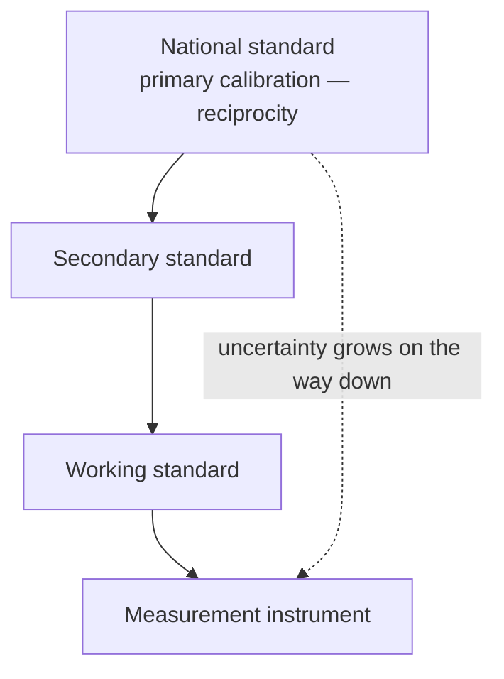

# Lecture 6 — Microphone Scattering, Metrology & Calibration

> [!info] Lecture Info
> **Date:** Thursday 17 September 2026, 8:30–12:00 · Lyngby · **VCH** — *not attended; written from the three slide decks, the recordings' slide order, Problems 6 and its official solutions.*
> **Slides:** `Slides/34870_Lecture_6A_E26.pdf` (microphone scattering, 12 slides) · `Slides/34870_Lecture_6B_E26.pdf` (metrology and calibration, 30 slides) · `Slides/34870_Lecture_6C_E26.pdf` (intro to Labs B and C, 14 slides). Recordings with audio: `Slides/34870_Lecture_6A/6B/6C_E26.mp4` — **watch 6C before the lab**, it is the practical briefing.
> **Problems:** `Exercises/34870_Problems6_2026.pdf` · solutions `Exercises/34870_Solutions6_2026.pdf`
> **Refs:** Leach §2.15 (scattering), §5.2 (T(s)) — uploaded excerpts · Jacobsen *Fundamentals* eq. 7.6 · BIPM SI Brochure, GUM and VIM (`Literature/Metrology - BIPM/`) · B&K Microphone Handbook
> **Previous:** [[Lecture 5 - Microphone Directionality & Condenser Microphones|Lecture 5]] · **Next:** Mo 21/9 — microphone scattering (cont.), lab intro, **Labs B/C start** (quiz due 5 Oct)
> **Interactive version:** <https://study.madsrudolph.dev/34870/#l6>

> [!abstract] Where this lecture sits
> Lecture 5 ended with the condenser microphone's transfer function carrying an unexplained factor $T(j\omega)$. Today explains it: a microphone is an obstacle, and at high frequency the pressure on its diaphragm is **not** the pressure that was there before you put it in the field. That is the difference between a *free-field* and a *pressure* microphone, and it is what Lab B measures. The second half is the measurement science around it: SI units, uncertainty the GUM way, the traceability chain down from the reciprocity primary standard, and the two devices you will actually hold in Lab C — the sound calibrator and the pistonphone.

---

## 1. Free-field vs pressure microphones — 6A slides 3–4

> [!important] Same capsule idea, two design targets
> - **Free-field microphone:** meant to report the sound pressure that existed *before* the microphone was placed in the field. Its own frequency response must therefore **compensate** for the pressure increase that its body causes at high frequency (sound arriving at normal incidence, pointed at the source).
> - **Pressure (cavity) microphone:** used where it has no influence on the field — flush in a wall, or closing a small cavity (couplers, calibrators, ear simulators). **No compensation**: flat response to the pressure actually on the diaphragm.
>
> This is the measurement-world meaning of "pressure microphone" flagged in [[Lecture 5 - Microphone Directionality & Condenser Microphones#3. Classification of microphones — slide 11|Lecture 5 §3]] — not the audio-jargon "closed back" meaning.

## 2. Scattering of sound by a microphone — 6A slides 5–6

A plane wave hits the end of a cylinder of diameter $D$. The total scattered wave is the **reflected wave** from the front face plus **diffracted waves** radiating from the edges. What matters is the size in wavelengths, $D/\lambda$ (equivalently $kR$).

> [!success] The numerical result (slide 6): excess pressure at the centre of the diaphragm
> | $kR$ | excess pressure |
> |---|---|
> | $\lesssim 0.3$ | ≈ 0 dB — the microphone is invisible to the wave |
> | 1 | ≈ +4 dB |
> | ≈ 3 | **≈ +10 dB** (first peak) |
> | ≈ 6 | ≈ −1 dB (dip: edge-diffracted waves arrive in antiphase) |
> | ≈ 9 | ≈ +10 dB again |
>
> *The sound pressure at the diaphragm, measured by the microphone, is not the same as in the undisturbed sound field.* For a ½-inch capsule ($R = 6.35$ mm) $kR = 1$ is 8.6 kHz; for a 1-inch capsule 4.3 kHz.

## 3. The useful approximation: diaphragm reflection only — 6A slides 7–10

Treat the front of the microphone as a plane reflector and ignore the corners. **Valid up to the first peak.**

Symbols: $Z_{ar}$ radiation impedance, $Z_{ad}$ diaphragm impedance, $U$ incident volume velocity on the diaphragm area, $U_t$ diaphragm volume velocity, $U_r$ reflected volume velocity, with $U_t = U - U_r$.

$$p_i = \frac{\rho c}{S}\,U, \qquad U_r = R\,U = \frac{Z_{ad} - \rho c/S}{Z_{ad} + \rho c/S}\,U \quad \text{(Jacobsen eq. 7.6)}$$
$$p_r = Z_{ar}\,U_r, \qquad p_D = p_i + p_r = \frac{\rho c}{S}U + Z_{ar}\frac{Z_{ad} - \rho c/S}{Z_{ad} + \rho c/S}\,U$$

A condenser diaphragm is acoustically very stiff: $Z_{ad} \to \infty \Rightarrow R = 1 \Rightarrow U_r = U$, and

$$\boxed{p_D = p_i\left(1 + \frac{Z_{ar}}{\rho c/S}\right) = T(s)\,p_i} \qquad \text{(Leach eq. 5.1)}$$

> [!note] Reading $T$
> - Low frequency: $Z_{ar} \approx j\omega M_{A1}$ is tiny compared with $\rho c/S$, so $T \to 1$: no effect.
> - High frequency: $Z_{ar} \to R_{A2} = \rho c/S$, so $T \to 2$: **pressure doubling, +6 dB** — the diaphragm is a rigid wall to a short wave (exactly the $R = +1$ wall of 34840 lecture 2).
> - In between, the reactive part of $Z_{ar}$ makes $|T|$ overshoot slightly. The true numerical curve goes higher (+10 dB) and then oscillates, because of the edge diffraction the approximation leaves out — "*Plane reflection: the effect of the corners is not included!*" is printed on every one of these slides.

### Putting $T(s)$ into the circuit (Leach) — slides 9–10

The incident-pressure source $p_i$ is put in series with a copy of the radiation network $Z_{ar} = j\omega M_{A1} \,\|\, [R_{A2} + (R_{A1} \| C_{A1})]$, and that network is driven by a **voltage-controlled current source of gain $1/R_{A2}$** controlled by $p_i$ (the "Gpb" generator in the course circuit). The current $p_i/R_{A2}$ through $Z_{ar}$ produces the extra voltage $p_i Z_{ar}/R_{A2}$, so the node feeding the diaphragm carries $p_i(1 + Z_{ar}/R_{A2}) = T\,p_i$ with $R_{A2} = \rho c/S$.

```tikz
\usepackage{circuitikz}
\begin{document}
\begin{circuitikz}[american, scale=0.9]
\draw (0,0) node[ground]{} to[vsource, l=$p_i$] (0,2.5) -- (1.5,2.5) coordinate(a);
\draw (a) to[L, l=$M_{A1}$] (6,2.5) coordinate(b);
\draw (a) -- (1.5,4) to[R, l=$R_{A2}$] (3.7,4) coordinate(m) to[R, l=$R_{A1}$] (6,4) -- (b);
\draw (m) -- (3.7,5.2) to[C, l=$C_{A1}$] (6,5.2) -- (6,4);
\draw (a) to[cisource, l_=$G_{pb}{=}p_i/R_{A2}$] (1.5,0) node[ground]{};
\draw (b) -- (7.5,2.5) node[right]{$T(s)\,p_i \to$ diaphragm};
\end{circuitikz}
\end{document}
```

The LTspice result on slide 10 (output in dB re 1 V/Pa, 100 Hz–100 kHz) shows the pressure response sagging at the top and the free-field response, with $T$, lifted by up to 6 dB: a free-field microphone is *designed* with extra damping so that capsule × scattering comes out flat.

> [!todo] Problem solving in class (slide 11) = Problems 5 Q2 d–e
> Include the scattering effect in your condenser-microphone LTspice model, then optimise the response. **Keep the circuit — Lab C uses it.**

## 4. Metrology — 6B slides 2–8

> [!quote] BIPM definition
> *Metrology: science of measurement and its application, including all theoretical and practical aspects of measurement, whatever the measurement uncertainty and field of application.* — and Kelvin's line: when you can measure what you are speaking about and express it in numbers, you know something about it.

- **History:** local body-part units → 1795 metre and kilogram (France) → 1875 Metre Convention, **BIPM** founded → 1960 **SI** established → **20 May 2019: all SI units defined through seven natural constants** ($\Delta\nu_{Cs}$, $c$, $h$, $e$, $k$, $N_A$, $K_{cd}$). The seven base units (s, m, kg, A, K, mol, cd) are still used for convenience but are now *derived* from the constants. Only the USA, Liberia and Burma are not officially SI.

> [!important] How to write a value (SI Brochure) — this is graded in reports
> - A value is a **number × unit**, treated as a mathematical product.
> - Unit symbols in **upright** type, never followed by a full stop or a plural "s".
> - Lower case, except when named after a person: **Pa, V, N, Hz, Ω** — but spelled out in lower case: *pascal*, *kelvin* ("a temperature of 293 kelvin").
> - Prefixes for scale: k, µ, p …
> - Course examples: sound pressure 1 Pa = 1 N/m²; resistance 1 Ω; volume velocity 1 m³/s; acoustic impedance 1 Ns/m⁵.

## 5. Uncertainty — the GUM vocabulary and the formula — 6B slides 9, 18

> [!abstract] Vocabulary (GUM, VIM)
> | Term | Meaning |
> |---|---|
> | **Measurement uncertainty** | a parameter (e.g. a standard deviation) characterising the dispersion of values that could reasonably be attributed to the measurand |
> | **True value** | the result we seek; it is not known |
> | **Measurement error** | result minus true value (so also unknown) |
> | **Repeatability** | spread under the *same* conditions |
> | **Reproducibility** | spread under *different* conditions (operator, lab, day, instrument) |

**Measurement model:** $Y = f(X_1, \dots, X_n)$, estimated by $y = f(x_1, \dots, x_n)$.

> [!success] Combined standard uncertainty
> Uncorrelated inputs:
> $$u_c^2(y) = \sum_i \left(\frac{\partial f}{\partial x_i}\right)^2 u^2(x_i)$$
> Correlated inputs:
> $$u_c^2(y) = \sum_i \left(\frac{\partial f}{\partial x_i}\right)^2 u^2(x_i) + 2\sum_{i<j} \frac{\partial f}{\partial x_i}\frac{\partial f}{\partial x_j}\,u(x_i)\,u(x_j)\,r(x_i, x_j)$$
> $\partial f/\partial x_i \approx \Delta y/\Delta x_i$ is the **sensitivity coefficient** (how much $y$ moves per unit of $x_i$); $u(x_i)$ is the standard uncertainty of $x_i$ (its standard deviation); $r$ the correlation coefficient. By the central limit theorem the distribution of $Y$ tends to a normal one even when the $X_i$ are not.

> [!warning] Two different "sensitivities"
> The microphone's **pressure sensitivity** $M$ (mV/Pa) and a GUM **sensitivity coefficient** $\partial M/\partial x_i$ share a word and nothing else. Problems 6 carries the same warning as a footnote.

## 6. Standards, traceability, and how microphones are calibrated — 6B slides 10–17



Every step down the chain is a comparison against the step above, and each adds uncertainty; **traceability** is the unbroken, documented chain back to the national standard. National institutes (DFM in Denmark — cellar of building 352 — NPL, PTB, NIST, CENAM, KRISS …) sit in regional organisations (EUROMET, SIM, COOMET, APMP …) under the BIPM, and check each other through **key comparisons**.

> [!important] The acoustic primary standard: reciprocity
> **Three microphones are measured in pairs**, one acting as emitter and the other as receiver. A condenser microphone is reciprocal (it works both ways with the same constant), so each pair measurement gives the *product* of two sensitivities; the three combinations give three equations from which all three sensitivities follow — absolutely, with no reference microphone needed.
> - **Pressure reciprocity:** the two microphones close the ends of a small cavity (coupler). B&K 4160/4180 laboratory standards, four coupler lengths 3.5 / 5.5 / 7.5 / 9.5 mm.
> - **Free-field reciprocity:** the two microphones face each other at distance $d_{12}$ in an anechoic room (absorbing walls, homogeneous medium).

## 7. Reminder: $f_s$ and $Q$ from a measured response — 6B slide 20 (Lab C)

1. $f_s$: the frequency where the **phase has dropped 90°** from its mid-frequency value.
2. $Q = e(f_s)/e(f \ll f_s)$, the **linear** ratio. A drop in sensitivity at resonance means $Q < 1$ and a *negative* value of $20\log Q$. (Notation clash: $Q$ is also charge.)

## 8. Level calibration devices — 6B slides 23–28

> [!abstract] Verification rather than metrological calibration
> A sound calibrator or pistonphone applies a **well-defined sound pressure** to the microphone so the whole chain can be *verified* in the field or lab. For the pressure not to depend on which microphone is inserted, the device needs a **low internal (source) impedance**.
>
> | | Sound calibrator | Pistonphone |
> |---|---|---|
> | Frequency, level | 1 kHz (or 250 Hz), **94 dB** (1 Pa) / 114 dB (10 Pa) | **250 Hz, 124 dB** |
> | Use | field | laboratory, secondary calibration |
> | How | small loudspeaker in a coupler cavity; **B&K 4231-type**: a built-in feedback microphone and gain control hold the pressure constant; older **B&K 4230**: loudspeaker with a Helmholtz resonator loading the back of the diaphragm | cam-driven pistons pump a known volume into a closed cavity: **B&K 4228**; single frequency and level, very stable |

> [!note] Why the pistonphone is so trustworthy
> A rigid piston is a volume-velocity source, and a closed cavity is a compliance $C_A = V/\gamma p_s$: $p = U/(j\omega C_A) = \gamma p_s\,\Delta V/V$ — geometry and the static pressure, nothing else. That last dependence is why a pistonphone comes with a barometer correction.

## 9. Intro to Labs B and C — deck 6C

> [!important] Lab B — scaled microphone (cylinder scattering)
> Measures what §2 computed: the pressure on the end of a cylinder vs the undisturbed field. The **free-field correction** is *defined as the ratio between the undisturbed sound field and the pressure at the diaphragm — not the microphone output*. It is sometimes used to correct a microphone used in the "wrong" field. B&K handbook curves: the bump sits near 7 kHz for a 1-inch, 13 kHz for a ½-inch, 25 kHz for a ¼-inch capsule, all about +9 to +10 dB: **the larger the microphone, the lower in frequency the effect**.
>
> **Effect of size** (1″, ½″, ¼″, ⅛″): bigger → more field disturbance, **more sensitivity**, lower maximum frequency; smaller → the opposite.

> [!important] Lab C — microphone calibration with an electrostatic actuator
> A metal grid is placed just above the diaphragm (protection grid removed) and driven with a **high DC voltage plus an AC signal**; the electric field pulls directly on the diaphragm. **No acoustic excitation → no scattering effects**, so it gives the *pressure* frequency response cleanly. Good for the **shape** of the response, **unsuited for absolute sensitivity** (that comes from the calibrator or pistonphone). Compare the B&K ½″ **4191 free-field** and **4192 pressure-field** capsules: the actuator response of the 4191 droops at high frequency by exactly the free-field correction it is built to cancel.

> [!warning] Lab etiquette (labs in buildings 354 and 355)
> No food or drink; never alone in the labs, tell the lab responsible when you arrive and leave; tidy up. First use of any equipment needs a (safety) introduction; do not take parts from existing setups; label your workspace. **Report damage or injuries immediately — do not hide it, do not repair it yourself.**

---

## 10. Problems 6 — worked

> [!example]+ Problem 1 — Uncertainty of a condenser microphone's sensitivity
> **a)** From [[Lecture 5 - Microphone Directionality & Condenser Microphones#4j. Transfer function — slide 25|Lecture 5]]: $M = \dfrac{E S_D C_{MT}}{x_0}$ with $C_{MT} = \left(\dfrac{1}{C_{MD}} + \dfrac{S_D^2}{C_{AB}}\right)^{-1}$. $M$ contains neither $M_{MD}$ nor $R_{MD}$, so
> $$\frac{\partial M}{\partial M_{MD}} = 0, \qquad \frac{\partial M}{\partial R_{MD}} = 0, \qquad \frac{\partial M}{\partial C_{MD}} = \frac{E S_D}{x_0}\cdot\frac{1}{C_{MD}^2\left(\dfrac{1}{C_{MD}} + \dfrac{S_D^2}{C_{AB}}\right)^2}$$
> (quotient rule on $C_{MT}$).
>
> **b)** With the Problems 5 values ($E = 200$ V, $S_D = 2.5447\times10^{-4}$ m², $x_0 = 20$ µm, $C_{MD} = 4\times10^{-6}$ m/N, $S_D^2/C_{AB} = 9042$ N/m): $E S_D/x_0 = 2544.7$, bracket $= 2.5904\times10^5$, so
> $$\frac{\partial M}{\partial C_{MD}} = 2544.7 \times \frac{6.25\times10^{10}}{6.710\times10^{10}} = \boxed{2.370\times10^{3}\ \frac{\text{V/Pa}}{\text{m/N}}}$$
>
> **c)** $u(C_{MD}) = 0.1 \times 4\times10^{-6} = 4\times10^{-7}$ m/N, the other two coefficients are zero:
> $$u_c(M) = \frac{\partial M}{\partial C_{MD}}\,u(C_{MD}) = 2370 \times 4\times10^{-7} = \boxed{0.948\ \text{mV/Pa}}$$
> — 9.7 % of $M = 9.8$ mV/Pa for a 10 % spread in $C_{MD}$ (slightly less than 10 % because the back-volume air spring, which is not uncertain here, carries 3.5 % of the stiffness).
>
> **d)** Too simplistic, valid only as an exercise. A condenser microphone is a highly coupled system: changing $C_{MD}$ changes the static deflection under the polarisation voltage and therefore $x_0$ — those two are **correlated**, which the uncorrelated formula ignores. Neglected contributions ($E$, $x_0$, $S_D$, temperature, static pressure through $C_{AB}$) are not negligible in practice.

> [!example]+ Problem 2 — the same thing in LTspice
> **a)** Cursor at 250 Hz, linear axis: $M_{250} = 9.6$ mV/Pa, close to the 9.8 of Problems 5 (the circuit includes the load and the small cavity).
> **b)** $f_0$ from the −90° phase point, $Q$ from the linear ratio $e(f_0)/e(250\,\text{Hz})$: should reproduce 10.6 kHz and 2.36.
> **c)** With **Gpb deactivated**: ±10 % on $M_{MD}$ and $R_{MD}$ changes $M_{250}$ negligibly; ±10 % on $C_{MD}$ gives **+0.922 / −0.929 mV/Pa**, matching 1c's 0.948 (the finite-difference values are slightly asymmetric because $M(C_{MD})$ is not linear).
> **d)** With Gpb active nothing changes at 250 Hz: the free-field correction only acts at high frequency. But $M_{MD}$, $R_{MD}$, $C_{MD}$ do matter there — **at and above resonance the response is governed by mass and damping, below it by compliance.**

> [!example]+ Problem 3 — Pistonphone and calibrator
> **a)** The pistonphone is heavy and stiff, so its volume velocity does not depend on the load: an ideal **volume-velocity source** $U_i$ feeding the cavity compliance $C_A = V/\gamma p_s = V/\rho c^2$ **in parallel** with the microphone's acoustic impedance $Z_A$, both to ground.
>
> ```tikz
> \usepackage{circuitikz}
> \begin{document}
> \begin{circuitikz}[american]
> \draw (0,0) node[ground]{} to[isource, l=$U_i$] (0,2.5) -- (5,2.5);
> \draw (2.5,2.5) to[C, l=$C_A$] (2.5,0) node[ground]{};
> \draw (5,2.5) to[generic, l=$Z_A$ (mic)] (5,0) node[ground]{};
> \node at (2.5,2.9) {$p$};
> \end{circuitikz}
> \end{document}
> ```
>
> **b)** $p = \left(\dfrac{1}{j\omega C_A} \,\Big\|\, Z_A\right) U_i$. For the pressure to be the same whatever microphone is inserted we need $Z_A \gg 1/(\omega C_A)$, i.e. $C_A \gg 1/(\omega Z_A)$: **the larger the cavity volume, the less the pressure depends on the microphone** — but the cavity must stay small compared with the wavelength so it remains a lumped compliance. Independence of the environment is harder: $C_A$ contains $p_s$, hence the barometric correction.
>
> **c–d)** Commercial calibrator: the piezo bar + diaphragm is a **pressure source $p_a$ with internal impedance $M_{as}$, $R_{as}$, $C_{as}$** in series; it drives the front volume $V_1$ (compliance to ground, with the microphone $Z_a$ in parallel); a long narrow tube (acoustic mass $M_{ah}$, plus its resistance) connects to the rear volume $V_3$ (compliance $C_{a3}$ to ground) behind the diaphragm. Two resonances: the diaphragm/suspension resonance ($M_{as}$, $C_{as}$) and the **Helmholtz resonance** ($M_{ah}$, $C_{a3}$). Tuning both to the calibration frequency makes the source impedance of the calibrator very small there — which is exactly the "low internal impedance" requirement of §8, achieved in a small device.

---

## Summary — what to walk away with

> [!success] Key takeaways
> - A microphone disturbs the field once $kR \gtrsim 0.3$: up to **+10 dB** on axis at $kR \approx 3$. **Free-field** microphones compensate for it in their own response, **pressure** microphones do not.
> - Plane-reflection model: $p_D = p_i\,(1 + Z_{ar}/(\rho c/S)) = T(s)\,p_i$, $T \to 2$ (+6 dB) at high frequency; valid up to the first peak because the edges are ignored. In the circuit: a G source of gain $1/R_{A2}$ driving a copy of the radiation network in series with $p_i$.
> - SI since 2019 rests on seven constants; write values as number × upright unit symbol.
> - GUM: $u_c^2(y) = \sum c_i^2 u^2(x_i)$ (+ correlation terms), $c_i = \partial f/\partial x_i$. For the condenser mic only $C_{MD}$ matters in the flat band: 10 % → **0.948 mV/Pa**.
> - Traceability chain: reciprocity primary standard (three microphones in pairs, coupler or free field) → secondary → working → instrument.
> - Calibrator 94 dB @ 1 kHz (field), pistonphone 124 dB @ 250 Hz (lab); both need low source impedance; big cavity → microphone-independent pressure.
> - Lab B = measure the scattering; Lab C = actuator response (no scattering, shape only) + absolute level from a calibrator.

> [!question] Open questions — not attended, so check these in the recordings or on Monday
> - ⬜ Does VCH want $T(s)$ built with the **tube-end** radiation network (0.6133 ρ/πa, as in the Problems 4/5 solutions) or the baffled-piston one? The slide's circuit labels are Ma1/Ra1/Ra2/Ca1 without values.
> - ⬜ Which standard uncertainties (type A from repeats, type B from certificates) are expected in the Lab C uncertainty budget?
> - ⬜ Anything said in the 6C recording about group timeslots for Labs B/C.

> [!tip] Looking ahead
> Monday 21/9: scattering (continued), lab introduction, **Labs B/C begin** (21–29 Sep, quiz due 5 Oct). Thursday 24/9: moving-coil loudspeakers.
