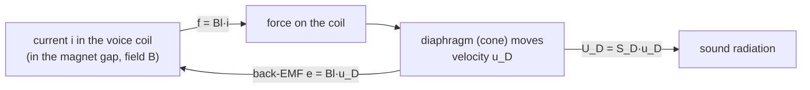

# Lecture 7 — Loudspeakers 1: Moving Coil

> [!info] Lecture Info
> **Date:** Thursday 24 September 2026, 8:30–12:00 · Lyngby · **VCH**. Written from the slide deck and Problems 7. No recording and no official solutions yet, so every answer below was checked against the brackets on the problem sheet and against an LTspice run.
> **Slides:** `Slides/34870_Lecture_7_E26.pdf` (27 slides)
> **Problems:** `Exercises/34870_Problems7_2026.pdf` (Loudspeakers 1; answers in brackets)
> **Refs:** Beranek §6.1–6.11, 6.18 · Leach §6.1–6.21, 11.7.1–11.7.4 (T-S measurement) · Klippel (nonlinearities)
> **LTspice model (Problem 4):** `5. Semester/Electroacoustics/LTspice/Problems 7 - Loudspeaker/`, which has `p7.py` plus two generated `.asc` files, checked headless against the closed form to within 4·10⁻⁵
> **Previous:** [[Lecture 6 - Microphone Scattering, Metrology & Calibration|Lecture 6]] · **Next:** Mo 28/9 Labs B/C · Th 1/10: loudspeaker **enclosures** (closed box: the "alternative" on slide 16)
> **Interactive version:** <https://study.madsrudolph.dev/34870/#l7>

> [!abstract] Where this lecture sits
> This is the dynamic microphone from [[Lecture 4 - Analogies - Transducers & Dynamic Microphones#4. Lecture 4B — Dynamic microphones (VCH)|Lecture 4B]] running in reverse. It has the same three-domain circuit, the same gyrator ($f = Bl\,i$, $e = Bl\,u$) and the same "total mass / total resistance / total compliance" bookkeeping. One thing changes the whole design philosophy. A microphone's output is proportional to **velocity**, so it wants to be *damping controlled*. A loudspeaker's far-field pressure is proportional to **acceleration**, so it wants to be *mass controlled*. The rest of the lecture follows from that: the five **Thiele-Small parameters** that sum a driver up, how to **measure** them (this is Lab D), and the practical limits of **efficiency** (≈1 %), **excursion** (nonlinearity), the **lossy voice-coil inductance**, and how **near-field** measurements relate to the far field.

---

## 1. The electrodynamic loudspeaker — slides 3–4

Driver types: **woofer** (big cone, low frequencies), **midrange**, **tweeter** (small dome, high frequencies), **full range** (a compromise). They all use the same physics, only scaled differently.

## 2. The equivalent circuit — slide 5 (Leach)

> [!important] Three domains, as for the dynamic microphone
> | Domain | Elements | Meaning |
> |---|---|---|
> | Electrical | $R_g$ | amplifier output resistance (≈ 0 for a modern amplifier) |
> | | $R_E$ | DC resistance of the voice coil |
> | | $L_E$ ∥ $R_E'$ | coil inductance, with $R_E'$ modelling the **eddy-current losses** (§10) |
> | Mechanical | $M_{MD}$ | mass of coil + diaphragm (**without** air) |
> | | $R_{MS}$, $C_{MS}$ | damping and compliance of the suspension (spider + surround) |
> | Acoustical | $Z_{AB}$, $Z_{AF}$ | acoustic load on the back and front of the diaphragm |
>
> Couplings: $e = Bl\,u_D$ (back-EMF, electrical side), $f_D = Bl\,i$ (force, mechanical side), $U_D = S_D u_D$ and $f = S_D p_D$ between mechanical and acoustical. *The circuit assumes small signals.* §8 covers what happens when that stops being true.

## 3. Microphone vs loudspeaker: why "mass control" — slide 6

> [!note] The one comparison to remember
> **Dynamic microphone:** output $e = Bl\,u$, which is proportional to **velocity**. A flat response therefore needs $u \propto p$, and that happens where the mechanical impedance is resistive: **damping control**, a band-pass around resonance, with $M = Bl\,S_D/R_{MT}$.
>
> **Loudspeaker:** a small piston in a baffle radiates as a point source on a plane:
> $$p(r) = j\rho\omega U\,\frac{e^{-jkr}}{2\pi r} = \rho S_D\,a\,\frac{e^{-jkr}}{2\pi r} \qquad (a = \text{acceleration})$$
> so the far-field pressure is proportional to **acceleration**. A flat response needs constant acceleration for a constant voltage, which is what happens *above* resonance where the moving mass dominates: $a = f/M_{MS} = Bl\,i/M_{MS}$ with $i ≈ e_g/R_E$. That is **mass control**, a **high-pass** response with the pass-band level
> $$p_{1m} = \frac{\rho}{2\pi}\,\frac{Bl\,S_D}{R_E M_{MS}}$$
>
> The catch: with $a = -\omega^2 x$ we get $p = -\omega^2\rho S_D x\,e^{-jkr}/2\pi r$, so **the same pressure at half the frequency needs four times the displacement**. Bass is paid for in excursion.

## 4. Volume velocity transfer function — slides 7–8

Infinite baffle, low-to-mid frequencies ($ka < 1$). Each side of the diaphragm sees the radiation mass of a baffled piston, so $Z_{AB} = Z_{AF} ≈ j\omega M_{A1}$.

Write the three loop equations:

| Domain | Equation |
|---|---|
| Acoustical | $p_D = S_D u_D\,j\omega\,2M_{A1}$ (front + back) |
| Mechanical | $Bl\,i = u_D\left(j\omega M_{MD} + R_{MS} + \dfrac{1}{j\omega C_{MS}}\right) + S_D p_D = u_D Z_M + S_D p_D$ |
| Electrical | $e_g = i Z_E + Bl\,u_D$, with $Z_E = R_g + R_E + \dfrac{j\omega L_E R_E'}{j\omega L_E + R_E'}$ |

Eliminate $i$ and $p_D$, and set $L_E ≈ 0$ and $R_g ≈ 0$:

$$U_D = \frac{Bl\,S_D}{R_E}\;\frac{1}{Z_M + j\omega S_D^2\,2M_{A1} + (Bl)^2/R_E}\;e_g$$

> [!success] Rewritten with the "total" quantities (Leach 6.5, Beranek 6.3)
> $$\boxed{U_D = \frac{Bl\,S_D}{R_E}\;\frac{1}{j\omega M_{MS} + R_{MT} + 1/(j\omega C_{MS})}\;e_g}$$
> - **Total moving mass (infinite baffle):** $M_{MS} = M_{MD} + 2S_D^2 M_{A1}$. The air load on *both* sides is included.
> - **Total resistance:** $R_{MT} = R_{MS} + (Bl)^2/R_E$. The second term is **electrical damping**: the back-EMF drives a current through $R_E$, which brakes the cone. With a voltage-driven speaker it is normally much bigger than $R_{MS}$.

> [!tip] Where the $(Bl)^2/R_E$ comes from
> This is the gyrator of [[Lecture 4 - Analogies - Transducers & Dynamic Microphones#2e. Impedance conversion — what one domain sees of the next (slide 16)|Lecture 4 §2e]]. Seen from the mechanical side, an electrical impedance $Z_E$ turns into a mechanical impedance $(Bl)^2/Z_E$ in series. A short-circuited coil ($R_E$ small) therefore gives *heavy* damping. That is why an amplifier with a low output resistance "controls" a woofer.

## 5. Sound pressure transfer function — slides 9–10

Insert $U_D$ into the point-source-on-a-baffle formula $p = j\rho\omega U_D\,e^{-jkr}/2\pi r$ and multiply top and bottom by $j\omega C_{MS}$:

$$p(r) = \frac{Bl S_D\rho}{R_E M_{MS}}\;\frac{M_{MS}C_{MS}(j\omega)^2}{(j\omega)^2 M_{MS}C_{MS} + j\omega C_{MS}R_{MT} + 1}\;\frac{e^{-jkr}}{2\pi r}\,e_g$$

> [!success] The loudspeaker's transfer function: a second-order high-pass
> $$\boxed{p(r) = \frac{\rho}{2\pi}\,\frac{Bl\,S_D}{R_E M_{MS}}\;\frac{(j\omega/\omega_S)^2}{(j\omega/\omega_S)^2 + (1/Q_{TS})(j\omega/\omega_S) + 1}\;\frac{e^{-jkr}}{r}\,e_g}$$
> with $\omega_S = 1/\sqrt{M_{MS}C_{MS}}$ and $Q_{TS} = \dfrac{1}{R_{MT}}\sqrt{\dfrac{M_{MS}}{C_{MS}}}$.
>
> - **Below $f_S$:** it falls at 12 dB/octave (40 dB/decade) and the phase heads to +180°.
> - **Above $f_S$:** it is flat. This is the mass-controlled pass band.
> - **Sensitivity** ($r = 1$ m, $e_g = 1$ V, mid-band): $p_{1m} = \dfrac{\rho}{2\pi}\dfrac{Bl\,S_D}{R_E M_{MS}}$. It is also quoted for $e_g = 2.83$ V (1 W into 8 Ω) or for 1 W directly.
> - $Q_{TS}$ sets the shape at $f_S$: $1/\sqrt2 ≈ 0.707$ is maximally flat (Butterworth), higher gives a bump, lower a slow roll-off.

## 6. Electrical input impedance — slide 11

$$Z_{ET} = R_E + \frac{j\omega L_E R_E'}{j\omega L_E + R_E'} + \frac{(Bl)^2}{Z_M + S_D^2 Z_A} = R_E + \frac{j\omega L_E R_E'}{j\omega L_E + R_E'} + \frac{(Bl)^2}{j\omega M_{MS} + R_{MS} + 1/(j\omega C_{MS})}$$

The mechanical **series** resonance appears on the electrical side as a **parallel** resonance: a peak. This is the gyrator again, which turns impedances into admittances.

- At $f_S$ the mechanical reactances cancel: $Z_{max} = R_E + (Bl)^2/R_{MS}$. Note that it is **$R_{MS}$**, not $R_{MT}$. The electrical damping is $R_E$ itself, and it is already there in series.
- Well above $f_S$, $Z ≈ R_E$ until the coil inductance makes it rise again (the slide's curve climbs from ~7 Ω towards 20 Ω at 10 kHz).
- The minimum just above resonance is what the data sheet calls the "minimum impedance" (6.3 Ω at 124 Hz for the 315 SWR).

## 7. Thiele-Small parameters — slides 12–14

> [!important] The five numbers that describe a driver at low frequency
> | Parameter | Formula | Typical |
> |---|---|---|
> | Resonance frequency | $\omega_S = \dfrac{1}{\sqrt{M_{MS}C_{MS}}}$ | |
> | Mechanical Q | $Q_{MS} = \dfrac{1}{R_{MS}}\sqrt{\dfrac{M_{MS}}{C_{MS}}} = \dfrac{\omega_S M_{MS}}{R_{MS}}$ | 2–10 |
> | Electrical Q | $Q_{ES} = \dfrac{R_E}{(Bl)^2}\sqrt{\dfrac{M_{MS}}{C_{MS}}} = \dfrac{R_E\,\omega_S M_{MS}}{(Bl)^2}$ | 0.2–1.5 |
> | Total Q | $Q_{TS} = \dfrac{1}{R_{MT}}\sqrt{\dfrac{M_{MS}}{C_{MS}}} = \dfrac{Q_{MS}Q_{ES}}{Q_{MS} + Q_{ES}}$ | |
> | Equivalent volume | $V_{AS} = \rho c^2 S_D^2 C_{MS}$ | |
>
> - **Why $Q_{TS}$ is the "parallel" combination:** $R_{MT} = R_{MS} + (Bl)^2/R_E$ and each $Q$ is proportional to $1/R$, so $1/Q_{TS} = 1/Q_{MS} + 1/Q_{ES}$. Since $Q_{ES} \ll Q_{MS}$, the **electrical damping dominates**: $Q_{TS} ≈ Q_{ES}$.
> - **$V_{AS}$** is the volume of air whose acoustic compliance $V/\rho c^2$, seen through $S_D^2$, equals the suspension compliance: $C_{AS} = S_D^2 C_{MS}$. A closed box of volume $V_{AS}$ doubles the stiffness. This is the bridge to next lecture's enclosures.

> [!example] Slide 13 example: small full-range driver
> $R_E = 6$ Ω, $L_E = 0.05$ mH, $Bl = 3.4$ Tm, $M_{MD} = 2.3$ g, $R_{MS} = 0.35$ Ns/m, $C_{MS} = 0.98$ mm/N, $a = 3.05$ cm.
> - $S_D = \pi a^2 = 2.922\times10^{-3}$ m², $M_{A1} = 8\rho/(3\pi^2 a) = 10.4$ kg/m⁴ ⇒ $2 S_D^2 M_{A1} = 0.18$ g ⇒ $M_{MS} = \mathbf{2.5}$ **g**. The air adds 8 %.
> - $f_S = 1/(2\pi\sqrt{2.48\text{ g}\times0.98\text{ mm/N}}) = \mathbf{102}$ **Hz**
> - $R_{MT} = 0.35 + 3.4^2/6 = 0.35 + 1.93 = \mathbf{2.28}$ **Ns/m**. The electrical damping is 5.5× the mechanical damping.
> - $Q_{TS} = \omega_S M_{MS}/R_{MT} = \mathbf{0.7}$, which is practically Butterworth.

### Free air vs infinite baffle — slide 14 (Leach 3.7, Beranek 4.19/4.21)

| Mounting | Radiation mass | Valid for | Air in $M_{MS}$ |
|---|---|---|---|
| **Infinite baffle** (half space, per side) | $M_{A1} = \dfrac{8\rho}{3\pi^2 a}$ on each side | $ka < 1$ | $2S_D^2 M_{A1}$ |
| **Free air** (both sides connected round the rim) | $M_{A1} = \dfrac{8\rho}{3\pi^2 a}$ **for the two sides together** | $ka < 0.5$ | $S_D^2 M_{A1}$ |

> [!warning] Same symbol, half the air
> In free air the front and back air loads short-circuit round the edge, and the total radiation mass is *half* the baffled one. Less mass means **a higher resonance frequency in free air** (the 315 SWR: 23.96 Hz free vs 22.9 Hz baffled). Data sheets list "free air" and "baffled" columns for exactly this reason (Problem 2).

## 8. Measuring the T-S parameters (Lab D) — slides 15–16

> [!important] Step 1: $f_S$ and the Q's from the impedance curve (Beranek 6.10, Leach 11.7)
> Measure voltage and current together: amplifier → 33 Ω series resistor → speaker, with $V_R$ giving $I$ and $V_{LOUD}$ giving the speaker voltage.
> 1. $f_S$ is at the peak, and $Z_{MAX} = R_E + (Bl)^2/R_{MS}$. $R_E$ comes from a DC measurement.
> 2. $r_c = \dfrac{Z_{MAX}}{R_E} = 1 + \dfrac{(Bl)^2}{R_E R_{MS}}$
> 3. Find $f_1 < f_S < f_2$ where $|Z_{ET}| = Z_r = \sqrt{R_E Z_{MAX}}$, the geometric mean and **not** the −3 dB point.
> 4. $$Q_{MS} = \frac{f_S\sqrt{r_c}}{f_2 - f_1}, \qquad Q_{ES} = \frac{Q_{MS}}{r_c - 1}, \qquad Q_{TS} = \frac{Q_{MS}}{r_c}$$
>
> *Why $\sqrt{R_E Z_{MAX}}$:* at $Z_r$ the motional part of the impedance has the magnitude that makes $f_2 - f_1$ come out as $f_S\sqrt{r_c}/Q_{MS}$ exactly. The −3 dB points would give the bandwidth of the whole $Z$, which is not a clean Q.
>
> **Sanity check with the 315 SWR (baffled, R_E only, computed):** $Z_{MAX} = 46.86$ Ω, $r_c = 8.583$, $Z_r = 16.00$ Ω, $f_1 = 15.82$ Hz, $f_2 = 33.00$ Hz (their geometric mean is $f_S = 22.85$ Hz). This gives $Q_{MS} = 22.85\sqrt{8.583}/17.18 = 3.90$, $Q_{ES} = 0.514$ and $Q_{TS} = 0.454$, which matches the data sheet exactly.

> [!important] Step 2: $M_{MS}$, $C_{MS}$, $Bl$, $R_{MS}$ by the **added-mass** method
> Glue a known mass $\Delta M$ to the cone and measure the new resonance $f_{S1}$:
> $$f_S = \frac{1}{2\pi\sqrt{M_{MS}C_{MS}}}, \quad f_{S1} = \frac{1}{2\pi\sqrt{(M_{MS}+\Delta M)C_{MS}}} \;\Rightarrow\; M_{MS} = \frac{\Delta M}{(f_S/f_{S1})^2 - 1}$$
> $$C_{MS} = \frac{1}{(2\pi f_S)^2 M_{MS}}, \qquad Bl = \sqrt{\frac{2\pi f_S R_E M_{MS}}{Q_{ES}}}, \qquad R_{MS} = \frac{2\pi f_S M_{MS}}{Q_{MS}}$$
> These are just the T-S definitions of §7 solved backwards. Example: 20 g on the 315 SWR moves $f_S$ from 22.85 to 20.63 Hz, and the formula returns 88.2 g.
>
> **Alternative:** change $C_{MS}$ instead of $M_{MS}$ by mounting the unit in a closed box of known volume (next lecture).

## 9. Efficiency — slide 18 (Beranek 6.9, Leach 6.20)

Defined at mid-frequencies, where $f \gg f_S$ and $Z_E ≈ R_E$:

$$\eta = \frac{\text{radiated acoustic power}}{\text{electrical input power}} = \frac{\tfrac12\text{Re}\{Z_{AR}\}|U_D|^2}{\tfrac12|i|^2\text{Re}\{Z_E\}} ≈ \frac{\tfrac12\,\dfrac{\omega^2\rho}{2\pi c}\left(\dfrac{Bl\,S_D\,e_g}{R_E M_{MS}\,\omega}\right)^2}{\tfrac12\,\dfrac{e_g^2}{R_E}}$$

- The numerator's $\omega^2\rho/2\pi c$ is the **radiation resistance of a baffled piston at low $ka$** (Lecture 3/4: $\text{Re}\,Z_{AR} ≈ \rho c k^2/2\pi$).
- The bracket is $U_D$ in the mass-controlled band, $|U_D| = Bl S_D e_g/(R_E M_{MS}\omega)$.
- The two $\omega^2$ cancel, so **the efficiency is flat above $f_S$**, just like the pressure:

$$\boxed{\eta = \frac{\rho}{2\pi c}\,\frac{1}{R_E}\left(\frac{Bl\,S_D}{M_{MS}}\right)^2}$$

> [!warning] Typically η ≈ 1 %, which is very low
> Almost all the electrical power becomes **heat in the voice coil**, so the driver's thermal design matters. Levers to raise $\eta$ are a bigger $Bl$ (bigger, costlier magnet), a bigger $S_D$, a lighter $M_{MS}$, and a lower $R_E$. The trade-off is that raising $Bl$ also lowers $Q_{ES}$, which changes the low-frequency response (next lecture).

## 10. Diaphragm displacement and nonlinearity — slides 19–22

$$x_D = \int u_D\,dt \;\Rightarrow\; x_D = \frac{u_D}{j\omega} = \frac{Bl}{j\omega R_E}\,\frac{1}{j\omega M_{MS} + R_{MT} + 1/(j\omega C_{MS})}\,e_g$$

$$\boxed{x_D = \frac{Bl\,C_{MS}}{R_E}\;\frac{1}{(j\omega/\omega_S)^2 + (1/Q_{TS})(j\omega/\omega_S) + 1}\;e_g}$$

This is a **low-pass** with the same poles as the pressure. Below $f_S$ the displacement is the static value $Bl\,C_{MS}\,e_g/R_E$ (force $Bl\,e_g/R_E$ into the spring $C_{MS}$). Above $f_S$ it falls at 40 dB/decade. So *the displacement is large for large amplitudes and low frequencies*.

### Overhung vs underhung coil — slide 20

The coil only feels the full $Bl$ while its windings fill the magnet gap. Here $h_{mg}$ is the gap height and $l_{vc}$ the voice-coil length.

| | **Overhung** (long coil, $l_{vc} > h_{mg}$) | **Underhung** (short coil, $l_{vc} < h_{mg}$) |
|---|---|---|
| Linear range | $x_{max,lin} ≈ \dfrac{l_{vc} - h_{mg}}{2}$ | $x_{max,lin} ≈ \dfrac{h_{mg} - l_{vc}}{2}$ |
| + | better cooling, larger excursion | high sensitivity (all the copper sits in the field) |
| − | copper outside the gap does no work | poor cooling, needs a large (costly) gap |

### What large excursion does — slides 21–22 (Klippel, and course 34871 in January)

| Parameter vs $x$ | What happens |
|---|---|
| $Bl(x)$ **drops** | the coil leaves the gap |
| $C_{MS}(x)$ **drops** | the suspension hardens at the ends of its travel |
| $L_E(x)$ **drops for $x > 0$** | the coil moves out of the iron |

The nonlinear $Bl(x)$, $C_M(x)$ and $L_E(x)$ generate **harmonics** (one tone in, multiples out) and **intermodulation** (two tones in, sum and difference products out). Slide 22 shows simulated spectra at 1 V, 10 V and 100 V drive, where the distortion products grow with level. The full treatment is 34871 Nonlinear Transducers.

### High frequencies — slide 23

Above a few kHz the cone stops moving as a rigid piston and **vibration modes** (break-up) appear. The slide shows the measured voice-coil acceleration of a 6.5-inch driver, where the flat piston region ends in peaks and dips. The lumped model is no longer valid there.

## 11. Lossy voice-coil inductance — slides 24–25

> [!note] Why an ideal $L_E$ is wrong
> The pole piece is a conductor inside the coil, so it acts like the short-circuited **secondary winding of a transformer**. The coil's alternating field induces **eddy currents** in the iron, and these react back on the coil in two ways:
> - **lower inductance** (the eddy field opposes the coil's field)
> - **more losses** (a real part in the "inductor's" impedance)
>
> The result is an impedance that rises more slowly than $\omega$ and has a phase below 90°.

> [!success] Empirical model: a fractional-order inductor
> $$Z_{L_E'} = L_E'\,(j\omega)^n, \quad n < 1 \qquad\Longleftrightarrow\qquad v = L_E'\,\frac{\partial^n i(t)}{\partial t^n}$$
> Phase is $n\times90°$ at every frequency. With $n = 0.76$ that is 68°.
>
> **LTspice:** a voltage-dependent current source (G) wired across its own terminals, with gain $1/Z$ so that *current = voltage / Z*:
> `G_Le  a  b  a  b  Laplace=1/(10m*s**0.7)` (the slide's example; Problems 7 uses $L_E' = 0.0106$, $n = 0.76$).
>
> On the slide's measured curve, the ideal inductor overshoots badly above 1 kHz, while the $(j\omega)^n$ model follows the measurement to 10 kHz.

## 12. Near field vs far field — slide 26

$$p_{near} = Z_{ar}U ≃ j\omega M_{A1}U = j\omega\frac{8\rho}{3\pi^2 a}U \qquad\qquad p_{ff} = j\omega\frac{\rho}{2\pi r}U$$

$$\boxed{\frac{p_{near}}{p_{ff}} = \frac{16\,r}{3\pi a}}$$

Both are $\propto j\omega U$, so they have the **same frequency dependence and differ only in level**, and that level depends on the piston radius. So **the far-field response can be deduced from a near-field measurement**: put the microphone almost against the dust cap, then subtract $20\log(16r/3\pi a)$. The payoff is that no anechoic room is needed, because the near-field pressure is so large that room reflections don't matter. It is valid only while $ka < 1$, since above that $Z_{ar}$ is no longer a pure mass (see the figure in §13, Problem 4).

---

## 13. Problems 7 — worked

*ρ = 1.2 kg/m³, c = 344 m/s. "Moving mass" includes the air load.*

> [!example]+ Problem 1 — T-S parameters of a baffled driver
> $M_{MS} = 38$ g, $R_{MS} = 1.5$ Ns/m, $C_{MS} = 0.9$ mm/N, $Bl = 5$ Tm, $R_E = 6$ Ω, $a = 10$ cm ⇒ $S_D = \pi a^2 = 0.03142$ m².
>
> **a)**
> - $\omega_S = 1/\sqrt{0.038\times0.9\times10^{-3}} = 171.0$ rad/s ⇒ $f_S = \mathbf{27.2}$ **Hz** ✓
> - $Q_{MS} = \omega_S M_{MS}/R_{MS} = 171.0\times0.038/1.5 = \mathbf{4.33}$ ✓
> - $Q_{ES} = R_E\,\omega_S M_{MS}/(Bl)^2 = 6\times171.0\times0.038/25 = \mathbf{1.56}$ ✓
> - $Q_{TS} = Q_{MS}Q_{ES}/(Q_{MS}+Q_{ES}) = 4.33\times1.56/5.89 = \mathbf{1.15}$ ✓ (a peaky driver that needs a lot of damping from its enclosure)
> - $V_{AS} = \rho c^2 S_D^2 C_{MS} = 1.2\times344^2\times(0.03142)^2\times0.9\times10^{-3} = 0.126$ m³ $= \mathbf{126}$ **L** ✓
>
> **b)** Free air: $Q_{ES} = 1.5$ is measured. **Trick:** of the quantities in $Q_{ES} = \dfrac{R_E}{(Bl)^2}\sqrt{\dfrac{M_{MS}}{C_{MS}}}$, only the air mass changes between baffle and free air. $R_E$, $Bl$ and $C_{MS}$ belong to the driver. Solve for the mass:
> $$M_{MS,free} = \left(\frac{Q_{ES}(Bl)^2}{R_E}\right)^2 C_{MS} = \left(\frac{1.5\times25}{6}\right)^2\times0.9\times10^{-3} = 6.25^2\times0.9\times10^{-3} = \mathbf{35.2}\ \textbf{g}\ ✓$$
> $$Q_{MS,free} = \frac{1}{R_{MS}}\sqrt{\frac{M_{MS,free}}{C_{MS}}} = \frac{6.25}{1.5} = \mathbf{4.17}\ ✓$$
> *Cross-check with §7:* removing one side's air, $S_D^2 M_{A1} = (0.03142)^2\times8\cdot1.2/(3\pi^2\cdot0.1) = 3.2$ g, gives 34.8 g, which is close to the 35.2 g "measured". $Q_{MS}$ drops because $Q_{MS} \propto \sqrt{M}$, and $f_S$ rises to 28.3 Hz.

> [!example]+ Problem 2 — the missing data-sheet entries for the 315 SWR
> Given (free air): $M_{MS} = 80.2$ g, $Q_{ES} = 0.49$. Common: $C_{MS} = 0.55$ mm/N, $Bl = 11.6$ Tm, $V_{AS} = 210$ L, $D = 25.7$ cm. Baffled: $M_{MS} = 88.2$ g, $f_S = 22.9$ Hz.
> - **$f_S$ (free air)** $= \dfrac{1}{2\pi\sqrt{0.0802\times0.55\times10^{-3}}} = \mathbf{23.96}$ **Hz** ✓. It is higher than the baffled 22.9 Hz because there is less air mass.
> - **$S_D$** from $V_{AS}$: $S_D = \sqrt{\dfrac{V_{AS}}{\rho c^2 C_{MS}}} = \sqrt{\dfrac{0.210}{1.2\times344^2\times0.55\times10^{-3}}} = 0.05185$ m² $= \mathbf{519}$ **cm²** ✓ (check: $\pi(0.257/2)^2 = 518.7$ cm²)
> - **$R_E$** from the free-air $Q_{ES}$: $R_E = \dfrac{Q_{ES}(Bl)^2}{\omega_S M_{MS}} = \dfrac{0.49\times134.56}{2\pi\times23.96\times0.0802} = \mathbf{5.46}$ **Ω** ✓
> - **$Q_{ES}$ (baffled)** $= \dfrac{R_E\,\omega_S M_{MS}}{(Bl)^2} = \dfrac{5.46\times2\pi\times22.9\times0.0882}{134.56} = \mathbf{0.515}$ ✓
>
> Consistency checks that come for free: $Z_{MAX} = R_E + (Bl)^2/R_{MS} = 5.46 + 134.56/3.25 = 46.9$ Ω, which is exactly the "maximum impedance" on the sheet. Also $Q_{TS} = 0.454$ (sheet: 0.46).

> [!example]+ Problem 3 — 315 SWR on an infinite baffle, 1 m
> Baffled values: $M_{MS} = 88.2$ g, $R_E = 5.46$ Ω, $S_D = 0.0519$ m², $Bl = 11.6$ Tm.
>
> **1) Efficiency** (above $f_S$, $L_E$ ignored):
> $$\eta = \frac{\rho}{2\pi c}\frac{1}{R_E}\left(\frac{Bl S_D}{M_{MS}}\right)^2 = \frac{1.2}{2\pi\cdot344}\cdot\frac{1}{5.46}\cdot\left(\frac{11.6\times0.0519}{0.0882}\right)^2 = 5.55\times10^{-4}\times0.183\times46.6 = \mathbf{0.47\,\%}\ ✓$$
>
> **2) Sensitivity** (1 V, $f > f_S$, $ka < 1$):
> $$p_{1m} = \frac{\rho}{2\pi}\frac{Bl S_D}{R_E M_{MS}} = 0.191\times\frac{0.602}{0.482} = 0.2385\ \text{Pa} \;\Rightarrow\; 20\log_{10}0.2385 = \mathbf{-12.4\ dB\ re\ 1\ Pa/V}\ ✓$$
> That is 81.5 dB SPL at 1 V, or **90.6 dB at 2.83 V**. The data sheet's *measured* 2.83 V / 1 m value is 89.3 dB. The 1.3 dB gap is the lossy $L_E$ (see Problem 4) plus a real measurement not being an ideal infinite baffle.
>
> **3) Displacement at 4 V**, using $x_D = \dfrac{Bl C_{MS}}{R_E}\dfrac{e_g}{(j\omega/\omega_S)^2 + (j\omega/\omega_S)/Q_{TS} + 1}$ with $f_S = 22.85$ Hz and $Q_{TS} = 0.454$:
> - Static value: $Bl C_{MS} e_g/R_E = 11.6\times0.55\times10^{-3}\times4/5.46 = 4.67$ mm
> - 50 Hz: $\Omega = 50/22.85 = 2.188$, $|1 - \Omega^2 + j\Omega/Q_{TS}| = |-3.788 + j4.82| = 6.13$ ⇒ $x_D = \mathbf{0.76}$ **mm** ✓
> - 200 Hz: $\Omega = 8.75$, $|-75.6 + j19.3| = 78.0$ ⇒ $x_D = \mathbf{59.9}$ **µm** ✓ (the sheet's "59.9 m" is a typo for µm). Four times the frequency gives about 1/13 of the displacement, heading for 1/16 as the mass takes over.
>
> **4) Maximum linear SPL.** The sheet gives $l_{vc} = h = 26$ mm and $h_{mg} = 8$ mm, so the coil is **overhung** and $x_{max,lin} = (26 - 8)/2 = 9$ mm. The far-field pressure for a given displacement is $|p| = \omega^2\rho S_D x/(2\pi r)$:
> - 50 Hz: $|p| = (2\pi\cdot50)^2\times1.2\times0.0519\times0.009/2\pi = 8.80$ Pa peak ⇒ rms $6.22$ Pa ⇒ $20\log(6.22/20\,\mu) = \mathbf{109.9}$ **dB** ✓
> - 200 Hz: 16× the pressure (+24.1 dB) ⇒ $\mathbf{133.9}$ **dB** ✓
>
> ⚠️ **The 200 Hz number is excursion-limited only on paper.** Reaching 9 mm at 200 Hz takes $e_g ≈ 600$ V, whereas 50 Hz needs 47 V. Long before that the coil would burn: at 1 % efficiency, 134 dB would mean kilowatts of heat. At high frequencies the real limit is **thermal**, and at low frequencies it is **excursion**. The data sheet's "max linear SPL 110 dB" is the low-frequency, excursion-set number, and it matches the 50 Hz answer.

> [!example]+ Problem 4 — LTspice model of the 315 SWR in a baffle
> Files: `5. Semester/Electroacoustics/LTspice/Problems 7 - Loudspeaker/` contains `P7_315SWR_Baffle.asc` (4.1–4.2) and `P7_315SWR_Baffle_LossyLe.asc` (4.3), generated by `p7.py`, which also checks them.
>
> **How it is built (slide 27, Leach). Impedance analogy in every domain, so each domain is a loop:**
> - **Electrical:** `V_eg` (AC 1) → `Vd1` (0 V, measures $i$) → `R_Re` → [`G_Le`] → `H_emf` = $Bl\cdot$I(Vd2). This is the back-EMF, a CCVS controlled by the mechanical loop current.
> - **Mechanical:** `H_Bli` = $Bl\cdot$I(Vd1) (the force) → `Vd2` (measures $u_D$) → `L_Mmd` → `R_Rms` → `C_Cms` → `E_SdpD` = $S_D\cdot$V(pD) (the reaction force of the air).
> - **Acoustical:** `F_SdUd` injects $U_D = S_D\cdot$I(Vd2) into the radiation impedance. Front and back are identical baffled pistons in series, so they are drawn as **one network with every element doubled**: $2M_{A1}$ ∥ [$2R_{A2}$ + ($2R_{A1}$ ∥ $C_{A1}/2$)]. Then V(pD) $= p_F + p_B$, and the front (near-field) pressure is V(pD)/2.
> - **Outputs:** `E_ff` with `Laplace=495.17*s` $= \rho S_D/(2\pi r\cdot20\,\mu\text{Pa})\cdot s$ acting on $u_D$ gives the far-field pressure at 1 m **already divided by 20 µPa**, so plotting V(SPLff) in dB reads SPL directly. The slide's `Laplace=9390*s` is the same trick with ρ = 1.18 and $U$ as input. `E_nf` = V(pD)/(2·20 µPa) gives the near-field SPL, and `E_x` with `Laplace=1/s` integrates velocity to displacement.
>
> ⚠️ **The data sheet's $M_{MS}$ already contains the air.** Since the circuit adds its own radiation mass, the mechanical inductor must be the *dry* mass: $M_{MD} = M_{MS} - 2S_D^2M_{A1} = 88.2 - 2\times0.0519^2\times2.524 = 88.2 - 13.6 = \mathbf{74.6}$ **g**. Typing 88.2 g would count the air twice and push $f_S$ down to 21.2 Hz.
>
> **4.1 Verification:** $|Z_E|$ peaks at **22.85 Hz** (sheet: 22.9 ✓) with **46.1 Ω**. That is 0.8 Ω below the lossless 46.9 because the circuit's radiation resistance adds a little mechanical damping.
>
> **4.2 Far vs near field:**
>
> ![[P7_315SWR_SPL_far_near.png]]
>
> - Far field: a 12 dB/oct high-pass, flat at **81.2 dB for 1 V** from ~80 Hz. That is the −12.4 dB re 1 Pa/V of Problem 3. It rises by 1.5 dB above ka = 1 because $M_{A1}$ shrinks at high $ka$ and the cone gets lighter. The point-source formula ignores beaming, so the far-field curve is only honest on-axis up to ≈ ka = 1.
> - Near field: the same shape **22.4 dB higher** $= 20\log(16r/3\pi a)$ with $a = 12.85$ cm. With that offset subtracted (dashed) it lies on top of the far field up to ≈ 400 Hz (ka = 1). Above that $Z_{ar}$ turns resistive and the near-field pressure falls away. That is the validity limit of the near-field trick.
>
> **4.3 Lossy inductance:** `G_Le` between nodes vc1 → vc2 with `Laplace=1/(Lstar*s**n)`, $L_E' = 0.0106$, $n = 0.76$. The control pins are tied to its own terminals, so it conducts $I = V/Z_L$.
>
> ![[P7_315SWR_impedance.png]]
>
> - With $R_E$ only, $|Z_E|$ is flat at 5.46 Ω above resonance, which is unrealistic.
> - With the lossy $L_E$, $|Z_E(1\ \text{kHz})| = 11.2$ Ω and it rises slowly (≈ 0.76 × 20 dB/decade at the top).
> - With the data sheet's ideal 2.8 mH, $|Z_E|$ would be 18 Ω at 1 kHz and shoot up far too fast. That is the slide 25 comparison.
> - Side effect: the extra impedance costs pressure. At 150 Hz the lossy model gives 80.5 dB against 81.2 dB, and the gap grows with frequency.
>
> **Displacement** (from the same run, 4 V):
>
> ![[P7_315SWR_displacement.png]]
>
> LTspice gives 0.758 mm at 50 Hz and 60.2 µm at 200 Hz, against 0.762 mm and 59.9 µm from the hand formula. The small difference is the radiation resistance, which the hand formula leaves out. The 9 mm $x_{max}$ line is reached only below ~20 Hz at 4 V.

---

## Summary — what to walk away with

> [!success] Key takeaways
> - The loudspeaker is the dynamic microphone reversed, with **pressure ∝ acceleration**. Above $f_S$ it is **mass controlled**, giving a **2nd-order high-pass** with flat level $p_{1m} = \dfrac{\rho}{2\pi}\dfrac{Bl S_D}{R_E M_{MS}}$ (1 V, 1 m).
> - The totals are $M_{MS} = M_{MD} + 2S_D^2M_{A1}$ (baffle; only one $S_D^2M_{A1}$ in free air, so $f_S$ is higher in free air) and $R_{MT} = R_{MS} + (Bl)^2/R_E$, where electrical damping dominates.
> - **T-S:** $f_S = 1/2\pi\sqrt{M_{MS}C_{MS}}$, $Q_{MS} = \omega_S M_{MS}/R_{MS}$, $Q_{ES} = R_E\omega_S M_{MS}/(Bl)^2$, $1/Q_{TS} = 1/Q_{MS} + 1/Q_{ES}$, $V_{AS} = \rho c^2 S_D^2 C_{MS}$.
> - **$Z_E$** peaks at $f_S$ with $Z_{MAX} = R_E + (Bl)^2/R_{MS}$. The Q's come from $f_1, f_2$ at $\sqrt{R_E Z_{MAX}}$, and the masses from the **added-mass** method. This is Lab D.
> - **$\eta = \dfrac{\rho}{2\pi c R_E}\left(\dfrac{Bl S_D}{M_{MS}}\right)^2 ≈ 1\,\%$**, flat above $f_S$, and the rest is heat.
> - **$x_D$** is a low-pass: static $Bl C_{MS}e_g/R_E$, then −40 dB/decade. Bass means excursion. $x_{max,lin} = |l_{vc} - h_{mg}|/2$ (overhung or underhung), and beyond it $Bl(x)$, $C_{MS}(x)$ and $L_E(x)$ distort (34871).
> - Voice-coil **eddy currents** give $Z = L_E'(j\omega)^n$, $n < 1$. In LTspice this is a G source with `Laplace=1/(L*s**n)`.
> - **Near/far field:** $p_{near}/p_{ff} = 16r/3\pi a$, so a near-field measurement gives the far-field response for $ka < 1$ without an anechoic room.

> [!question] Open questions — check against the lecture or the solutions when they appear
> - ⬜ Is the sheet's Problem 3.4 meant as rms SPL of a *peak* excursion $x_{max}$? The bracket (109.9 dB) only matches that reading.
> - ⬜ For Lab D: which added mass and which series resistor (the slide shows 33 Ω) does the setup use, and is $R_E$ measured with the DC function of the DMM?
> - ⬜ The slide builds the radiation network separately for front (f) and back (b). Is the doubled single network acceptable in hand-ins? It is electrically identical.

> [!tip] Looking ahead
> Mon 28/9: **Labs B/C** (quiz due 5/10). Thu 1/10: **enclosures**. The closed box changes $C_{MS}$ via $V_{AS}/V_B$, and the bass reflex adds a Helmholtz resonator (the [[Lecture 3 - Analogies - Acoustic Systems|Lecture 3]] bottle, now useful). **Lab D** (Tue 6/10) measures exactly §8 on System D.
