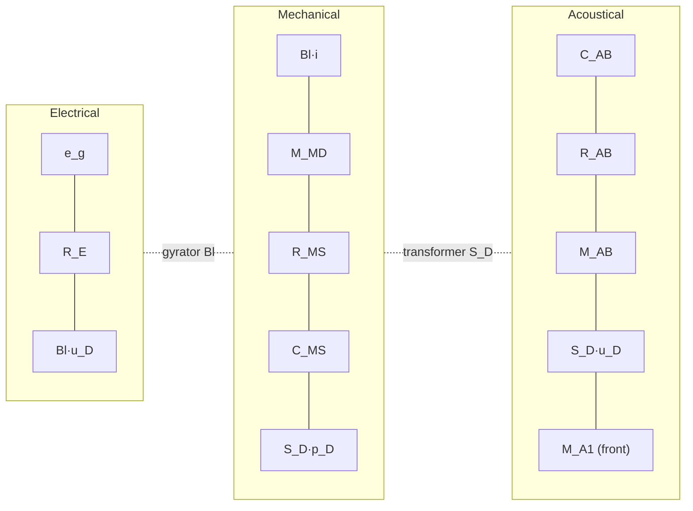
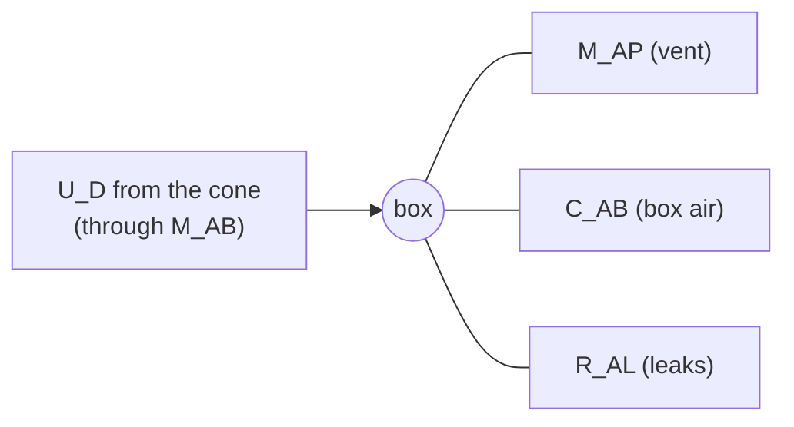

# Lecture 8 — Loudspeakers 2: Enclosures

> [!info] Lecture Info
> **Date:** Thursday 1 October 2026, 8:30–12:00 · Lyngby · **VCH**. Written from the slide deck and Problems 8 on the day. There is no recording and there are no official solutions yet, so every number below was checked against the brackets on the problem sheet with `p8.py`.
> **Slides:** `Slides/34870_Lecture_8_E26.pdf` (30 slides, 2 per page)
> **Problems:** `Exercises/34870_Problems8_2026.pdf` (Loudspeakers 2; answers in brackets, page 2 has Leach's alignment charts for $Q_L$ = 7 and 5)
> **Refs:** Leach ch. 7 (closed box) and ch. 8 (vented box), both in `_Learn/Lecture 8 - Loudspeaker enclosures/` · Beranek ch. 7
> **Course tools:** `VentedBox_Matlab.zip` (`ventbox.m` picks a QB3 or Chebyshev alignment from lookup tables, an alternative to reading Leach's graphs) and `diffrac.m` (baffle diffraction)
> **Script:** `5. Semester/Electroacoustics/LTspice/Problems 8 - Enclosures/p8.py`. It prints every answer next to its bracket, ports `ventbox.m` to Python (it parses the course tables straight out of the zip), and writes the figures in `Images/Lecture8/` with `--plots`.
> **Previous:** [[Lecture 7 - Moving Coil Loudspeakers|Lecture 7]] · **Next:** [[Lecture 9 - Loudspeaker Systems & Crossovers|Lecture 9]] · **Lab D** Tue 6/10 (T-S parameters of System D, including the added-box method of §6) · Lecture 10 digest for Lab E is already out (`Slides/34870_Lecture_10_Digest_Lab_E.pdf`)
> **Interactive version:** <https://study.madsrudolph.dev/34870/#l8>

> [!abstract] Where this lecture sits
> Lecture 7 put the driver on an **infinite baffle**, which is an idealisation: in real life the back wave has to go somewhere. In **free air** it runs round the rim and cancels the front wave at low frequency (a dipole). A **closed box** traps the back wave, and its air acts as an **extra spring**. That raises $f_C$ and $Q_{TC}$ by the same factor $\sqrt{1+\alpha}$. A **vented box** lets the back wave out again through a tube, but only after a **Helmholtz resonator** (the bottle from [[Lecture 3 - Analogies - Acoustic Systems|Lecture 3]]) has turned its phase round. You get a 4th-order high-pass with a lower cut-off in return for a harder design. Every formula in the lecture is still the Lecture 7 loop equation; only the acoustic load behind the cone changes.

---

## 1. The four ways to mount a driver — slide 2

| Mounting | Low end | Practical? |
|---|---|---|
| **Free air** | weak: front and back waves cancel round the rim (dipole) | — |
| **Infinite baffle** | the Lecture 7 reference, 12 dB/oct below $f_S$ | not really (a wall-sized baffle) |
| **Closed box** | simple design, but limited at low frequency | ✓ |
| **Vented (bass-reflex) box** | better at low frequency, harder to design | ✓ |

The goals pull against each other: you want **small size** and a **good low-frequency response** at the same time. The compromise depends on space, price, performance and subjective factors.

---

## 2. Closed box: the new elements — slides 3–4 (Leach 7.1)

The box adds three acoustic elements **in series** behind the diaphragm (where the infinite baffle had $M_{A1}$ for the back radiation):

> [!important] $Z_{AB} = \dfrac{1}{j\omega C_{AB}} + R_{AB} + j\omega M_{AB}$
> | Element | What it is | How to get it |
> |---|---|---|
> | $C_{AB}$ | compliance of the air in the box | $C_{AB} = V_{AB}/\rho c^2$. The **effective** volume $V_{AB}$ is 10–20 % larger than the physical $V_B$ if the box is filled with damping material (§3). |
> | $R_{AB}$ | losses in the absorbing material | must be **estimated**, from experience with the material |
> | $M_{AB}$ | air mass loading the back of the cone | $M_{AB} = B\rho/\pi a$, typically $B = 0.65$. For a large box $M_{AB} ≈ M_{A1}$. |
>
> Mass loading factor (Leach eq. 7.4), with $d$ the depth of the box, $S_D$ the piston area and $S_B$ the inside area of the wall the driver sits in:
> $$B = \frac{d}{3}\sqrt{\frac{\pi}{S_D}}\left(\frac{S_D}{S_B}\right)^2 + \frac{8}{3\pi}\left(1 - \frac{S_D}{S_B}\right)$$
> Sanity check: a huge wall ($S_D/S_B → 0$) gives $B = 8/3\pi = 0.85$, so $M_{AB} = 8\rho/3\pi^2a = M_{A1}$, the baffled piston.

### The circuit — slide 5 (Leach 7.2–7.3)

Same three loops as Lecture 7. Only the acoustic loop changes: $C_{AB}$, $R_{AB}$, $M_{AB}$ sit where the back radiation impedance was, in series with the front $M_{A1}$.

---

## 3. Closed box: transfer function and the effect of the box — slides 6–7

The derivation is the infinite-baffle one word for word, with new totals:

> [!success] Closed box = infinite baffle with a stiffer spring
> $$U_D = \frac{Bl\,S_D}{R_E}\,\frac{1}{j\omega M_{MC} + R_{MC} + 1/(j\omega C_{MT})}\,e_g$$
> $$p(r) = \frac{\rho}{2\pi}\,\frac{Bl\,S_D}{R_E M_{MC}}\;\frac{(j\omega/\omega_C)^2}{(j\omega/\omega_C)^2 + (1/Q_{TC})(j\omega/\omega_C) + 1}\;\frac{e^{-jkr}}{r}\,e_g$$
> | Total | Closed box | Infinite baffle (L7) |
> |---|---|---|
> | mass | $M_{MC} = M_{MD} + S_D^2(M_{A1} + M_{AB})$ | $M_{MS} = M_{MD} + 2S_D^2M_{A1}$ |
> | resistance | $R_{MC} = R_{MS} + (Bl)^2/R_E + S_D^2R_{AB}$ | $R_{MT} = R_{MS} + (Bl)^2/R_E$ |
> | compliance | $C_{MT} = \dfrac{C_{MS}\,(C_{AB}/S_D^2)}{C_{MS} + C_{AB}/S_D^2}$ (two springs in series) | $C_{MS}$ |
>
> $\omega_C = 1/\sqrt{M_{MC}C_{MT}}$, $\quad Q_{TC} = \dfrac{1}{R_{MC}}\sqrt{\dfrac{M_{MC}}{C_{MT}}}$.
>
> ⚠️ Footnote on slide 6: **Leach's $R_{MC}$ (his $R_{AC}$, eq. 7.6) leaves out the $(Bl)^2/R_E$ term.** The slides include it, so the slides' $Q_{TC}$ is a *total* Q.

### The box's three effects

**1. Higher resonance.** If $M_{AB} ≈ M_{A1}$, then $M_{MC} ≈ M_{MS}$ (the same air on both sides as on the baffle), and only the compliance changes:
$$\omega_C = \frac{1}{\sqrt{M_{MS}C_{MT}}} = \frac{1}{\sqrt{M_{MS}C_{MS}/(1 + V_{AS}/V_{AB})}} = \omega_S\sqrt{1+\alpha}, \qquad \boxed{\alpha = \frac{V_{AS}}{V_{AB}} = \frac{C_{AS}}{C_{AB}}}$$
$\alpha$ is the **box compliance ratio**: how much stiffer the box air is than the suspension. $V_{AS} = S_D^2\rho c^2C_{MS}$ is the T-S equivalent volume from Lecture 7, and this is exactly why it was defined: a box of volume $V_{AS}$ gives $\alpha = 1$ and doubles the stiffness.

**2. Higher Q, by the same factor.** If $R_{AB} ≈ 0$ then $R_{MC} ≈ R_{MT}$, and
$$Q_{TC} = \frac{\omega_C M_{MC}}{R_{MC}} ≈ Q_{TS}\sqrt{1+\alpha}$$
Mass and resistance are unchanged, the stiffness goes up, so $f$ and $Q$ both scale by $\sqrt{1+\alpha}$. In particular **$Q_{TC}/f_C = Q_{TS}/f_S$ is fixed by the driver**, whatever the box. You choose one; the other follows.

**3. Larger effective volume when the box is filled.** In the damping material sound travels more slowly (the compression becomes closer to isothermal), so the air looks more compliant (Leach eq. 7.3):
$$V_{AB} = V_B\left(1 - \frac{V_f}{V_B}\right)\left(1 + \frac{\gamma - 1}{1 + \gamma(V_B/V_f - 1)(\rho c_v)/(\rho_f c_f)}\right), \qquad \gamma = \frac{c_p}{c_v} ≈ 1.4$$
with $V_f$ the volume of the filling fibres, $\rho_f$, $c_f$ their density and specific heat. At most this gives a factor $\gamma$ = 1.4 (fully isothermal). In practice it is 10–20 %.

**4. Guessing $Q_{MC}$.** $R_{AB}$ is not known in advance, so the mechanical Q has to be guessed:
$$Q_{MC} = \frac{\omega_C M_{MC}}{R_{MS} + S_D^2R_{AB}}, \qquad Q_{MC} ≈ 5\text{–}10 \text{ (unfilled)},\quad 2\text{–}5 \text{ (filled)}$$

---

## 4. Closed box: choosing the volume — slides 8–9, 14

Slide 8 runs one driver ($Q_{TS}$ = 0.35) through $\alpha$ = 0.1 … 10. A small box (large $\alpha$) pushes the corner up *and* sharpens it into a bump ($\alpha$ = 10 gives $Q_{TC}$ = 1.17 and +2 dB). A big box (small $\alpha$) leaves a slow, overdamped roll-off.

> [!important] −3 dB cut-off of a 2nd-order high-pass (slide 9)
> $$f_3 = f_C\sqrt{\left(\frac{1}{2Q_{TC}^2} - 1\right) + \sqrt{\left(\frac{1}{2Q_{TC}^2} - 1\right)^2 + 1}}$$
> $f_3$ is **lowest for $Q_{TC} = 1/\sqrt2$** (Butterworth), and then $f_3 = f_C$. Above 0.707 the response peaks and $f_3 < f_C$; below, it droops early and $f_3 > f_C$.
>
> **Recipe for the lowest $f_3$:** $\alpha = (Q_{TC}/Q_{TS})^2 - 1$ → $V_{AB} = V_{AS}/\alpha$ → $f_3 = f_C = f_S\,Q_{TC}/Q_{TS}$.

> [!warning] A driver with $Q_{TS} > 0.707$ can never reach Butterworth in a closed box
> $\alpha$ would have to be negative. Since $Q_{TC} ≥ Q_{TS}$ always, a high-$Q_{TS}$ driver is a free-air or vented-box driver. Conversely, a very low $Q_{TS}$ (strong magnet) needs a tiny box and gets a high $f_3$: the SWR 308 in Problem 1 ends up with 12 L and 64 Hz.

> [!example] Slide 14 — Scan-Speak 22W/8857T00
> $R_E$ = 6.2 Ω, $Bl$ = 10.1 Tm, $C_{MS}$ = 1.29 mm/N, $M_{MS}$ = 37 g, $R_{MS}$ = 1.1 Ns/m, $S_D$ = 220 cm², $f_S$ = 23 Hz, $Q_{TS}$ = 0.3, $V_{AS}$ = 88 L.
>
> | | **Case 1: fix $Q_{TC} = 1/\sqrt2$** | **Case 2: fix $V_{AB}$ = 10 L** |
> |---|---|---|
> | $\alpha$ | $(Q_{TC}/Q_{TS})^2 - 1$ = **4.3** | $V_{AS}/V_{AB}$ = **8.8** |
> | box | $V_{AB} = V_{AS}/\alpha$ = **20.2 L** | 10 L |
> | $f_C = f_S\sqrt{1+\alpha}$ | **53.2 Hz** | **72.2 Hz** |
> | $Q_{TC} = Q_{TS}\sqrt{1+\alpha}$ | 0.707 | **0.96** |
> | $f_3$ | **53.2 Hz** (= $f_C$) | **58.0 Hz** (below $f_C$, the peak helps) |
>
> ⚠️ With the *rounded* $Q_{TS}$ = 0.3 you get $\alpha$ = 4.56, not 4.3. The slide used the value computed from the raw parameters: $\omega_S = 1/\sqrt{0.037 \times 1.29\times10^{-3}}$ = 144.8 rad/s, $Q_{MS}$ = 4.87, $Q_{ES} = R_E\omega_SM_{MS}/(Bl)^2$ = 0.326, so **$Q_{TS}$ = 0.305**. That gives $\alpha$ = 4.37 and every number on the slide. Halving the box costs 5 Hz of bass and buys a 0.6 dB bump.
>
> ![[L8_scanspeak_mountings.png]]
> *Same driver, 2.83 V, 1 m (`p8.py`, full circuit, $L_E$ ignored). The infinite baffle has the gentlest slope, because its $Q_{TS}$ = 0.3 is heavily overdamped. Both closed boxes are steeper and cross it near 40 Hz. The vented box (§9) holds the full level down to ~40 Hz from a 33 L box.*

---

## 5. Closed box: efficiency — slide 10

Same formula as on the baffle with $M_{MC}$ in place of $M_{MS}$:
$$\eta = \frac{\rho}{2\pi c}\,\frac{1}{R_E}\left(\frac{Bl\,S_D}{M_{MC}}\right)^2$$

> [!tip] The "do as an exercise" rearrangement
> Use the three definitions to get rid of $Bl$, $R_E$ and $M_{MC}$:
> 1. $Q_{EC} = \dfrac{R_E\,\omega_C M_{MC}}{(Bl)^2}$ ⇒ $\dfrac{(Bl)^2}{R_E} = \dfrac{\omega_C M_{MC}}{Q_{EC}}$, so $\eta = \dfrac{\rho\,S_D^2\,\omega_C}{2\pi c\,M_{MC}\,Q_{EC}}$
> 2. $\omega_C^2 = 1/(M_{MC}C_{MT})$ ⇒ $1/M_{MC} = \omega_C^2C_{MT}$, so $\eta = \dfrac{\rho\,\omega_C^3\,S_D^2C_{MT}}{2\pi c\,Q_{EC}}$
> 3. $S_D^2C_{MT}$ is the series combination of the two acoustic compliances, $= V_{AT}/\rho c^2$ with $V_{AT} = \dfrac{V_{AB}V_{AS}}{V_{AB} + V_{AS}}$
>
> $$\boxed{\eta = \frac{\omega_C^3\,V_{AT}}{2\pi c^3\,Q_{EC}} = \frac{4\pi^2}{c^3}\,\frac{f_C^3\,V_{AT}}{Q_{EC}}}$$
> Check with slide 14 case 1: $f_C$ = 53.4 Hz, $V_{AT}$ = 16.4 L, $Q_{EC}$ = 0.326·√5.37 = 0.755 ⇒ η = 0.32 %, the same as $\frac{\rho}{2\pi cR_E}(BlS_D/M_{MS})^2$ = 0.32 % ✓.

> [!warning] What the conclusions actually mean
> "Smaller boxes are less efficient" and "lower resonance means less efficiency" hold **for a fixed response**: if you insist on a given $f_C$ and $Q_{EC}$, then η ∝ $V_{AT}$ (smaller box, less efficiency) and η ∝ $f_C^3$ (an octave lower costs 9 dB). Putting a given driver into a different box does not change its η. This is Hofmann's iron law: **bass extension, box size, efficiency: pick two.**

---

## 6. Measuring $V_{AS}$ with a closed box (added compliance) — slide 15

This is the "alternative" from Lecture 7 §8. Instead of gluing a mass to the cone, change the *compliance* by mounting the driver in a known closed box and measuring the resonance with and without it:

$$f_S = \frac{1}{2\pi\sqrt{M_{MS}C_{MS}}}\ \text{(no box)}, \qquad f_C = \frac{1}{2\pi\sqrt{M_{MC}C_{MT}}}\ \text{(in box)}$$

With $M_{MC} ≈ M_{MS}$ (the box's $M_{AB}$ ≈ the $M_{A1}$ it replaces):
$$\omega_C = \omega_S\sqrt{1+\alpha} \;\Rightarrow\; \alpha = \left(\frac{f_C}{f_S}\right)^2 - 1 \;\Rightarrow\; C_{AS} = C_{AB}\left[\left(\frac{f_C}{f_S}\right)^2 - 1\right], \qquad \boxed{V_{AS} = \rho c^2C_{AS} = V_{AB}\left[\left(\frac{f_C}{f_S}\right)^2 - 1\right]}$$

Then $C_{MS} = C_{AS}/S_D^2$ and $M_{MS} = 1/(\omega_S^2C_{MS})$, and the rest follows as in the added-mass method. *Example:* the Scan-Speak in a 20 L box would move from 23.0 to 53.4 Hz: (53.4/23.0)² − 1 = 4.37, × 20.1 L = 88 L ✓.

> [!note] Lab D (Tue 6/10)
> The f_S/Q measurement comes from the impedance curve (L7 §8). Added mass and added box are the two ways to split $f_S$ into $M_{MS}$ and $C_{MS}$. Check at the lab which one System D uses, and whether the box has filling in it, which would make $V_{AB} > V_B$ (§3).

---

## 7. Near field vs far field in LTspice — slides 11–13

Slide 11 repeats the Lecture 7 result $p_{near}/p_{ff} = 16r/3\pi a$ (same shape, different level). Slides 12–13 show how the lecturer reads both off the circuit:

- **Near field:** the pressure across the **front** radiation mass `Ma1f` (node `Pnear`, between `FSdud` and the dummy source `Vd3`). `Exd` with gain `5e4` = 1/20 µPa turns it into a dB-ready number, `Pnear_dB`.
- **Far field:** `Hpd` is a CCVS that reads the volume velocity through `Vd3` (that is, through `Ma1f`). It feeds `Epd` with `Laplace=9.5493e3*s`, where 9549 = ρ/(2π·20 µPa) = 1.2/(2π·20·10⁻⁶). So V(`dB_SPL_1m`) **is** $\rho\omega U/(2\pi\cdot20\,\mu\text{Pa})$, and plotting it in dB gives SPL at 1 m directly.

Same trick as the `E_ff` source in [[Lecture 7 - Moving Coil Loudspeakers#13. Problems 7 — worked|Problems 7, Problem 4]] (there the constant was 495.17 because it acted on $u_D$ and contained $S_D$). The difference here: the box replaces the back radiation impedance, so **only the front $M_{A1}$ radiates** and the near-field pressure is the pressure on that front element alone.

---

## 8. Vented box: the idea and the circuit — slides 17–18 (Leach 8.1–8.2)

> [!important] Use the back wave instead of throwing it away
> The box plus the vent is a **Helmholtz resonator** tuned to $f_B$. Near $f_B$ it delays the back wave enough that, when it leaves the port, it adds to the front wave instead of cancelling it. The box/vent system introduces a **second resonance**.

Four volume velocities meet in the box ($U_D$ diaphragm, $U_L$ leak, $U_P$ port, $U_B$ compression of the box air). Radiated volume velocity:
$$U_0 = U_D + U_L + U_P = -U_B$$
so the net radiated flow is **whatever the box air does not absorb**.

> [!success] The vented-box network $Z_{A2}$ (slide 18)
> In the acoustic loop, the closed box's $C_{AB}$ becomes three elements **in parallel**: the port mass $M_{AP}$, the box compliance $C_{AB}$ and the leakage resistance $R_{AL}$. The back air mass $M_{AB}$ stays in series.
> $$\frac{1}{Z_{A2}} = Y_{A2} = \frac{1}{j\omega M_{AP}} + \frac{1}{R_{AL}} + j\omega C_{AB}$$
> $R_{AL}$ collects leaks through the box seams and the driver, and losses in the port. It is described by the box Q, $Q_L = R_{AL}\sqrt{C_{AB}/M_{AP}}$. Typical $Q_L ≈ 7$ (Problems 8 uses 5). The damping in the filling ($R_{AB}$) is assumed to be ≈ 0.

---

## 9. Vented box: the transfer function — slides 19–20 (Leach 8.3)

Assume $M_{AB} ≈ M_{A1}$ and $R_{AB} ≈ 0$, and collect the driver into one acoustic impedance $Z_{A1} = (j\omega M_{MS} + R_{MT} + 1/j\omega C_{MS})/S_D^2$ (mechanical + electrical, with $R_{MT} = R_{MS} + (Bl)^2/R_E$). Then
$$U_D = \frac{Bl\,S_D}{R_E}\,\frac{1}{j\omega M_{MS} + R_{MT} + 1/j\omega C_{MS} + S_D^2Z_{A2}}\,e_g = \frac{Bl\,S_D}{R_ES_D^2}\,\frac{1}{Z_{A1} + Z_{A2}}\,e_g$$

**Radiated flow = minus the box flow:** the box pressure is $p_B = U_DZ_{A2}$, and the box air takes $U_B = p_B\,j\omega C_{AB}$. So
$$U_0 = j\omega C_{AB}Z_{A2}\,U_D = \frac{Bl\,S_D}{R_ES_D^2}\,\frac{j\omega C_{AB}}{1 + Z_{A1}Y_{A2}}\,e_g$$

> [!success] A 4th-order high-pass (slide 20)
> $$p(r) = \frac{\rho}{2\pi}\,\frac{Bl\,S_D}{R_E M_{MS}}\;\frac{(j\omega/\omega_0)^4}{(j\omega/\omega_0)^4 + a_3(j\omega/\omega_0)^3 + a_2(j\omega/\omega_0)^2 + a_1(j\omega/\omega_0) + 1}\;\frac{e^{-jkr}}{r}\,e_g$$
> $$\omega_0 = \sqrt{\omega_B\omega_S}, \quad h = \frac{\omega_B}{\omega_S}, \quad \alpha = \frac{C_{AS}}{C_{AB}}$$
> $$a_1 = \frac{1}{Q_L\sqrt h} + \frac{\sqrt h}{Q_{TS}}, \qquad a_2 = \frac{\alpha + 1}{h} + h + \frac{1}{Q_LQ_{TS}}, \qquad a_3 = \frac{1}{Q_{TS}\sqrt h} + \frac{\sqrt h}{Q_L}$$
> | Resonator | Q | Resonance |
> |---|---|---|
> | Driver | $Q_{TS} = \dfrac{1}{R_{MT}}\sqrt{\dfrac{M_{MS}}{C_{MS}}}$ | $\omega_S = \dfrac{1}{\sqrt{M_{MS}C_{MS}}}$ |
> | Vent/box | $Q_L = R_{AL}\sqrt{\dfrac{C_{AB}}{M_{AP}}}$ | $\omega_B = \dfrac{1}{\sqrt{M_{AP}C_{AB}}}$ |
>
> Same pass-band level as the baffle and the closed box. Below cut-off it falls at **24 dB/octave** instead of 12.

> [!tip] Why the $a$'s look symmetric
> Swap driver and vent ($Q_{TS} \leftrightarrow Q_L$, $h \leftrightarrow 1/h$) and $a_1 \leftrightarrow a_3$. It is two coupled resonators, and $\alpha$ (in $a_2$) is the coupling: the box air is the spring both of them push on.

### Contributions — slide 24

![[L8_vented_contrib_impedance.png]]
*Left: the Scan-Speak in the QB3 box of §10 (33 L, $f_B$ = 30 Hz, $Q_L$ = 7), from `p8.py`. Right: the impedance for three vent tunings in the same box.*

- **At $f_B$ the vent does the work.** The cone barely moves there: the driver curve has a deep **dip at $f_B$** because the resonator's pressure holds the cone still. That is also where the **excursion is lowest**, a big practical win of the vented box.
- Above $f_B$ the vent's output falls at 12 dB/oct (it is a mass driven by the box pressure), and the driver takes over.
- Below $f_B$ vent and driver are **in antiphase** and cancel, which is why the total falls at 24 dB/oct. Below the tuning the cone is unloaded and its excursion grows quickly. Hence the subsonic filters on real bass-reflex systems.

---

## 10. Standard alignments — slides 21–23

There are more degrees of freedom ($h$, $\alpha$, $Q_L$, $Q_{TS}$) and so many possible **tunings** (alignments), some with active filters (out of scope). The passive ones follow from the driver's $Q_{TS}$:

| $Q_{TS}$ | Alignment | Roll-off | Cut-off $f_L$ (= $f_3$) |
|---|---|---|---|
| low | **QB3** (quasi-Butterworth, 3rd order) | 18 dB/oct near cut-off | $f_L > f_S$ |
| ≈ **0.4** | **B4** (4th-order Butterworth) | 24 dB/oct | $f_B = f_S = f_L$ |
| high | **C4** (Chebyshev) | 24 dB/oct, rippled | $f_L < f_S$ |

Slide 22 (Leach) shows the family: from C4 ($k$ = 0.33 with a 1 dB ripple, lowest cut-off) through B4 to QB3 ($B$ = 2, 4, highest cut-off). **The lowest cut-off costs ripple and a poorer time response.** There is no best tuning.

> [!important] The graphical method (slide 23, Problems 8 page 2)
> 1. **Guess $Q_L$** (7 is typical; a chart exists for each $Q_L$).
> 2. Enter the $Q_{TS}$ curve at the driver's $Q_{TS}$ (left axis) → read **$\alpha$** on the bottom axis.
> 3. At that $\alpha$, read **$h = f_B/f_S$** and **$q = f_L/f_S$** on the right axis.
> 4. $V_{AB} = V_{AS}/\alpha$, $f_B = h\,f_S$, $f_3 = q\,f_S$. Then size the vent (§11).
>
> On the chart, $\alpha ≈ 1$ (with $h = q = 1$) is the B4 point. Left of it is Chebyshev (top scale $k$), right of it QB3 (top scale $B$). The red construction on slide 23: $Q_{TS}$ ≈ 0.5 → α ≈ 0.55 → h ≈ q ≈ 0.9.
>
> **`ventbox.m`** (course zip) does the same from tables: `[alpha,q,h,fb,Vab,fl] = ventbox(fs,Qts,Vas,QL)` with $Q_L$ an integer 5–20. It chooses C4 if $Q_{TS}$ is above the B4 value for that $Q_L$ (0.414 at $Q_L$ = 5, 0.397 at 10, 0.390 at 20), otherwise QB3. `p8.py` has a Python port.

> [!warning] In the lab you cannot follow the recipe
> The recipe gives *the* box volume. In Lab E you are handed the box and the driver, so $\alpha$ is fixed. All you can change is the **vent** ($h$) and the **filling** ($Q_L$, $V_{AB}$). Many other tunings are possible; just know which way each knob moves the response.

---

## 11. Vented box: input impedance — slides 25–27

$$Z_E ≈ R_E + \frac{j\omega L_E R_E'}{j\omega L_E + R_E'} + \frac{(Bl)^2}{j\omega M_{MS} + R_{MS} + 1/j\omega C_{MS} + S_D^2Z_{A2}}$$

> [!important] Two peaks, and neither of them is $f_S$ or $f_B$
> - The two coupled resonators split into two modes, one **below** and one **above** the original resonances.
> - **$f_B$ is the minimum between the peaks.** At $f_B$ the parallel $M_{AP}$–$C_{AB}$ circuit has infinite impedance (only $R_{AL}$ is left), so the cone sees a stiff load, does not move and produces no back-EMF. $Z_E$ drops towards $R_E$.
> - $f_B = f_S$ gives roughly **equal peaks**, $f_B < f_S$ a taller upper peak, $f_B > f_S$ a taller lower peak (slides 25–27; the right panel above shows the same).
> - ⚠️ **Equal peaks do not mean B4.** B4 needs a driver with $Q_{TS}$ ≈ 0.4 *and* the right $\alpha$. Equal peaks only tell you $f_B ≈ f_S$.
>
> This is how you **measure $f_B$** of a finished box in Lab E: look for the dip in the impedance between the two peaks.

---

## 12. Designing the vent tube — slide 28

$$f_B = \frac{1}{2\pi\sqrt{M_{AP}C_{AB}}}, \qquad M_{AP} = \frac{\rho}{S_P}\left(L_P + 1.46\sqrt{\frac{S_P}{\pi}}\right)$$

The **end correction** $1.46\,a_P$ is the sum of the radiation masses at the two ends: one **flanged** end (in the baffle, $8/3\pi$ = 0.85) and one **unflanged** end (inside the box, 0.6133). Together, $1.46 = 0.6133 + 8/3\pi$. Same physics as Lecture 3's tube.

**Recipe:** $C_{AB} = V_{AB}/\rho c^2$ → $M_{AP} = 1/(\omega_B^2C_{AB})$ → $L_P = M_{AP}S_P/\rho - 1.46\,a_P$.

- The same $M_{AP}$ comes from many $(L_P, S_P)$ pairs ($M \propto L/S$).
- **Narrow tubes are short but chuff**: the air velocity in the port at $f_B$ is high, which gives turbulence noise.
- **Wide tubes are long** and may not fit in the box. If $L_P$ comes out negative, the tube is too wide for that tuning.

## 13. Passive radiators — slide 29

An **unconnected driver** (cone + suspension, no magnet) can provide the acoustic mass instead of a vent. Use it when the tube would not fit. It costs more, adds its own compliance (a small series spring with $M_{AP}$), and has no port noise. The analysis is the vented box's. The slide shows a compact speaker and a passive-radiator unit.

---

## 14. Problems 8 — worked

*ρ = 1.2 kg/m³, c = 344 m/s. Data "when mounted in an infinite baffle", so $M_{AB} ≈ M_{A1}$ and the baffle T-S values apply directly.*

| Woofer | $f_S$ | $Q_{TS}$ | $V_{AS}$ |
|---|---|---|---|
| Peerless CSX 217C | 34 Hz | 0.47 | 49 L |
| Peerless SWR 263 | 27.8 Hz | 0.52 | 88 L |
| Peerless SWR 308 | 18.1 Hz | 0.20 | 140 L |

> [!example]+ Problem 1a — closed box, lowest −3 dB cut-off
> The lowest $f_3$ needs $Q_{TC} = 1/\sqrt2$ (§4). Then $\alpha = (Q_{TC}/Q_{TS})^2 - 1$, $V_{AB} = V_{AS}/\alpha$ and $f_3 = f_C = f_S\,Q_{TC}/Q_{TS}$.
> | | $\alpha$ | $V_{AB}$ | $f_3 = f_C$ |
> |---|---|---|---|
> | CSX 217C | $(0.7071/0.47)^2 - 1$ = 1.263 | 49/1.263 = **38.8 L** ✓ | 34 × 1.504 = **51.2 Hz** ✓ |
> | SWR 263 | $(0.7071/0.52)^2 - 1$ = 0.849 | 88/0.849 = **104 L** ✓ | 27.8 × 1.360 = **37.8 Hz** ✓ |
> | SWR 308 | $(0.7071/0.20)^2 - 1$ = 11.5 | 140/11.5 = **12.2 L** ✓ | 18.1 × 3.536 = **64 Hz** ✓ |
>
> The SWR 308 has the lowest $f_S$ but ends with the *highest* cut-off: its $Q_{TS}$ = 0.2 is so low that the box must multiply Q by 3.5, and $f$ goes up by the same factor. It is a vented-box driver (Problem 2).

> [!example]+ Problem 1b — all three in a 40 L box
> $\alpha = V_{AS}/40$, $f_C = f_S\sqrt{1+\alpha}$, $Q_{TC} = Q_{TS}\sqrt{1+\alpha}$, then the $f_3$ formula of §4:
> | | $\alpha$ | $f_C$ | $Q_{TC}$ | $f_3$ |
> |---|---|---|---|---|
> | CSX 217C | 1.225 | 50.7 Hz | 0.701 | **51.2 Hz** ✓ (40 L is almost its optimum 38.8 L) |
> | SWR 263 | 2.2 | 49.7 Hz | 0.930 | **40.5 Hz** ✓ (peaky: $f_3 < f_C$) |
> | SWR 308 | 3.5 | 38.4 Hz | 0.424 | **75.0 Hz** ✓ (overdamped: $f_3 ≈ 2f_C$) |
>
> Worked $f_3$ for the SWR 263: $x = 1/(2\cdot0.930^2) - 1 = -0.422$, $\sqrt{-0.422 + \sqrt{0.178 + 1}} = \sqrt{0.663} = 0.814$, so $f_3$ = 49.7 × 0.814 = 40.5 Hz.
>
> ![[P8_closed_box.png]]

> [!example]+ Problem 2a — vented box, $Q_L$ = 5 (chart, Figure 2 on the sheet)
> Read the chart at each $Q_{TS}$ (sheet answers), and compare with the course's `ventbox.m` tables via `p8.py`:
> | | Alignment | chart: $\alpha$, $h$ | **Sheet** $f_B$, $V_{AB}$ | Tables: $\alpha$, $h$ → $f_B$, $V_{AB}$, $f_3$ |
> |---|---|---|---|---|
> | CSX 217C ($Q_{TS}$ = 0.47) | C4 (> 0.414) | ≈ 0.55, ≈ 0.9 | **31 Hz, 90 L** | 0.536, 0.876 → 29.8 Hz, 91.3 L, 27.5 Hz |
> | SWR 263 ($Q_{TS}$ = 0.52) | C4 | ≈ 0.35, ≈ 0.8 | **22 Hz, 250 L** | 0.357, 0.783 → 21.8 Hz, 246 L, 19.5 Hz |
> | SWR 308 ($Q_{TS}$ = 0.20) | QB3 | ≈ 7.8, ≈ 2.2 | **40 Hz, 18 L** | 7.54, 1.997 → 36.2 Hz, 18.6 L, 46.8 Hz |
>
> Steps for the CSX: $Q_{TS}$ = 0.47 on the $Q_{TS}$ curve → $\alpha$ ≈ 0.55 → $V_{AB}$ = 49/0.55 ≈ 90 L; at $\alpha$ = 0.55, $h$ ≈ 0.9 → $f_B$ = 0.9 × 34 ≈ 31 Hz.
>
> The volumes agree within 3 %. The $f_B$ for the SWR 308 differs by 10 %: the $h$ curve is steep out at $\alpha$ ≈ 8, and a small misreading moves it a lot. Both are "right" to chart accuracy. Use the sheet values in a hand-in that is marked against the sheet.
>
> **Compare with Problem 1:** the vented boxes are bigger (except for the SWR 308) and reach much lower: CSX 51 → 28 Hz, SWR 263 38 → 20 Hz, SWR 308 64 → 47 Hz.
>
> ![[P8_vented_box.png]]

> [!example]+ Problem 2b — vent length, PVC tube with $a_P$ = 3.75 cm
> $S_P = \pi a_P^2$ = 4.418·10⁻³ m², end correction $1.46\,a_P$ = 5.48 cm.
> **CSX 217C** (31 Hz, 90 L): $C_{AB}$ = 0.090/(1.2·344²) = 6.34·10⁻⁷ m⁵/N, $M_{AP} = 1/((2\pi\cdot31)^2\cdot6.34\cdot10^{-7})$ = 41.6 kg/m⁴, so $L_P$ = 41.6 × 4.418·10⁻³/1.2 − 0.0548 = 0.153 − 0.055 = **9.8 cm** (sheet **10.4 cm**).
> | | from the sheet's $f_B$, $V_{AB}$ | **sheet** | from the tables' $f_B$, $V_{AB}$ |
> |---|---|---|---|
> | CSX 217C | 9.8 cm | **10.4 cm** | 10.9 cm |
> | SWR 263 | 5.5 cm | **6.0 cm** | 5.9 cm |
> | SWR 308 | 40.5 cm | **42.2 cm** | 49.1 cm |
>
> The sheet's lengths fit unrounded chart values, $f_B$ ≈ 30.4 / 21.5 / 39.3 Hz with the rounded volumes, so the 0.5–2 cm gap is rounding. Note how sensitive $L_P$ is: $M_{AP} \propto 1/f_B^2$, and the end correction is subtracted, so a 2 % error in $f_B$ is a 6 % error in $L_P$. In practice you **cut the tube long and trim it** while watching the impedance dip.
>
> The SWR 308 needs a 42 cm tube in an 18 L box, which barely fits (an 18 L cube is 26 cm on a side). That is exactly when you bend the tube, use a slot port or switch to a passive radiator.

> [!example]- Problem 3 — LTspice, closed box (open-ended design task)
> **a) Circuit:** the Lecture 7 / Problems 7 model (`5. Semester/Electroacoustics/LTspice/Problems 7 - Loudspeaker/p7.py`) with the **back** radiation network replaced by a series $C_{AB}$ (+ $R_{AB}$, + $M_{AB} ≈ M_{A1}$) as on slide 5. Read the far field off the front `Ma1f` current as on slide 13.
> **b) Choose a driver** for $f_3 ≤ 40$ Hz in $V_{AB} ≤ 100$ L. With $Q_{TC} = 1/\sqrt2$, $f_3 = f_S\cdot0.707/Q_{TS}$ and $V_{AB} = V_{AS}/[(0.707/Q_{TS})^2 - 1]$, so you need **$f_S/Q_{TS} ≤ 56.6$ Hz** and enough $Q_{TS}$ that the box stays under 100 L. Of the sheet's woofers, the **SWR 263** just makes it at 104 L / 37.8 Hz. A 100 L box gives α = 0.88, $Q_{TC}$ = 0.71, $f_3$ ≈ 38 Hz, so it qualifies. Browse peerless-audio.com for others: look for $Q_{TS}$ ≈ 0.4–0.6 with $f_S$ ≲ 25 Hz.
> **c) Sensitivity to volume:** halve and double the box. $Q_{TC}$ moves as $\sqrt{1 + V_{AS}/V_{AB}}$, so around the optimum $f_3$ is flat to first order (it is a minimum). The Scan-Speak example loses only 5 Hz going from 20 to 10 L. The response *shape* (the bump) changes faster than $f_3$.

> [!example]- Problem 4 — LTspice, vented box (open-ended design task)
> **a) Circuit:** as Problem 3, but the box becomes $M_{AP} \parallel C_{AB} \parallel R_{AL}$ (slide 18), with $R_{AL} = Q_L\sqrt{M_{AP}/C_{AB}}$. Measure the vent output as the current in $M_{AP}$, then sum it with the front $U_D$ for the far field (the "contributions" plot of slide 24).
> **b) B4:** needs $Q_{TS}$ ≈ 0.40–0.41 (0.414 at $Q_L$ = 5, 0.40 at $Q_L$ = 7). Then $h$ = 1 ($f_B = f_S$), $\alpha$ ≈ 0.93 at $Q_L$ = 5, and $f_3 = f_S$.
> **c)** Same driver as Problem 3, via the chart: e.g. the SWR 263 at $Q_L$ = 7 → C4, α = 0.41, $V_{AB}$ ≈ 216 L, $f_B$ ≈ 21.5 Hz, $f_3$ ≈ 19 Hz (from `ventbox`).
> **d) Detune the vent** ±30 % and watch: a lower $f_B$ gives a drooping, extended response, a higher $f_B$ a bump. The impedance dip follows $f_B$ (right panel of the §9 figure).
>
> *Not built yet:* an LTspice generator for P3/P4 in the `p7.py` style. `p8.py` already solves the same full circuit in closed form, so the LTspice runs only need to reproduce its curves.

---

## Summary — what to walk away with

> [!success] Key takeaways
> - **Closed box = baffle + extra spring.** $\alpha = V_{AS}/V_{AB}$, $f_C = f_S\sqrt{1+\alpha}$, $Q_{TC} = Q_{TS}\sqrt{1+\alpha}$. The ratio $Q/f$ is fixed by the driver.
> - **Lowest $f_3$** at $Q_{TC} = 1/\sqrt2$: $\alpha = (0.707/Q_{TS})^2 - 1$, $f_3 = f_C$. Otherwise $f_3 = f_C\sqrt{x + \sqrt{x^2+1}}$ with $x = 1/2Q_{TC}^2 - 1$. A driver with $Q_{TS} > 0.707$ cannot reach Butterworth in a closed box.
> - **Box elements:** $C_{AB} = V_{AB}/\rho c^2$ (filling: +10–20 %, at most ×γ), $R_{AB}$ guessed via $Q_{MC}$ (5–10 unfilled, 2–5 filled), $M_{AB} = B\rho/\pi a$ ≈ $M_{A1}$.
> - **Efficiency:** $\eta = 4\pi^2f_C^3V_{AT}/(c^3Q_{EC})$. For a given response, smaller box or lower $f_C$ means less η.
> - **$V_{AS}$ by an added box:** $V_{AS} = V_{AB}[(f_C/f_S)^2 - 1]$.
> - **Vented box:** $Y_{A2} = 1/j\omega M_{AP} + 1/R_{AL} + j\omega C_{AB}$; radiated $U_0 = j\omega C_{AB}Z_{A2}U_D$ → **4th-order high-pass**, 24 dB/oct, with $h = f_B/f_S$, $\alpha$, $Q_L$, $Q_{TS}$.
> - **Alignments:** low $Q_{TS}$ → QB3 ($f_L > f_S$), $Q_{TS}$ ≈ 0.4 → B4 ($f_B = f_S = f_L$), high → C4 ($f_L < f_S$, ripple). Chart: $Q_{TS}$ → $\alpha$ → $h$, $q$.
> - **Impedance:** two peaks with **$f_B$ at the dip**. Equal peaks mean $f_B ≈ f_S$, not B4.
> - **Vent:** $M_{AP} = \frac{\rho}{S_P}(L_P + 1.46a_P)$, with 1.46 = 0.6133 (unflanged) + 0.85 (flanged). Narrow tubes chuff, wide tubes don't fit; passive radiators are the fallback.

> [!question] Open questions — check against the recording or solutions when they appear
> - ⬜ Problem 2: did VCH read the chart (the sheet's brackets) or use `ventbox.m`? The two differ by up to 10 % in $f_B$ for the SWR 308.
> - ⬜ Problem 2a at $Q_L$ = 5 but slide 23 says "$Q_L$ = 7 is typical". Which one does Lab E assume?
> - ⬜ Does Lab D measure $V_{AS}$ with added mass or with an added box (§6)?
> - ⬜ Slide 4 writes $\sqrt{pi/Sd}$ in $B$: confirmed as $\sqrt{\pi/S_D}$ against Leach eq. 7.4?

> [!tip] Looking ahead
> **Lab C** data is due in the Lab B+C quiz on **Mon 5/10**. **Lab D** Tue 6/10, 08:00, r.026: T-S parameters of System D (L7 §8 and §6 here). **Lab E** Tue 20/10: vented box, where you get the box and the driver and tune the vent and filling (§10's warning). The Lecture 10 digest for Lab E is in `Slides/`.
