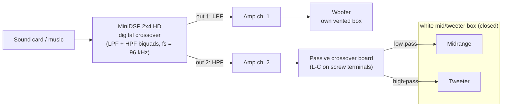

# Lecture 9 — Loudspeakers 3: Systems and Crossovers

> [!info] Lecture Info
> **Date:** Thursday 8 October 2026, 8:30–12:00 · Lyngby · **VCH**. Written from the slide deck, Problems 9 and the **official solutions** (already out). Every number was checked with `p9.py`. The recording [[Courses/34870 Electroacoustics/Slides/34870_Lecture_9_E26_and_Loudspeaker_Project.mp4|lecture 9 video]] (46 min) was transcribed afterwards (Whisper, [[Transcripts/Lecture 9 - transcript|transcript]]) and the commentary checked against the note: what it adds is in §7.6.
> **Slides:** [[Courses/34870 Electroacoustics/Slides/34870_Lecture_9_E26_and_Loudspeaker_Project.pdf|Lecture 9 slides]] (28 pages, 2 slides per page; crossovers on slides 2–32, the project on 33–56)
> **Problems:** [[Courses/34870 Electroacoustics/Project/34870_Problems_9_2026.pdf|Problems 9]] (Loudspeakers 3, with the two Peerless data sheets) · **Solutions:** [[Courses/34870 Electroacoustics/Exercises/34870_Solutions_9_2026.pdf|Solutions 9]] (problems 1–2 only)
> **Refs:** [[Courses/34870 Electroacoustics/Project/Leach_4ed_chapter10_crossover.pdf|Leach ch. 10 (crossover networks)]]
> **Project files:** [[Courses/34870 Electroacoustics/Project/34870_Project_Guide_2026.pdf|Project Guide]] · [[Courses/34870 Electroacoustics/Project/Loudspeaker Project - Systems 2026.pdf|Project systems]] · [[Courses/34870 Electroacoustics/Project/Project woofers datasheets.pdf|Woofer data sheets]] · [[Courses/34870 Electroacoustics/Project/Passive_Filters_And_Measurement_Data_in_LTspice.zip|Passive filters + measurement data zip]] (`Matlab2LTspice.m`, `phaseunwrap.m`, example `.asc`) · [[Courses/34870 Electroacoustics/Project/Digital_Filters_to_MiniDSP_&_LTspice.zip|Digital filters zip]] (`DigitalCrossover.m`)
> **Script:** [p9.py](file:///home/mads/DTU/5.%20Semester/Electroacoustics/LTspice/Problems%209%20-%20Crossovers/p9.py) in `5. Semester/Electroacoustics/LTspice/Problems 9 - Crossovers/` (outside the vault, opens in the system editor). It prints problems 1–2 against the brackets, writes the two problem 3 schematics (`--verify` runs LTspice headless, matches the closed form to 3·10⁻⁵) and the figures in `Images/Lecture9/` with `--plots`.
> **Previous:** [[Lecture 8 - Loudspeaker Enclosures|Lecture 8]] · **Next:** **Lab E** Tue 20/10 08:30 (anechoic chamber: the transfer functions this lecture's LTspice import needs) · [[Courses/34870 Electroacoustics/Slides/34870_Lecture_10_Digest_Lab_E.pdf|Lecture 10 digest (Lab E)]] is already out
> **Interactive version:** <https://study.madsrudolph.dev/34870/#l9>

> [!abstract] Where this lecture sits
> Lectures 7 and 8 built **one** driver in **one** box. No single driver covers 20 Hz–20 kHz well, so a real loudspeaker splits the signal between two or three drivers with **crossover filters**. The idea is easy: low-pass the woofer, high-pass the tweeter, add the two. The details are hard. The textbook filters assume the load is a **resistor** ($R_E$), but a driver is not a resistor. Each filter also turns the phase, so the two outputs can cancel where they overlap. And the drivers have their own phase and sensitivity. The second half of the lecture is the **loudspeaker project**: a 3-way system with a DSP crossover (woofer/mid) and a passive one (mid/tweeter), designed in LTspice from measured data.

---

## 1. Why crossovers, and passive vs active — slides 4–7

Several drivers together cover a wider band. Where their ranges overlap you **filter**, for four reasons (slide 6):

- a **flatter** combined response
- **better directivity**: a big cone beams at high frequency (Lecture 7, $ka > 1$), so stop feeding it there
- **efficiency**: no power wasted in a driver that cannot radiate it
- **rejection of break-up**: keep each cone below its first modes

| | **Passive** (slide 4) | **Active / DSP** (slide 5) |
|---|---|---|
| where | after the amplifier, L-C network inside the box | before the amplifiers, digital filter in a DSP |
| amplifiers | one for all drivers | **one channel per driver** |
| power | none needed | needs the DSP + amps |
| affected by the driver? | **yes**: the driver is the filter's load | **no**: the amp drives the driver directly |
| design | component values (standard values, tolerances) | software (and other tuning possible) |

Both need **measurements, simulations and listening tests**. The DSP control software alone is not enough (slide 5).

> [!tip] Low-pass + high-pass in cascade = band-pass (slide 7)
> That is the midrange in a 3-way system, §4.

---

## 2. The ideal filters on a resistor — slides 8–15

**The order is the number of reactive components** (L and C), and each order adds 20 dB/decade (6 dB/oct) of slope. "Ideal" here means the load is a plain resistor $R_E$.

> [!important] 1st order — slides 8–9
> Low-pass, series $L$ into $R_E$: $\;H = \dfrac{1}{1 + j\omega/\omega_0}$, $\quad\omega_0 = R_E/L \;\Rightarrow\; L = \dfrac{R_E}{\omega_0}$
>
> High-pass, series $C$ into $R_E$: $\;H = \dfrac{j\omega/\omega_0}{1 + j\omega/\omega_0}$, $\quad\omega_0 = \dfrac{1}{R_EC} \;\Rightarrow\; C = \dfrac{1}{R_E\,\omega_0}$

> [!example] Slide 10 — 1st-order crossover at 3 kHz
> 5″ woofer/mid $R_E$ = 6 Ω: $L = 6/(2\pi\cdot3000)$ = **0.32 mH**. 1″ tweeter $R_E$ = 5 Ω: $C = 1/(5\cdot2\pi\cdot3000)$ = **10.61 µF**.
> ⚠️ The slide prints **10.06 µF**: the digits are swapped. 10.61 is right.

> [!important] 2nd order — slides 11–12 (Leach ch. 10)
> Low-pass: series $L$, shunt $C$ across $R_E$. High-pass: series $C$, shunt $L$. **Same denominator, so the same $L$ and $C$ formulas for both:**
> $$H_{LP} = \frac{1}{1 + \frac{1}{Q}\frac{j\omega}{\omega_0} + \left(\frac{j\omega}{\omega_0}\right)^2},\qquad H_{HP} = \frac{(j\omega/\omega_0)^2}{1 + \frac{1}{Q}\frac{j\omega}{\omega_0} + \left(\frac{j\omega}{\omega_0}\right)^2}$$
> $$\omega_0 = \frac{1}{\sqrt{LC}},\quad Q = R_E\sqrt{\frac{C}{L}}\qquad\Rightarrow\qquad \boxed{L = \frac{R_E}{\omega_0 Q},\quad C = \frac{Q}{\omega_0 R_E}}$$
> **Butterworth** (maximally flat): $Q = 1/\sqrt2$, −3 dB at $f_0$.

> [!important] 3rd-order Butterworth — slide 13
> $H_{LP} = 1/\big(1 + 2s + 2s^2 + s^3\big)$ with $s = j\omega/\omega_0$, 60 dB/decade.
> | | series | shunt | series (next to $R_E$) |
> |---|---|---|---|
> | **low-pass** | $L_1 = \dfrac{3R_E}{2\omega_0}$ | $C = \dfrac{4}{3R_E\omega_0}$ | $L_2 = \dfrac{R_E}{2\omega_0}$ |
> | **high-pass** | $C_1 = \dfrac{2}{3R_E\omega_0}$ | $L = \dfrac{3R_E}{4\omega_0}$ | $C_2 = \dfrac{2}{R_E\omega_0}$ |
> Checked numerically: both ladders reproduce the transfer function exactly into $R_E$.
>
> Higher order separates the drivers better and **protects** mid/tweeter from large excursions. It costs more parts (more money) and **more phase shift**.

> [!important] Linkwitz-Riley — slides 14–15
> **LR = a Butterworth filter squared:** $H_{LR2} = (H_{BW1})^2$, $H_{LR4} = (H_{BW2})^2$.
> - **LR2** $= \dfrac{1}{(1 + j\omega/\omega_0)^2}$: the same circuit as the 2nd-order filter with **$Q = 1/2$**, so $L = \dfrac{R_E}{\pi f_0}$, $C = \dfrac{1}{4\pi f_0 R_E}$. **−6 dB** at $f_0$. Flat sum **with one driver inverted**. 40 dB/dec.
> - **LR4**: 4-element ladder, **flat sum with the same polarity**, 80 dB/dec. Slide 15's values (verified against $(H_{BW2})^2$ in `p9.py`):
>
> | LR4 | 1st series | 1st shunt | 2nd series | 2nd shunt (across $R_E$) |
> |---|---|---|---|---|
> | low-pass | $L_1 = 1.886R_E/\omega_0$ | $C_1 = 1.591/(\omega_0R_E)$ | $L_2 = 0.943R_E/\omega_0$ | $C_2 = 0.354/(\omega_0R_E)$ |
> | high-pass | $C_1 = 1/(1.886\,\omega_0R_E)$ | $L_1 = R_E/(1.591\,\omega_0)$ | $C_2 = 1/(0.943\,\omega_0R_E)$ | $L_2 = R_E/(0.354\,\omega_0)$ |

---

## 3. Phase: why the sum is not 1 — slides 16–17, Problems 9.1–9.2

Passive filters always shift the phase. **Low-pass lags (delay), high-pass leads (advance)**, and the shift grows with the order.

- **1st order** (slide 16): at $f_0$ the two outputs are $\tfrac{1}{\sqrt2}\angle{-45°}$ and $\tfrac{1}{\sqrt2}\angle{+45°}$, so they are 90° apart, and $H_{LP} + H_{HP} = \dfrac{1 + j\omega/\omega_0}{1 + j\omega/\omega_0} = 1$ exactly. Perfect sum, but only 20 dB/dec of protection.
- **2nd order** (slide 17): −90° and +90°, **180° apart at $f_0$**. Same polarity gives a **total cancellation**. Inverting one driver gives a **+3 dB bump** (Butterworth) because both are −3 dB and now add in phase: $2/\sqrt2 = \sqrt2$.

> [!success] Problem 9.1b — LR2 sums flat with the tweeter inverted
> $$H_{LP} - H_{HP} = \frac{1}{(1+s)^2} - \frac{s^2}{(1+s)^2} = \frac{(1-s)(1+s)}{(1+s)^2} = \frac{1-s}{1+s}$$
> $|1 - j x| = |1 + j x|$, so the magnitude is **exactly 1 at every frequency**. It is an **all-pass**: flat magnitude, but the phase still turns from 0 to −180°.

> [!example] Problem 9.2 — the total response (official solution plots reproduced, `p9.py`)
> | Sum, at $f/f_c$ = | 0.5 | **1** | 2 | phase at $f_c$ |
> |---|---|---|---|---|
> | BW2, same polarity | −2.8 dB | **−∞** (null) | −2.8 dB | — |
> | BW2, tweeter inverted | +1.7 dB | **+3.0 dB** | +1.7 dB | −90° |
> | LR2, same polarity | −4.4 dB | **−∞** (null) | −4.4 dB | — |
> | **LR2, tweeter inverted** | 0 | **0** | 0 | −90°, total 0 → −180° |
> | **LR4, same polarity** | 0 | **0** | 0 | ±180°, total 0 → −360° |
>
> ![[P9_crossover_families.png]]
> *Top: the two filter halves and their sum both ways. Bottom: the phase of the sum. LR4's phase wraps through ±180° at $f_c$ but is a smooth 0 → −360° all-pass underneath.*
>
> The official wording: LR2's magnitude is flat, but "the response shows a shift in phase of 180° from low to high frequency", which is **non-linear phase** (a linear-phase system has phase ∝ frequency, i.e. a pure delay). LR4 turns twice as far in total, but the solutions call it "much better than for 2nd order since it is only near the crossover frequency that the phase is different from zero" (they plot the wrapped phase, which is back near 0° away from $f_c$).

> [!tip] What to remember
> **Butterworth halves are −3 dB at $f_c$ and add in power. Linkwitz-Riley halves are −6 dB and add in voltage.** Driver outputs add as pressures (voltages), so LR is the family that sums flat. Pick the polarity from the order: LR2 → invert one; LR4 → same polarity.

---

## 4. Band-pass for the midrange — slide 18

A high-pass ($C_1$ series, $L_1$ shunt) followed by a low-pass ($L_2$ series, $C_2$ shunt), each designed with the §2 formulas on $R_E$ at its own corner. This works only if **$\omega_l \gg \omega_h$**, that is, the low-pass corner well above the high-pass corner. Otherwise $L_2$–$C_2$ loads $C_1$–$L_1$ and both corners move.

---

## 5. Real drivers break the ideal — slides 20–30

Slide 20 lists what goes wrong when you put real drivers behind the textbook filter:

| Issue | What happens | What to do |
|---|---|---|
| **driver response** | not flat, and the phases differ in the crossover region | the driver *adds to* the filter, so design the filter for the driver |
| **driver impedance** | a resonance peak plus an inductive rise, not $R_E$ | **always check the voltage at the driver** |
| **box diffraction** | edges and shape colour the response | check the drivers' relative positions |
| **directivity** | drivers beam at high frequency | the response depends on angle |
| **sensitivity** | each driver has its own dB/2.83 V | level-match (L-pad, or DSP gain) |

### 5.1 Sensitivity: the L-pad — slide 21

The most sensitive driver (usually the tweeter) has to be turned down. An **L-pad** (series $R_1$, shunt $R_2$ across the driver) attenuates by $\kappa$ and still shows the filter the **same load $R_E$**, so the filter design survives.

> [!important] L-pad
> Want $V_2/V_1 = \kappa$ and $R_{in} = R_1 + R_2\parallel R_E = R_E$:
> $$R_2\parallel R_E = \kappa R_E \;\Rightarrow\; \boxed{R_1 = (1-\kappa)\,R_E,\qquad R_2 = \frac{\kappa}{1-\kappa}\,R_E}$$
> Example: a 6 Ω tweeter turned down 3 dB ($\kappa$ = 0.708) needs $R_1$ = 1.75 Ω, $R_2$ = 14.5 Ω.

> [!warning] Not on a woofer
> The series resistance adds to $R_E$ and raises $Q_{ES}$ (Lecture 7: $Q_{ES} ∝ R_E$), which **retunes the box**, especially a vented one. Sometimes that is what you want, but not by accident.

### 5.2 Example 1: mid + tweeter with BW2 — slides 22–26

- The raw drivers are already **~180° apart** in the crossover region, and the tweeter is more sensitive (slide 22).
- BW2 adds its own 180°, which **compensates** the drivers' difference (slide 23). Warning on the slide: that is the ideal filter into a resistor.
- Filters + drivers (slides 24–25): with **the same polarity** the phase is roughly continuous and the sum has a **bump**. With one driver inverted the phase jumps ~180° and the sum has a **dip**. The opposite of what §3 predicts for ideal filters, because the drivers brought their own 180°.
- Slide 26: the voltage at the filter output **into the real driver** is visibly different from the ideal resistive-load curve. **Always check.**

### 5.3 Example 2: the driver's own impedance — slides 27–28

- **Voice-coil inductance** (slide 27): a 1st-order low-pass is a series $L$ into the driver. When the driver itself is inductive, $|Z_E|$ rises with frequency at the same rate as $\omega L$, so the divider **stops attenuating**. A 1st-order low-pass on a woofer with large $L_E$ barely works.
- **Mechanical resonance** (slide 28): a high-pass near the driver's resonance sees the impedance **peak**, not $R_E$. The filter output overshoots there. This matters for **midrange and tweeter**. **Fix: put the crossover well above the driver's resonance.**

### 5.4 Compensation networks (Zobel) — slide 29

Make the driver look like $R_E$ to the filter by adding networks in parallel with it:

| Compensate | Network across the driver | Values |
|---|---|---|
| inductance | series $R_1$–$C_1$ | $R_1 = R_E$, $\;C_1 = L_E/R_E^2$ |
| mechanical resonance | series $R_2$–$L_2$–$C_2$ | $R_2 = R_E\left(1 + \dfrac{Q_{ES}}{Q_{MS}}\right)$, $\;L_2 = \dfrac{R_EQ_{ES}}{2\pi f_S}$, $\;C_2 = \dfrac{1}{2\pi f_SR_EQ_{ES}}$ |

For a lossy (non-ideal) inductance the $R_1$–$C_1$ values become a lengthy expression (Leach).

> [!warning] "DO NOT USE IN THE PROJECT" (slide 29, in capitals)
> Many components, side effects, and very sensitive to the values. Instead:
> - **shift one or both crossover frequencies** (the low-pass and high-pass corners do not have to be equal)
> - **change one or more filters** (for example a different order)

### 5.5 The phase of the drivers decides the order — slide 30

Even if the filter outputs add up nicely, the **drivers' own phase** can make them cancel. Measure the phase of each driver **mounted in the box, at the listening point**, in the crossover region, and choose the order so that drivers + filters end up roughly in phase.

> [!example] Slide 30 at 3 kHz
> The drivers differ by **210°**. A 1st-order pair adds 90° → 300° ≡ **60°** apart. A 2nd-order pair adds 180° → 390° ≡ **30°** apart. So here 2nd order is the better choice.
> Two more knobs: **swap the cables on one driver** (adds 180°), or **move the crossover frequency**.

---

## 6. Problem 9.3 — two real drivers in LTspice

> [!question] Problem 3
> (a) Peerless **SLS-P830669** 12″ woofer in a **40 L** closed box and Tymphany **NE123W-08** 4″ midrange in a **2 L** closed box. 2nd-order Butterworth crossover at **250 Hz**, LTspice model of both drivers + filters. (b) Flip the midrange polarity and/or change Q. (c) Your own filter type and crossover frequency. No brackets, no official solution.

**The drivers in their boxes** (data-sheet T-S values, Lecture 8's closed box with $M_{AB} ≈ M_{A1}$, so only the spring changes: $C_{MT} = C_{MS}/(1+\alpha)$):

| | $f_S$ | $Q_{TS}$ | $\alpha = V_{AS}/V_B$ | $f_C$ | $Q_{TC}$ | $\lvert Z\rvert_{max}$ | SPL 2.83 V/1 m (model / sheet) |
|---|---|---|---|---|---|---|---|
| SLS-P830669, 40 L | 31.5 Hz | 0.54 | 3.31 | **65.4 Hz** | **1.12** | 74 Ω | 92.1 / 89.85 dB |
| NE123W-08, 2 L | 61.3 Hz | 0.35 | 2.95 | **121.8 Hz** | **0.69** | 90 Ω | 88.8 / 87.23 dB |

**The filter (on $R_E$):** woofer low-pass $L$ = **5.04 mH**, $C$ = **80.4 µF** ($R_E$ 5.6 Ω); midrange high-pass $C$ = **71.8 µF**, $L$ = **5.64 mH** ($R_E$ 6.27 Ω).

**The schematic** (`P9_3_BW2_250Hz.asc`): per driver an electrical loop ($R_E$, $L_E$, $H_{emf} = Bl\,u$) and a mechanical loop ($H = Bl\,i$, $M_{MS}$, $R_{MS}$, $C_{MT}$), the far-field pressure from an E source `Laplace = ρS_D/(2π)·s` on the velocity, and a sum $p_w + \text{pol}\cdot p_m$. Every filter part is a `.param` of `fc`, `Q` and $R_E$, so `fc=300` redesigns the whole filter. A second copy of each filter drives a plain $R_E$, so `V(vw)` vs `V(vw_id)` is slide 26 directly.

![[P9_3_BW2_SPL.png]]
*(a)+(b): with the same polarity BW2 leaves a **20 dB hole** at 250–320 Hz (§3 says −∞ at $f_c$ for ideal filters). With the midrange inverted it fills in, with the expected bump just above 180 Hz.*

![[P9_3_filter_voltage.png]]
*Why it is not the textbook curve: the high-pass puts **2.71 V** on the midrange at 250 Hz instead of 2.00 V into a resistor (+2.6 dB), with a **+4.6 dB** peak at 179 Hz. The midrange's box resonance is at 122 Hz, only one octave below the crossover, which is exactly slide 28's warning. The woofer's low-pass overshoots +3.4 dB at 96 Hz, where the woofer's $Q_{TC}$ = 1.12 hump already sits.*

**Summed SPL, 2.83 V at 1 m** (125 / 177 / 250 / 354 / 500 Hz, ripple over 125–500 Hz):

| Filter | Midrange | SPL | Ripple |
|---|---|---|---|
| BW2 @ 250 | normal | 96.5 / 92.0 / **74.7** / 72.4 / 83.2 | 28.6 dB |
| BW2 @ 250 | **inverted** | 96.0 / 97.6 / 95.0 / 92.9 / 91.0 | 6.9 dB |
| LR2 @ 250 ($Q$ = 0.5) | inverted | 94.2 / 95.7 / 92.0 / 90.4 / 89.6 | 6.3 dB |
| LR4 @ 250 | normal | 94.4 / 92.1 / 90.2 / 91.7 / 89.4 | 6.4 dB |
| **BW2 @ 350** | **inverted** | 95.8 / 94.3 / 95.6 / 94.2 / 93.2 | **2.6 dB** |

Most of the leftover ripple is not the crossover. The woofer alone is **~4 dB louder** than the midrange at 250 Hz (92.7 vs 88.5 dB) and keeps falling above it (its 1.12 mH coil corners at $R_E/2\pi L_E$ = 800 Hz). Moving the crossover up to 350 Hz meets the midrange's level better, **and** moves away from its 122 Hz resonance: both slide 29 remedies at once.

![[P9_3_LR4_SPL.png]]
*(c) LR4 at 250 Hz: textbook-flat in theory, but the 4-element low-pass resonates with the woofer and puts **+9 dB** on it at 84 Hz. That gives a **103.5 dB** bass hump against 94.5 dB unfiltered. A higher-order passive filter is *more* sensitive to the load, not less. The midrange side also shows a sharp spike at 127 Hz (its box resonance).*

> [!tip] Lessons from problem 3
> 1. **Check the voltage across each driver, not just the filter in isolation.** `V(vw)/V(vw_id)` makes that one trace.
> 2. Keep the high-pass corner **≥ 2× the midrange's $f_C$** in its box.
> 3. On a woofer with big $L_E$ and a high $Q_{TC}$, a big passive low-pass is a liability. That is one reason the project does the woofer/mid split **digitally** (§7).

---

## 7. The loudspeaker project — slides 31–56 + Project Guide

### 7.1 The system

**Group 10 = System D** (shared with group 4): **Dali Spektor 2 (S/N 7446912 – L)** mid/tweeter box + **ScanSpeak 26W/8534G00** woofer in the custom box (the same pair as Lab D). The project guide's appendix 2 resolves the Lab D question of which DALI model it is.

**Five tasks** (Project Guide):
1. **Low-frequency tuning of the woofer box** (Lectures 7–8, Lab D). You cannot reach a textbook alignment with the given box. You can add filling (more effective volume, more damping), reduce the volume with objects of known volume (not advised), and use **one, two or none of the two telescopic vents** (they combine into one acoustic mass). Validate the LTspice model against the **near-field** measurements. **Don't tune by ear.** The anechoic room is useless here (cut-off 125 Hz).
2. **Model the crossovers** in LTspice from measured $Z_i$ (Lab D) and TF (Lab E).
3. **Build them**: DSP coefficients into the MiniDSP, passive parts on the board, measure in the anechoic chamber (vents covered).
4. **Listening test** in the IEC 60268-13 room (booked all November): a procedure and a questionnaire, not casual listening. Equipment outside, through the pass-through panel, door closed.
5. **Project quiz** (individual, two parts with different deadlines: part 1 = LTspice models + Lab D/E integration, part 2 = final results) and the **demo on the last day** in room 019, with a vote on the best sound. Bring only the filter board and the DSP coefficients.

### 7.2 Two workflows — slide 31

| "Fast" (and wrong) | Iterative (the one to use) |
|---|---|
| pick drivers, tune the vent by ear | design the vented box with the circuit (L7–8) |
| crossover from the data sheet | **measure** each driver's response and impedance **in the box** |
| textbook filter, build, measure | import into LTspice, choose crossover frequency and type |
| | experiment in LTspice, build, measure, **repeat**, listen, repeat |

"And do not forget the low-frequency design of the woofer!"

### 7.3 Phase: unwrapping and distance compensation — slides 43–50

A measured transfer function has a huge phase term $e^{-jkr}$ from the travel time to the microphone, plus a **random sound-card/UMIK delay** every measurement. MATLAB returns the phase wrapped to $[-\pi, \pi]$. Unwrapping alone leaves ~7000° (≈ 39π) of slope, and the drivers cannot be compared.

> [!important] Distance compensation = multiply by $e^{+jkd}$
> `phaseunwrap.m` adds $2\pi f d/c$ (with **c = 345 m/s**) to the phase, then unwraps.
> - **Same microphone position for every driver.** The listening position defines the relative phases (slide 49).
> - **The same $d$ for every driver.** Each driver is at a different distance, so you can never compensate all of them perfectly (slide 50). That is the point: their *relative* phase is real and must survive.
> - **Never distance-compensate an input impedance** (`Matlab2LTspice` forces $d$ = 0 for $Z_i$).

### 7.4 Measured data in LTspice — slides 51–54, Project Guide §2

- **Impedance** → a voltage-controlled **current** source $I = V_{in}/Z$, i.e. gain $1/Z$ (`BiZin Vspkr 0 I=V(Vspkr,0) DB FREQ= …`). The 0 V source **`Yi`** in series senses that current: $1/I(Y_i)$ is the input impedance.
- **Transfer function** → a voltage-controlled **voltage** source $V_{out} = TF\cdot V_{in}$ (`BvTF Pout 0 V=V(Vspkr,0) DB FREQ= …`).
- The tables are too long for the schematic's value field, so `Matlab2LTspice(fr, resp, name, Rtype, d)` writes them to text files that the schematic pulls in with **`.inc`**. Tables are (Hz, dB, degrees).
- **R1 on the Pout node is irrelevant** (a voltage source drives it): it is *not* a radiation impedance.
- **Three drivers = three such circuits.** Rename `Vspkr`/`Pout` in the **first line of each text file** and in the schematic labels. Duplicate names break the netlist. Sum the three `Pout` with series controlled sources in their own loop, using a gain of −1 for a polarity flip.
- **Digital filters** (slide 54): `DigitalCrossover(f0, 'LPF'|'HPF', n)` returns the MiniDSP `biquad_DSP` text and the LTspice `Laplace=` string(s) for an E source. No $Z_i$ is needed on that branch, because the amp isolates the driver from the filter.

> [!warning] Gotchas found in the course files
> - **`DigitalCrossover.m` makes Butterworth, not Linkwitz-Riley.** `cascade_BW` sets $Q_k = 1/(2\cos(k\pi/2n))$: n = 2 gives **Q = 0.707 (BW2)**, n = 4 gives **Q = 0.541 and 1.307 (BW4)**. By §3 a BW2 pair nulls at $f_c$ with the same polarity and bumps +3 dB inverted. An LR4 would be **two cascaded Q = 0.707 biquads**, i.e. the n = 2 result applied twice. That is not an option of the function; ask VCH whether pasting the same biquad twice into the MiniDSP is acceptable.
> - The LTspice digital filter is **exact**: `biquad2ltspice` writes $z^{-1} = e^{-sT}$ with $T$ = 1/96 kHz, not a bilinear approximation.
> - The example `Loudspeaker_with_measurement_files and example filter.asc` is described in the guide as a **"2nd-order passive LPF example"**, but it is drawn as **series C (9.04 µF), shunt L (0.448 mH)**, which is a **high-pass**, with Problem 9.1's *woofer* values. Don't copy it as a low-pass.
> - `TF_data.txt` in the passive zip and the one in the digital zip are **different files** (23 087 vs 22 697 bytes). Neither is your driver's data.

### 7.5 Advice — slide 56 + guide

- **As simple as possible: lowest filter order, smallest circuit.**
- Passive parts come from a fixed list (guide appendix 1), **no combining parts** to make in-between values. Simulate the tolerances.
  - L: 0.15 0.18 0.22 0.33 0.39 0.47 0.56 0.68 0.82 1 1.2 1.5 1.8 2.2 mH
  - R: 1 1.5 2.2 3.3 4.7 5.6 6.8 8.2 10 15 22 33 47 Ω
  - C: 1.5 2.2 2.7 3.3 3.9 4.7 5.6 6.8 8.2 10 12 15 22 33 47 68 100 µF
- Lab-time booking spreadsheet opens after the autumn break; start the low-frequency and crossover design now from Lab D/E data.
- Prepare the listening-test procedure early. Status meetings and Q&A run during the project. Contact: VCH, b.352 r.016.
- LTspice plots: keep the y-axis range sensible (< 100 dB), or every curve looks flat.

### 7.6 From the recording, not on the slides

The commentary mostly reads the slides aloud. What it adds (timestamps into the video):

- **Crossover frequencies don't have to match** [05:43]. Already from the 1st-order example: "It doesn't have to be. You may choose different crossover frequencies", as a tool for shaping the response. The same advice comes back for Example 1 and slide 29.
- **Keep the order low** [06:58]. "The more the components, the more problems". Part of the reason: "you cannot choose exact values of the components, you only can choose normalized values".
- **Example 1 is left unsolved on purpose** [17:10]. With BW2 the drivers + filters still give a bump (same polarity) or a dip (inverted). "The problem is not solved, even though the filters seem to be the right solution". His suggested fix is moving the crossover frequency, or using different low-pass and high-pass frequencies, "an exercise in your project".
- **Zobel: "you are not allowed to use it in your project"** [19:30]. Besides being very sensitive to the values ("you could do more harm than good"), it needs non-standard values that are expensive.
- **L-pad vs DSP** [14:08]. Level matching is easy in a digital crossover (separate amplifier channels, set the gains); the L-pad is only for the passive branch, and should be avoided on woofers because it spoils the low-frequency alignment.
- **Directivity** [13:36] can't be avoided, only mitigated "with some clever design" (driver placement on the box, see also the box-edge diffraction from the previous lecture).
- **Lab D uses the closed-box method for V_AS** [27:24] ("this is actually what you will be doing in Lab D"), with $M_{AB} ≈ M_{A1}$ because it is "less subject to uncertainties" than Beranek's route via the $Q_E$'s.
- **Hardware chain** [29:58]: the same stereo amplifier as in the labs, its two channels go into the chamber / listening room, where the boxes and the passive board sit. MiniDSP: one input, two outputs; set the input gain and channel gains in the app; use **Advanced** and paste your own coefficients, because the basic filter definitions would not match LTspice.
- **Distance compensation** [36:24]: "Always R1 for all of them. In some cases it will be too short, some others it will be too big", and that is the point: you *want* to see the phase differences between units at the crossover frequency.
- **Pout resistor** [40:18]: "any resistor will do", because the output is a voltage source that imposes the voltage.
- **Digital branch without $Z_i$** [42:47]: the input impedance is commented out because the amplifier sits between filter and driver. He says the amplifier's output impedance is "so high that it doesn't matter"; a voltage amplifier's output impedance is actually very **low**, which is exactly why the driver's impedance does not load the filter. Slip of the tongue, same conclusion.
- **Listening test** [43:49]: a questionnaire about how the sound is perceived, but methodical: choose subjects (group members or recruited people), run them through it the same way, present the results "in a kind of a statistic". You can bring your own music; inside the room there is only the chair, the boxes and the passive filter board.

> [!note] Reminders on slides 34–37 (nothing new)
> Near/far-field ratio $16r/3\pi a$ ([[Lecture 8 - Loudspeaker Enclosures|L8 §7]]), T-S from the impedance curve, the added mass and the added box ([[Lecture 7 - Moving Coil Loudspeakers|L7 §8]], L8 §6). New hint on slide 36: assume $M_{AB} ≈ M_{A1}$ where possible. Beranek 2019 eqs. 6.71–6.72 need $Q_E$ with and without the box, and those come from measurements with large errors.

---

## 8. Open questions

- [x] Recording transcribed and checked against the note (§7.6).
- [ ] LR vs Butterworth in the DSP: can we paste two identical Q = 0.707 biquads to get LR4 (§7.4)?
- [ ] For System D: where is the Spektor 2's internal mid/tweeter crossover, and is it bypassed for the project? The units must be driven separately for the passive filter board to make sense.
