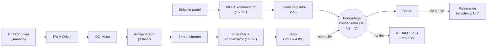

# 62768 Electrical Energy Systems — Project

> [!info] Course Information
> **Course:** 62768 Electrical Energy Systems, project
> **Term:** June 2026 (3-week course, F2026)
> **Format:** Project-based (CDIO) — groups of up to 6 students
> **Lecturers:** Ashraf (ashka@dtu.dk, T1.16) · Sam (samro@dtu.dk, T1.17) · Audrey (auddel@dtu.dk, T1.15)
> **Intro day:** Monday 8 June 2026, 09:00 — room **X2.70**
> **Lab work:** room **V1.01-04**
> **Assessment:** Group report + functional model (no written exam — project hand-in)

> [!tip] Quick Links
> - [DTU Course Page](https://kurser.dtu.dk/course/62768)

---

## The Project — what we're building

A complete **electrical energy system** that meets the [[Project Specifications.pdf|requirement spec (Kravspecifikation)]]. Block diagram from the spec:

> [!abstract] In words
> A DC motor drives a 3-phase AC generator → stepped through 3 transformers → rectified → fed to a **self-built buck converter**. A **solar panel + MPPT** feeds an energy-storage capacitor (1F) via a linear regulator. A **self-built boost converter** supplies a pulsing 10V load. An **Arduino** closes a PID loop on the motor (PWM) and handles monitoring. Converters and current sensing must use **discrete components** (no integrated converter ICs; op-amps allowed).

---

## Requirements at a glance

Full list (18) in [[Project Specifications.pdf]]. **Priority 1 = must design & implement. Priority 2 = optional.**

| # | Requirement | Target |
|---|---|---|
| 1 | AC-generator voltage (V1) | 15 V ±1 V @ 100 mA buck current |
| 2 | AC-generator current | deliver 300 mA to buck |
| 3 | V1 under load | hold req.1 within 1.0 s for 100→300 mA step |
| 4 | Load voltage (V2) | within ±1.0 V |
| 5 | Load current (V2) | deliver min. 150 mA |
| 6 | V2 under load | ±1.0 V for 50→150 mA step within 1.0 s |
| 7 | Energy-storage (V3) | 5 V ±0.5 V for currents > 20 mA |
| 8 | Voltage conversion | self-built buck/boost converters |
| 9 | Voltage conversion | buck/boost + MPPT with **discrete components** |
| 10 | Current measurement | discrete components (op-amps OK, no other ICs) |
| 11 | Energy-source priority | use solar first, AC-generator supplements |
| 12 | Buck & Boost converter | realised as part of the project |
| 13 | System monitoring (P2) | PC-based voltage monitoring |
| 14 | System monitoring (P2) | update every 1.0 s |
| 15 | Software design (P2) | Arduino ADC, timer interrupts, PWM |
| 16 | System test | 100 W LED light (0.5 m) from solar panel |
| 17 | Linear regulator (P2) | may be replaced by buck regulator |
| 18 | Data platform (P2) | Arduino |

---

## Lectures / Slides

In [[Slides]]:
- [[Lecture 1.pdf|Lecture 1 — Intro]]
- [[Lecture 1 Modeling.pdf|Lecture 1 — Modeling]]
- [[Lec 2.pdf|Lecture 2]]
- [[Lec 3.pdf|Lecture 3]]
- [[Lec 4.pdf|Lecture 4]]
- [[Lecture 5.pdf|Lecture 5]]
- [[Introduction to 62768.pdf|Course introduction (practical & group work)]]

## Labs / Experiments

In [[Labs]]:
- [[Exp 3A.pdf|Experiment 3A]]
- [[Three Phase Transformer.pdf|Three-Phase Transformer (lab guide)]]

## Simulation models (MATLAB / Simulink)

In `4. Semester/Electrical Energy Systems/`:
- **Three Phase Transformer/** — `ThreePhTrans.slx`, `ThreePhaseTransformer.slx`, `three_phase_rectifier.slx`
- **DC-DC Converters/** — `Buck_converter_Lab.slx`, `Boost_converter_Lab.slx`, `Buck_Boost__Ser.slx`, `Buck_Boost_converter_Lab.slx`, `dcdcmodel20.slx`, `dcdc120_cl.slx` + params `boost.m`, `Parameters.m`, `Parameters_Buck_Boost.m`

---

## Literature & Reference

In [[Literature]]:
- [[Project Specifications.pdf|Kravspecifikation — the project requirements (read first)]]
- [[Solceller mm.docx|Solceller mm. (solar notes)]]
- [[Motortest ver3_Ny generator.xlsx|Motor test data]]

### Datasheets (`Literature/Datasheets/`)
| Part | Use |
|---|---|
| IRF540N | Power MOSFET (converters) |
| IR2110 | High/low-side MOSFET gate driver |
| MCP601 | Op-amp |
| ACS712 / INA219 | Current sensing |
| IL300 / ILD74 / IL300 note | Optocouplers (galvanic isolation) |
| SR555SHP-3247S-75C | (component) |
| Motors Datasheets | DC motor specs |
| LAUNCHXL-F28027 / sprz376 | TI C2000 LaunchPad + errata |
| 1362132 | (component) |

---

## Why This Course

> [!abstract] Relevance to Audio Profile
> Pure power-electronics practice: building rectifiers, buck/boost converters, and regulated supplies with discrete components — the same supply-design skills behind clean rails for amplifiers. Complements 34620 Power Electronics and 34655 Analog Electronics.

---

## Status / TODO

- [ ] Day 1 (8 June): intro, form group, read [[Project Specifications.pdf]]
- [ ] Get familiar with the Simulink converter models
- [ ] Lab: V1.01-04
