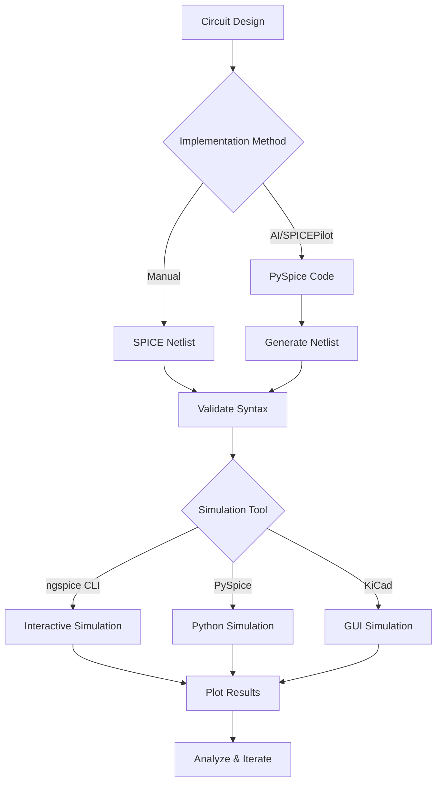

# Simulation Workflows

Practical guide to running SPICE simulations with different tools and workflows.

## Workflow Overview



## Method 1: ngspice Command Line (Recommended ✅)

### Quick Start

```bash
# Navigate to circuit directory
cd C:\Users\Mads2\SPICEPilot

# Run interactive ngspice
ngspice two_stage_opamp_kicad.cir
```

### Interactive Commands

Once in ngspice prompt (`ngspice 1 ->`):

```bash
# Run simulation
run

# Plot voltage magnitude in dB
plot vdb(vout)

# Plot phase
plot vp(vout)

# Plot multiple signals
plot v(vout) v(n_d2) v(n_d3)

# Print specific value
print v(vout)

# Print all node voltages
print all

# Show available vectors
display

# Quit
quit
```

### Batch Mode

For automated/scripted simulations:

```bash
ngspice -b two_stage_opamp_kicad.cir -o output.log
```

**Advantages:**
- No interaction needed
- Output saved to file
- Good for automation/scripts

### Using Batch Files

**Interactive with plots:**
```batch
# run_with_plots.bat
@echo off
echo Starting ngspice...
ngspice two_stage_opamp_kicad.cir
```

**Automated:**
```batch
# run_batch.bat
@echo off
ngspice -b two_stage_opamp_kicad.cir -o results.txt
echo Results saved to results.txt
notepad results.txt
```

## Method 2: PySpice (Python Integration)

### Basic Simulation Script

```python
from PySpice.Spice.Netlist import Circuit
from PySpice.Unit import *
import matplotlib.pyplot as plt
import numpy as np

# Create circuit (see two_stage_opamp_improved.py)
circuit = Circuit('Op-Amp')
# ... (add components)

# Simulate
simulator = circuit.simulator(temperature=25, nominal_temperature=25)

# Operating Point
dc_analysis = simulator.operating_point()
print("DC voltages:")
for node in dc_analysis.nodes.values():
    print(f"  {str(node)}: {float(node):.3f} V")

# AC Analysis
ac_analysis = simulator.ac(
    start_frequency=0.1@u_Hz,
    stop_frequency=1@u_GHz,
    number_of_points=200,
    variation='dec'
)

# Extract and plot data
frequency = np.array(ac_analysis.frequency)
vout = np.array(ac_analysis['vout'])
gain_db = 20 * np.log10(np.abs(vout) + 1e-20)

plt.semilogx(frequency, gain_db)
plt.grid(True)
plt.xlabel('Frequency (Hz)')
plt.ylabel('Gain (dB)')
plt.title('Frequency Response')
plt.show()
```

### Running PySpice Scripts

```bash
python two_stage_opamp_improved.py
```

**Advantages:**
- Full Python integration
- Easy to automate
- Good for parameter sweeps
- Can save data in any format

**Disadvantages:**
- Requires Python knowledge
- More complex than ngspice CLI
- Setup overhead

## Method 3: KiCad Simulator

### Setup (when working)

1. Open KiCad project
2. Schematic Editor → Inspect → Simulator
3. Configure simulation (AC, DC, Transient)
4. Run
5. Add signals to plot

### Current Status

⚠️ **Partial functionality** - see [[03 - KiCad Integration Methods]]

## Simulation Types

### 1. Operating Point Analysis (.op)

**Purpose:** Find DC voltages and currents

**SPICE Command:**
```spice
.op
```

**PySpice:**
```python
analysis = simulator.operating_point()
```

**ngspice:**
```bash
ngspice> run
ngspice> print all
```

**Typical Output:**
```
vout = 9.054408e-02
n_tail = 8.458424e-01
n_d2 = 3.328068e+00
...
```

**Use cases:**
- Verify biasing
- Check transistor regions (saturation/linear)
- Starting point for AC/Transient analysis

### 2. AC Analysis (.ac)

**Purpose:** Frequency response (Bode plots)

**SPICE Command:**
```spice
.ac dec 100 0.1 1G
```
- `dec` = decade sweep
- `100` = 100 points per decade
- `0.1` = start frequency (Hz)
- `1G` = stop frequency (Hz)

**PySpice:**
```python
ac = simulator.ac(
    start_frequency=0.1@u_Hz,
    stop_frequency=1@u_GHz,
    number_of_points=100,
    variation='dec'  # or 'lin' or 'oct'
)
```

**ngspice:**
```bash
ngspice> ac dec 100 0.1 1G
ngspice> plot vdb(vout)    # Magnitude in dB
ngspice> plot vp(vout)     # Phase in degrees
```

**Use cases:**
- Bode plots (gain and phase)
- Finding bandwidth, unity-gain frequency
- Stability analysis (phase margin)

### 3. Transient Analysis (.tran)

**Purpose:** Time-domain behavior

**SPICE Command:**
```spice
.tran 1n 10u
```
- `1n` = time step (1 ns)
- `10u` = end time (10 µs)

**PySpice:**
```python
tran = simulator.transient(
    step_time=1@u_ns,
    end_time=10@u_us
)
```

**ngspice:**
```bash
ngspice> tran 1n 10u
ngspice> plot v(vout) v(vin_p)
```

**Use cases:**
- Step response
- Settling time
- Slew rate
- Distortion analysis

### 4. DC Sweep (.dc)

**Purpose:** Transfer characteristics

**SPICE Command:**
```spice
.dc Vin 0 5 0.01
```

**PySpice:**
```python
dc = simulator.dc(Vin=slice(0, 5, 0.01))
```

**ngspice:**
```bash
ngspice> dc Vin 0 5 0.01
ngspice> plot v(vout)
```

**Use cases:**
- Input-output transfer curve
- Finding switching threshold
- Linearity analysis

## Parameter Sweeps

### Single Parameter Sweep (ngspice)

```spice
.control
let vbias_start = 3.0
let vbias_stop = 4.0
let vbias_step = 0.1

let vbias = vbias_start
while vbias le vbias_stop
    alter Vbias_p = vbias
    ac dec 100 0.1 1G
    plot vdb(vout)
    let vbias = vbias + vbias_step
end
.endc
```

### Multi-Parameter Sweep (Python)

```python
import numpy as np
import pandas as pd

results = []

for vbias_p in np.arange(3.0, 4.1, 0.2):
    for vbias_n in np.arange(1.0, 2.0, 0.2):
        # Update circuit
        circuit.V('bias_p', 'vbias_p', circuit.gnd, vbias_p@u_V)
        circuit.V('bias_n', 'vbias_n', circuit.gnd, vbias_n@u_V)

        # Simulate
        simulator = circuit.simulator()
        analysis = simulator.operating_point()

        # Store results
        results.append({
            'Vbias_p': vbias_p,
            'Vbias_n': vbias_n,
            'Vout_DC': float(analysis['vout'])
        })

df = pd.DataFrame(results)
df.to_csv('parameter_sweep.csv')
```

## Data Export and Analysis

### Export from ngspice

```bash
# Write data to file
ngspice> write output.raw v(vout)

# Export to CSV (if supported)
ngspice> wrdata data.csv v(vout)

# Or redirect to text
ngspice> print v(vout) > voltages.txt
```

### PySpice to CSV

```python
import pandas as pd

# After AC analysis
freq = np.array(analysis.frequency)
vout = np.array(analysis['vout'])

df = pd.DataFrame({
    'frequency': freq,
    'vout_real': vout.real,
    'vout_imag': vout.imag,
    'magnitude': np.abs(vout),
    'phase': np.angle(vout, deg=True),
    'gain_db': 20*np.log10(np.abs(vout))
})

df.to_csv('ac_analysis.csv', index=False)
```

### Plotting Exported Data

**In Python:**
```python
import pandas as pd
import matplotlib.pyplot as plt

data = pd.read_csv('ac_analysis.csv')

plt.figure(figsize=(10, 6))
plt.semilogx(data['frequency'], data['gain_db'])
plt.grid(True)
plt.xlabel('Frequency (Hz)')
plt.ylabel('Gain (dB)')
plt.title('Bode Plot')
plt.savefig('bode.png', dpi=300)
plt.show()
```

**In MATLAB:**
```matlab
data = readtable('ac_analysis.csv');

figure;
semilogx(data.frequency, data.gain_db);
grid on;
xlabel('Frequency (Hz)');
ylabel('Gain (dB)');
title('Bode Plot');
```

**In Excel:**
1. Import CSV
2. Select frequency and gain columns
3. Insert → Chart → Scatter with smooth lines
4. Format X-axis as logarithmic

## Performance Analysis

### Calculating Key Metrics (Python)

```python
# From AC analysis data
gain_db = 20*np.log10(np.abs(vout))
phase_deg = np.angle(vout, deg=True)

# DC gain
dc_gain_db = gain_db[0]
dc_gain_linear = 10**(dc_gain_db/20)

# 3dB bandwidth
gain_3db = dc_gain_db - 3
idx_3db = np.where(gain_db <= gain_3db)[0]
if len(idx_3db) > 0:
    bw_3db = frequency[idx_3db[0]]
    print(f"3dB Bandwidth: {bw_3db/1e6:.2f} MHz")

# Unity-gain frequency
idx_ugf = np.where(gain_db <= 0)[0]
if len(idx_ugf) > 0:
    ugf = frequency[idx_ugf[0]]
    phase_margin = 180 + phase_deg[idx_ugf[0]]
    print(f"Unity-Gain Freq: {ugf/1e6:.2f} MHz")
    print(f"Phase Margin: {phase_margin:.1f} degrees")

# Gain-Bandwidth Product
gbw = dc_gain_linear * bw_3db
print(f"GBW Product: {gbw/1e6:.2f} MHz")
```

### Measuring in ngspice

```bash
ngspice> meas ac dc_gain find vdb(vout) at=0.1
ngspice> meas ac ugf when vdb(vout)=0
ngspice> meas ac phase_at_ugf find vp(vout) at=ugf
ngspice> print 180+phase_at_ugf
```

## Automation Scripts

### Bash Script (Linux/Git Bash)

```bash
#!/bin/bash
# run_all_sims.sh

circuits=("opamp" "inverter" "diff_pair")

for circuit in "${circuits[@]}"; do
    echo "Simulating $circuit..."
    ngspice -b "${circuit}.cir" -o "${circuit}_results.txt"
    echo "Results saved to ${circuit}_results.txt"
done

echo "All simulations complete!"
```

### Python Automation

```python
import subprocess
import os

circuits = [
    'two_stage_opamp_kicad.cir',
    'simple_inverter.cir',
    'diff_pair.cir'
]

os.chdir('C:/Users/Mads2/SPICEPilot')

for circuit in circuits:
    print(f"Running {circuit}...")
    result = subprocess.run(
        ['ngspice', '-b', circuit, '-o', f'{circuit}.log'],
        capture_output=True,
        text=True
    )

    if result.returncode == 0:
        print(f"  ✓ Success")
    else:
        print(f"  ✗ Failed: {result.stderr}")

print("Done!")
```

## Optimization Workflows

### 1. Manual Iteration

1. Run baseline simulation
2. Identify metric to improve (gain, bandwidth, etc.)
3. Adjust one parameter
4. Re-run simulation
5. Compare results
6. Repeat

### 2. Grid Search

```python
# Example: optimize bias voltages for maximum gain

best_gain = 0
best_vbias_p = 0
best_vbias_n = 0

for vbias_p in np.arange(3.0, 4.0, 0.1):
    for vbias_n in np.arange(1.0, 2.0, 0.1):
        # Update and simulate
        # ... (circuit modification code)

        gain_db = 20*np.log10(np.abs(vout[0]))

        if gain_db > best_gain:
            best_gain = gain_db
            best_vbias_p = vbias_p
            best_vbias_n = vbias_n

print(f"Optimum: Vbias_p={best_vbias_p}, Vbias_n={best_vbias_n}")
print(f"Gain: {best_gain:.2f} dB")
```

### 3. Using Optimization Libraries

```python
from scipy.optimize import minimize

def objective(params):
    vbias_p, vbias_n = params

    # Update circuit and simulate
    # ...

    # Return negative gain (minimize -gain = maximize gain)
    gain_db = 20*np.log10(np.abs(vout[0]))
    return -gain_db

# Initial guess
x0 = [3.5, 1.5]

# Bounds
bounds = [(3.0, 4.0), (1.0, 2.0)]

# Optimize
result = minimize(objective, x0, bounds=bounds, method='L-BFGS-B')

print(f"Optimal Vbias_p: {result.x[0]:.2f}")
print(f"Optimal Vbias_n: {result.x[1]:.2f}")
print(f"Max Gain: {-result.fun:.2f} dB")
```

## Quick Reference Commands

### ngspice Interactive

| Task | Command |
|------|---------|
| Run simulation | `run` |
| Plot signal | `plot v(node)` |
| Plot dB | `plot vdb(node)` |
| Plot phase | `plot vp(node)` |
| Print value | `print v(node)` |
| Show all nodes | `print all` |
| List signals | `display` |
| Help | `help` or `help command` |
| Quit | `quit` |

### PySpice Common Patterns

```python
# Operating point
op = simulator.operating_point()
vout_dc = float(op['vout'])

# AC analysis
ac = simulator.ac(start_frequency=1@u_Hz,
                  stop_frequency=1@u_GHz,
                  number_of_points=100,
                  variation='dec')

# Transient
tran = simulator.transient(step_time=1@u_ns,
                           end_time=10@u_us)

# DC sweep
dc = simulator.dc(Vin=slice(0, 5, 0.01))
```

## Best Practices

> [!tip] Workflow Tips
> 1. **Start simple** - verify basic operation first
> 2. **Check DC bias** - always run .op first
> 3. **Log everything** - save outputs for comparison
> 4. **Version control** - track circuit changes
> 5. **Automate** - script repetitive tasks

> [!warning] Common Mistakes
> - Not checking convergence
> - Insufficient AC analysis points
> - Wrong units (Hz vs kHz vs MHz)
> - Forgetting ground node
> - Not saving intermediate results

## Related Topics

- [[02 - Two-Stage CMOS Op-Amp|Circuit Design]]
- [[03 - KiCad Integration Methods|KiCad Integration]]
- [[05 - Troubleshooting Guide|Troubleshooting]]

---

**Last Updated:** 2025-12-14
**Tools:** ngspice 41, PySpice 1.5, Python 3.13
