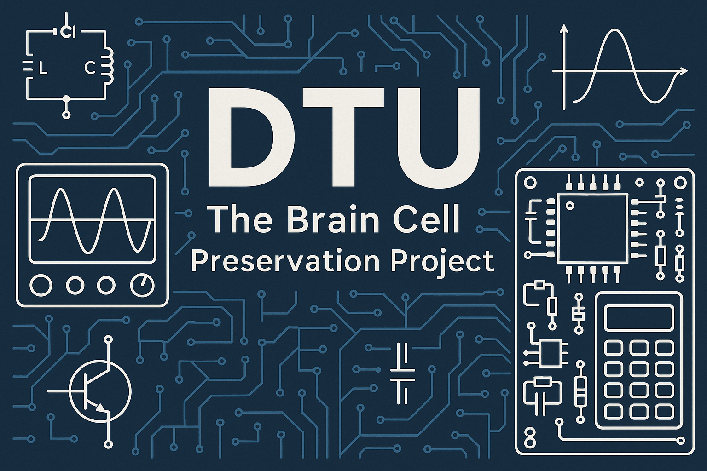

<!-- Improved and structured README for easier scanning and usage -->

<p align="center">
  
</p>

# DTU — Signal Integrity for My Brain

Welcome — this is my brain's repo: notes, cheat-sheets, sims, and tiny tools to survive exams.

TL;DR: everything is organized so you don't waste time re-deriving stuff. ⚡

---

## Table of contents

- [Repository layout](#repository-layout)
- [Toolchain overview](#toolchain-overview)
- [Branching model](#branching-model)
- [SSH & clone (quickstart)](#ssh--clone-quickstart)
- [Included scripts](#included-scripts)
- [Notes & contact](#notes--contact)

---

## Repository layout

Top-level (high level):

```
DTU/
├─ 1. Semester/            # Intro programming & basic circuits
├─ 2. Semester/            # Math, modeling, LabVIEW, digital foundations
├─ 3. semester/            # DSP, Electromagnetics, Analog IC coursework
├─ Obsidian/               # Notes, course vault (Markdown + images)
└─ scripts/                # Small utilities for vault maintenance
```

Inside `Obsidian/` the structure is consistent per course:

- `Courses/<Course>/`
- `Exercises/` (work, solutions, lab files)
- `Lecture Notes/`, `Slides/`, `Formulas/`, `Images/`
- `MOC – Course overview mapping files`

Yes — it took a while to organize, but it saves time during revision.

---

## Toolchain overview

| Area                     | Tools / files                      | Notes                                    |
|-------------------------:|:----------------------------------:|:----------------------------------------|
| Notes / knowledge base   | Markdown (Obsidian vault)          | Human-readable, portable                 |
| DSP / Math               | MATLAB (`.mlx`), Maple             | Math notebooks and scripts               |
| Analog / Circuits        | LTspice (`.asc`, `.raw`)           | Per-lesson groups                         |
| Microcontrollers         | PlatformIO, VS Code                 | MCU projects and example sketches         |
| Version control          | Git + Git LFS                       | Large binaries (slides, PDFs) via LFS     |

---

## Branching model

- `main` — stable, clean, safe to rely on.
- `haul` — big renames / reorganizations go here (talk first).
- feature branches — small focused work: `feat/...`, `fix/...`, `docs/...`.

If you're moving a lot of files, open an issue or do it on `haul` so we don't break links for everyone.

---

## SSH & clone (quickstart)

Preferred clone method is SSH. Example commands (PowerShell / Windows):

```powershell
# Generate an ED25519 key (one-liner)
ssh-keygen -t ed25519 -C "your_email@example.com"

# Ensure the ssh-agent is running and add your key
Start-Service ssh-agent
ssh-add $env:USERPROFILE\.ssh\id_ed25519

# Verify the key was added (optional)
ssh-add -l

# Test connection
ssh -T git@github.com

# Clone the repo (replace <username>)
git clone git@github.com:<username>/DTU.git
cd DTU
git lfs install
git lfs pull

# Create a feature branch
git switch -c feat/<task>
```

Linux / macOS variants use `eval "$(ssh-agent -s)"` and `ssh-add ~/.ssh/id_ed25519`.

If you prefer HTTPS, the repo still works with HTTPS clones — just use your normal GitHub flow.

---

## Included scripts

Small utilities that help keep the vault consistent and catch broken links.

| Script                                | Purpose                                            |
|--------------------------------------:|:--------------------------------------------------|
| `scripts/check_wikilinks.py`          | Find broken `[[wikilinks]]` in the Obsidian vault  |
| `scripts/check_wikilinks_courses.py`  | Scoped link checks per course                      |
| `scripts/wire_courses.py`             | Ensure course directory structure consistency      |
| `scripts/wire_em_vault.py`            | Maintain Electromagnetics vault index + refs       |

Run these from the repo root with your Python environment active.

---
## Academic integrity & usage

This repo contains **personal study material** for DTU courses: notes, helper scripts, and in some cases worked examples.

Please use it responsibly:

### ✅ Allowed / encouraged

- Reading and learning from the notes, code, and derivations  
- Using it as *inspiration* for your own solutions  
- Forking/cloning to build your own study vault  

### ❌ Not allowed

- Submitting anything from this repo **as your own work** for assignments, projects, or exams  
- Blindly copying solutions into graded hand-ins  

By using this repo, you are responsible for complying with your university’s rules on **academic honesty** and **plagiarism**. If in doubt, ask your course responsible or supervisor.

Unless otherwise specified in subfolders, content here is intended for **personal / educational use**. Do not redistribute or package it as a solution set.

See [LICENSE.md](LICENSE.md) for usage terms.

## Contributing — come hack the vault (please be chill) 🛠️

Wanna help? Love docs? Hate broken links? Sweet. Here's how to not break stuff:

- Make an issue for big changes.
- Fork -> branch -> PR. Keep PRs small.
- Branch name ideas: `feat/<what>`, `fix/<what>`, `docs/<what>`.
- Large reorganizations: discuss first, or use `haul`.

Before you open a PR, run the quick checks (PowerShell, Windows):

```powershell
# make a venv and activate it
python -m venv .venv
.\.venv\Scripts\Activate

# optional: deps
if (Test-Path requirements.txt) { pip install -r requirements.txt }

# sanity-check links
python .\scripts\check_wikilinks.py
```

If you touch lots of files, also run `scripts/wire_courses.py` or the course-scoped checker.

See [CONTRIBUTING.md](CONTRIBUTING.md) 

---

## Notes & contact

This repo's primary goal is to keep the mental signal-to-noise ratio acceptable: well-organized notes reduce repeated re-derivations during study.