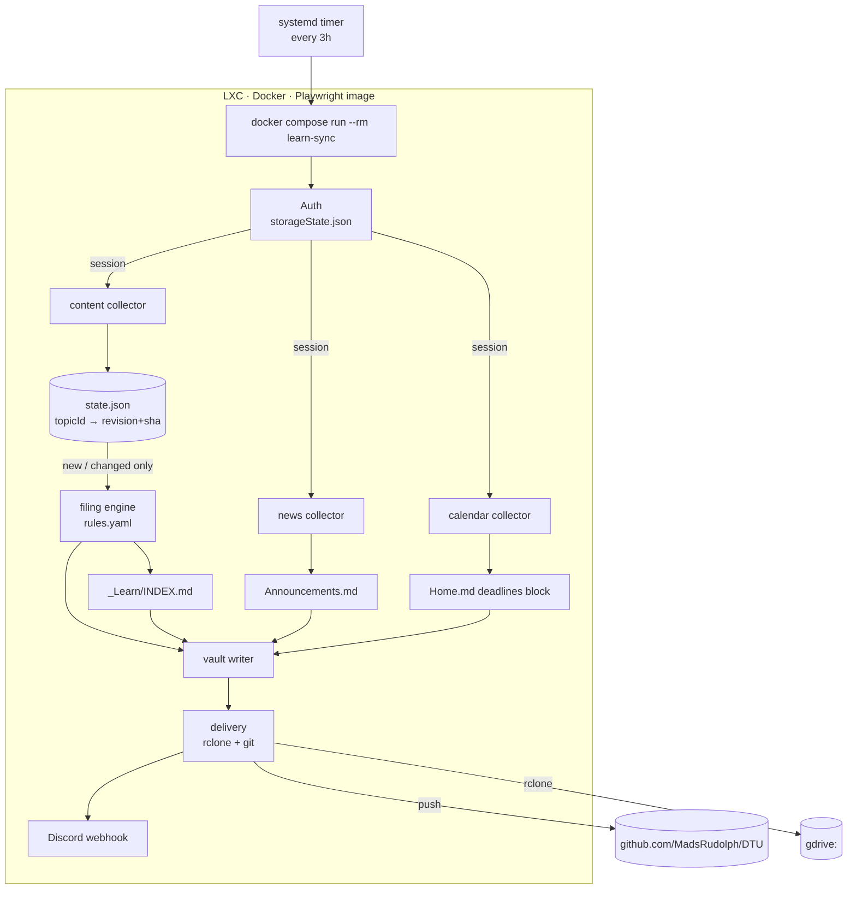

# learn-sync — automated DTU Learn → Obsidian vault pipeline

**Date:** 2026-08-31
**Status:** Design approved, ready for implementation planning

---

## 1. Problem

DTU Learn (Brightspace) releases course material incrementally — slides appear the
morning of a lecture, exercise sets mid-week, literature whenever a lecturer
remembers. Keeping the Obsidian vault current means logging in, clicking through
five courses, downloading whatever is new, and filing it by hand. It is pure
overhead and it fails silently: material gets missed, and the vault drifts from
what the course actually contains.

**Goal:** a service on the Proxmox homelab that logs into DTU Learn on a schedule,
detects material that is new or changed since last run, files it into the correct
place in the vault, pushes it through the existing git + drive-sync pipeline, and
notifies on Discord. Zero manual steps in the steady state.

## 2. Non-goals

- **Not** a Brightspace mirror or an offline Learn client. It syncs material into
  the vault; it does not reproduce the Learn UI, quizzes, or submissions.
- **Not** a submission tool. It never uploads, submits, or posts anything to DTU
  Learn. Read-only against Learn, write-only against the vault.
- **Not** multi-user. Single account, single vault.
- **Not** a general scraper framework. It targets one Brightspace instance.

## 3. Architecture



**Run model:** one-shot. Each invocation is a complete, independent sync. No
long-running daemon, no in-memory state between runs. A crashed run leaves the
system in its pre-run state and the next run retries.

## 4. Components

### 4.1 Auth (`auth.py`)

DTU Learn sits behind on-prem Microsoft ADFS: `learn.inside.dtu.dk/d2l/home`
redirects to `sts.ait.dtu.dk/adfs/ls/?SAMLRequest=…`, which serves a plain HTML
form taking `username@dtu.dk` plus password, then SAML-POSTs back to Brightspace,
which issues a normal session cookie.

Session acquisition, in order:

1. **Reuse.** Load `storageState.json` into a Playwright context, request
   `/d2l/home`, and confirm we land on the dashboard rather than an ADFS redirect.
   If valid, done — no login traffic at all.
2. **Refresh.** If invalid and `LEARN_USER` + `LEARN_PASS` are present in the
   environment, drive the ADFS form, wait for the SAML round-trip to settle on
   `learn.inside.dtu.dk`, and persist the new `storageState.json`.
3. **Bail.** If the post-login page is anything else — MFA challenge, password
   expiry, changed markup — abort the run with exit code 2, touch nothing, and
   send a Discord alert containing the final URL and page title so the failure is
   diagnosable without shelling into the container.

`learn-sync auth` is a separate entrypoint that opens a **headed** browser for a
one-time interactive login and writes `storageState.json`. It runs on Windows as
well as in the container, so a session can be seeded by hand on a desktop and the
file copied over. This is the escape hatch if ADFS ever gains MFA, and it lets the
whole system run without the password ever being stored.

**Credential handling:** `LEARN_PASS` lives only in `.env` on the container,
written by the operator, mode `0600`, never committed. It is optional — the system
is fully functional with only a seeded `storageState.json`.

### 4.2 Collectors

All three receive an authenticated Playwright context and return plain data
structures. No filesystem or network side effects beyond fetching.

| Collector | Produces |
|---|---|
| `content` | `[Topic]` — per course, the module tree flattened to topics with `topic_id`, `module_path`, `title`, `filename`, `download_url`, `revision` |
| `news` | `[Announcement]` — `course`, `posted_at`, `title`, `body_markdown` |
| `calendar` | `[Event]` — `course`, `title`, `starts_at`, `due`, `kind` (assignment / lecture / other) |

Course discovery reads the enrolment list from the dashboard and parses the DTU
course code (5 digits) out of each course name, yielding `org_unit_id → code`.

**Politeness:** requests are sequential with a 1–2 s delay between them; the real
browser user agent is used; a run touches on the order of tens of requests. This is
one student account fetching its own material — it should be indistinguishable
from a person clicking through the site, and must never look like a crawler.

### 4.3 State (`state.json`)

```json
{
  "schema": 1,
  "topics": {
    "<topic_id>": {
      "revision": "<d2l revision or last-modified>",
      "sha256": "<hash of downloaded bytes>",
      "vault_path": "Obsidian/Courses/34870 Electroacoustics/Slides/L03.pdf",
      "synced_at": "2026-08-31T09:00:00Z"
    }
  },
  "announcements": { "<course>": "<id of newest seen>" }
}
```

A topic is downloaded when its id is absent, or its revision differs. The sha256
guards against a lecturer re-uploading a file under the same revision — after
download, if the hash matches what is on record, the write is skipped.

State is committed to git alongside the vault so any machine can see what the sync
believes it has done, and so a rebuilt container resumes rather than re-downloading
everything.

### 4.4 Filing engine (`filing.py`)

Pure function: `(Topic, rules) → Path`. No I/O, fully table-testable.

`rules.yaml`:

```yaml
courses:
  "34870":
    vault: "34870 Electroacoustics"
    rules:
      - {module: "^Lab",                  to: "Labs/"}
      - {module: "(?i)project",           to: "Project/"}
      - {file:   "(?i)lecture.*pdf$",     to: "Slides/"}
      - {module: "(?i)literature",        to: "Literature/"}
      - {file:   "(?i)(exercise|opgave)", to: "Exercises/"}
    default: "_Learn/{module}/"
```

- Rules are ordered; **first match wins**.
- `module` matches against the slash-joined module path, `file` against the
  filename. Both are regexes. A rule may specify either or both (both = AND).
- `default` is required per course. `{module}` interpolates the module path,
  sanitised for the filesystem.
- **Each file lands in exactly one place.** Files are never duplicated across
  `_Learn/` and a filed location — that would double Drive storage and manifest
  churn for no benefit.

**Unknown courses.** A course code with no `rules.yaml` entry gets the standard
folder skeleton created (`Slides/ Exercises/ Literature/ Lecture Notes/ Formulas/
Images/`), everything filed under `_Learn/<module>/`, and a Discord notice asking
for rules. The sync never blocks on an unknown course.

**Collision policy.** If the target path exists and belongs to a different topic
id, the new file is suffixed ` (2)`, ` (3)`, … and the collision is reported in the
run's Discord message. Silent overwrites are never acceptable.

### 4.5 Note generators

Markdown only — these are committed to git directly, not drive-synced.

- **`<course>/_Learn/INDEX.md`** — the Brightspace module tree as a nested markdown
  outline, every topic linking to wherever the file was actually filed. This is the
  ground-truth tree view without duplicating binaries. Regenerated in full each run.
- **`<course>/_Learn/Announcements.md`** — newest first, `## YYYY-MM-DD — Title` per
  post, body converted to markdown. Appended, never rewritten.
- **`Obsidian/Home.md`** — deadlines injected between
  `<!-- learn-sync:deadlines:start -->` and `<!-- learn-sync:deadlines:end -->`.
  Only the region between markers is ever touched. If the markers are absent the
  block is appended once with markers; hand-written dashboard content outside them
  is never modified.

### 4.6 Delivery (`delivery.py`)

The container holds its own clone of `git@github.com:MadsRudolph/DTU.git`
authenticated with a dedicated SSH deploy key (write access), plus an rclone config
for the `gdrive:` remote.

Per run, in order:

1. `git pull --rebase` — start from remote HEAD.
2. Write all files and notes into the working tree.
3. `python Obsidian/scripts/drive-sync/upload.py --sync` — pushes new binaries to
   Drive and rebuilds `manifest.json`.
4. `git add` the manifest, generated notes, `state.json`, and any non-gitignored
   files. Binaries stay gitignored — the manifest is what travels.
5. Commit. The message is generated from the run contents and **reads like a
   developer wrote it** — e.g. `Add 34870 week 2 slides and 62755 lecture 8`. No
   mention of Claude, AI, or automation in the message body or trailers (repo
   convention).
6. `git push`.

If nothing changed, steps 3–6 are skipped entirely — no empty commits.

On any machine: `git pull` then `python Obsidian/scripts/drive-sync/download.py`.

### 4.7 Notification (`notify.py`)

Discord webhook, URL in `.env`. One embed per run:

- **New material** — grouped by course: files added, with their filed paths.
- **Announcements** — course, title, first line.
- **Deadlines** — new or changed due dates.
- **Warnings** — unknown courses, filename collisions, skipped downloads.

**Silent when nothing is new.** Loud and unmissable on auth failure or delivery
failure. No heartbeat spam.

## 5. Configuration and repo layout

The service lives in the DTU umbrella repo, so the container clones one repo and
gets both the code and the delivery target:

```
tools/learn-sync/
  src/learn_sync/{auth,collectors,filing,notes,state,delivery,notify,cli}.py
  tests/
  fixtures/            # captured during the discovery run
  rules.yaml
  state.json
  Dockerfile
  docker-compose.yml
  README.md
```

The running container executes code baked into its image, not the code in the
mounted clone — so a `git pull --rebase` mid-run can never change the behaviour of
the run in progress. Code changes take effect on the next image rebuild.

| File | Location | Committed? | Contents |
|---|---|---|---|
| `.env` | container only, `0600` | no | `LEARN_USER`, `LEARN_PASS` (optional), `DISCORD_WEBHOOK_URL` |
| `storageState.json` | volume | no | Playwright session cookies |
| `state.json` | `tools/learn-sync/state.json` | yes | sync bookkeeping |
| `rules.yaml` | `tools/learn-sync/rules.yaml` | yes | per-course filing rules |
| `docker-compose.yml` | `tools/learn-sync/` | yes | service definition |
| rclone config | volume | no | `gdrive:` remote credentials |

## 6. Deployment

- Proxmox LXC, Debian 12, unprivileged, ~2 GB RAM (the Chromium floor).
- Docker + Compose inside the LXC.
- Image built from `mcr.microsoft.com/playwright/python` so Chromium and its system
  dependencies are baked in rather than installed into the LXC.
- Host systemd timer: `0 */3 * * *` → `docker compose run --rm learn-sync`.
- Volumes: `storageState.json`, rclone config, the repo clone, `.env`.
- `--dry-run` prints the full plan — what would be downloaded, where each file
  would be filed, what the commit message would be — and writes nothing.

## 7. Error handling

| Failure | Behaviour |
|---|---|
| Session invalid, no password | Discord alert "re-auth needed", exit 2, no writes |
| ADFS login lands somewhere unexpected | Discord alert with URL + page title, exit 2, no writes |
| Single download fails | Skip that topic, do not record state, continue run, report in Discord |
| `upload.py` fails | Abort before commit, leave working tree dirty, alert |
| `git push` rejected | `pull --rebase` and retry once, then alert and leave the commit local |
| Brightspace markup/endpoint changed | Collector raises, run aborts before any writes, alert names the collector |

The invariant: **no partial state is ever committed.** Either a run produces a
complete, consistent commit or it produces nothing.

## 8. Testing

- **Collectors** — browser/HTTP access sits behind a small interface; tests run
  against saved HTML and JSON fixtures captured during the discovery run. No
  network in the test suite.
- **Filing engine** — pure; table-driven tests over (module path, filename, rules) →
  expected path, including collisions, unknown courses, and regex edge cases.
- **Note generators** — golden-file tests, including the `Home.md` marker logic with
  markers present, absent, and with user content on both sides.
- **State** — new / changed / unchanged / re-uploaded-same-hash transitions.
- **Delivery** — against a scratch git repo and a stubbed rclone, asserting the
  no-empty-commit and no-partial-commit invariants.

TDD throughout: test first, watch it fail, then implement.

## 9. Known unknown — discovery run

The exact Brightspace endpoint paths and payload shapes cannot be pinned down
without an authenticated session. **The first implementation task is a discovery
run**: log in once, dump the content TOC, announcements, and calendar responses to
disk, and build the collectors and their fixtures against the real shapes.

Everything downstream of the collectors — filing, notes, state, delivery,
notification — is independent of those shapes and can be built in parallel.

## 10. Security

- The DTU password is optional, operator-written, `0600`, never committed, never
  logged. A seeded session removes the need for it entirely.
- The SSH deploy key is scoped to the one repo.
- `.env`, `storageState.json`, and the rclone config are volume-mounted, never baked
  into the image and never committed.
- Read-only against DTU Learn. The service has no code path that writes to
  Brightspace.
- Logs redact cookie values and the password.
